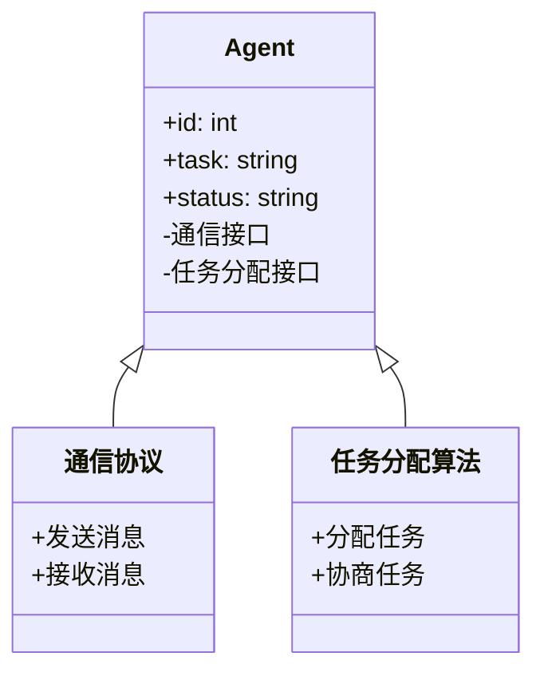
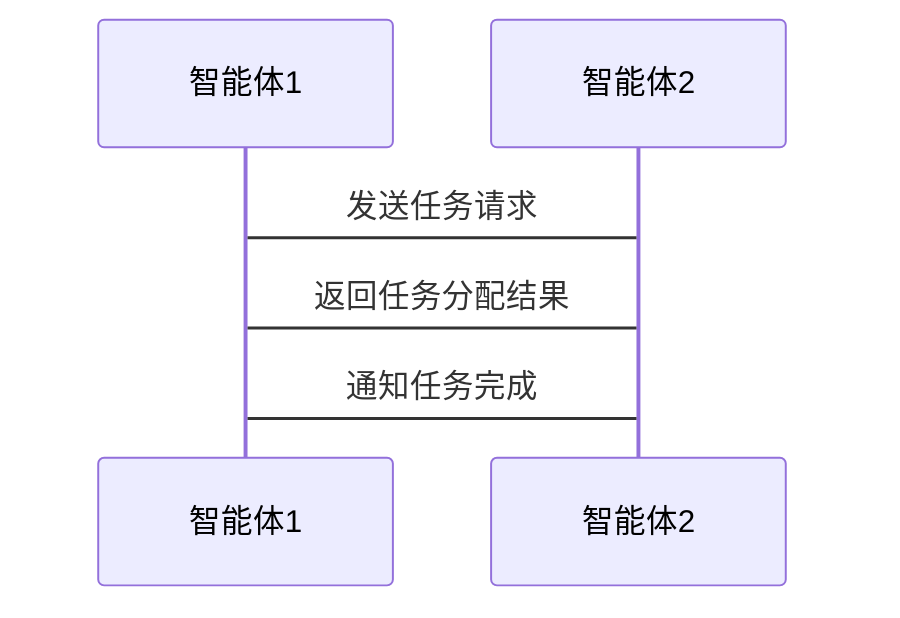

                 

# 多Agent协作系统：复杂任务的分布式解决方案

## 关键词：多Agent系统、分布式协作、任务分配、协调机制、通信协议

## 摘要：多Agent协作系统是一种通过多个智能体协同工作的分布式系统，能够高效解决复杂任务。本文从基础概念出发，深入探讨多Agent协作的核心算法、系统架构设计，并通过项目实战展示其实现过程，最后总结其应用前景。

---

## 第一部分：多Agent协作系统基础

### 第1章：多Agent协作系统概述

#### 1.1 多Agent系统的基本概念

##### 1.1.1 什么是多Agent系统
多Agent系统（Multi-Agent System, MAS）是由多个智能体（Agent）组成的分布式系统，每个智能体能够独立执行任务并与其他智能体协作。多Agent系统的优点在于能够利用多个智能体的分布式计算能力，解决单个智能体难以完成的复杂任务。

**例子**：在智能交通系统中，多个智能体可以分别负责交通信号控制、路径规划和车辆调度，共同实现交通流量的优化。

##### 1.1.2 多Agent系统的特点
1. **分布式**：智能体独立运行，没有中央控制节点。
2. **协作性**：智能体之间通过通信和协商完成任务。
3. **自主性**：每个智能体都有一定的自主决策能力。
4. **动态性**：系统能够适应环境的变化。

##### 1.1.3 多Agent系统的优势与劣势
- **优势**：能够处理复杂任务，提高系统可靠性和容错能力。
- **劣势**：设计复杂，通信开销大，协作过程可能存在冲突。

#### 1.2 多Agent协作的背景与应用

##### 1.2.1 多Agent系统协作的应用场景
1. **分布式计算**：如分布式数据库、网格计算。
2. **智能控制**：如智能家居、工业自动化。
3. **人工智能**：如多智能体游戏、推荐系统。

##### 1.2.2 复杂任务的分布式解决方案
通过分解任务到多个智能体，利用各自的优势完成子任务，最终实现整体目标。

##### 1.2.3 多Agent协作的典型应用案例
- **智能物流**：多个智能体分别负责货物运输、路径规划和订单管理。
- **智能电网**：智能体协作实现电力的优化分配和需求响应。

---

### 第2章：多Agent协作的核心概念

#### 2.1 多Agent协作的基本原理

##### 2.1.1 多Agent协作的定义
多Agent协作是指多个智能体通过通信和协商，共同完成一个复杂任务的过程。

##### 2.1.2 多Agent协作的核心要素
1. **智能体**：能够感知环境并采取行动的实体。
2. **通信**：智能体之间交换信息的方式。
3. **协作协议**：智能体之间达成一致的规则和机制。

##### 2.1.3 多Agent协作的系统架构
多Agent系统通常采用分层架构，包括任务层、协作层和通信层。

#### 2.2 多Agent协作的通信机制

##### 2.2.1 通信协议的选择与设计
选择适合应用场景的通信协议，如HTTP、WebSocket等，确保信息传递的可靠性和高效性。

##### 2.2.2 通信模型的构建
构建通信模型，明确智能体之间的信息交互流程和数据结构。

##### 2.2.3 通信中的数据传输与安全性
确保数据传输的完整性和安全性，防止信息泄露和篡改。

---

### 第3章：多Agent协作的算法基础

#### 3.1 多Agent协作中的任务分配算法

##### 3.1.1 任务分配的基本原理
任务分配算法的核心是将整体任务分解为多个子任务，并将这些子任务分配给不同的智能体。

##### 3.1.2 基于协商的任务分配算法
通过智能体之间的协商，动态调整任务分配，确保每个智能体都能高效完成分配的任务。

##### 3.1.3 基于规则的任务分配算法
根据预设的规则，将任务分配给最适合的智能体，减少协商过程中的冲突。

#### 3.2 多Agent协作中的协调机制

##### 3.2.1 协调机制的定义与分类
协调机制是智能体之间达成一致的规则和流程，常见的分类包括基于规则的协调和基于协商的协调。

##### 3.2.2 基于协商的协调机制
通过智能体之间的协商，动态调整协作策略，适应环境的变化。

##### 3.2.3 基于规则的协调机制
根据预设的规则，智能体自动执行协作任务，减少计算开销。

---

### 第4章：多Agent协作的数学模型与公式

#### 4.1 多Agent协作中的数学模型

##### 4.1.1 多Agent协作的基本数学模型
利用数学模型描述智能体之间的协作关系和任务分配过程。

##### 4.1.2 多Agent协作中的优化模型
通过优化算法，提高协作效率和任务完成质量。

##### 4.1.3 多Agent协作中的概率模型
利用概率论分析协作过程中的不确定性，提高系统的鲁棒性。

#### 4.2 多Agent协作中的关键公式

##### 4.2.1 任务分配的数学表达式
$$\text{Task Allocation} = \arg\min_{i} (c_i - s_i)$$

##### 4.2.2 协调机制的数学表达式
$$\text{Coordination} = \sum_{i=1}^{n} w_i x_i$$

##### 4.2.3 通信协议的数学表达式
$$\text{Communication} = \frac{\text{Data Size}}{\text{Bandwidth}}$$

---

### 第5章：多Agent协作系统的架构设计

#### 5.1 系统架构设计的基本原则

##### 5.1.1 系统架构设计的目标
确保系统具有良好的扩展性、可靠性和可维护性。

##### 5.1.2 系统架构设计的步骤
1. 明确需求
2. 确定架构风格
3. 设计组件和接口
4. 实现和测试

##### 5.1.3 系统架构设计的注意事项
注重模块化设计，减少组件之间的耦合度。

#### 5.2 多Agent协作系统的通信协议设计

##### 5.2.1 通信协议的选择与设计
选择适合应用场景的通信协议，如MQTT、HTTP等。

##### 5.2.2 通信协议的实现与测试
通过模拟测试，验证通信协议的可靠性和高效性。

##### 5.2.3 通信协议的优化与改进
根据测试结果，不断优化通信协议，减少延迟和带宽消耗。

---

### 第6章：多Agent协作系统的项目实战

#### 6.1 项目背景与需求分析

##### 6.1.1 项目背景
本项目旨在通过多Agent协作系统实现智能物流的任务分配与路径规划。

##### 6.1.2 项目需求分析
需要实现货物运输的路径优化和订单管理的智能分配。

##### 6.1.3 项目目标设定
通过多Agent协作，提高物流效率，降低成本。

#### 6.2 项目实现与代码解读

##### 6.2.1 系统环境搭建
安装必要的开发工具和库，如Python、Flask、RabbitMQ等。

##### 6.2.2 系统核心功能实现
实现智能体之间的通信、任务分配和协作逻辑。

##### 6.2.3 系统代码解读与分析
通过代码实现多Agent协作的具体功能，如任务分配算法和通信协议。

#### 6.3 项目测试与优化

##### 6.3.1 系统测试
通过单元测试和集成测试，验证系统的功能和性能。

##### 6.3.2 系统优化
根据测试结果，优化系统架构和算法，提高协作效率。

---

## 第二部分：系统分析与架构设计方案

### 第7章：系统分析与架构设计

#### 7.1 问题场景介绍
在智能物流系统中，需要多个智能体协作完成货物运输和订单管理。

#### 7.2 系统功能设计

##### 7.2.1 领域模型设计
使用mermaid类图描述系统的组件和它们之间的关系。

#### 7.3 系统架构设计

##### 7.3.1 系统架构设计图
使用mermaid架构图描述系统的整体架构。

#### 7.4 系统接口设计

##### 7.4.1 接口描述
定义智能体之间的通信接口和任务分配接口。

#### 7.5 系统交互设计

##### 7.5.1 交互流程
使用mermaid序列图描述智能体之间的协作流程。

---

## 第三部分：总结与展望

### 第8章：总结与展望

#### 8.1 项目总结
通过多Agent协作系统，实现了复杂任务的分布式解决方案，提高了系统的协作效率和可靠性。

#### 8.2 未来展望
随着人工智能技术的不断发展，多Agent协作系统将在更多领域得到应用，进一步提升系统的智能化水平。

---

## 作者信息

作者：AI天才研究院 & 禅与计算机程序设计艺术

---

以上是《多Agent协作系统：复杂任务的分布式解决方案》的技术博客文章的完整大纲和部分正文内容。每章的内容需要进一步扩展，详细讲解相关概念、算法和案例，确保文章的深度和可读性。

