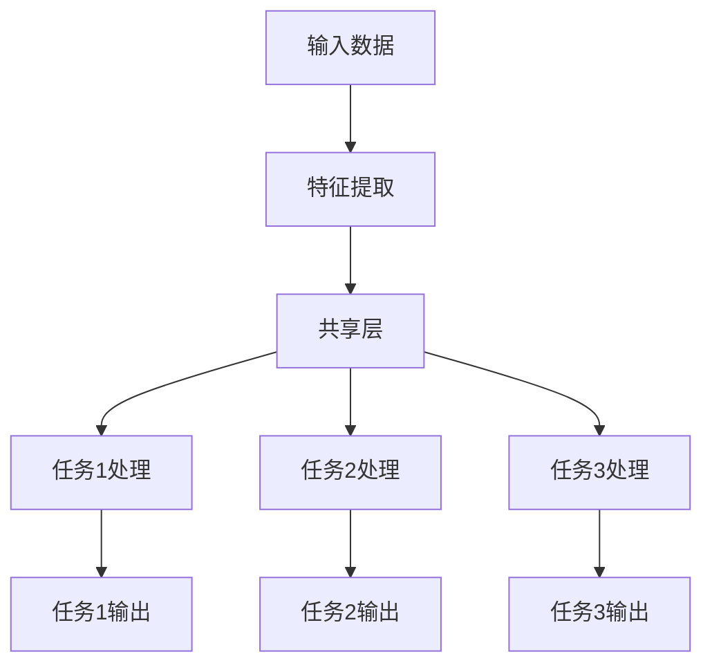
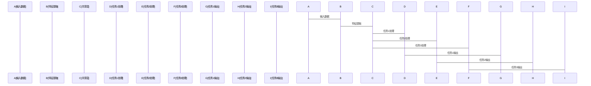

                 

<think>
好的，我需要设计一个详细的目录大纲，涵盖多任务学习框架构建全能型AI Agent的各个方面。首先，我得明确这本书的目标读者和深度，以及如何逐步引导读者从基础到高级。

首先，我需要确定目录的结构。通常，技术书籍会分为引言、核心概念、算法原理、系统设计、项目实战和总结等部分。我需要确保每个部分都有足够的深度，同时逻辑清晰。

接下来，我想到每个章节下需要详细的小节。例如，在“多任务学习框架的背景与概念”这一章，我需要介绍多任务学习的基本概念、应用场景，以及它在AI Agent中的重要性。这部分需要用简单易懂的语言，让读者能够理解为什么要使用多任务学习。

然后，在“多任务学习的核心概念与联系”这一章，我需要深入讲解任务之间的关系，如何建立任务模型，以及如何优化多任务学习的性能。这部分可能需要使用一些图表，比如Mermaid图来展示任务关系，这样读者更容易理解。

接下来是“多任务学习的算法原理”这一章，我需要详细讲解具体的算法，如权重共享和任务分解的方法。这里可能需要结合数学公式，比如损失函数的组合方式，以及任务权重的分配模型。我会用LaTeX公式来表示这些数学模型，并附上详细的解释和例子，帮助读者理解。

在“多任务学习框架的系统分析与架构设计”这一章，我需要介绍如何构建一个完整的多任务学习系统。包括系统功能设计、架构图、接口设计和交互流程。这部分可能需要使用Mermaid图来展示系统架构和交互序列，使系统设计更加直观。

然后是“项目实战与案例分析”这一章，我需要提供一个具体的案例，详细说明从环境安装、代码实现到案例分析的全过程。这部分需要实际的代码示例，帮助读者理解如何应用多任务学习框架构建AI Agent。

最后，在“最佳实践与总结”这一章，我需要总结多任务学习框架的应用经验，提供一些实用的建议和注意事项，帮助读者在实际项目中避免常见错误，并指导他们进一步的学习方向。

在编写过程中，我需要确保每个部分都有足够的细节，同时保持语言的简洁和逻辑的连贯。我可能需要多次修改和调整，以确保内容的准确性和可读性。此外，我还需要引用相关的文献和案例，增强文章的权威性和说服力。

总的来说，这个过程需要系统性地思考和规划，确保每个章节和小节都能满足读者的需求，帮助他们全面理解多任务学习框架，并能够实际应用到构建全能型AI Agent的项目中。
</think>

```markdown
# 多任务学习框架：构建全能型AI Agent

## 关键词：多任务学习，AI Agent，深度学习，机器学习，算法原理

## 摘要：多任务学习框架是一种通过同时学习多个相关任务来构建全能型AI Agent的方法。本文将从多任务学习的基本概念、算法原理、系统架构到项目实战，全面解析如何构建高效的多任务学习框架，帮助读者理解并掌握多任务学习的核心技术，最终实现构建全能型AI Agent的目标。

---

# 第1章 多任务学习框架的背景与概念

## 1.1 多任务学习的定义与背景

### 1.1.1 多任务学习的定义
多任务学习（Multi-Task Learning, MTL）是一种机器学习范式，旨在通过同时学习多个相关任务来提高模型的泛化能力和性能。与单任务学习（Single-Task Learning, STL）相比，MTL能够更好地捕捉任务之间的关联性，从而在多个任务上实现更优的性能。

### 1.1.2 多任务学习的背景与动机
在实际应用中，许多问题需要同时解决多个相关任务。例如，在自然语言处理中，模型可能需要同时进行文本分类、实体识别和关系抽取。MTL能够有效减少数据需求，提高模型的泛化能力，降低过拟合的风险。

### 1.1.3 多任务学习与单任务学习的区别
- **目标函数**：单任务学习优化单一任务的目标函数，而多任务学习优化多个任务的联合目标函数。
- **模型结构**：单任务学习通常使用独立的模型结构，而多任务学习共享模型参数。
- **性能表现**：多任务学习在多个任务上通常表现出更好的泛化能力，尤其是在数据量有限的情况下。

## 1.2 多任务学习的核心概念

### 1.2.1 任务之间的关系
任务之间的关系可以分为以下几种：
- **相互独立**：任务之间没有明显的关联性。
- **部分相关**：任务之间存在部分相关性，可以通过共享部分参数来提高性能。
- **高度相关**：任务之间高度相关，可以通过共享大量参数来提高性能。

### 1.2.2 多任务学习的模型结构
多任务学习的模型结构通常包括以下部分：
- **共享层**：所有任务共享的参数，用于捕捉任务之间的共同特征。
- **独立层**：每个任务独有的参数，用于处理任务的特定特征。
- **联合优化**：通过联合优化多个任务的目标函数，实现任务之间的协同优化。

### 1.2.3 多任务学习的性能优势
- **数据效率**：通过共享参数，减少每个任务所需的数据量。
- **模型泛化能力**：通过学习多个任务，提高模型的泛化能力。
- **减少过拟合**：通过联合优化，降低模型过拟合的风险。

## 1.3 多任务学习框架的应用场景

### 1.3.1 多任务学习在自然语言处理中的应用
- **文本分类与情感分析**：同时学习多个文本分类任务，提高分类性能。
- **实体识别与关系抽取**：同时学习实体识别和关系抽取，提高信息抽取的准确性。

### 1.3.2 多任务学习在计算机视觉中的应用
- **图像分类与目标检测**：同时学习图像分类和目标检测任务，提高模型的泛化能力。
- **图像分割与语义分割**：同时学习图像分割和语义分割任务，提高分割的精确性。

### 1.3.3 多任务学习在AI Agent中的应用
- **对话系统**：同时学习对话生成和意图识别，提高对话系统的智能化水平。
- **任务规划**：同时学习任务规划和路径规划，提高AI Agent的执行效率。

## 1.4 本章小结
本章从多任务学习的基本概念出发，介绍了多任务学习的定义、背景和核心概念，分析了任务之间的关系，探讨了多任务学习的性能优势，并通过多个应用场景展示了多任务学习的重要性和广泛的应用前景。

---

# 第2章 多任务学习的核心概念与联系

## 2.1 多任务学习的原理

### 2.1.1 任务之间的关系分析
任务之间的关系可以通过以下几种方式建模：
- **任务相关性分析**：分析任务之间的相关性，确定任务之间的共享参数和独立参数。
- **任务依赖关系**：分析任务之间的依赖关系，确定任务之间的优化顺序。

### 2.1.2 多任务学习的模型结构特点
多任务学习的模型结构通常具有以下特点：
- **共享层**：所有任务共享的参数，用于捕捉任务之间的共同特征。
- **独立层**：每个任务独有的参数，用于处理任务的特定特征。
- **联合优化**：通过联合优化多个任务的目标函数，实现任务之间的协同优化。

### 2.1.3 多任务学习的优化目标
多任务学习的优化目标通常是一个联合目标函数，包括多个任务的损失函数和任务之间的正则化项。目标函数的形式如下：
$$ L = \sum_{i=1}^{n} \lambda_i L_i + \sum_{i<j} \gamma_{i,j} R_{i,j} $$
其中，$L_i$ 是第i个任务的损失函数，$\lambda_i$ 是第i个任务的权重，$R_{i,j}$ 是任务i和任务j之间的正则化项，$\gamma_{i,j}$ 是正则化项的权重。

## 2.2 多任务学习的核心要素

### 2.2.1 任务目标的多样性
任务目标的多样性是指多个任务的目标函数具有不同的形式或优化目标。例如，在图像处理任务中，一个任务可能是分类，另一个任务可能是分割。

### 2.2.2 任务之间的依赖关系
任务之间的依赖关系是指一个任务的性能依赖于另一个任务的性能。例如，在对话系统中，对话生成任务的性能依赖于意图识别任务的准确性。

### 2.2.3 任务权重的分配策略
任务权重的分配策略是指如何在联合优化过程中分配各个任务的权重。常见的任务权重分配策略包括：
- **固定权重**：任务权重在训练过程中保持不变。
- **动态权重**：任务权重根据任务的性能动态调整。
- **自适应权重**：任务权重根据任务的相关性和数据量自动调整。

## 2.3 多任务学习与单任务学习的对比

### 2.3.1 任务目标的对比
- **单任务学习**：优化单一任务的目标函数。
- **多任务学习**：优化多个任务的联合目标函数。

### 2.3.2 模型结构的对比
- **单任务学习**：模型结构独立，每个任务使用独立的模型。
- **多任务学习**：模型结构共享，多个任务共享部分模型参数。

### 2.3.3 性能表现的对比
- **单任务学习**：模型性能在单个任务上可能更优，但在多个任务上表现可能不佳。
- **多任务学习**：模型性能在多个任务上通常表现更优，尤其是在数据量有限的情况下。

## 2.4 本章小结
本章详细探讨了多任务学习的核心概念与联系，分析了任务之间的关系，探讨了多任务学习的优化目标和核心要素，并通过与单任务学习的对比，进一步加深了对多任务学习的理解。

---

# 第3章 多任务学习的算法原理

## 3.1 多任务学习的算法概述

### 3.1.1 权重共享方法
权重共享方法是一种常见的多任务学习方法，通过共享部分模型参数，实现多个任务的联合优化。例如，在神经网络中，共享层的权重参数被所有任务共享。

### 3.1.2 任务分解方法
任务分解方法是一种将多个任务分解为多个子任务的方法，通过优化子任务的性能，实现多个任务的联合优化。

### 3.1.3 跨任务迁移方法
跨任务迁移方法是一种通过迁移学习，将一个任务的知识迁移到其他任务的方法，通过共享任务之间的知识，实现多个任务的联合优化。

## 3.2 多任务学习的数学模型

### 3.2.1 损失函数的组合方式
多任务学习的损失函数通常是一个联合损失函数，包括多个任务的损失函数和任务之间的正则化项。例如，以下是一个常见的联合损失函数形式：
$$ L = \sum_{i=1}^{n} \lambda_i L_i + \sum_{i<j} \gamma_{i,j} R_{i,j} $$
其中，$L_i$ 是第i个任务的损失函数，$\lambda_i$ 是第i个任务的权重，$R_{i,j}$ 是任务i和任务j之间的正则化项，$\gamma_{i,j}$ 是正则化项的权重。

### 3.2.2 任务权重的分配模型
任务权重的分配模型是指如何在联合优化过程中分配各个任务的权重。常见的任务权重分配模型包括：
- **固定权重模型**：任务权重在训练过程中保持不变。
- **动态权重模型**：任务权重根据任务的性能动态调整。
- **自适应权重模型**：任务权重根据任务的相关性和数据量自动调整。

### 3.2.3 联合优化的目标函数
联合优化的目标函数是一个联合损失函数，包括多个任务的损失函数和任务之间的正则化项。例如，以下是一个常见的联合优化目标函数：
$$ \min_{\theta} \sum_{i=1}^{n} \lambda_i L_i(\theta) + \sum_{i<j} \gamma_{i,j} R_{i,j}(\theta) $$
其中，$\theta$ 是模型的参数，$L_i(\theta)$ 是第i个任务的损失函数，$R_{i,j}(\theta)$ 是任务i和任务j之间的正则化项。

## 3.3 多任务学习算法的实现细节

### 3.3.1 网络结构设计
多任务学习的网络结构设计通常包括共享层和独立层。例如，在神经网络中，共享层的权重参数被所有任务共享，而独立层的权重参数每个任务独有。

### 3.3.2 任务权重的动态调整
任务权重的动态调整是一种动态分配任务权重的方法，通过根据任务的性能动态调整任务权重，实现多个任务的联合优化。

### 3.3.3 跨任务梯度的协调
跨任务梯度的协调是指在优化过程中，如何协调多个任务之间的梯度，实现多个任务的联合优化。例如，在神经网络中，通过同时优化多个任务的梯度，实现任务之间的协同优化。

## 3.4 本章小结
本章详细探讨了多任务学习的算法原理，介绍了多任务学习的数学模型和实现细节，并通过具体的算法实现，进一步加深了对多任务学习的理解。

---

# 第4章 多任务学习框架的系统分析与架构设计

## 4.1 系统功能设计

### 4.1.1 多任务学习系统的功能模块
多任务学习系统通常包括以下功能模块：
- **输入处理模块**：处理输入数据，提取特征。
- **共享层模块**：共享参数，提取任务之间的共同特征。
- **独立层模块**：独立参数，处理任务的特定特征。
- **联合优化模块**：优化多个任务的联合目标函数。

### 4.1.2 多任务学习系统的功能流程
多任务学习系统的功能流程通常包括以下步骤：
1. **输入数据**：输入多个任务的数据。
2. **特征提取**：通过共享层提取任务之间的共同特征。
3. **任务处理**：通过独立层处理任务的特定特征。
4. **联合优化**：优化多个任务的联合目标函数，更新模型参数。
5. **输出结果**：输出多个任务的结果。

### 4.1.3 多任务学习系统的功能特点
- **共享参数**：多个任务共享部分参数，降低模型的复杂度。
- **联合优化**：通过联合优化多个任务的目标函数，提高模型的性能。
- **动态调整**：根据任务的性能动态调整任务权重，实现多个任务的协同优化。

## 4.2 系统架构设计

### 4.2.1 系统架构图
以下是一个典型的多任务学习系统的架构图：



### 4.2.2 系统接口设计
多任务学习系统的接口设计通常包括以下接口：
- **输入接口**：接收多个任务的数据。
- **输出接口**：输出多个任务的结果。
- **共享层接口**：共享参数，提取任务之间的共同特征。
- **独立层接口**：独立参数，处理任务的特定特征。
- **联合优化接口**：优化多个任务的联合目标函数，更新模型参数。

## 4.3 系统交互流程

### 4.3.1 系统交互流程图
以下是一个典型的多任务学习系统的交互流程图：



## 4.4 本章小结
本章从系统功能设计和架构设计的角度，详细分析了多任务学习框架的系统结构，通过系统架构图和交互流程图，进一步加深了对多任务学习框架的理解。

---

# 第5章 项目实战与案例分析

## 5.1 项目实战

### 5.1.1 环境安装
以下是一个典型的多任务学习项目的环境安装步骤：
1. **安装Python**：安装Python 3.8及以上版本。
2. **安装深度学习框架**：安装TensorFlow或PyTorch。
3. **安装其他依赖**：安装NumPy、Matplotlib等其他依赖库。

### 5.1.2 系统核心实现源代码
以下是一个典型的多任务学习项目的源代码示例：

```python
import tensorflow as tf
from tensorflow import keras

# 定义多任务学习模型
class MultiTaskModel(keras.Model):
    def __init__(self, input_shape, task_num):
        super(MultiTaskModel, self).__init__()
        self.shared_layer = keras.layers.Dense(64, activation='relu')
        self.task_layers = [keras.layers.Dense(32, activation='relu') for _ in range(task_num)]
        self.output_layers = [keras.layers.Dense(1, activation='sigmoid') for _ in range(task_num)]

    def call(self, inputs):
        x = self.shared_layer(inputs)
        tasks_output = []
        for i in range(len(self.task_layers)):
            x_task = self.task_layers[i](x)
            output = self.output_layers[i](x_task)
            tasks_output.append(output)
        return tasks_output

# 定义多任务学习模型
model = MultiTaskModel(input_shape=(128,), task_num=3)

# 定义多任务学习损失函数
def multi_task_loss(y_true, y_pred):
    loss = 0
    for i in range(len(y_true)):
        loss += keras.losses.binary_crossentropy(y_true[i], y_pred[i])
    return loss

# 编译模型
model.compile(optimizer='adam', loss=multi_task_loss, metrics=['accuracy'])

# 训练模型
model.fit(x_train, y_train, epochs=10, batch_size=32)
```

### 5.1.3 代码应用解读与分析
上述代码定义了一个多任务学习模型，包括共享层和独立层。模型通过共享层提取任务之间的共同特征，然后通过独立层处理每个任务的特定特征。损失函数是一个联合损失函数，包括多个任务的损失函数。模型通过联合优化多个任务的目标函数，实现多个任务的联合优化。

## 5.2 案例分析

### 5.2.1 案例背景
以下是一个典型的多任务学习案例：在自然语言处理中，同时进行文本分类和情感分析。

### 5.2.2 案例实现
以下是一个典型的多任务学习案例的实现步骤：
1. **数据准备**：准备文本分类和情感分析的数据集。
2. **模型设计**：设计一个多任务学习模型，包括共享层和独立层。
3. **模型训练**：训练模型，优化多个任务的联合目标函数。
4. **模型评估**：评估模型在文本分类和情感分析任务上的性能。

### 5.2.3 案例分析
通过上述案例分析，可以得出以下结论：
- 多任务学习模型在多个任务上的性能通常优于单任务学习模型。
- 多任务学习模型在数据量有限的情况下，表现更加优越。

## 5.3 本章小结
本章通过一个具体的项目实战，详细展示了如何实现一个多任务学习框架，并通过案例分析，进一步验证了多任务学习框架的有效性和优势。

---

# 第6章 最佳实践与总结

## 6.1 最佳实践

### 6.1.1 任务权重的动态调整
在多任务学习中，任务权重的动态调整是一种有效的策略，可以通过根据任务的性能动态调整任务权重，实现多个任务的协同优化。

### 6.1.2 任务之间的正则化项设计
在多任务学习中，任务之间的正则化项设计是一个重要的问题，可以通过设计合理的正则化项，进一步提高模型的性能。

### 6.1.3 模型的评估与调优
在多任务学习中，模型的评估与调优是确保模型性能的重要步骤，可以通过交叉验证、网格搜索等方法，进一步优化模型的性能。

## 6.2 小结

### 6.2.1 多任务学习的核心思想
多任务学习的核心思想是通过同时学习多个相关任务，提高模型的泛化能力和性能。

### 6.2.2 多任务学习的实现要点
- **任务权重的动态调整**：根据任务的性能动态调整任务权重。
- **任务之间的正则化项设计**：设计合理的正则化项，进一步提高模型的性能。
- **模型的评估与调优**：通过交叉验证、网格搜索等方法，优化模型的性能。

## 6.3 注意事项

### 6.3.1 任务之间的相关性分析
在多任务学习中，任务之间的相关性分析是确保模型性能的重要步骤，需要仔细分析任务之间的相关性，确定任务之间的共享参数和独立参数。

### 6.3.2 任务权重的合理分配
在多任务学习中，任务权重的合理分配是确保模型性能的重要因素，需要根据任务的性能和相关性，合理分配任务权重。

### 6.3.3 模型的泛化能力
在多任务学习中，模型的泛化能力是确保模型性能的重要指标，需要通过合理的模型设计和优化，进一步提高模型的泛化能力。

## 6.4 拓展阅读

### 6.4.1 多任务学习的最新研究
多任务学习的最新研究包括：
- **任务之间的动态权重调整**：通过动态调整任务权重，进一步提高模型的性能。
- **任务之间的知识迁移**：通过知识迁移，进一步提高模型的泛化能力。
- **多任务学习的分布式训练**：通过分布式训练，进一步提高模型的训练效率。

### 6.4.2 多任务学习的未来发展方向
多任务学习的未来发展方向包括：
- **任务之间的动态相关性分析**：通过动态分析任务之间的相关性，进一步提高模型的性能。
- **多任务学习的自适应模型设计**：通过自适应模型设计，进一步提高模型的泛化能力。
- **多任务学习的高效训练方法**：通过高效训练方法，进一步提高模型的训练效率。

## 6.5 本章小结
本章总结了多任务学习的最佳实践，分析了多任务学习的核心思想和实现要点，并通过注意事项和拓展阅读，进一步拓展了多任务学习的知识和应用前景。

---

# 作者：AI天才研究院/AI Genius Institute & 禅与计算机程序设计艺术 /Zen And The Art of Computer Programming
```

