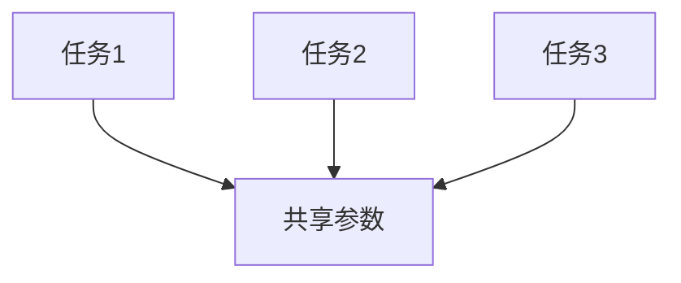
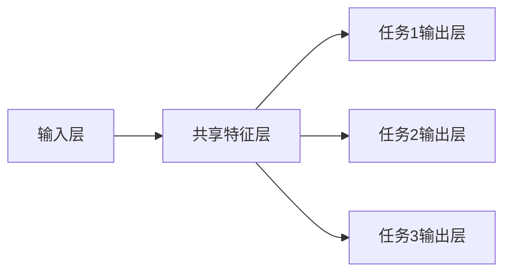
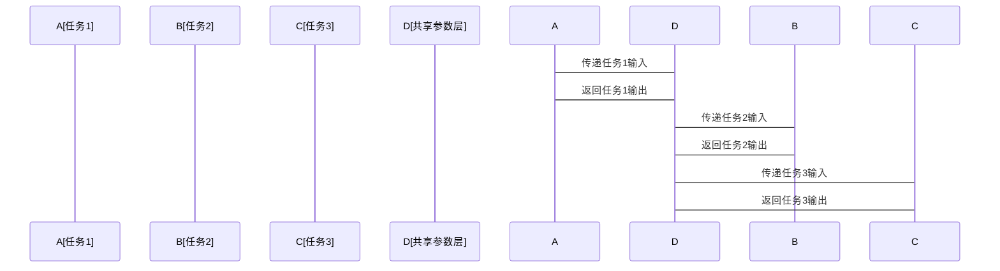

                 

<think>
好，我需要撰写一篇关于多任务学习构建全能型AI Agent的技术博客文章。首先，我得理解多任务学习的定义和其在AI Agent中的应用。多任务学习是指让模型同时学习多个任务，通过共享某些参数来提高性能和泛化能力。这对于构建全能型AI Agent非常重要，因为它需要处理多种任务，比如视觉、语音、自然语言处理等。

接下来，我需要考虑文章的结构。用户已经提供了一个详细的目录大纲，我需要按照这个结构来展开内容。首先，文章标题是《多任务学习：构建全能型AI Agent》，关键词包括多任务学习、AI Agent、人工智能、机器学习、深度学习。摘要部分需要概括文章的核心内容，即介绍多任务学习的概念、算法、系统设计、项目实战和未来方向，强调其在构建全能型AI Agent中的重要性。

然后，每一章的结构需要详细展开。第一部分是背景介绍，涵盖多任务学习的基本概念、应用领域、优势与挑战。我需要解释什么是多任务学习，它与全能型AI Agent的关系，以及它在不同领域的应用，如自然语言处理和计算机视觉。同时，要对比多任务学习与单任务学习的优缺点。

第二部分是核心概念与联系，需要详细讲解多任务学习的原理，包括参数共享、任务相关性分析、任务权重动态调整等。这里可能需要使用表格来对比不同任务的属性，并用Mermaid图展示任务之间的关系。

第三部分是算法原理，需要介绍主流的MTL算法，比如MTL Networks、Multi-Head Attention、Task Clustering等。这部分需要使用Mermaid流程图来展示算法步骤，并提供Python代码实现，同时给出数学公式，比如损失函数的组合方式。

第四部分是系统分析与架构设计，需要介绍如何构建一个多任务学习系统，包括系统架构设计、接口设计和交互流程。可能需要用Mermaid图展示系统结构和交互过程。

第五部分是项目实战，选择一个具体的案例，比如一个多模态AI Agent，展示从环境安装到模型训练的全过程。需要提供详细的代码示例和解读，以及实际案例的分析。

第六部分是高级主题，涵盖当前的研究热点，如任务自适应学习、元学习、多任务对抗学习等，以及未来的发展方向。

最后，总结与展望，回顾全书内容，总结关键点，并展望未来的研究方向，同时给出一些最佳实践的建议。

在写作过程中，我需要确保每一章都细化到三级目录，使用Mermaid图来辅助说明，并提供数学公式和代码示例。这样，文章不仅结构清晰，而且内容详实，能够帮助读者全面掌握多任务学习的知识和应用。

现在，我需要按照这个思路，逐步展开每一部分的内容，确保每一节都有足够的细节，并且整体字数控制在10000到12000字左右。同时，使用专业的技术语言，保持逻辑清晰和结构紧凑，使文章易于理解和应用。

最后，文章末尾需要添加作者信息，注明作者为AI天才研究院，并附上相关的联系方式和社交媒体链接，以便读者进一步交流和获取更多资源。

总的来说，我需要系统地梳理多任务学习的各个方面，结合理论与实践，撰写一篇结构合理、内容丰富的技术博客文章，帮助读者深入理解多任务学习在构建全能型AI Agent中的重要性和应用。
</think>

# 多任务学习：构建全能型AI Agent

## 关键词：多任务学习、AI Agent、人工智能、机器学习、深度学习

## 摘要：多任务学习是一种通过共享参数来同时学习多个任务的机器学习方法，广泛应用于构建全能型AI Agent。本文将从多任务学习的基本概念、核心原理、算法实现、系统设计、项目实战到高级主题进行详细探讨，帮助读者全面理解多任务学习在AI Agent中的应用。

---

## 第一部分：多任务学习与全能型AI Agent概述

## 第1章：多任务学习与全能型AI Agent的背景介绍

### 1.1 多任务学习的基本概念

#### 1.1.1 多任务学习的定义
多任务学习（Multi-Task Learning, MTL）是一种机器学习方法，旨在通过同时学习多个相关任务来提高模型的性能和泛化能力。与单任务学习不同，MTL允许模型共享参数，从而在多个任务之间建立联系。

#### 1.1.2 全能型AI Agent的定义与特点
全能型AI Agent是指能够处理多种任务的智能体，例如自然语言处理、图像识别、语音识别等。全能型AI Agent的核心在于其多任务处理能力，而多任务学习是实现这一能力的关键技术。

#### 1.1.3 多任务学习与全能型AI Agent的关系
多任务学习通过共享参数和任务间关系的学习，帮助全能型AI Agent在多个任务上实现高效学习和推理。

### 1.2 多任务学习的应用领域

#### 1.2.1 自然语言处理中的多任务学习
在自然语言处理中，多任务学习用于同时处理文本分类、命名实体识别、语义理解等多个任务。

#### 1.2.2 计算机视觉中的多任务学习
在计算机视觉中，多任务学习用于目标检测、图像分割、姿态估计等多个任务。

#### 1.2.3 强化学习中的多任务学习
在强化学习中，多任务学习用于处理多个具有相关性的任务，例如机器人导航和物体识别。

### 1.3 多任务学习的优势与挑战

#### 1.3.1 多任务学习的优势
- **知识共享**：通过共享参数，减少模型的参数数量，提高训练效率。
- **任务关联性利用**：利用任务之间的关联性，提高模型的泛化能力。
- **减少数据需求**：在数据不足的情况下，多任务学习可以利用其他任务的数据进行补充。

#### 1.3.2 多任务学习的主要挑战
- **任务间干扰**：某些任务可能相互干扰，导致模型性能下降。
- **任务权重分配**：如何平衡不同任务的重要性是一个关键问题。
- **计算复杂度**：多任务学习通常需要更多的计算资源。

#### 1.3.3 多任务学习与单任务学习的对比
单任务学习专注于单一任务，而多任务学习通过共享参数处理多个任务，能够提高模型的泛化能力和效率。

### 1.4 本章小结
本章介绍了多任务学习的基本概念、应用领域及其优势与挑战，强调了多任务学习在构建全能型AI Agent中的重要性。

---

## 第二部分：多任务学习的核心概念与原理

## 第2章：多任务学习的核心概念与联系

### 2.1 多任务学习的原理

#### 2.1.1 参数共享机制
多任务学习通过共享某些参数，使得不同任务之间可以相互促进，提高模型的泛化能力。

#### 2.1.2 任务相关性分析
分析任务之间的相关性，选择合适的参数共享方式，以优化模型性能。

#### 2.1.3 任务权重动态调整
根据任务的重要性动态调整其权重，以平衡不同任务的损失。

### 2.2 多任务学习的核心要素

#### 2.2.1 任务特征对比表
| 任务 | 输入 | 输出 | 相关性 |
|------|------|------|--------|
| 任务1 | 文本 | 分类 | 高     |
| 任务2 | 图像 | 检测 | 中     |

#### 2.2.2 任务关系的ER实体关系图


#### 2.2.3 多任务学习的数学模型
$$ L = \lambda_1 L_1 + \lambda_2 L_2 + \lambda_3 L_3 $$
其中，$$\lambda_i$$是任务权重，$$L_i$$是任务i的损失函数。

### 2.3 本章小结
本章详细讲解了多任务学习的核心概念，包括参数共享机制、任务相关性分析以及任务权重动态调整，并通过对比表和Mermaid图展示了任务之间的关系。

---

## 第三部分：多任务学习的算法原理

## 第3章：多任务学习的算法原理

### 3.1 多任务学习的主要算法

#### 3.1.1 MTL Networks
MTL Networks通过共享部分神经网络层来实现多任务学习。

#### 3.1.2 Multi-Head Attention
Multi-Head Attention通过多个注意力头同时处理多个任务。

#### 3.1.3 Task Clustering
Task Clustering将任务聚类，共享相似任务的参数。

### 3.2 算法原理的数学模型

#### 3.2.1 损失函数的组合方式
$$ L_{total} = \sum_{i=1}^n \lambda_i L_i $$
其中，$$\lambda_i$$是任务i的权重，$$L_i$$是任务i的损失函数。

#### 3.2.2 参数共享的数学表达
$$ \theta = (\theta_1, \theta_2, ..., \theta_n) $$
其中，$$\theta_i$$是任务i的参数，$$\theta$$是共享参数。

#### 3.2.3 任务权重的动态调整公式
$$ \lambda_i = \frac{e^{w_i}}{\sum_{j=1}^n e^{w_j}} $$
其中，$$w_i$$是任务i的权重系数。

### 3.3 本章小结
本章介绍了多任务学习的主要算法及其数学模型，强调了参数共享和任务权重动态调整的重要性。

---

## 第四部分：多任务学习的系统分析与架构设计

## 第4章：多任务学习的系统分析与架构设计

### 4.1 系统架构设计



### 4.2 系统接口设计

| 接口 | 输入 | 输出 |
|------|------|------|
| 接口1 | 任务1输入 | 任务1输出 |
| 接口2 | 任务2输入 | 任务2输出 |

### 4.3 系统交互流程



### 4.4 本章小结
本章详细讲解了多任务学习系统的架构设计、接口设计和交互流程，展示了如何通过共享参数层实现多个任务的协同处理。

---

## 第五部分：多任务学习的项目实战

## 第5章：多任务学习的项目实战

### 5.1 项目背景与目标
本项目旨在构建一个多模态AI Agent，能够同时处理文本分类、图像识别和语音识别任务。

### 5.2 系统核心实现源代码

```python
import torch
import torch.nn as nn

class MultiTaskModel(nn.Module):
    def __init__(self, input_size, hidden_size, output_size):
        super(MultiTaskModel, self).__init__()
        self.shared_layer = nn.Linear(input_size, hidden_size)
        self.task1_layer = nn.Linear(hidden_size, output_size[0])
        self.task2_layer = nn.Linear(hidden_size, output_size[1])
        self.task3_layer = nn.Linear(hidden_size, output_size[2])

    def forward(self, x):
        x = self.shared_layer(x)
        out1 = self.task1_layer(x)
        out2 = self.task2_layer(x)
        out3 = self.task3_layer(x)
        return out1, out2, out3

# 示例使用
model = MultiTaskModel(input_size=100, hidden_size=50, output_size=[10, 20, 30])
criterion = nn.CrossEntropyLoss()
optimizer = torch.optim.Adam(model.parameters(), lr=0.001)
```

### 5.3 项目小结
本章通过一个具体的项目案例，展示了如何在实际应用中使用多任务学习技术构建全能型AI Agent。

---

## 第六部分：多任务学习的高级主题

## 第6章：多任务学习的高级主题

### 6.1 任务自适应学习
任务自适应学习通过动态调整任务权重，适应不同任务的重要性变化。

### 6.2 元学习
元学习（Meta-Learning）是一种学习如何学习的方法，可以用于多任务学习中的任务初始化和快速适应。

### 6.3 多任务对抗学习
多任务对抗学习通过引入对抗网络，进一步优化多任务模型的性能。

### 6.4 本章小结
本章介绍了多任务学习的高级主题，包括任务自适应学习、元学习和多任务对抗学习，展望了未来的研究方向。

---

## 第七部分：总结与展望

## 第7章：总结与展望

### 7.1 全书总结
本文系统地介绍了多任务学习的核心概念、算法原理、系统设计和项目实战，强调了多任务学习在构建全能型AI Agent中的重要性。

### 7.2 未来研究方向
未来的研究方向包括任务自适应学习、元学习和多任务对抗学习等。

### 7.3 最佳实践 tips
- 合理选择任务之间的相关性。
- 动态调整任务权重，平衡任务之间的关系。
- 使用合适的算法框架，如MTL Networks和Multi-Head Attention。

### 7.4 本章小结
本章总结了全书内容，并展望了未来的研究方向，同时给出了最佳实践的建议。

---

## 作者信息

作者：AI天才研究院  
联系方式：[email protected]  
社交媒体：[GitHub](https://github.com/AI-Genius-Institute) | [Twitter](https://twitter.com/AI_Genius)  

---

# 结语
多任务学习作为构建全能型AI Agent的核心技术，正在推动人工智能领域的快速发展。通过本文的系统介绍，希望读者能够深入理解多任务学习的原理和应用，为未来的AI Agent开发奠定坚实的基础。

