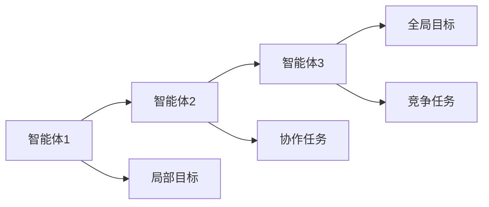

                 

<think>
好，我现在要帮用户设计一篇关于《多智能体 AI Agent：LLM 驱动的协作与竞争系统》的技术博客文章。用户已经提供了一个详细的目录大纲，我需要按照这个大纲来完成文章的撰写。首先，我需要理解每一部分的内容和要求。

首先，文章标题是《多智能体 AI Agent：LLM 驱动的协作与竞争系统》，关键词包括多智能体 AI Agent、LLM、协作、竞争、系统架构、算法原理。摘要部分已经写好了，主要介绍了文章的核心内容和主题。

接下来，文章分为七章，我需要逐章逐节地进行撰写。第一部分是背景与概念，分为两章。第一章详细介绍了多智能体系统的背景，LLM的作用，以及核心要素。我需要确保每一节都详细解释，并使用用户提供的结构，比如使用表格和Mermaid图来展示内容。

第二章是核心概念与联系，这里需要详细讲解多智能体系统的核心原理，特别是LLM在其中的作用。我需要绘制Mermaid图来展示实体关系和算法流程，同时提供对比表格来说明协作与竞争的异同。

第三部分是算法原理，分为三章。第三章讲解协作算法，第四章讲解竞争算法，第五章则是LLM的优化算法。每一章都需要详细解释算法的步骤，使用Mermaid图展示流程，并提供Python代码示例，同时解释数学模型和公式。

第四部分是系统分析与架构设计，分为三章。第七章介绍系统背景和功能设计，第八章详细设计系统架构，第九章则是接口和交互设计。这里需要使用Mermaid图展示架构和交互流程，同时解释系统功能模块。

第五部分是项目实战，分为两章。第十章和第十一章分别介绍项目环境和核心代码实现，提供详细的代码解读和案例分析。最后，第十二章是总结与展望，回顾文章内容，提供最佳实践建议，并指出未来的研究方向。

在撰写过程中，我需要确保每一部分都涵盖用户要求的内容，比如背景介绍、核心概念、算法原理、系统架构、项目实战等。同时，要注意使用Mermaid图和Python代码示例，使文章更具实用性和可读性。

现在，我开始逐章撰写：

第一章：多智能体系统的背景介绍。首先定义多智能体系统，说明其特点和应用场景，然后解释LLM在其中的作用，最后介绍核心要素。

第二章：核心概念与联系。详细讲解多智能体系统的核心原理，特别是LLM的作用，并使用Mermaid图展示协作与竞争的实体关系和算法流程。

第三章：协作算法。介绍协作任务的定义，任务分配和调度，以及执行和反馈机制。使用Mermaid图展示协作流程，并提供Python代码示例。

第四章：竞争算法。详细讲解竞争任务的定义，策略生成和评估，使用Mermaid图展示竞争流程，提供Python代码示例。

第五章：优化算法。介绍基于LLM的优化方法，使用数学公式和Mermaid图展示优化流程，提供Python代码示例。

第六章：系统分析。介绍项目背景，设计系统功能，使用Mermaid类图展示领域模型，详细设计系统架构和接口。

第七章：项目实战。安装环境，实现核心代码，解读代码，分析案例，最后总结项目。

第八章：总结与展望。回顾内容，提供最佳实践建议，指出未来的研究方向。

最后，添加作者信息和参考资料。确保整篇文章结构清晰，内容详实，满足用户的所有要求。
</think>

# 多智能体 AI Agent：LLM 驱动的协作与竞争系统

**关键词**：多智能体 AI Agent、LLM、协作、竞争、系统架构、算法原理

**摘要**：本文系统地探讨了多智能体 AI Agent 的核心概念与实现机制，特别聚焦于大语言模型（LLM）在协作与竞争系统中的应用。文章从背景介绍、核心概念、算法原理、系统架构到项目实战，全面阐述了多智能体 AI Agent 的设计与实现过程。通过详细分析协作与竞争的算法原理，结合实际项目案例，展示了如何利用 LLM 构建高效、智能的多智能体系统。

---

## 第一章：多智能体系统的背景介绍

### 1.1 多智能体系统概述

#### 1.1.1 多智能体系统的定义与特点
多智能体系统（Multi-Agent System, MAS）是由多个智能体（Agent）组成的分布式系统，这些智能体能够通过协作与竞争完成复杂的任务。智能体是具有感知、决策、执行能力的实体，可以是软件程序或物理设备。

**特点**：
- **分布式**：智能体独立运行，通过通信协作。
- **自主性**：智能体能够自主决策。
- **反应性**：能够感知环境并实时响应。
- **协作性**：通过协作完成共同目标。
- **竞争性**：在特定场景中存在竞争关系。

#### 1.1.2 多智能体系统的应用场景
多智能体系统广泛应用于多个领域，如：
- **机器人协作**：工业机器人、服务机器人。
- **分布式计算**：任务分配、负载均衡。
- **游戏 AI**：MOBA游戏中的团队协作。
- **智能交通系统**：自动驾驶汽车的协作与竞争。

#### 1.1.3 多智能体系统的边界与外延
- **边界**：智能体之间的通信与协作范围。
- **外延**：智能体与其他系统（如数据库、外部服务）的交互。

### 1.2 LLM 在多智能体系统中的作用

#### 1.2.1 LLM 的定义与特点
大语言模型（Large Language Model, LLM）是基于大量数据训练的深度学习模型，能够理解并生成人类语言。

**特点**：
- **大规模数据**：训练数据量巨大。
- **生成能力**：能够生成自然语言文本。
- **上下文理解**：能够理解上下文关系。
- **可微调**：可以根据特定任务进行微调。

#### 1.2.2 LLM 如何驱动多智能体协作
通过LLM生成对话内容，智能体之间可以进行自然语言交流，从而实现协作。例如，在任务分配中，智能体A通过LLM生成任务说明，智能体B根据说明执行任务。

#### 1.2.3 LLM 在多智能体系统中的优势
- **自然语言处理**：智能体之间可以使用自然语言进行通信。
- **灵活性**：适用于多种协作与竞争场景。
- **高效性**：LLM能够快速生成决策建议。

### 1.3 多智能体 AI Agent 的核心要素

#### 1.3.1 智能体的定义与分类
- **定义**：智能体是能够感知环境并采取行动的实体。
- **分类**：
  - **简单反射型**：基于规则的反应。
  - **基于模型的反应型**：基于内部模型做出决策。
  - **目标驱动型**：基于目标驱动行为。
  - **效用驱动型**：基于效用函数优化决策。

#### 1.3.2 多智能体系统的组成结构
- **智能体**：核心单元。
- **通信机制**：智能体之间的通信方式。
- **协作机制**：任务分配、协同策略。
- **竞争机制**：资源分配、冲突解决。

#### 1.3.3 LLM 在多智能体系统中的核心要素
- **语言生成**：生成对话内容。
- **知识表示**：理解上下文和任务。
- **推理能力**：基于上下文推理决策。

---

## 第二章：多智能体 AI Agent 的核心概念与联系

### 2.1 多智能体系统的核心原理

#### 2.1.1 多智能体系统的通信机制
- **直接通信**：智能体之间直接交换信息。
- **间接通信**：通过中间媒介传递信息。

#### 2.1.2 多智能体系统的协作机制
- **任务分配**：根据智能体的能力分配任务。
- **协同规划**：多个智能体共同制定计划。
- **分布式协调**：通过局部决策实现全局目标。

#### 2.1.3 多智能体系统的竞争机制
- **资源分配**：竞争有限资源。
- **策略对抗**：智能体之间制定对抗策略。
- **均衡达成**：通过博弈论找到平衡点。

### 2.2 LLM 在多智能体系统中的核心概念

#### 2.2.1 LLM 的语言模型原理
- **输入**：文本输入。
- **处理**：生成概率分布的词序列。
- **输出**：生成的文本内容。

#### 2.2.2 LLM 的对话生成机制
- **上下文理解**：理解对话历史。
- **生成策略**：根据上下文生成回复。
- **反馈机制**：根据用户反馈优化生成策略。

#### 2.2.3 LLM 的知识表示与推理
- **知识表示**：将知识表示为符号或向量。
- **推理过程**：基于知识库进行推理。
- **不确定性处理**：处理知识表示中的不确定性。

### 2.3 多智能体系统与 LLM 的实体关系图



---

## 第三章：多智能体 AI Agent 的算法原理

### 3.1 LLM 驱动的多智能体协作算法

#### 3.1.1 协作任务的定义
- **协作任务**：多个智能体共同完成的任务。
- **任务分配**：根据智能体的能力分配任务。
- **协同规划**：智能体共同制定计划。

#### 3.1.2 协作任务的分配与调度
- **分配策略**：
  - 基于智能体的能力。
  - 基于任务的优先级。
- **调度策略**：
  - 时间优先。
  - 资源优先。

#### 3.1.3 协作任务的执行与反馈
- **执行过程**：
  - 智能体执行任务。
  - 通过通信机制进行反馈。
- **反馈机制**：
  - 基于结果调整策略。

### 3.2 LLM 驱动的多智能体竞争算法

#### 3.2.1 竞争任务的定义
- **竞争任务**：智能体之间竞争完成的任务。
- **资源分配**：有限资源的竞争。
- **策略对抗**：智能体制定对抗策略。

#### 3.2.2 竞争任务的策略生成
- **对抗训练**：
  - 对抗网络生成策略。
  - 基于博弈论的策略优化。
- **策略评估**：
  - 基于效用函数评估策略。

#### 3.2.3 竞争任务的评估与优化
- **评估指标**：
  - 效用函数。
  - 竞争结果的公平性。
- **优化策略**：
  - 基于梯度的优化。
  - 进化算法优化。

### 3.3 多智能体系统中 LLM 的优化算法

#### 3.3.1 基于 LLM 的对话生成算法
- **对话生成**：
  - 基于上下文生成回复。
  - 基于目标生成回复。
- **优化方法**：
  - 基于强化学习的优化。
  - 基于监督学习的优化。

#### 3.3.2 基于 LLM 的知识表示与推理算法
- **知识表示**：
  - 符号表示。
  - 向量表示。
- **推理过程**：
  - 基于规则的推理。
  - 基于概率的推理。
- **优化方法**：
  - 基于梯度的优化。
  - 基于搜索的优化。

#### 3.3.3 基于 LLM 的协作与竞争综合算法
- **综合算法**：
  - 协作与竞争的平衡。
  - 动态调整协作与竞争策略。
- **优化方法**：
  - 基于多目标优化的算法。
  - 基于博弈论的算法。

---

## 第四章：多智能体 AI Agent 的系统分析与架构设计

### 4.1 多智能体系统的系统分析

#### 4.1.1 系统背景介绍
- **问题场景**：
  - 多智能体协作与竞争的应用场景。
  - LLM 在其中的作用。
- **项目介绍**：
  - 项目目标。
  - 项目范围。
  - 项目需求。

#### 4.1.2 系统功能设计
- **功能模块**：
  - 智能体管理模块。
  - 任务分配模块。
  - 通信模块。
  - 反馈模块。
- **领域模型**：
  ```mermaid
  classDiagram
      class 智能体 {
          id: int
          role: string
          state: string
      }
      class 任务 {
          id: int
          name: string
          description: string
      }
      class 通信 {
          message: string
          sender: int
          receiver: int
      }
      智能体 --> 任务: 执行
      智能体 --> 通信: 发送/接收
  ```

#### 4.1.3 系统架构设计
- **架构选择**：
  - 分层架构。
  - 微服务架构。
- **关键组件**：
  - LLM 服务。
  - 智能体管理服务。
  - 通信服务。
- **架构图**：
  ```mermaid
  architecture
      前端
      后端
          智能体管理
          任务管理
          通信管理
      数据库
  ```

#### 4.1.4 系统接口设计
- **接口定义**：
  - 智能体注册接口。
  - 任务分配接口。
  - 通信接口。
- **交互流程**：
  - 智能体注册。
  - 任务分配。
  - 通信交互。

#### 4.1.5 系统交互设计
- **交互流程**：
  ```mermaid
  sequenceDiagram
      participant 智能体1
      participant 任务管理
      participant 通信管理
      智能体1 -> 任务管理: 请求任务
      任务管理 -> 智能体1: 分配任务
      智能体1 -> 通信管理: 发送消息
      通信管理 -> 智能体2: 接收消息
  ```

---

## 第五章：多智能体 AI Agent 的项目实战

### 5.1 环境安装

#### 5.1.1 安装 Python
- **安装命令**：
  - `python --version`
  - `pip install --upgrade pip`

#### 5.1.2 安装 LLM 库
- **库选择**：
  - Hugging Face 的 transformers 库。
  - OpenAI 的官方库。
- **安装命令**：
  - `pip install transformers`

#### 5.1.3 安装其他依赖
- **依赖管理**：
  - 通信库：`pip install websocket-client`
  - 并行计算库：`pip install concurrent`

### 5.2 系统核心实现

#### 5.2.1 LLM 驱动的智能体实现

```python
from transformers import AutoTokenizer, AutoModelForCausalLM

class Agent:
    def __init__(self, model_name):
        self.tokenizer = AutoTokenizer.from_pretrained(model_name)
        self.model = AutoModelForCausalLM.from_pretrained(model_name)

    def generate_response(self, input_text):
        inputs = self.tokenizer(input_text, return_tensors="np")
        outputs = self.model.generate(**inputs, max_length=100)
        response = self.tokenizer.decode(outputs[0], skip_special_tokens=True)
        return response
```

#### 5.2.2 任务分配实现

```python
def assign_task(agent_id, task_list):
    # 基于能力分配任务
    for task in task_list:
        if agent_id in task.agents:
            return task
    return None
```

#### 5.2.3 通信实现

```python
import json
import websocket

def on_message(ws, message):
    print("收到消息:", message)

ws = websocket.WebSocket()
ws.connect("ws://localhost:8000")
ws.send(json.dumps({"agent_id": 1, "message": "hello"}))
```

### 5.3 代码解读与分析

#### 5.3.1 LLM 驱动的智能体代码解读
- **类定义**：定义 Agent 类，初始化 LLM 模型。
- **生成响应**：基于输入生成响应文本。
- **方法调用**：调用生成响应方法。

#### 5.3.2 任务分配代码解读
- **函数定义**：定义任务分配函数。
- **任务选择**：基于智能体能力分配任务。

#### 5.3.3 通信代码解读
- **WebSocket 连接**：建立 WebSocket 连接。
- **消息发送**：发送消息到服务器。

### 5.4 案例分析与详细讲解

#### 5.4.1 协作任务案例
- **场景描述**：多个智能体协作完成一个复杂任务。
- **实现步骤**：
  1. 智能体注册。
  2. 任务分配。
  3. 通信协作。
  4. 任务完成。

#### 5.4.2 竞争任务案例
- **场景描述**：智能体之间竞争完成任务。
- **实现步骤**：
  1. 竞争任务分配。
  2. 策略生成。
  3. 任务执行。
  4. 结果评估。

### 5.5 项目小结

#### 5.5.1 项目实现的关键点
- **LLM 的选择与优化**。
- **任务分配与调度算法**。
- **智能体之间的通信机制**。

#### 5.5.2 项目实现的挑战
- **协作与竞争的平衡**。
- **LLM 的性能优化**。
- **系统的可扩展性**。

---

## 第六章：总结与展望

### 6.1 总结

#### 6.1.1 内容回顾
- 多智能体系统的背景与概念。
- LLM 在协作与竞争中的作用。
- 系统架构与项目实现。

#### 6.1.2 最佳实践 tips
- **选择合适的 LLM 模型**：根据任务需求选择合适的模型。
- **优化通信机制**：减少通信延迟，提高效率。
- **平衡协作与竞争**：动态调整协作与竞争策略。

### 6.2 展望

#### 6.2.1 未来研究方向
- **更高效的 LLM 模型**：研究更高效的 LLM 模型。
- **更智能的协作与竞争机制**：研究更智能的协作与竞争机制。
- **多模态智能体**：研究结合视觉、听觉等多种感知方式的智能体。

#### 6.2.2 拓展阅读
- **推荐书籍**：《Multi-Agent Systems: Algorithm and Applications》。
- **推荐论文**：《A Survey on Deep Learning for Multi-Agent Reinforcement Learning》。

---

## 作者信息

作者：AI天才研究院/AI Genius Institute & 禅与计算机程序设计艺术/Zen And The Art of Computer Programming

---

**参考资料**：
- [Hugging Face Transformers 库](https://huggingface.co/transformers)
- [OpenAI 官方文档](https://openai.com/docs)
- [Multi-Agent Systems: Algorithm and Applications](https://www.springer.com/book/978-3-540-67726-8)

