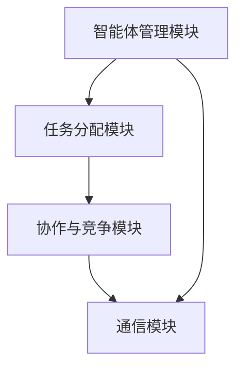

                 


# 多智能体AI Agent：LLM驱动的协作与竞争系统

> 关键词：多智能体系统，AI Agent，大语言模型（LLM），协作与竞争，分布式计算，博弈论

> 摘要：  
本文深入探讨了多智能体AI Agent系统中，基于大语言模型（LLM）的协作与竞争机制。通过分析多智能体系统的定义、核心概念、算法原理、系统架构及实际应用场景，本文为读者提供了一种全新的视角，理解如何利用LLM驱动多智能体系统实现高效协作与良性竞争。文章从基础理论到算法实现，再到系统设计，层层递进，旨在为技术从业者和研究者提供有价值的参考和启发。

---

# 第一部分：多智能体AI Agent基础

## 第1章：多智能体系统与AI Agent概述

### 1.1 多智能体系统的基本概念

#### 1.1.1 多智能体系统的定义
多智能体系统（Multi-Agent System, MAS）是由多个智能体（Agent）组成的分布式系统，这些智能体通过协作或竞争完成特定任务。多智能体系统的特点包括分布式性、自主性、反应性和社会性。

#### 1.1.2 多智能体系统的特征
- **分布式性**：智能体分布在不同的位置，通过通信和协调完成任务。
- **自主性**：每个智能体都有自己的目标和决策机制。
- **反应性**：智能体能够感知环境并实时调整行为。
- **社会性**：智能体之间通过协作或竞争实现整体目标。

#### 1.1.3 多智能体系统与单智能体系统的区别
| 特性             | 单智能体系统                | 多智能体系统                |
|------------------|---------------------------|---------------------------|
| 结构             | 单一结构                   | 分布式结构                 |
| 任务分配         | 单个智能体完成所有任务     | 多个智能体分工合作           |
| 通信             | 不需要通信                 | 需要智能体之间通信           |
| 稳定性           | 单点故障可能导致系统崩溃   | 分布式架构提高系统的容错性   |

### 1.2 AI Agent的基本概念

#### 1.2.1 AI Agent的定义
AI Agent是一种能够感知环境并采取行动以实现特定目标的智能实体。它可以是一个软件程序、机器人或其他智能设备。

#### 1.2.2 AI Agent的核心属性
- **自主性**：Agent能够自主决策。
- **反应性**：Agent能够感知环境并实时调整行为。
- **社会性**：Agent能够与其他Agent或人类交互。
- **目标导向**：Agent的行为以实现目标为导向。

#### 1.2.3 AI Agent的分类
| 类型             | 描述                       |
|------------------|--------------------------|
| 简单反射型Agent   | 基于简单规则做出反应       |
| 目标驱动型Agent   | 以实现特定目标为导向       |
| 情境意识型Agent   | 具有环境感知和理解能力     |
| 学习型Agent       | 能够通过学习改进行为       |

### 1.3 LLM驱动的AI Agent

#### 1.3.1 LLM在AI Agent中的作用
大语言模型（LLM）作为AI Agent的核心驱动力，主要负责处理自然语言理解、生成、推理等任务。

#### 1.3.2 LLM驱动的AI Agent的优势
- **强大的语言处理能力**：LLM能够理解复杂的自然语言指令。
- **灵活性**：LLM可以快速适应不同场景的任务需求。
- **可扩展性**：LLM可以通过微调或参数调整适应新任务。

#### 1.3.3 LLM驱动的AI Agent的应用场景
- **智能客服**：通过LLM驱动的Agent为用户提供智能问答服务。
- **协作机器人**：在团队协作中，Agent可以辅助完成任务分配和进度跟踪。
- **智能家居**：通过LLM驱动的Agent实现设备间的智能协作。

### 1.4 本章小结
本章介绍了多智能体系统和AI Agent的基本概念，重点分析了LLM在AI Agent中的作用及其优势。通过对比和实例分析，读者可以清晰理解多智能体系统与单智能体系统的区别，以及LLM在AI Agent中的重要性。

---

## 第2章：多智能体AI Agent的核心概念

### 2.1 协作与竞争机制

#### 2.1.1 协作机制的定义与特点
协作机制是指多个智能体通过合作完成共同目标的过程。其特点包括：
- **目标一致性**：所有智能体的目标一致。
- **信息共享**：智能体之间共享信息以提高协作效率。
- **任务分配**：根据智能体的能力分配任务。

#### 2.1.2 竞争机制的定义与特点
竞争机制是指多个智能体通过竞争资源或任务完成目标的过程。其特点包括：
- **资源有限性**：竞争通常发生在资源有限的情况下。
- **策略性**：智能体通过制定策略来优化自己的收益。
- **动态性**：竞争过程可能会根据环境变化而调整。

#### 2.1.3 协作与竞争的平衡
在实际应用中，协作与竞争是相辅相成的。例如，在一个团队中，成员之间需要协作完成任务，同时在某些情况下也需要竞争以激发潜力。

### 2.2 多智能体系统中的通信协议

#### 2.2.1 通信协议的定义
通信协议是指智能体之间进行信息交换的规则和格式。

#### 2.2.2 常见的通信协议类型
- **基于消息的通信协议**：通过消息传递信息。
- **基于订阅的通信协议**：通过订阅主题接收信息。
- **基于请求-响应的通信协议**：通过请求和响应的方式进行信息交换。

#### 2.2.3 通信协议的设计原则
- **简洁性**：协议设计应尽量简单，减少不必要的复杂性。
- **可靠性**：确保信息能够准确无误地传递。
- **安全性**：防止信息被篡改或窃取。

### 2.3 多智能体系统中的决策模型

#### 2.3.1 决策模型的定义
决策模型是指智能体在面对选择时，如何基于信息做出最优决策的模型。

#### 2.3.2 常见的决策模型类型
- **基于规则的决策模型**：根据预定义的规则做出决策。
- **基于概率的决策模型**：根据概率计算做出决策。
- **基于强化学习的决策模型**：通过奖励机制优化决策。

#### 2.3.3 决策模型的设计原则
- **可解释性**：决策过程应能够被人类理解。
- **可扩展性**：模型应能够适应不同规模的系统。
- **实时性**：决策模型应能够在短时间内做出决策。

### 2.4 本章小结
本章重点介绍了协作与竞争机制、通信协议和决策模型等多智能体系统的核心概念。通过对比和实例分析，读者可以理解这些概念在实际系统中的作用和设计原则。

---

## 第3章：大语言模型（LLM）的原理与应用

### 3.1 LLM的基本原理

#### 3.1.1 LLM的定义
大语言模型（LLM）是一种基于深度学习的自然语言处理模型，通常使用Transformer架构。

#### 3.1.2 LLM的核心技术
- **自注意力机制**：通过计算词与词之间的关系，生成上下文相关的表示。
- **多层神经网络**：通过多层网络提取特征，生成最终的输出。

#### 3.1.3 LLM的应用场景
- **自然语言处理**：如文本生成、问答系统等。
- **对话系统**：如智能客服、聊天机器人等。
- **知识图谱构建**：通过LLM提取文本中的实体关系，构建知识图谱。

### 3.2 LLM在AI Agent中的应用

#### 3.2.1 LLM作为知识库的使用
LLM可以作为AI Agent的知识库，提供实时的信息查询和推理能力。

#### 3.2.2 LLM作为决策支持的使用
LLM可以为AI Agent提供决策建议，帮助智能体做出最优选择。

#### 3.2.3 LLM作为通信工具的使用
LLM可以作为智能体之间的通信桥梁，帮助智能体理解和生成自然语言。

### 3.3 LLM的优化与调优

#### 3.3.1 LLM的训练方法
- **微调**：在特定任务上对模型进行微调。
- **知识蒸馏**：通过教师模型指导学生模型进行学习。

#### 3.3.2 LLM的调优技巧
- **参数调整**：通过调整模型参数优化性能。
- **数据增强**：通过增加多样化的训练数据提高模型的泛化能力。

#### 3.3.3 LLM的评估指标
- **准确率**：模型输出的正确答案的比例。
- **困惑度**：衡量模型对测试数据的预测能力。
- **生成质量**：模型生成文本的质量和相关性。

### 3.4 本章小结
本章深入探讨了大语言模型的基本原理及其在AI Agent中的应用。通过分析LLM的训练方法和优化技巧，读者可以理解如何在实际系统中充分利用LLM的能力。

---

## 第4章：多智能体协作与竞争的算法原理

### 4.1 协作算法

#### 4.1.1 分布式协作算法
**分布式协作算法**是一种基于分布式计算的协作方法。其核心思想是通过智能体之间的协作完成共同目标。

#### 4.1.2 基于博弈论的协作
**博弈论**是研究智能体之间如何通过策略选择实现最优决策的理论。在协作中，博弈论可以帮助智能体制定合作策略。

#### 4.1.3 协作算法的实现步骤
1. **任务分解**：将整体任务分解为多个子任务。
2. **任务分配**：根据智能体的能力分配子任务。
3. **协作执行**：智能体协同完成分配的任务。
4. **结果整合**：将各智能体的结果整合为最终输出。

### 4.2 竞争算法

#### 4.2.1 基于强化学习的竞争
**强化学习**是一种通过试错机制优化决策的算法。在竞争中，强化学习可以帮助智能体通过不断尝试优化自己的策略。

#### 4.2.2 基于纳什均衡的竞争
**纳什均衡**是指在策略性竞争中，所有参与方都无法通过单方面改变策略而获得更好的结果的状态。

#### 4.2.3 竞争算法的实现步骤
1. **资源分配**：根据资源的可用性分配任务。
2. **竞争策略制定**：制定智能体之间的竞争规则。
3. **竞争执行**：智能体根据策略进行竞争。
4. **结果评估**：评估竞争结果，优化策略。

### 4.3 协作与竞争的平衡

#### 4.3.1 协作与竞争的动态平衡
在实际应用中，协作与竞争是动态平衡的。智能体需要根据环境的变化调整协作与竞争的比例。

#### 4.3.2 协作与竞争的优化策略
1. **信息共享机制**：通过信息共享机制实现协作与竞争的平衡。
2. **动态调整策略**：根据环境变化动态调整协作与竞争的比例。

### 4.4 本章小结
本章详细介绍了协作与竞争算法的原理与实现步骤。通过分析协作与竞争的平衡，读者可以理解如何在实际系统中实现协作与竞争的动态平衡。

---

## 第5章：多智能体协作与竞争的系统架构与实现

### 5.1 系统架构设计

#### 5.1.1 系统功能模块划分
多智能体协作与竞争系统的功能模块包括：
- **智能体管理模块**：负责智能体的注册、管理和监控。
- **任务分配模块**：根据智能体的能力分配任务。
- **协作与竞争模块**：实现智能体之间的协作与竞争。
- **通信模块**：负责智能体之间的信息传递。

#### 5.1.2 系统架构设计图


### 5.2 系统实现

#### 5.2.1 环境搭建
- **编程语言**：Python
- **框架**：如Ray、Dask等分布式计算框架。
- **依赖管理**：使用pip管理Python依赖。

#### 5.2.2 核心实现
```python
import ray

@ray.remote
class Agent:
    def __init__(self, id):
        self.id = id
        self.task = None

    def receive_task(self, task):
        self.task = task
        return True

    def execute_task(self):
        # 具体任务实现
        pass

def main():
    agents = [Agent.remote(i) for i in range(4)]
    tasks = ["task1", "task2", "task3", "task4"]
    
    # 任务分配
    for i in range(len(agents)):
        agents[i].receive_task.remote(tasks[i])
    
    # 任务执行
    for agent in agents:
        agent.execute_task.remote()

if __name__ == "__main__":
    main()
```

#### 5.2.3 实验与结果分析
通过实验可以验证系统的性能，分析协作与竞争机制的效果。

### 5.3 本章小结
本章详细介绍了多智能体协作与竞争系统的架构设计与实现过程。通过代码示例和系统架构图，读者可以理解如何在实际系统中实现协作与竞争机制。

---

## 第6章：多智能体协作与竞争系统中的数学模型与公式

### 6.1 协作机制的数学模型

#### 6.1.1 纳什均衡
纳什均衡是指在一个博弈中，参与方无法通过单方面改变策略而获得更好的结果的状态。数学表达式为：
$$
\text{纳什均衡} \iff \forall i, u_i(a_i, a_{-i}) \geq u_i(b_i, a_{-i})
$$
其中，$a_i$是第$i$个参与方的策略，$b_i$是其他参与方的策略。

#### 6.1.2 协作收益函数
$$
R = \sum_{i=1}^{n} r_i
$$
其中，$r_i$是第$i$个智能体的收益。

### 6.2 竞争机制的数学模型

#### 6.2.1 强化学习中的Q值函数
$$
Q(s, a) = r + \gamma \max_{a'} Q(s', a')
$$
其中，$s$是当前状态，$a$是动作，$r$是奖励，$\gamma$是折扣因子，$s'$是下一个状态。

#### 6.2.2 竞争收益函数
$$
C = \sum_{i=1}^{n} c_i
$$
其中，$c_i$是第$i$个智能体的收益。

### 6.3 协作与竞争的综合模型

#### 6.3.1 综合收益函数
$$
S = \alpha R + \beta C
$$
其中，$\alpha$和$\beta$是权重系数，$R$是协作收益，$C$是竞争收益。

#### 6.3.2 平衡条件
$$
\frac{\alpha R}{\beta C} = 1
$$
当协作收益与竞争收益相等时，系统达到平衡状态。

### 6.4 本章小结
本章通过数学公式和模型，详细分析了协作与竞争机制的数学原理。通过公式推导和模型分析，读者可以理解协作与竞争机制的内在联系。

---

## 第7章：实际应用场景与案例分析

### 7.1 智能交通系统

#### 7.1.1 系统描述
智能交通系统通过多智能体协作实现交通流量的优化。

#### 7.1.2 应用案例
- **交通信号灯控制**：通过协作优化信号灯的切换策略。
- **车辆路径规划**：通过协作实现车辆的路径优化。

### 7.2 智能客服系统

#### 7.2.1 系统描述
智能客服系统通过多智能体协作实现客户服务的智能化。

#### 7.2.2 应用案例
- **智能问答**：通过协作实现复杂问题的解答。
- **客户情绪分析**：通过协作实现客户情绪的实时监测。

### 7.3 智能制造系统

#### 7.3.1 系统描述
智能制造系统通过多智能体协作实现生产过程的智能化。

#### 7.3.2 应用案例
- **生产流程优化**：通过协作优化生产流程。
- **设备状态监测**：通过协作实现设备状态的实时监测。

### 7.4 本章小结
本章通过实际应用场景和案例分析，展示了多智能体协作与竞争系统的广泛应用。通过具体案例分析，读者可以理解如何将理论应用于实际场景。

---

## 第8章：多智能体协作与竞争系统的优化与挑战

### 8.1 系统优化

#### 8.1.1 算法优化
- **参数优化**：通过调整算法参数提高系统性能。
- **模型优化**：通过优化模型结构提高系统性能。

#### 8.1.2 系统调优
- **负载均衡**：通过负载均衡技术优化系统性能。
- **资源分配优化**：通过优化资源分配提高系统效率。

### 8.2 系统挑战

#### 8.2.1 协作与竞争的平衡
协作与竞争的动态平衡是多智能体系统的一个重要挑战。

#### 8.2.2 信息共享与隐私保护
信息共享与隐私保护是多智能体系统中的另一个重要挑战。

### 8.3 本章小结
本章分析了多智能体协作与竞争系统的优化方法和面临的挑战。通过优化算法和系统调优，读者可以理解如何提高系统性能。

---

## 第9章：结论与展望

### 9.1 研究总结
本文系统地探讨了多智能体AI Agent的协作与竞争机制，分析了其在实际应用中的潜力和挑战。

### 9.2 未来展望
未来的研究方向包括：
- **更高效的协作算法**
- **更智能的竞争机制**
- **更安全的信息共享技术**

### 9.3 本章小结
本章总结了全文的主要内容，并展望了未来的研究方向。通过本文的分析，读者可以理解多智能体AI Agent协作与竞争系统的现状和未来发展方向。

---

# 作者：AI天才研究院/AI Genius Institute & 禅与计算机程序设计艺术 /Zen And The Art of Computer Programming

