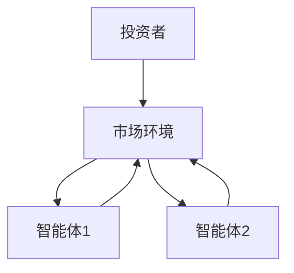
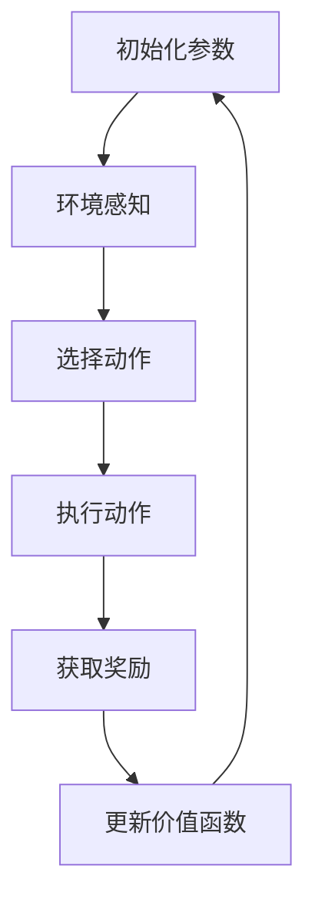
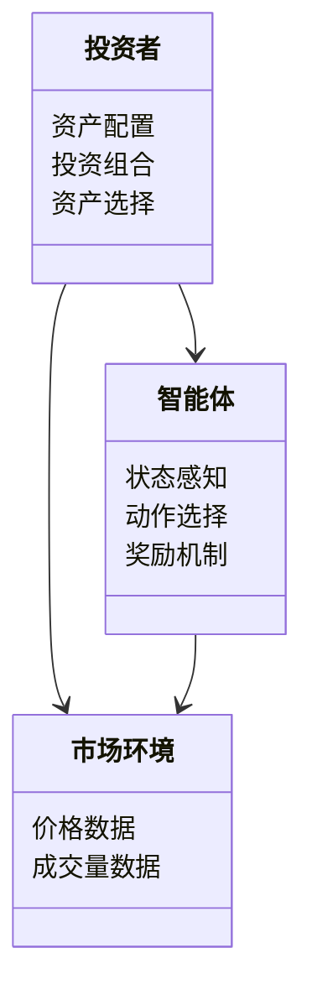
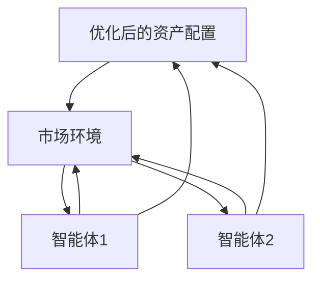
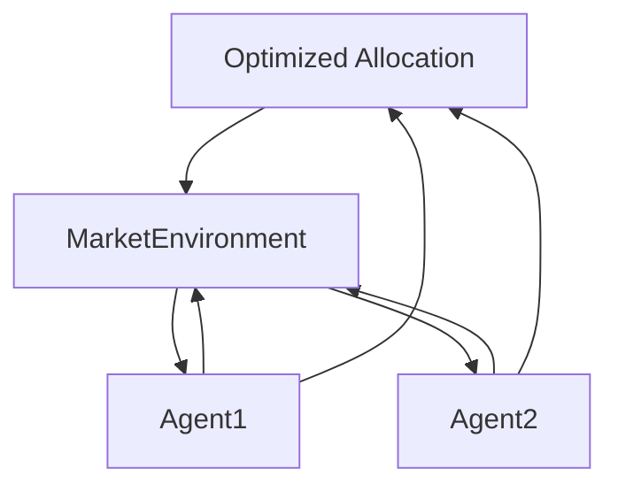

                 


# 多智能体强化学习在优化价值投资的资产配置中的应用

> 关键词：多智能体强化学习，价值投资，资产配置，强化学习，智能体协作

> 摘要：本文探讨了多智能体强化学习在优化价值投资资产配置中的应用。首先介绍了多智能体强化学习的基本概念和价值投资的定义，分析了多智能体强化学习在金融领域的优势。接着，详细讲解了多智能体强化学习的核心概念与联系，包括价值函数与策略优化的数学模型。然后，重点分析了多智能体强化学习算法的原理，如Q-learning和多智能体DQN算法，并用Mermaid流程图和Python代码进行了详细阐述。最后，结合实际投资场景，设计了系统的功能模块和架构，并通过实际案例分析了多智能体强化学习在优化资产配置中的应用效果。

---

# 第1章: 多智能体强化学习与价值投资的背景介绍

## 1.1 多智能体强化学习的定义与特点

### 1.1.1 多智能体强化学习的定义
多智能体强化学习（Multi-Agent Reinforcement Learning, MARL）是指多个智能体在共享的环境中通过学习策略来优化各自的或共同的目标。与单智能体强化学习不同，MARL强调多个智能体之间的协作与竞争关系，每个智能体都可以独立地感知环境并采取行动，最终通过全局奖励或局部奖励来优化整体或个体的策略。

### 1.1.2 多智能体强化学习的核心特点
- **协作性**：多个智能体之间可以通过协作来提高整体的收益。
- **竞争性**：智能体之间可能存在竞争关系，每个智能体的目标可能不同。
- **分布式决策**：每个智能体独立决策，但需要与其他智能体协同工作以达到最优结果。
- **复杂性**：多智能体系统比单智能体系统复杂，需要考虑智能体之间的交互和环境状态的变化。

### 1.1.3 多智能体与单智能体强化学习的区别
| 特性 | 单智能体强化学习 | 多智能体强化学习 |
|------|------------------|------------------|
| 决策主体 | 单一智能体       | 多个智能体       |
| 交互方式 | 独立决策         | 协作与竞争       |
| 状态感知 | 单一视角         | 多视角           |
| 策略优化 | 个体优化         | 集体优化         |

## 1.2 价值投资与资产配置的定义

### 1.2.1 价值投资的基本概念
价值投资是一种投资策略，强调以低于内在价值的价格购买优质资产。其核心思想是寻找市场上的“价值洼地”，即市场价格低于内在价值的资产，并长期持有，等待价格回归。

### 1.2.2 资产配置的定义与重要性
资产配置是指将资金分配到不同的资产类别（如股票、债券、房地产等）中，以实现风险分散和收益最大化。合理的资产配置可以帮助投资者在不同市场环境下平衡风险与收益。

### 1.2.3 价值投资与资产配置的关系
价值投资与资产配置密切相关。价值投资强调选择具有合理内在价值的资产，而资产配置则决定了这些资产在投资组合中的比例。通过资产配置，投资者可以在不同资产之间分散风险，同时最大化收益。

## 1.3 多智能体强化学习在价值投资中的应用背景

### 1.3.1 传统资产配置方法的局限性
传统的资产配置方法（如均值-方差模型）依赖于历史数据和假设条件，无法应对复杂多变的市场环境。此外，传统方法通常假设资产收益是独立的，忽略了市场中其他投资者的行为和决策。

### 1.3.2 强化学习在金融领域的优势
强化学习（Reinforcement Learning, RL）是一种基于试错的学习方法，适用于动态和不确定的环境。与传统方法相比，强化学习可以根据实时市场反馈调整策略，具有更强的适应性。

### 1.3.3 多智能体强化学习在价值投资中的潜力
多智能体强化学习可以模拟多个投资者的行为，分析市场中的复杂互动关系。通过多个智能体的协作，可以更准确地预测市场价格波动，优化资产配置策略。

---

# 第2章: 多智能体强化学习的核心概念与联系

## 2.1 多智能体强化学习的原理

### 2.1.1 状态空间与动作空间的定义
- **状态空间（State Space）**：智能体所处的环境状态集合，例如市场中的价格、成交量等。
- **动作空间（Action Space）**：智能体在每个状态下可以采取的动作集合，例如买入、卖出或持有某只股票。

### 2.1.2 多智能体之间的协作与竞争
- **协作**：多个智能体通过共享信息或策略来提高整体收益。
- **竞争**：智能体之间可能存在利益冲突，例如争夺有限的资源。

### 2.1.3 奖励机制的设计
奖励机制是强化学习中的关键部分，用于引导智能体的行为。在价值投资中，奖励可以定义为投资组合的收益或风险调整后的收益。

## 2.2 价值函数与策略优化

### 2.2.1 价值函数的定义与作用
- **价值函数（Value Function）**：衡量某一个状态下策略的优劣，通常定义为状态-动作对的期望收益。
- **作用**：帮助智能体评估当前策略的有效性，并指导策略的优化。

### 2.2.2 策略优化的目标与方法
- **目标**：通过优化策略，使投资组合的收益最大化，同时控制风险。
- **方法**：基于强化学习的策略梯度（Policy Gradient）方法，通过不断调整策略参数来优化目标函数。

### 2.2.3 价值函数与策略优化的关系
价值函数为策略优化提供了反馈信息，策略优化则通过调整动作空间中的动作来最大化价值函数。

## 2.3 多智能体强化学习的数学模型

### 2.3.1 状态转移概率矩阵
状态转移概率矩阵（State Transition Probability Matrix）描述了智能体在不同状态下采取不同动作后，环境状态转移的概率。

### 2.3.2 动作价值函数的表达式
动作价值函数（Q-value Function）表示在状态s下采取动作a后的期望收益：
$$ Q(s, a) = \mathbb{E}[R | s, a] $$

### 2.3.3 多智能体协作的价值函数模型
多智能体协作的价值函数模型通过多个智能体之间的信息共享，优化整体的价值函数：
$$ V(s) = \max_{\pi} \mathbb{E}[R | s, \pi] $$

---

## 2.4 价值函数与策略优化的对比表格

| 特性           | 价值函数（Value Function） | 策略优化（Policy Optimization） |
|----------------|---------------------------|-----------------------------|
| 目标           | 最大化状态-动作对的期望收益 | 最大化策略的期望收益           |
| 方法           | 基于Q-learning算法         | 基于策略梯度方法               |
| 适用场景       | 适用于离策略方法           | 适用于On-policy方法             |

---

## 2.5 多智能体强化学习的ER实体关系图



---

# 第3章: 多智能体强化学习算法原理

## 3.1 Q-learning算法

### 3.1.1 Q-learning的基本原理
Q-learning是一种经典的强化学习算法，通过更新动作价值函数（Q-value）来学习最优策略。其更新公式为：
$$ Q(s, a) = Q(s, a) + \alpha [r + \gamma \max Q(s', a') - Q(s, a)] $$

其中：
- $\alpha$ 是学习率
- $\gamma$ 是折扣因子
- $r$ 是即时奖励
- $s'$ 是下一状态

### 3.1.2 Q-learning的数学模型
Q-learning的数学模型如下：
$$ Q(s, a) = r + \gamma \max Q(s', a') $$

### 3.1.3 Q-learning在多智能体环境中的应用
在多智能体环境中，每个智能体可以独立学习自己的Q-value函数，同时通过共享信息来提高整体的收益。

---

## 3.2 多智能体DQN算法

### 3.2.1 DQN的基本原理
DQN（Deep Q-Network）是一种基于深度学习的强化学习算法，通过神经网络来近似动作价值函数。

### 3.2.2 多智能体DQN的改进方法
在多智能体环境中，DQN算法可以通过共享参数或分布式学习来提高效率。

---

## 3.3 多智能体强化学习算法的流程图



---

## 3.4 多智能体强化学习的Python代码实现

### 3.4.1 环境设置
```python
import gym
env = gym.make('Multi-Asset-Configuration-v0')
env.reset()
```

### 3.4.2 神经网络模型
```python
import torch
import torch.nn as nn

class DQN(nn.Module):
    def __init__(self, input_dim, output_dim):
        super(DQN, self).__init__()
        self.fc1 = nn.Linear(input_dim, 64)
        self.fc2 = nn.Linear(64, output_dim)
    
    def forward(self, x):
        x = torch.relu(self.fc1(x))
        x = self.fc2(x)
        return x
```

### 3.4.3 算法实现
```python
import torch.optim as optim

def train(q_network, optimizer, memory, batch_size, gamma):
    if len(memory) < batch_size:
        return
    batch = random.sample(memory, batch_size)
    states = torch.cat([torch.FloatTensor([e[0] for e in batch])])
    actions = torch.cat([torch.LongTensor([e[1] for e in batch])])
    rewards = torch.cat([torch.FloatTensor([e[2] for e in batch])])
    next_states = torch.cat([torch.FloatTensor([e[3] for e in batch])])
    
    q_values = q_network(states).gather(1, actions)
    next_q_values = q_network(next_states).max(1)[0].detach()
    target = rewards + gamma * next_q_values
    
    loss = nn.MSELoss()(q_values.squeeze(), target)
    optimizer.zero_grad()
    loss.backward()
    optimizer.step()
```

---

## 3.5 算法数学模型的详细解释

### 3.5.1 Q-learning的数学模型
Q-learning的更新公式为：
$$ Q(s, a) = Q(s, a) + \alpha (r + \gamma \max Q(s', a') - Q(s, a)) $$

### 3.5.2 DQN的数学模型
DQN通过神经网络近似动作价值函数，损失函数为：
$$ L = \mathbb{E}[(r + \gamma \max Q(s', a') - Q(s, a))^2] $$

---

# 第4章: 系统分析与架构设计

## 4.1 系统功能设计

### 4.1.1 领域模型（领域模型类图）


### 4.1.2 系统架构设计（系统架构图）


### 4.1.3 系统接口设计
- 输入接口：投资者的初始资金、市场数据、资产列表
- 输出接口：优化后的资产配置、投资组合的收益与风险分析

---

## 4.2 系统架构设计

### 4.2.1 系统架构图


### 4.2.2 系统交互流程图


---

## 4.3 系统功能模块

### 4.3.1 投资组合优化模块
- 功能：根据市场数据和智能体反馈，优化投资组合的资产配置。

### 4.3.2 市场环境感知模块
- 功能：收集和分析市场数据，提供给智能体进行决策。

### 4.3.3 智能体协作模块
- 功能：协调多个智能体的行为，实现协作与竞争的平衡。

---

## 4.4 系统核心代码实现

### 4.4.1 系统架构代码
```python
class Investor:
    def __init__(self, initial_capital):
        self.capital = initial_capital
        self.portfolio = {}
    
    def allocate_assets(self, market_data):
        # 调用智能体进行资产配置
        pass
```

### 4.4.2 智能体协作代码
```python
class Agent:
    def __init__(self, id, capital):
        self.id = id
        self.capital = capital
        self.strategy = Strategy()
    
    def decide_action(self, market_state):
        # 根据市场状态决定动作
        pass
```

---

## 4.5 系统功能模块之间的交互流程



---

# 第5章: 项目实战

## 5.1 环境安装

### 5.1.1 安装Python和相关库
```bash
pip install gym numpy torch
```

### 5.1.2 安装强化学习框架
```bash
pip install gym[atari] gym[box2d]
```

---

## 5.2 系统核心实现

### 5.2.1 投资组合优化代码
```python
import numpy as np

def optimize_portfolio(weights, returns):
    # 定义目标函数
    def objective(weights):
        return -np.mean(weights * returns)  # 最小化风险或最大化收益
    
    # 定义约束条件
    constraints = {'type': 'eq', 'fun': lambda w: np.sum(w) - 1}
    
    # 使用SLSQP求解器
    from scipy.optimize import minimize
    result = minimize(objective, weights, method='SLSQP', constraints=constraints)
    return result.x
```

### 5.2.2 多智能体协作代码
```python
import gym
env = gym.make('Multi-Asset-Configuration-v0')
env.reset()
```

---

## 5.3 实际案例分析

### 5.3.1 案例背景
假设我们有三个资产：股票A、股票B和债券C。市场数据包括历史价格、成交量等。

### 5.3.2 案例分析
通过多智能体强化学习，智能体可以协作优化投资组合的配置，例如：
- 智能体1负责选择股票A和B
- 智能体2负责选择债券C
- 通过协作，最终得到一个最优的资产配置比例。

---

## 5.4 项目小结

### 5.4.1 项目总结
通过多智能体强化学习，我们可以有效地优化价值投资的资产配置，实现收益最大化和风险最小化。

### 5.4.2 经验分享
在实际项目中，需要注意智能体之间的协作与竞争关系，同时要合理设计奖励机制，以引导智能体的行为。

---

# 第6章: 最佳实践与总结

## 6.1 最佳实践

### 6.1.1 小结
多智能体强化学习在价值投资中的应用具有很大的潜力，可以通过多个智能体的协作优化资产配置策略。

### 6.1.2 注意事项
- 设计合理的奖励机制
- 处理智能体之间的协作与竞争关系
- 确保系统的稳定性和高效性

### 6.1.3 拓展阅读
建议读者进一步学习强化学习的高级算法，如多智能体DQN和分布式强化学习。

---

## 6.2 总结

通过本文的详细讲解，我们了解了多智能体强化学习在优化价值投资资产配置中的应用。多智能体强化学习通过模拟多个投资者的行为，优化投资组合的配置，实现收益最大化和风险最小化。希望本文的内容能够为读者提供有价值的参考。

---

# 作者：AI天才研究院/AI Genius Institute & 禅与计算机程序设计艺术 /Zen And The Art of Computer Programming

