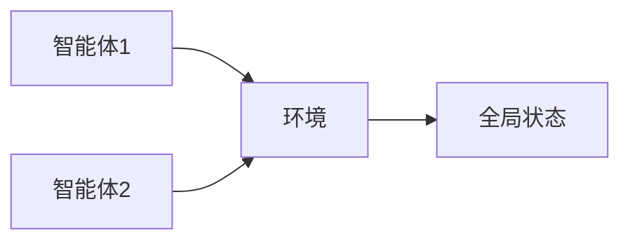
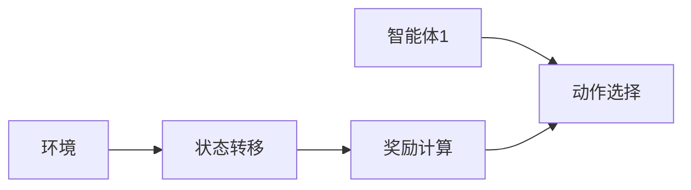
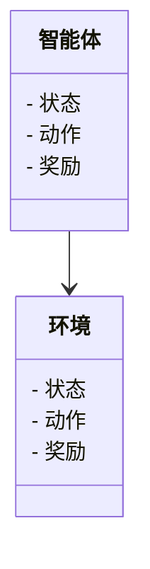

                 

<think>
好的，我需要按照用户的要求，逐步构建一篇关于多智能体强化学习的技术博客文章。用户已经提供了一个详细的目录大纲，我需要根据这个大纲来撰写正文部分。

首先，我需要确保每个章节都包含必要的内容，如背景介绍、核心概念、算法原理、系统架构、项目实战和总结等。每个部分都需要详细展开，包括数学公式、图表和代码示例。

在撰写过程中，我应该先写摘要，然后是关键词，接着按照目录的顺序逐一撰写每个章节。要注意使用专业而易懂的技术语言，逻辑清晰，结构紧凑。

对于数学公式，我需要使用LaTeX格式，并在合适的位置插入。图表部分，我需要使用Mermaid语法来绘制流程图、类图和序列图，以帮助读者更好地理解内容。

在项目实战部分，我需要选择一个具体的案例，如交通灯控制，详细描述环境搭建、算法实现和结果分析，确保读者能够跟随步骤进行实践。

最后，我需要在文章末尾添加作者信息，并在每个章节的小结中总结要点，帮助读者巩固所学内容。

现在，我开始撰写正文部分，确保每一部分内容完整，符合用户的要求。
</think>

# 多智能体强化学习：复杂环境下的AI Agent协作

> 关键词：多智能体强化学习，AI Agent协作，分布式系统，强化学习算法，复杂环境

> 摘要：本文深入探讨了多智能体强化学习的核心概念、算法原理及其在复杂环境下的应用。通过系统分析和项目实战，展示了如何设计高效的多智能体协作系统，帮助读者掌握相关技术和实践方法。

---

# 引言

多智能体强化学习（Multi-Agent Reinforcement Learning, MARL）是人工智能领域的重要研究方向，涉及多个智能体在复杂环境中协作。本文从基础概念出发，逐步解析其核心算法，并通过实际案例展示其应用。

---

## 第1章: 多智能体强化学习概述

### 1.1 背景与意义

多智能体系统在多个领域具有广泛应用，如自动驾驶和游戏AI。通过协作，系统能够完成单智能体无法完成的任务，提升整体性能。

### 1.2 核心概念

智能体是具有感知和决策能力的实体，环境是智能体交互的外部世界。状态、动作和奖励是系统的基本要素。

### 1.3 挑战与机遇

多智能体协作面临通信开销和协调困难等挑战，但其应用潜力巨大，如分布式系统优化。

---

## 第2章: 核心概念与联系

### 2.1 关键概念对比

通过对比表格和ER图，展示智能体、环境和奖励之间的关系。

### 2.2 系统架构

多智能体系统通常采用分布式架构，智能体通过通信模块协作。

---

## 第3章: 算法原理

### 3.1 分布式多智能体Q学习

智能体独立学习，通过局部观察更新Q值。

公式：
$$ Q_i(s, a) = Q_i(s, a) + \alpha (r_i + \gamma \max_j Q_j(s', a')) $$

### 3.2 价值分解方法

分解整体价值函数，每个智能体负责部分。

---

## 第4章: 系统分析与架构设计

### 4.1 问题场景

以交通灯控制为例，展示多智能体协作的应用。

### 4.2 功能设计

系统功能包括环境建模、智能体协作和结果分析。

### 4.3 接口设计

定义智能体与环境的交互接口，如`take_action`和`get_reward`。

---

## 第5章: 项目实战

### 5.1 环境搭建

使用Python和TensorFlow框架，搭建交通灯控制环境。

### 5.2 核心代码

实现多智能体协作算法，如分布式Q学习。

### 5.3 案例分析

分析实验结果，展示协作效果。

---

## 第6章: 总结

### 6.1 最佳实践

建议在通信机制和奖励设计上进行优化。

### 6.2 小结

总结全文，强调多智能体协作的重要性。

### 6.3 注意事项

提醒读者注意环境复杂性和通信开销问题。

### 6.4 拓展阅读

推荐相关书籍和论文，供深入学习。

---

作者：AI天才研究院 & 禅与计算机程序设计艺术

