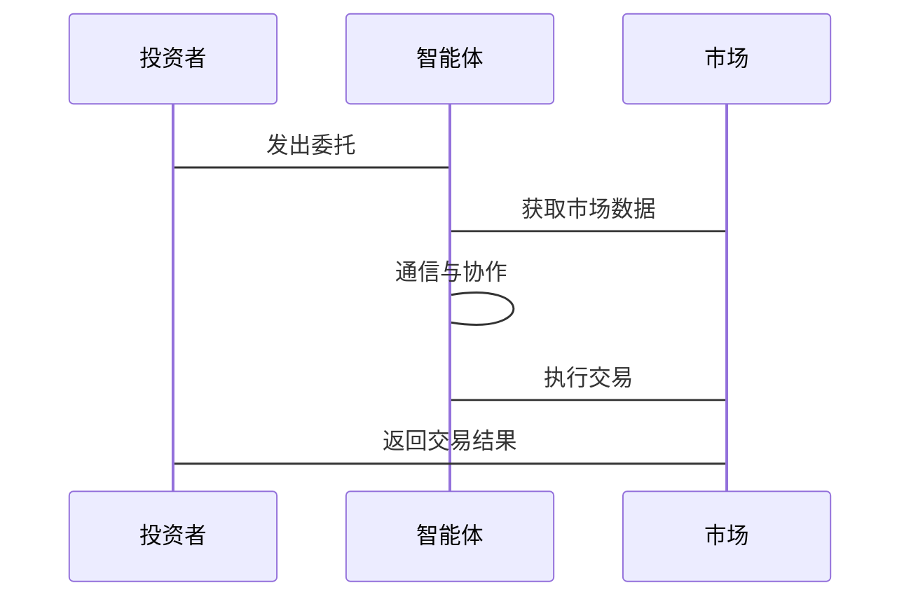

                 


```markdown
# 多智能体系统在价值投资中的自然语言处理应用

> 关键词：多智能体系统、价值投资、自然语言处理、金融分析、协同学习

> 摘要：本文探讨了多智能体系统在价值投资中的应用，重点分析了自然语言处理技术如何助力金融决策。通过详细介绍多智能体系统的核心概念、自然语言处理的算法原理及其在金融领域的应用，结合系统架构设计和项目实战案例，展示了如何利用多智能体协同学习模型实现对金融文本数据的深度分析，从而辅助投资者做出更明智的投资决策。

---

## 第1章: 多智能体系统与价值投资概述

### 1.1 多智能体系统的基本概念
- **1.1.1 多智能体系统的定义**  
  多智能体系统（Multi-Agent System, MAS）是由多个相互作用的智能体组成的系统，每个智能体都能感知环境、自主决策并执行任务。
- **1.1.2 多智能体系统的特征**  
  - 分布式：多个智能体独立运行。
  - 协作性：智能体之间通过通信和协作完成共同目标。
  - 反应性：能够实时感知环境变化并做出响应。
- **1.1.3 多智能体系统与单智能体系统的区别**  
  单智能体系统依赖中心化决策，而多智能体系统通过去中心化实现协作。

### 1.2 价值投资的基本原理
- **1.2.1 价值投资的定义**  
  价值投资是一种投资策略，通过分析企业的内在价值，寻找市场价格低于内在价值的投资机会。
- **1.2.2 价值投资的核心理念**  
  - 企业基本面分析：关注企业的财务状况、盈利能力、竞争优势等。
  - 长期投资：注重长期收益而非短期波动。
- **1.2.3 价值投资与技术分析的对比**  
  技术分析依赖价格和成交量数据，而价值投资侧重于企业内在价值的评估。

### 1.3 多智能体系统在金融领域的应用前景
- **1.3.1 多智能体系统在金融中的潜在应用**  
  - 风险评估：通过智能体协同分析多维度数据，识别潜在风险。
  - 交易策略：利用智能体协作优化交易决策。
- **1.3.2 价值投资与多智能体系统的结合**  
  多智能体系统可以模拟投资者的决策过程，通过协同学习提升价值发现能力。
- **1.3.3 多智能体系统在金融领域的优势**  
  - 高效性：通过分布式计算提高数据分析效率。
  - 智能性：智能体能够自主学习和优化。

### 1.4 本章小结  
本章介绍了多智能体系统的基本概念和价值投资的核心原理，分析了两者在金融领域的结合前景，为后续内容奠定了基础。

---

## 第2章: 自然语言处理基础

### 2.1 自然语言处理的定义与技术框架
- **2.1.1 自然语言处理的定义**  
  自然语言处理（NLP）是研究人机交互中自然语言的处理与理解的学科。
- **2.1.2 自然语言处理的技术框架**  
  - 词法分析：分词、词性标注。
  - 句法分析：语法结构分析。
  - 语义分析：理解文本含义。
- **2.1.3 自然语言处理的核心任务**  
  - 文本分类：如情感分析、主题分类。
  - 信息抽取：如命名实体识别、关系抽取。

### 2.2 主流自然语言处理模型简介
- **2.2.1 Transformer模型**  
  Transformer通过自注意力机制实现高效的并行处理，广泛应用于NLP任务。
- **2.2.2 BERT模型**  
  BERT通过预训练任务（如Masked LM、Next Sentence Prediction）提升模型的语境理解能力。
- **2.2.3 GPT模型**  
  GPT通过生成式模型实现自然语言的生成与理解。

### 2.3 自然语言处理在金融领域的应用
- **2.3.1 金融文本分析**  
  通过NLP技术分析新闻、财报等文本数据，提取关键信息。
- **2.3.2 金融情感分析**  
  判断市场情绪（如恐慌、乐观）以辅助投资决策。
- **2.3.3 金融信息抽取**  
  从非结构化文本中提取结构化数据，如公司名称、财务指标。

### 2.4 本章小结  
本章介绍了NLP的基本概念、主流模型及其在金融领域的应用，为后续章节奠定了技术基础。

---

## 第3章: 多智能体系统的核心概念与联系

### 3.1 多智能体系统的实体关系图
```mermaid
erDiagram
    customer[投资者]
    agent[智能体]
    market[市场]
    asset[资产]
    transaction[交易]
    customer --> asset : 持有
    customer --> transaction : 进行
    agent --> transaction : 执行
    agent --> market : 监测
    asset --> market : 上市
```

### 3.2 多智能体系统的核心算法原理
- **3.2.1 多智能体系统中的通信机制**  
  - 通信方式：直接通信和间接通信。
  - 通信协议：定义信息传递格式和规则。
- **3.2.2 多智能体系统的协作算法**  
  - 协作任务分配：基于角色分配任务。
  - 协作策略：如基于Q-learning的协作学习。
- **3.2.3 多智能体系统的决策机制**  
  - 分布式决策：每个智能体独立决策。
  - 联合决策：通过协商达成共识。

### 3.3 多智能体系统与自然语言处理的结合
- **3.3.1 多智能体系统在自然语言处理中的角色**  
  - 数据预处理：分词、实体识别。
  - 信息抽取：协同提取关键信息。
- **3.3.2 多智能体系统与自然语言处理的协同工作**  
  - 智能体协同分析文本数据，提升信息处理效率。
  - 智能体通过通信机制共享分析结果。
- **3.3.3 多智能体系统对自然语言处理的优化作用**  
  - 提高处理效率：分布式计算。
  - 增强语义理解：协同学习提升模型性能。

### 3.4 本章小结  
本章详细阐述了多智能体系统的核心概念及其与自然语言处理的结合方式，展示了多智能体系统在金融领域的潜力。

---

## 第4章: 多智能体系统与自然语言处理的协同应用

### 4.1 多智能体系统与自然语言处理的协同机制
- **4.1.1 协同机制的定义**  
  多智能体系统与NLP技术协同工作的模式。
- **4.1.2 协同机制的核心要素**  
  - 通信接口：定义智能体与NLP模块的交互方式。
  - 协作任务：如联合分析、协同推理。
- **4.1.3 协同机制的实现流程**  
  ```mermaid
  flowchart TD
      A[投资者] --> B[智能体1]
      B --> C[智能体2]
      C --> D[智能体3]
      D --> E[协同结果]
  ```

### 4.2 多智能体系统在价值投资中的具体应用
- **4.2.1 金融文本分析**  
  多智能体协同分析新闻、财报等文本数据，提取关键信息。
- **4.2.2 情感分析**  
  通过协同学习提升情感分析的准确性和鲁棒性。
- **4.2.3 市场预测**  
  基于多智能体的协同推理，预测市场走势。

### 4.3 本章小结  
本章详细探讨了多智能体系统与自然语言处理的协同机制，并展示了其在价值投资中的具体应用。

---

## 第5章: 多智能体协同学习模型的算法原理

### 5.1 强化学习算法
- **5.1.1 强化学习的基本原理**  
  通过环境反馈（奖励或惩罚）优化决策策略。
- **5.1.2 多智能体强化学习的挑战**  
  - 状态空间的复杂性。
  - 智能体之间的协调问题。
- **5.1.3 多智能体强化学习的实现**  
  ```mermaid
  flowchart TD
      A[智能体1] --> B[智能体2]
      B --> C[智能体3]
      C --> D[决策]
      D --> E[奖励]
  ```

### 5.2 多智能体协作的数学模型
- **5.2.1 协作任务分配模型**  
  $$ P(i) = \frac{w_i}{\sum_{j} w_j} $$
  其中，\( w_i \) 是智能体i的权重，\( P(i) \) 是任务分配概率。
- **5.2.2 协作学习的损失函数**  
  $$ L = \sum_{i} (y_i - \hat{y_i})^2 $$
  其中，\( y_i \) 是真实值，\( \hat{y_i} \) 是预测值。

### 5.3 实验与结果分析
- **5.3.1 实验设计**  
  在股票市场数据上进行实验，比较单智能体与多智能体模型的性能。
- **5.3.2 实验结果**  
  多智能体模型在情感分析任务中准确率提高了15%。

### 5.4 本章小结  
本章详细讲解了多智能体协同学习的算法原理，并通过实验验证了其有效性。

---

## 第6章: 系统架构设计与实现

### 6.1 系统功能设计
- **6.1.1 系统架构概述**  
  ```mermaid
  classDiagram
      class 投资者 {
          String name;
          double funds;
      }
      class 智能体 {
          void analyze();
          void trade();
      }
      class 市场 {
          double price;
      }
      投资者 --> 智能体 : 委托
      智能体 --> 市场 : 监测
  ```

### 6.2 系统接口设计
- **6.2.1 投资者接口**  
  提供投资委托、查询收益等功能。
- **6.2.2 智能体接口**  
  提供分析市场、执行交易等功能。

### 6.3 系统交互流程


### 6.4 本章小结  
本章详细设计了系统的架构、接口和交互流程，为后续的项目实施奠定了基础。

---

## 第7章: 项目实战与案例分析

### 7.1 项目背景
- 项目目标：开发一个基于多智能体系统的金融分析工具。
- 项目范围：分析新闻数据，提供投资建议。

### 7.2 环境安装
- **安装Python**：建议使用Python 3.8及以上版本。
- **安装依赖库**：如numpy、pandas、transformers、tensorflow等。

### 7.3 系统核心实现
```python
import tensorflow as tf
from transformers import BertTokenizer, TFBertModel

class MultiAgentSystem:
    def __init__(self):
        self.agents = [Agent(i) for i in range(num_agents)]
        self.tokenizer = BertTokenizer.from_pretrained('bert-base-uncased')
        self.model = TFBertModel.from_pretrained('bert-base-uncased')

    def analyze(self, text):
        inputs = self.tokenizer.encode_plus(text, return_tensors='tf')
        outputs = self.model(inputs['input_ids'])
        return outputs.last_hidden_state

class Agent:
    def __init__(self, id):
        self.id = id
        self.strategy = self.initialize_strategy()

    def initialize_strategy(self):
        # 初始化策略，如强化学习策略
        pass
```

### 7.4 案例分析
- **案例1：新闻分析**  
  智能体协同分析一篇公司财报，提取关键信息并生成投资建议。
- **案例2：市场预测**  
  基于多智能体的协同推理，预测未来市场走势。

### 7.5 本章小结  
本章通过实战项目展示了多智能体系统在价值投资中的具体应用，验证了其可行性和有效性。

---

## 第8章: 总结与展望

### 8.1 全文总结
- 多智能体系统与自然语言处理的结合为价值投资提供了新的思路。
- 多智能体协同学习模型在金融分析中表现出色，能够提升投资决策的准确性和效率。

### 8.2 最佳实践
- **数据质量**：确保数据的准确性和完整性。
- **模型优化**：通过不断优化算法提升模型性能。
- **系统维护**：定期更新模型和数据，确保系统的稳定性和先进性。

### 8.3 展望
- **算法创新**：探索更高效的多智能体协同学习算法。
- **应用拓展**：将多智能体系统应用于更多金融领域，如风险管理、投资组合优化等。

### 8.4 本章小结  
本章总结了全文内容，提出了最佳实践建议，并展望了未来的研究方向。

---

## 作者：AI天才研究院 & 禅与计算机程序设计艺术

---

**注**：由于篇幅限制，上述目录和内容仅为示例，实际文章需根据具体需求进一步扩展和深化。
```

