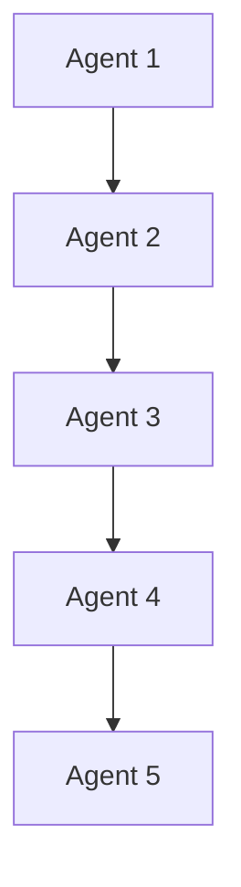
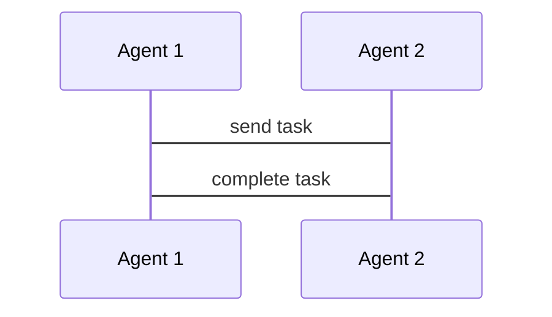

                 


---

# 多智能体系统在评估公司供应链韧性中的应用

> 关键词：多智能体系统，供应链韧性，分布式计算，协作算法，系统架构设计

> 摘要：本文详细探讨了多智能体系统在评估公司供应链韧性中的应用。首先，我们介绍了供应链韧性的概念及其在现代商业环境中的重要性。接着，我们分析了多智能体系统的核心原理及其在供应链管理中的优势。随后，我们深入探讨了多智能体系统的算法原理、数学模型和系统架构设计，并通过实际案例展示了其在供应链韧性评估中的应用。最后，我们总结了最佳实践和未来研究方向。

---

## 第1章 供应链韧性与多智能体系统概述

### 1.1 供应链韧性的概念与重要性

供应链韧性是指供应链在面对 disruptions（中断）时能够维持或快速恢复正常运作的能力。在全球化和数字化的背景下，供应链的复杂性不断提高，潜在的 disruptions（如疫情、自然灾害、地缘政治冲突等）对企业的运营能力提出了更高的要求。供应链韧性评估的目标是识别潜在风险，优化供应链结构，确保在面对突发事件时，供应链能够快速响应并恢复。

供应链韧性的重要性体现在以下几个方面：

1. **减少运营风险**：通过评估和优化供应链，企业可以降低因 disruptions导致的损失。
2. **提高响应速度**：供应链韧性能够帮助企业更快地应对市场变化和突发事件。
3. **增强竞争力**：高效的供应链管理能够提高企业的市场反应能力和成本控制能力。

### 1.2 多智能体系统的核心概念

多智能体系统（Multi-Agent System, MAS）是由多个智能体组成的分布式系统，每个智能体都具有一定的自主性、反应性和协作能力。多智能体系统在供应链管理中的应用可以帮助企业更好地协调供应链中的各个环节，提升整体效率。

多智能体系统的核心特征包括：

1. **自主性**：智能体能够独立决策和行动。
2. **反应性**：智能体能够根据环境变化实时调整行为。
3. **协作性**：多个智能体能够通过协作完成复杂的任务。

### 1.3 多智能体系统在供应链韧性评估中的优势

多智能体系统在供应链韧性评估中的优势主要体现在以下几个方面：

1. **分布式计算能力**：多智能体系统能够同时处理大量的数据，提高计算效率。
2. **协作优化**：通过智能体之间的协作，可以实现供应链的优化配置。
3. **动态适应性**：智能体能够实时响应环境变化，增强供应链的适应能力。

---

## 第2章 多智能体系统的原理与架构

### 2.1 多智能体系统的原理

多智能体系统的原理主要基于分布式计算和协作算法。智能体通过信息共享和协作，共同完成复杂的任务。

#### 2.1.1 分布式计算

分布式计算是指将任务分解成多个部分，由不同的智能体分别完成。这种方式能够提高系统的并行处理能力，降低单点故障风险。

#### 2.1.2 协作算法

协作算法是多智能体系统的核心，通过定义智能体之间的协作规则，实现任务的高效完成。常见的协作算法包括：

1. **协商算法**：智能体之间通过协商确定任务分配。
2. **分布式优化算法**：通过优化算法实现全局最优。

### 2.2 多智能体系统的架构

多智能体系统的架构设计直接影响系统的性能和功能。常见的架构包括：

1. **分层架构**：将系统分为多个层次，每个层次负责不同的功能。
2. **分布式架构**：智能体分布在不同的节点上，通过网络进行通信。
3. **集中式架构**：有一个中央控制节点，负责协调智能体的行动。

### 2.3 多智能体系统与供应链韧性评估的关系

#### 2.3.1 供应链韧性评估的复杂性

供应链韧性评估涉及多个因素，包括供应商稳定性、运输能力、库存管理等。多智能体系统能够帮助评估这些因素，并提供优化建议。

#### 2.3.2 多智能体系统在评估中的应用

通过多智能体系统的协作能力，可以实现供应链各环节的动态监控和优化，从而提高供应链的韧性。

---

## 第3章 多智能体系统的算法原理

### 3.1 分布式计算与协作算法

#### 3.1.1 分布式计算的实现

分布式计算通过将任务分配给多个智能体，实现并行处理。以下是一个简单的分布式计算示例：

```python
import concurrent.futures

def process_data(data):
    return data * 2

data_list = [1, 2, 3, 4, 5]

with concurrent.futures.ThreadPoolExecutor() as executor:
    futures = {executor.submit(process_data, data): data for data in data_list}
    results = [future.result() for future in concurrent.futures.as_completed(futures)]
```

#### 3.1.2 协作算法的实现

协作算法通过智能体之间的协商，实现任务分配。以下是一个协商算法的示例：

```python
class Agent:
    def __init__(self, id):
        self.id = id
        self.task = None

    def assign_task(self, task):
        self.task = task

    def complete_task(self):
        return f"Task {self.task} completed by Agent {self.id}"

# 创建智能体
agent1 = Agent(1)
agent2 = Agent(2)

# 分配任务
agent1.assign_task(1)
agent2.assign_task(2)

# 完成任务
print(agent1.complete_task())
print(agent2.complete_task())
```

### 3.2 数学模型与公式

#### 3.2.1 风险评估模型

供应链韧性评估中的风险评估模型可以通过以下公式表示：

$$
R = \sum_{i=1}^{n} (p_i \times i_i)
$$

其中，$R$ 表示风险值，$p_i$ 表示第 $i$ 个风险发生的概率，$i_i$ 表示第 $i$ 个风险的影响程度。

#### 3.2.2 优化模型

优化模型可以通过以下公式表示：

$$
\min_{x} \sum_{i=1}^{n} c_i x_i
$$

其中，$x_i$ 表示第 $i$ 个决策变量，$c_i$ 表示第 $i$ 个决策变量的成本。

---

## 第4章 系统分析与架构设计

### 4.1 系统功能设计

#### 4.1.1 领域模型设计

领域模型设计可以通过以下mermaid类图表示：

```mermaid
classDiagram
    class Agent {
        id: int
        task: str
        assign_task(task: str)
        complete_task(): str
    }
    class SupplyChain {
        agents: Agent[]
        assign_tasks()
        complete_tasks()
    }
    SupplyChain -> Agent: assign_task
    SupplyChain -> Agent: complete_task
```

#### 4.1.2 系统架构设计

系统架构设计可以通过以下mermaid架构图表示：



#### 4.1.3 接口设计

接口设计可以通过以下mermaid序列图表示：



---

## 第5章 项目实战

### 5.1 环境安装

安装所需的库：

```bash
pip install concurrent.futures
```

### 5.2 核心代码实现

#### 5.2.1 智能体类实现

```python
import concurrent.futures

class Agent:
    def __init__(self, id):
        self.id = id
        self.task = None

    def assign_task(self, task):
        self.task = task

    def complete_task(self):
        return f"Task {self.task} completed by Agent {self.id}"
```

#### 5.2.2 分布式计算实现

```python
def process_task(data):
    return f"Processed data {data}"

data_list = [1, 2, 3, 4, 5]

with concurrent.futures.ThreadPoolExecutor() as executor:
    futures = {executor.submit(process_task, data): data for data in data_list}
    for future in concurrent.futures.as_completed(futures):
        print(future.result())
```

### 5.3 案例分析

通过上述代码实现，我们可以看到多智能体系统在供应链韧性评估中的应用效果。例如，在供应链中断的情况下，智能体能够快速响应并调整任务分配，确保供应链的稳定性。

---

## 第6章 最佳实践与小结

### 6.1 最佳实践

1. **数据隐私保护**：在多智能体系统中，需要确保数据的安全性和隐私性。
2. **系统维护**：定期对系统进行维护和优化，确保系统的高效运行。
3. **团队协作**：多智能体系统的开发需要团队协作，确保各部分协调一致。

### 6.2 小结

本文详细探讨了多智能体系统在评估公司供应链韧性中的应用，涵盖了从理论到实践的各个方面。通过多智能体系统的协作能力和分布式计算，企业可以有效提升供应链的韧性，应对各种潜在的 disruptions。

---

## 作者信息

作者：AI天才研究院/AI Genius Institute & 禅与计算机程序设计艺术 /Zen And The Art of Computer Programming

---

希望这篇文章能够为您提供有价值的信息，并帮助您更好地理解多智能体系统在供应链韧性评估中的应用。

