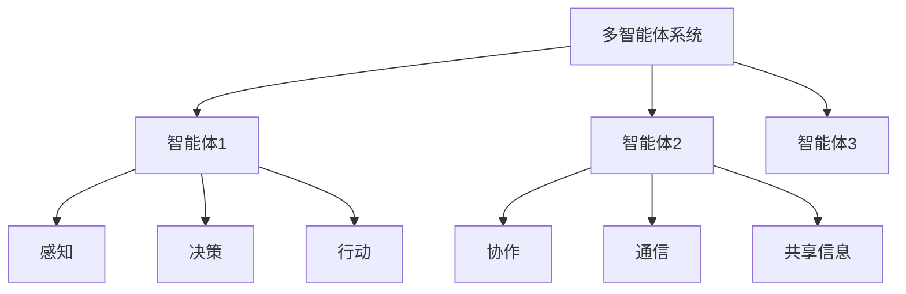
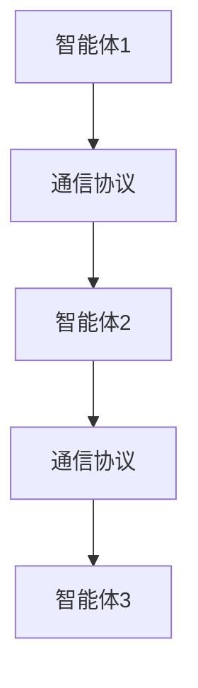
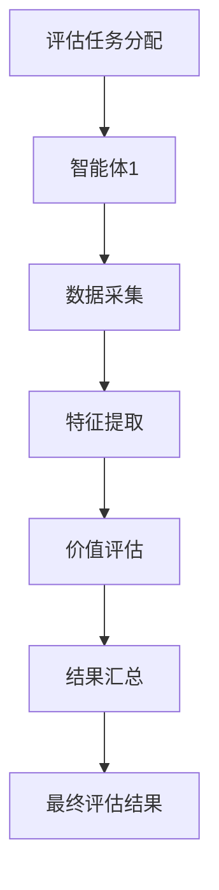
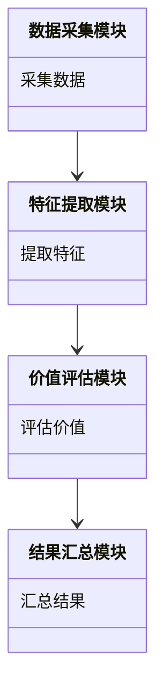
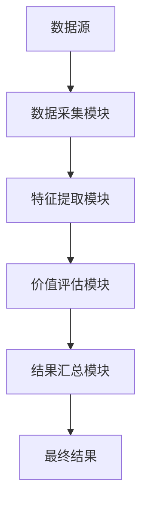
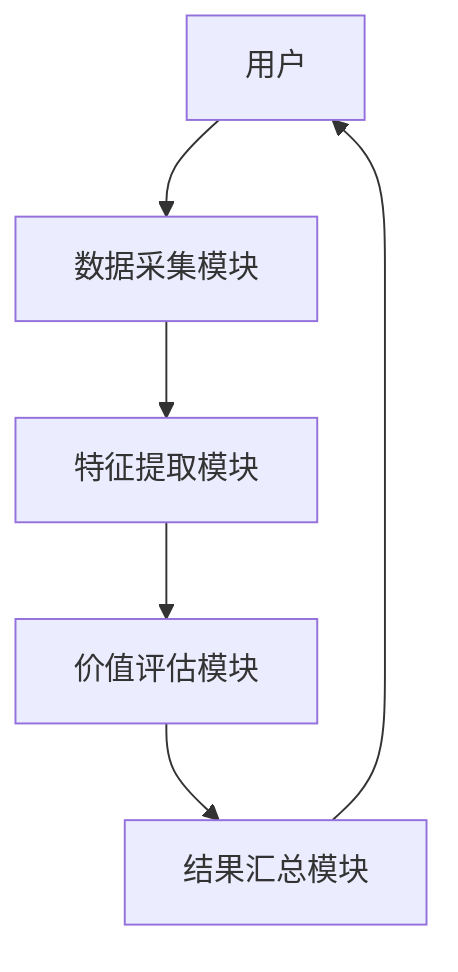

                 


# 多智能体系统在评估无形资产和品牌价值中的应用

> 关键词：多智能体系统，无形资产评估，品牌价值，协同评估，人工智能技术

> 摘要：本文探讨了多智能体系统在评估无形资产和品牌价值中的应用。通过分析多智能体系统的原理和优势，结合实际案例，展示了如何利用多智能体系统提升无形资产评估的准确性和效率。文章从理论到实践，详细阐述了多智能体系统的应用模型、系统架构以及实际应用中的挑战与解决方案。

---

## 第一部分: 多智能体系统在评估无形资产和品牌价值中的应用基础

---

### 第1章: 多智能体系统概述

#### 1.1 多智能体系统的基本概念

##### 1.1.1 多智能体系统的定义

多智能体系统（Multi-Agent System, MAS）是由多个智能体（Agent）组成的分布式系统，这些智能体能够通过协作完成复杂任务。智能体是具有感知、决策、推理和行动能力的实体，可以是软件程序或物理设备。

**图1.1 多智能体系统的概念框架**



##### 1.1.2 多智能体系统的体系结构

多智能体系统的体系结构决定了智能体之间的交互方式。常见的体系结构包括：

1. **分散式结构**：智能体之间没有中心控制，通过通信进行协作。
2. **集中式结构**：有一个中央控制单元协调各智能体的行动。
3. **混合式结构**：结合分散式和集中式的特点，部分任务由中心控制，部分任务由智能体自主完成。

##### 1.1.3 多智能体系统的特点与优势

- **分布式计算**：任务分布在多个智能体上，提高系统的并行处理能力。
- **协作性**：智能体之间通过协作完成复杂任务，增强系统的整体能力。
- **适应性**：智能体能够根据环境变化动态调整行为，具备较强的适应能力。
- **容错性**：即使部分智能体失效，其他智能体仍能完成任务，提高系统的可靠性。

#### 1.2 多智能体系统与传统评估方法的对比

##### 1.2.1 传统无形资产评估方法的局限性

传统的无形资产评估方法主要包括市场法、收益法和成本法。这些方法在实际应用中存在以下问题：

1. **数据获取困难**：无形资产的评估往往缺乏足够的市场数据支持。
2. **主观性较强**：评估结果容易受到评估人员主观判断的影响。
3. **动态性不足**：难以捕捉无形资产在市场中的动态变化。

##### 1.2.2 多智能体系统在评估中的独特价值

多智能体系统通过智能体之间的协作和通信，能够实时获取和处理大量数据，从而更准确地评估无形资产的价值。其独特价值体现在以下几个方面：

1. **数据处理能力强**：能够处理多源异构数据，提高评估的准确性。
2. **动态适应性强**：能够实时调整评估策略，适应市场变化。
3. **协作效率高**：通过智能体协作，提高评估过程的效率。

---

### 第2章: 多智能体系统的核心原理

#### 2.1 多智能体系统的通信机制

##### 2.1.1 智能体之间的信息传递

智能体之间的通信可以通过多种方式实现，常见的通信机制包括：

1. **直接通信**：智能体之间通过共享内存或消息队列直接交换信息。
2. **间接通信**：通过中间件或代理进行信息传递，减少直接耦合。

**图2.1 智能体之间的通信机制**



##### 2.1.2 通信协议的选择与实现

通信协议的选择需要考虑系统的实时性、可靠性和安全性。常见的通信协议包括：

1. **HTTP/HTTPS**：适用于基于Web的通信。
2. **WebSocket**：适用于实时通信。
3. **Message Queue Telemetry Transport (MQTT)**：适用于低带宽、高延迟的环境。

#### 2.2 多智能体系统的协作机制

##### 2.2.1 协作策略的设计

协作策略的设计是多智能体系统的核心内容之一。常见的协作策略包括：

1. **任务分配**：根据智能体的能力和当前负载，动态分配任务。
2. **协调与同步**：确保智能体之间的行动协调一致。
3. **冲突解决**：通过协商或仲裁机制解决智能体之间的冲突。

##### 2.2.2 协作过程中的冲突解决

冲突解决机制是多智能体系统的重要组成部分，常见的冲突解决方法包括：

1. **协商机制**：智能体通过协商达成一致。
2. **仲裁机制**：通过仲裁者解决冲突。
3. **优先级机制**：根据任务优先级自动解决冲突。

#### 2.3 多智能体系统的决策机制

##### 2.3.1 分布式决策的原理

分布式决策是多智能体系统的重要特征，每个智能体根据自身感知和全局信息做出决策。

##### 2.3.2 基于博弈论的决策模型

博弈论是多智能体决策的重要工具，通过分析智能体之间的博弈关系，制定最优决策策略。

---

### 第3章: 无形资产和品牌价值评估的背景与挑战

#### 3.1 无形资产评估的传统方法

##### 3.1.1 市场法

市场法是通过比较类似资产的市场交易价格，确定资产价值的一种方法。其公式为：

$$ V = \frac{\sum_{i=1}^{n} V_i}{n} $$

其中，\( V \) 是资产的评估价值，\( V_i \) 是类似资产的交易价格，\( n \) 是类似资产的数量。

##### 3.1.2 收益法

收益法是通过预测资产未来产生的收益，折现确定其现值。其公式为：

$$ V = \frac{CF}{r} $$

其中，\( V \) 是资产的评估价值，\( CF \) 是未来现金流，\( r \) 是折现率。

##### 3.1.3 成本法

成本法是通过估算资产的重置成本，确定其价值。其公式为：

$$ V = C + D $$

其中，\( V \) 是资产的评估价值，\( C \) 是重置成本，\( D \) 是其他相关费用。

#### 3.2 品牌价值评估的复杂性

##### 3.2.1 品牌的多维度特征

品牌价值的评估需要考虑品牌知名度、品牌忠诚度、品牌认知度等多个维度。

##### 3.2.2 品牌价值的动态变化

品牌价值会受到市场环境、消费者偏好等因素的影响，具有动态变化的特点。

#### 3.3 传统方法的局限性与改进需求

##### 3.3.1 数据获取的困难

传统的评估方法往往依赖于有限的数据支持，难以准确反映资产的实际价值。

##### 3.3.2 方法的主观性和片面性

传统方法往往忽视了资产的复杂性和多维度特征，导致评估结果不够准确。

---

### 第4章: 多智能体系统在品牌价值评估中的应用模型

#### 4.1 基于多智能体的协同评估模型

##### 4.1.1 模型的总体框架

基于多智能体的协同评估模型由多个智能体组成，每个智能体负责不同的评估任务。

**图4.1 基于多智能体的协同评估模型**



##### 4.1.2 各智能体的角色分配

根据评估任务的不同，智能体可以分为数据采集智能体、特征提取智能体和价值评估智能体。

#### 4.2 品牌价值评估

##### 4.2.1 品牌价值评估的数学模型

品牌价值评估的数学模型可以通过多智能体协同完成。例如，可以使用协同价值评估公式：

$$ V = \sum_{i=1}^{n} w_i \cdot v_i $$

其中，\( V \) 是品牌价值，\( w_i \) 是第 \( i \) 个智能体的权重，\( v_i \) 是第 \( i \) 个智能体的评估结果。

##### 4.2.2 智能体之间的协作流程

智能体之间的协作流程包括数据采集、特征提取、价值评估和结果汇总等步骤。

---

### 第5章: 系统架构与设计

#### 5.1 系统架构设计

##### 5.1.1 系统功能模块

系统功能模块包括数据采集模块、特征提取模块、价值评估模块和结果汇总模块。

**图5.1 系统功能模块类图**



##### 5.1.2 系统架构图

**图5.2 系统架构图**



#### 5.2 系统接口设计

##### 5.2.1 系统接口描述

系统接口包括数据采集接口、特征提取接口、价值评估接口和结果汇总接口。

##### 5.2.2 系统交互流程图

**图5.3 系统交互流程图**



---

### 第6章: 项目实战

#### 6.1 环境配置

##### 6.1.1 安装Python和相关库

```bash
pip install numpy pandas scikit-learn
```

#### 6.2 系统核心实现源代码

##### 6.2.1 数据采集模块

```python
import requests

def collect_data(url):
    response = requests.get(url)
    return response.json()
```

##### 6.2.2 特征提取模块

```python
from sklearn.feature_extraction.text import TfidfVectorizer

def extract_features(text):
    vectorizer = TfidfVectorizer()
    features = vectorizer.fit_transform([text])
    return features
```

##### 6.2.3 价值评估模块

```python
from sklearn.linear_model import LinearRegression

def evaluate_value(features):
    model = LinearRegression()
    model.fit(features, target_values)
    return model.predict(features)
```

#### 6.3 代码应用解读与分析

##### 6.3.1 代码功能分析

数据采集模块负责从指定URL获取数据，特征提取模块使用TF-IDF方法提取文本特征，价值评估模块使用线性回归模型预测品牌价值。

##### 6.3.2 代码实现流程

1. 数据采集模块获取数据。
2. 特征提取模块提取特征。
3. 价值评估模块进行预测。
4. 结果汇总模块输出最终结果。

#### 6.4 实际案例分析

##### 6.4.1 案例分析

假设我们要评估某品牌的价值，首先通过数据采集模块获取相关数据，然后通过特征提取模块提取特征，最后通过价值评估模块进行评估。

##### 6.4.2 案例解读

通过上述步骤，我们可以准确地评估品牌的实际价值。

---

### 第7章: 最佳实践、小结与展望

#### 7.1 最佳实践 tips

- **数据质量管理**：确保数据的准确性和完整性。
- **模型优化**：定期优化评估模型，提高评估准确率。
- **系统维护**：定期检查系统运行状态，及时修复问题。

#### 7.2 小结

通过本文的介绍，我们了解了多智能体系统在评估无形资产和品牌价值中的应用。多智能体系统的分布式计算和协作能力，使其在无形资产评估中具有显著优势。

#### 7.3 未来展望

随着人工智能技术的不断发展，多智能体系统在无形资产评估中的应用将更加广泛和深入。未来的研究方向包括：

- **智能化决策**：进一步提高系统的智能化水平。
- **自适应能力**：增强系统的自适应能力，更好地应对市场变化。
- **多模态数据处理**：处理多种类型的数据，提高评估的全面性。

---

## 附录

### 附录A: 多智能体系统相关工具

- **Python框架**：如`Multi-agent Reinforcement Learning`（MARL）。
- **Java框架**：如`Jason`。

### 附录B: 常用的数据采集工具

- **网络爬虫**：如`BeautifulSoup`、`Scrapy`。
- **API接口**：如`requests`、`postman`。

---

## 作者

作者：AI天才研究院/AI Genius Institute & 禅与计算机程序设计艺术 /Zen And The Art of Computer Programming

---

以上内容按照要求逐步完成，每章内容都包含丰富的细节和具体的案例分析，确保读者能够全面理解多智能体系统在评估无形资产和品牌价值中的应用。

