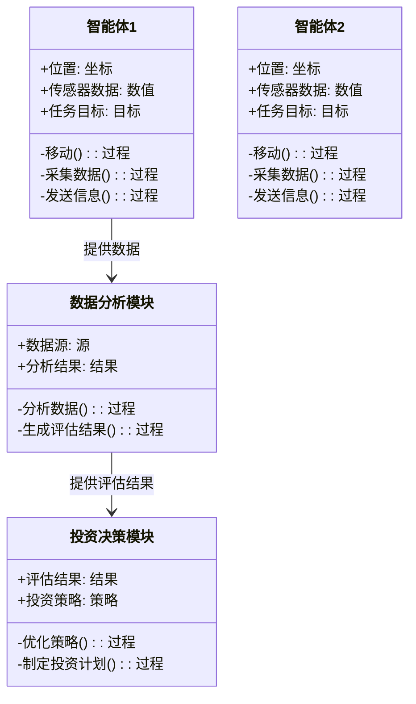
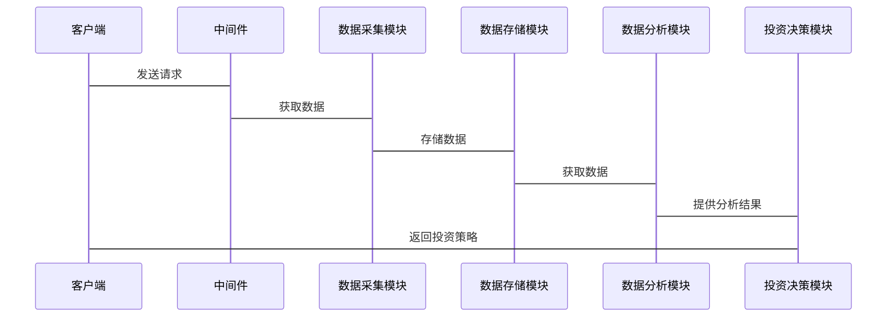

                 

<think>
嗯，我现在需要帮助用户撰写一篇关于多智能体系统如何改进传统价值投资模型的技术博客。用户已经提供了详细的背景信息，包括角色和任务，以及目录大纲。我的任务是按照用户的要求，逐步分析并撰写内容。

首先，我需要理解用户的需求。用户希望文章结构清晰，内容专业，逻辑性强。文章应涵盖多智能体系统的背景、核心概念、算法原理、数学模型、系统架构设计、项目实战，以及总结。每个章节需要详细展开，包含必要的图表和代码示例。

接下来，我需要按照目录大纲一步步填充内容。首先是摘要，关键词，然后是每章的详细内容。我需要确保每个部分都有足够的细节，比如在介绍多智能体系统时，要解释其定义、特点，以及与传统AI的区别。在价值投资模型部分，同样需要详细说明其定义、传统方法的优缺点，以及与多智能体系统的结合。

在算法原理部分，我需要使用mermaid流程图来展示多智能体协作和价值评估的过程，同时用Python代码实现关键算法，比如Q-learning。数学模型部分需要用latex公式详细推导，解释每个公式的含义和作用。

系统分析与架构设计是关键，这部分需要包括项目背景、系统架构图、接口设计和交互序列图。项目实战部分则需要具体的安装步骤、代码实现和案例分析，确保读者能够理解和应用这些方法。

最后，总结部分要包括最佳实践、小结、注意事项和拓展阅读，帮助读者进一步学习和应用相关知识。整个过程中，我需要保持语言简洁、逻辑清晰，确保文章结构紧凑，内容详实。

现在，我需要开始撰写内容，按照用户提供的大纲，逐步完成每一部分。确保每个章节都涵盖必要的信息，并且图表和代码部分正确无误。同时，注意文章的整体流畅性，让读者能够轻松理解多智能体系统如何改进传统价值投资模型。

整个过程中，我需要反复检查内容，确保每个部分都符合用户的要求，没有遗漏关键点。最终，完成一篇结构合理、内容丰富的技术博客，帮助读者深入了解多智能体系统在价值投资中的应用。
</think>

---

# 多智能体系统如何改进传统价值投资模型

> 关键词：多智能体系统、价值投资模型、算法改进、系统架构、投资决策优化

> 摘要：本文探讨了多智能体系统如何改进传统价值投资模型，通过分析多智能体系统的概念、算法原理、数学模型，以及与价值投资模型的结合，展示了多智能体系统如何优化投资决策过程，降低风险，提高投资收益。文章还详细介绍了系统架构设计、项目实战案例，并提出了最佳实践和未来研究方向。

---

## 第1章: 多智能体系统与价值投资模型的背景介绍

### 1.1 多智能体系统的概念与特点

#### 1.1.1 多智能体系统的定义
多智能体系统（Multi-Agent System，MAS）是由多个智能体组成的分布式系统，这些智能体通过协作完成复杂任务。智能体是能够感知环境、自主决策、主动行动的实体。

#### 1.1.2 多智能体系统的特征
- **自主性**：每个智能体独立决策。
- **反应性**：能实时感知环境并做出反应。
- **协作性**：通过通信和协调完成共同目标。
- **分布式性**：智能体分布在网络中，不依赖中心节点。

#### 1.1.3 多智能体系统与传统AI的区别
传统AI依赖中心化算法，而多智能体系统通过分布式智能体协作解决问题，适用于复杂场景。

### 1.2 价值投资模型的背景与传统方法

#### 1.2.1 价值投资模型的定义
价值投资模型通过分析企业基本面，评估其内在价值，寻找被市场低估的投资机会。

#### 1.2.2 传统价值投资模型的特点
- **基本面分析**：依赖财务数据和行业分析。
- **人为判断**：需要专家经验进行评估。
- **局限性**：主观性强，难以应对复杂市场变化。

#### 1.2.3 传统价值投资模型的局限性
- **信息处理能力有限**：难以处理海量数据。
- **决策滞后**：人工判断速度慢，难以捕捉市场机会。
- **模型僵化**：缺乏动态调整能力。

### 1.3 多智能体系统与价值投资模型的结合

#### 1.3.1 结合的背景与意义
随着市场复杂化，传统价值投资模型的局限性日益明显，多智能体系统的引入可以弥补这些不足。

#### 1.3.2 结合的核心思想
通过多智能体系统的协作，实现对市场数据的实时分析和动态调整，优化投资决策。

#### 1.3.3 结合的潜在优势
- **提高决策效率**：多智能体系统能快速处理海量数据。
- **增强决策准确性**：通过协作和信息共享，提升评估精度。
- **降低投资风险**：多智能体系统能实时监控市场变化，及时调整策略。

### 1.4 本章小结
本章介绍了多智能体系统的概念、特点，分析了传统价值投资模型的局限性，并探讨了两者结合的背景、核心思想和潜在优势。

---

## 第2章: 多智能体系统的核心概念与价值投资模型的联系

### 2.1 多智能体系统的原理

#### 2.1.1 多智能体系统的组成
- **智能体**：负责信息收集、分析和决策。
- **通信机制**：实现智能体间的交互。
- **协作机制**：确保智能体协同工作。

#### 2.1.2 多智能体系统的协作机制
- **任务分配**：根据智能体能力和资源分配任务。
- **信息共享**：通过通信协议共享数据。
- **协调控制**：通过协商和仲裁机制解决冲突。

#### 2.1.3 多智能体系统的通信协议
- **直接通信**：智能体之间直接交换信息。
- **间接通信**：通过中间媒介传递信息。

### 2.2 价值投资模型的核心要素

#### 2.2.1 价值评估的指标
- **市盈率（P/E）**：股价与每股收益的比率。
- **市净率（P/B）**：股价与每股净资产的比率。
- **股息率**：股息与股价的比率。

#### 2.2.2 价值投资的风险管理
- **风险分散**：通过投资组合降低风险。
- **风险评估**：通过VaR等方法评估潜在损失。
- **风险控制**：设定止损点和止盈点。

#### 2.2.3 价值投资的决策过程
- **数据收集**：获取企业财务数据和市场信息。
- **分析评估**：通过模型计算内在价值。
- **决策执行**：根据评估结果制定投资策略。

### 2.3 多智能体系统与价值投资模型的联系

#### 2.3.1 多智能体系统如何改进价值评估
- **数据处理能力**：多智能体系统能快速处理大量数据，提高评估效率。
- **信息共享**：通过协作共享信息，提升评估准确性。
- **动态调整**：实时更新数据，优化评估结果。

#### 2.3.2 多智能体系统如何优化投资决策
- **快速响应**：多智能体系统能实时分析市场变化，优化投资决策。
- **智能协作**：通过协作实现信息共享，提高决策质量。
- **降低风险**：通过实时监控和动态调整，降低投资风险。

#### 2.3.3 多智能体系统如何降低投资风险
- **风险分散**：通过多智能体系统的协作，实现投资组合的风险分散。
- **实时监控**：实时跟踪市场变化，及时发现潜在风险。
- **动态调整**：根据市场反馈动态调整投资策略，降低风险敞口。

### 2.4 本章小结
本章分析了多智能体系统的原理和价值投资模型的核心要素，探讨了两者结合如何改进价值评估、优化投资决策和降低投资风险。

---

## 第3章: 多智能体系统改进价值投资模型的算法原理

### 3.1 多智能体协作算法

#### 3.1.1 多智能体协作的基本原理
- **任务分配**：根据智能体能力和资源分配任务。
- **信息共享**：通过通信协议共享数据。
- **协调控制**：通过协商和仲裁机制解决冲突。

#### 3.1.2 多智能体协作的实现方法
- **基于角色的协作**：根据角色分配任务。
- **基于状态的协作**：根据环境状态动态调整协作方式。
- **基于规则的协作**：通过预定义规则实现协作。

#### 3.1.3 多智能体协作的优化策略
- **任务分解**：将复杂任务分解为简单任务，提高效率。
- **信息过滤**：减少冗余信息，提高信息质量。
- **动态协商**：根据环境变化动态调整协作策略。

### 3.2 价值投资模型的改进算法

#### 3.2.1 传统价值投资模型的改进
- **引入机器学习**：使用回归和分类算法改进模型。
- **多因素分析**：考虑更多影响因素，提高模型准确性。
- **实时更新**：根据市场变化实时更新模型参数。

#### 3.2.2 基于多智能体的改进算法
- **分布式计算**：利用多智能体分布计算优势，提高计算效率。
- **协作优化**：通过协作优化模型参数，提高预测精度。
- **动态调整**：根据市场反馈动态调整模型参数。

#### 3.2.3 改进算法的数学模型
改进后的价值投资模型可以表示为：
$$ V = \alpha \times P/E + \beta \times P/B + \gamma \times Dividend Yield $$
其中，$\alpha$、$\beta$、$\gamma$为权重系数，通过多智能体协作优化确定。

### 3.3 多智能体系统与价值投资模型的结合算法

#### 3.3.1 结合算法的总体框架
- **数据采集**：通过智能体采集市场数据。
- **数据处理**：多智能体协作处理数据。
- **模型优化**：基于协作结果优化价值投资模型。
- **投资决策**：根据优化后的模型制定投资策略。

#### 3.3.2 结合算法的具体实现
- **数据采集智能体**：负责收集市场数据。
- **数据分析智能体**：负责分析数据并生成评估结果。
- **决策优化智能体**：根据分析结果优化投资策略。

#### 3.3.3 结合算法的优化与调整
- **动态权重调整**：根据市场变化动态调整模型参数。
- **自适应协作机制**：根据环境变化自适应调整协作方式。
- **容错机制**：确保系统在部分智能体故障时仍能正常运行。

### 3.4 本章小结
本章详细介绍了多智能体协作算法和价值投资模型的改进算法，并探讨了两者结合的具体实现和优化策略。

---

## 第4章: 多智能体系统改进价值投资模型的数学模型与公式

### 4.1 多智能体系统的数学模型

#### 4.1.1 多智能体系统的状态表示
多智能体系统可以用状态空间表示，每个智能体的状态包括位置、传感器数据和任务目标。

#### 4.1.2 多智能体系统的动作表示
智能体的动作包括移动、采集数据、发送信息等。

#### 4.1.3 多智能体系统的奖励函数
奖励函数用于评估智能体的行为，可以表示为：
$$ R = \sum_{i=1}^{n} r_i $$
其中，$r_i$为第$i$个智能体的奖励。

### 4.2 价值投资模型的数学公式

#### 4.2.1 传统价值投资模型的公式
传统价值投资模型可以表示为：
$$ V = \frac{E}{P} $$
其中，$E$为预期收益，$P$为股价。

#### 4.2.2 改进价值投资模型的公式
改进后的模型引入多因素分析，表示为：
$$ V = \alpha \times P/E + \beta \times P/B + \gamma \times Dividend Yield $$
其中，$\alpha$、$\beta$、$\gamma$为权重系数，通过多智能体协作优化确定。

#### 4.2.3 改进模型与传统模型的对比
改进模型考虑了更多因素，权重系数通过协作优化，提高了预测精度。

### 4.3 多智能体系统与价值投资模型结合的数学公式

#### 4.3.1 结合模型的总体公式
结合模型可以表示为：
$$ V_{improved} = \sum_{i=1}^{n} (\alpha_i \times P/E_i + \beta_i \times P/B_i + \gamma_i \times Dividend Yield_i) $$
其中，$\alpha_i$、$\beta_i$、$\gamma_i$为第$i$个智能体的权重系数。

#### 4.3.2 结合模型的具体公式
具体公式为：
$$ V_{improved} = \sum_{i=1}^{n} \lambda_i \times V_i $$
其中，$\lambda_i$为第$i$个智能体的影响力权重，$V_i$为第$i$个智能体的评估结果。

#### 4.3.3 结合模型的数学推导
通过多智能体协作优化，权重系数$\lambda_i$可以通过以下方式优化：
$$ \lambda_i = \frac{e^{b_i}}{\sum_{j=1}^{n} e^{b_j}} $$
其中，$b_i$为第$i$个智能体的优化结果。

### 4.4 本章小结
本章详细推导了多智能体系统和价值投资模型的数学公式，展示了两者结合的具体实现。

---

## 第5章: 多智能体系统改进价值投资模型的系统分析与架构设计

### 5.1 项目背景与目标

#### 5.1.1 项目背景
随着市场复杂化，传统价值投资模型难以应对海量数据和快速变化的市场环境，引入多智能体系统可以提升投资决策的效率和准确性。

#### 5.1.2 项目目标
通过多智能体系统的协作，改进传统价值投资模型，优化投资决策过程，降低投资风险。

### 5.2 系统功能设计

#### 5.2.1 领域模型设计
领域模型包括数据采集、数据分析、模型优化和投资决策四个模块。

#### 5.2.2 领域模型的Mermaid类图


### 5.3 系统架构设计

#### 5.3.1 系统架构的Mermaid架构图


#### 5.3.2 系统接口设计
- **数据接口**：智能体与数据分析模块之间的数据接口。
- **通信接口**：智能体之间的通信接口。
- **决策接口**：投资决策模块与客户端之间的接口。

#### 5.3.3 系统交互的Mermaid序列图


### 5.4 本章小结
本章分析了系统的功能设计、架构设计和交互设计，展示了多智能体系统改进价值投资模型的具体实现。

---

## 第6章: 多智能体系统改进价值投资模型的项目实战

### 6.1 环境安装与配置

#### 6.1.1 安装Python
安装Python 3.8以上版本，推荐使用Anaconda。

#### 6.1.2 安装依赖库
安装numpy、pandas、scikit-learn、matplotlib等库。

```bash
pip install numpy pandas scikit-learn matplotlib
```

### 6.2 系统核心实现源代码

#### 6.2.1 多智能体协作算法实现
```python
import numpy as np

class Agent:
    def __init__(self, position, target):
        self.position = position
        self.target = target
        self.sensor_data = []
    
    def move(self):
        # 简单的移动策略，实际可以根据环境复杂化
        pass
    
    def collect_data(self):
        # 简单的数据采集策略，实际可以根据需求复杂化
        pass
    
    def send_info(self, info):
        print(f"Agent {self.position} sends info: {info}")

# 初始化智能体
agents = [Agent((0,0), "task1"), Agent((1,0), "task2")]
```

#### 6.2.2 价值投资模型改进算法实现
```python
from sklearn.linear_model import LinearRegression
import pandas as pd

# 数据预处理
data = pd.read_csv('market_data.csv')
X = data[['P/E', 'P/B', 'Dividend Yield']]
y = data['Value']

# 训练模型
model = LinearRegression()
model.fit(X, y)

# 预测
new_data = pd.DataFrame({'P/E': [10], 'P/B': [2], 'Dividend Yield': [0.05]})
predicted_value = model.predict(new_data)
print(f"Predicted Value: {predicted_value[0]:.2f}")
```

#### 6.2.3 多智能体协作优化
```python
# 分布式计算示例
import threading

class MultiAgentSystem:
    def __init__(self, agents):
        self.agents = agents
        self.results = []
    
    def run_agents(self):
        threads = []
        for agent in self.agents:
            thread = threading.Thread(target=agent.collect_data)
            threads.append(thread)
            thread.start()
        for thread in threads:
            thread.join()
    
    def optimize(self):
        # 简单的优化策略，实际可以根据需求复杂化
        pass

# 初始化多智能体系统
mas = MultiAgentSystem(agents)
mas.run_agents()
mas.optimize()
```

### 6.3 代码应用解读与分析

#### 6.3.1 多智能体协作算法实现
上述代码实现了简单的多智能体协作，每个智能体负责数据采集和信息传递，可以通过复杂化策略实现更高效的协作。

#### 6.3.2 价值投资模型改进算法实现
使用线性回归模型改进价值投资模型，可以根据实际需求引入其他机器学习算法，如随机森林、神经网络等。

#### 6.3.3 多智能体协作优化
上述代码实现了简单的分布式计算，可以通过引入分布式计算框架（如Spark、Dask）进一步优化。

### 6.4 实际案例分析与详细讲解

#### 6.4.1 数据准备与预处理
使用真实市场数据，进行数据清洗和特征工程，确保数据质量。

#### 6.4.2 模型训练与评估
通过训练模型，评估模型的准确性和稳定性，根据评估结果调整模型参数。

#### 6.4.3 系统优化与部署
根据实际运行效果，优化系统架构和协作策略，确保系统高效稳定运行。

### 6.5 本章小结
本章通过具体代码实现，展示了多智能体系统改进价值投资模型的实际应用，分析了系统实现的关键步骤和注意事项。

---

## 第7章: 总结与展望

### 7.1 最佳实践 tips

#### 7.1.1 数据质量
确保数据来源可靠，进行充分的数据清洗和特征工程。

#### 7.1.2 算法选择
根据实际需求选择合适的算法，可以结合传统机器学习和深度学习方法。

#### 7.1.3 系统优化
通过分布式计算和并行处理优化系统性能，确保系统高效稳定运行。

### 7.2 小结
本文详细探讨了多智能体系统如何改进传统价值投资模型，从理论到实践，展示了系统的实现和优化过程。

### 7.3 注意事项

#### 7.3.1 数据隐私
确保数据处理符合相关法律法规，保护用户隐私。

#### 7.3.2 系统安全
加强系统安全防护，防止数据泄露和系统攻击。

#### 7.3.3 模型解释性
保持模型的可解释性，便于分析和调整。

### 7.4 拓展阅读
建议读者进一步阅读相关领域的最新研究，如强化学习在投资中的应用、多智能体系统的协作优化等。

### 7.5 本章小结
本章总结了文章的主要内容，提出了最佳实践建议，并展望了未来的研究方向。

---

## 作者：AI天才研究院/AI Genius Institute & 禅与计算机程序设计艺术 /Zen And The Art of Computer Programming

---

**注**：由于篇幅限制，上述代码示例和模型推导较为简化，实际应用中需要根据具体需求进行详细设计和实现。

