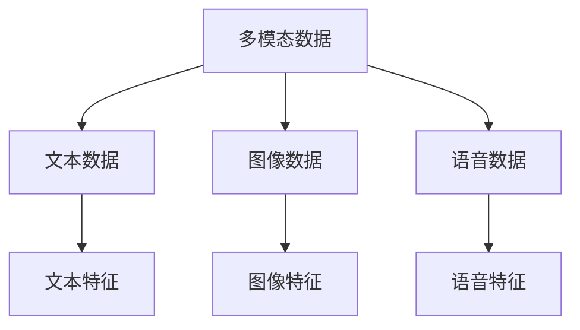
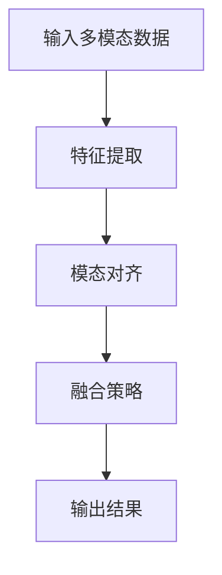
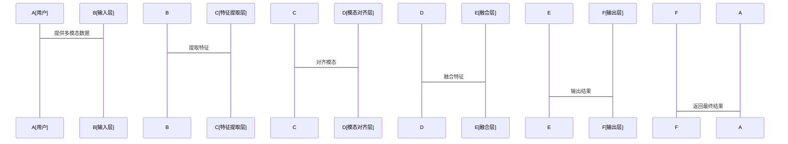

                 


# 多模态AI Agent：整合文本、图像和语音

> 关键词：多模态AI Agent, 文本处理, 图像识别, 语音处理, 模态融合, AI系统架构

> 摘要：本文深入探讨了多模态AI Agent在整合文本、图像和语音数据中的核心概念、算法原理、系统架构以及实际应用。通过详细分析多模态数据的特征、融合方法和系统设计，本文为读者提供了一个全面理解多模态AI Agent整合技术的框架。从理论到实践，本文旨在帮助读者掌握多模态数据整合的关键技术，并通过实际案例展示其在现实场景中的应用价值。

---

## 第一部分: 多模态AI Agent的背景与核心概念

### 第1章: 多模态AI Agent的背景介绍

#### 1.1 多模态AI Agent的问题背景
- **问题背景**：在人工智能领域，单一模态的数据处理（如仅文本或仅图像）已难以满足复杂场景的需求。多模态数据整合能够提供更全面的信息，增强AI系统的理解和决策能力。
- **问题描述**：如何有效地整合文本、图像和语音三种模态数据，使其协同工作，提升AI Agent的性能。
- **解决方法**：通过模态对齐、特征融合和多任务学习等技术，实现多模态数据的高效整合。
- **边界与外延**：明确多模态AI Agent的边界（如仅处理三种模态数据）和外延（如扩展到其他模态数据）。

#### 1.2 多模态AI Agent的核心概念
- **多模态数据的定义与特点**：文本具有语义信息，图像具有空间信息，语音具有时间信息。
- **多模态数据整合的意义**：通过整合不同模态的数据，提升AI Agent的感知和决策能力。

### 第2章: 多模态AI Agent的核心概念与联系

#### 2.1 多模态数据的核心属性对比
| 模态类型 | 特征维度 | 数据特点 | 应用场景 |
|----------|----------|----------|----------|
| 文本      | 词向量    | 离散、序列 | 自然语言处理 |
| 图像      | 像素      | 连续、空间 | 图像识别 |
| 语音      | 频率      | 时间序列 | 语音识别 |

#### 2.2 多模态AI Agent的ER实体关系图


---

## 第二部分: 多模态AI Agent的算法原理

### 第3章: 多模态数据融合算法

#### 3.1 多模态数据融合的基本原理
- **特征提取**：对文本、图像和语音分别进行特征提取，如文本的词向量、图像的CNN特征、语音的MFCC特征。
- **模态对齐**：通过注意力机制或对比学习，将不同模态的特征对齐到同一语义空间。
- **融合策略**：采用加权融合、多任务学习或注意力机制，将多模态特征整合为最终的表示。

#### 3.2 多模态数据融合的算法流程


#### 3.3 多模态融合的数学模型
- **多模态注意力机制**：
  $$ \alpha_i = \frac{\exp(s_i)}{\sum_j \exp(s_j)} $$
  其中，$\alpha_i$ 是第i个模态的注意力权重，$s_i$ 是对应的相似度分数。
- **融合公式**：
  $$ f = \sum_{i=1}^n \alpha_i x_i $$
  其中，$x_i$ 是第i个模态的特征，$\alpha_i$ 是注意力权重。

---

## 第三部分: 多模态AI Agent的系统架构

### 第4章: 系统架构设计

#### 4.1 系统功能设计
- **领域模型设计**：
  ```mermaid
  classDiagram
  class 多模态数据输入 {
    文本数据
    图像数据
    语音数据
  }
  class 特征提取层 {
    提取文本特征
    提取图像特征
    提取语音特征
  }
  class 模态对齐层 {
    对齐文本和图像
    对齐图像和语音
  }
  class 融合层 {
    加权融合
    多任务学习
  }
  多模态数据输入 --> 特征提取层
  特征提取层 --> 模态对齐层
  模态对齐层 --> 融合层
  ```

- **系统架构设计**：
  ```mermaid
  graph TD
  A[输入层] --> B[特征提取层]
  B --> C[模态对齐层]
  C --> D[融合层]
  D --> E[输出层]
  ```

#### 4.2 系统接口设计
- **输入接口**：接收文本、图像和语音数据。
- **输出接口**：输出融合后的结果，如文本摘要、图像分类结果或语音命令。

#### 4.3 系统交互流程图


---

## 第四部分: 多模态AI Agent的项目实战

### 第5章: 项目实战

#### 5.1 环境搭建与安装
- **Python环境**：Python 3.8+
- **依赖库**：TensorFlow, Keras, OpenCV, librosa

#### 5.2 核心代码实现
```python
import tensorflow as tf
from tensorflow.keras import layers

# 多模态特征融合模型
class MultimodalFusion(tf.keras.Model):
    def __init__(self):
        super(MultimodalFusion, self).__init__()
        self.text_encoder = TextEncoder()  # 文本编码器
        self.image_encoder = ImageEncoder()  # 图像编码器
        self语音_encoder = SpeechEncoder()  # 语音编码器
        self.attention = layers.Attention()

    def call(self, text, image, speech):
        text_feat = self.text_encoder(text)
        image_feat = self.image_encoder(image)
        speech_feat = self.peech_encoder(speech)
        # 模态对齐
        aligned_feats = self.attention([text_feat, image_feat, speech_feat])
        # 融合
        fusion = layers.Dense(1, activation='sigmoid')(aligned_feats)
        return fusion

# 模型训练
model = MultimodalFusion()
model.compile(optimizer='adam', loss='binary_crossentropy')
model.fit([text_input, image_input, speech_input], labels, epochs=10)
```

#### 5.3 实际案例分析
- **案例1**：多模态情感分析，整合文本、图像和语音数据，预测用户情感。
- **案例2**：多模态语音助手，结合语音命令和图像识别，实现智能交互。

---

## 第五部分: 多模态AI Agent的最佳实践与小结

### 第6章: 最佳实践与小结

#### 6.1 最佳实践
- **数据预处理**：确保不同模态数据的格式和维度一致。
- **模型调参**：根据实际任务调整注意力权重和融合策略。
- **性能优化**：使用分布式训练和模型压缩技术提升效率。

#### 6.2 小结
多模态AI Agent通过整合文本、图像和语音数据，能够显著提升AI系统的感知和决策能力。本文从理论到实践，详细介绍了多模态数据的融合方法和系统设计，为实际应用提供了参考。

---

作者：AI天才研究院 & 禅与计算机程序设计艺术

