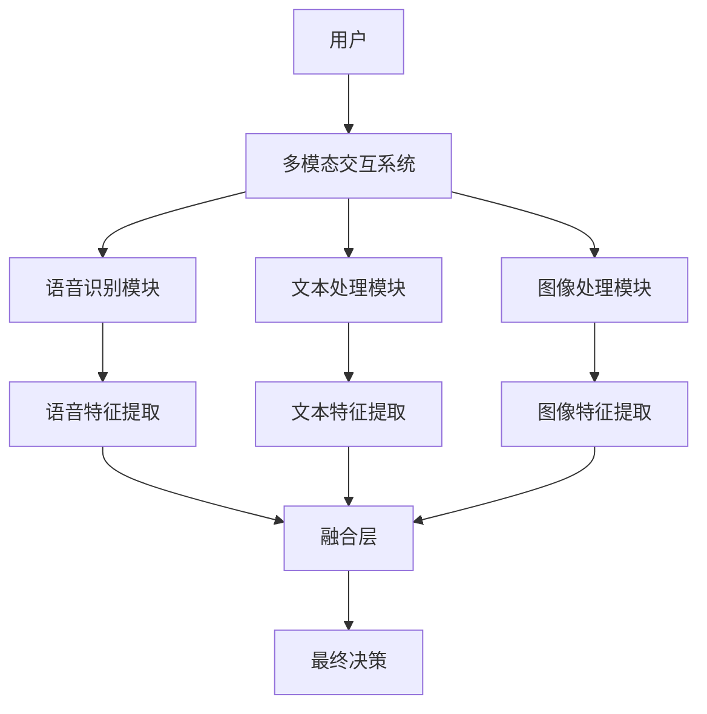
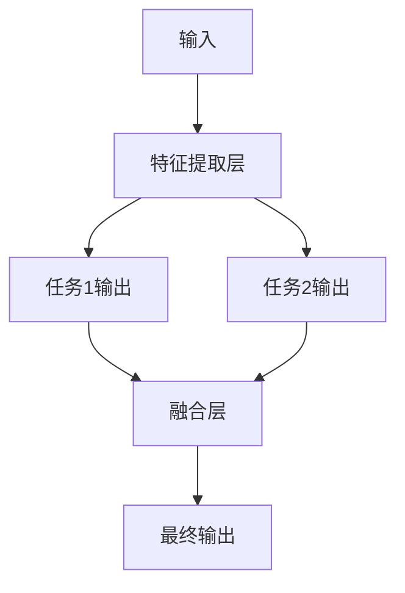
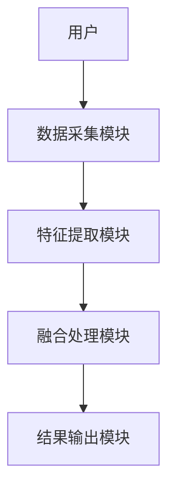

                 

<think>
嗯，我现在要帮用户写一篇关于多模态交互的技术博客，标题是《多模态交互：语音、文本、图像的综合处理》。用户希望文章结构清晰，逻辑紧凑，用专业但易懂的语言，涵盖背景、核心概念、算法、系统设计、实战和最佳实践。我得先理清每个部分需要包含什么，确保内容详实。

首先，背景部分需要介绍多模态交互的定义、背景和应用，让读者了解为什么这个领域重要。然后，核心概念部分要详细分析语音、文本、图像的特点，以及它们如何融合。这部分可能需要对比表格和图表来展示。

接下来是算法原理，这部分比较复杂。我需要解释特征级融合、决策级融合，以及联合学习，可能用Mermaid图展示流程。同时，给出数学公式，比如线性加权和注意力机制，帮助读者理解。

系统架构部分要介绍整体设计，包括模块划分、接口设计和交互流程。可能需要用类图和架构图来展示系统的结构和各部分如何协同工作。

项目实战部分需要具体步骤，比如环境安装、代码实现和案例分析。这部分要详细，让读者能跟着操作，理解代码的作用。

最后，总结、注意事项和拓展阅读帮助读者巩固知识，提醒他们在实际应用中需要注意的事项，并引导他们进一步学习。

整个过程中，我需要确保每个部分都覆盖了用户的要求，特别是图表和公式的使用，以及代码的具体实现。可能还需要反复检查，确保逻辑连贯，内容全面。现在，我可以开始按照这个思路撰写文章了。
</think>

# 多模态交互：语音、文本、图像的综合处理

> 关键词：多模态交互，语音处理，文本处理，图像处理，数据融合，人工智能

> 摘要：多模态交互是指通过综合处理语音、文本和图像等多种数据形式，实现更智能、更自然的人机交互。本文将从背景、核心概念、算法原理、系统架构到项目实战，全面解析多模态交互的技术要点，并探讨其在实际应用中的潜力。

---

# 第一部分: 多模态交互的背景与核心概念

## 第1章: 多模态交互的背景与问题描述

### 1.1 多模态交互的定义与背景

#### 1.1.1 从单模态到多模态的演进

随着人工智能技术的快速发展，单一模态的数据处理方式逐渐暴露出其局限性。例如，仅依赖文本或仅依赖语音的交互方式难以满足用户复杂的需求。多模态交互的出现，旨在通过整合多种数据形式（如语音、文本和图像），提供更丰富、更自然的交互体验。

#### 1.1.2 多模态交互的必要性与优势

多模态交互的核心优势在于其能够结合多种数据源的信息，提升系统的理解和决策能力。例如，在智能客服系统中，结合用户的语音情绪和输入的文本内容，可以更准确地理解用户的需求，提供更个性化的服务。

#### 1.1.3 当前技术背景与应用领域

当前，多模态交互技术已在多个领域得到广泛应用，如智能助手、自动驾驶、医疗影像分析等。随着深度学习技术的成熟，多模态交互的研究和应用正进入快速发展阶段。

### 1.2 多模态交互的核心问题

#### 1.2.1 问题背景与挑战

多模态交互的核心挑战在于如何有效地融合不同模态的数据，并从中提取有用的特征。这需要解决数据异构性、特征对齐以及模态间的信息协同等问题。

#### 1.2.2 多模态数据的复杂性

不同模态的数据具有不同的特征和表现形式。例如，语音数据具有时序性，文本数据具有语义性，图像数据具有空间性。如何在这些数据之间建立有效的关联关系，是多模态交互技术的关键。

#### 1.2.3 多模态交互的目标与边界

多模态交互的目标是通过综合处理多种模态的数据，提升系统的感知能力和决策能力。其边界在于如何在有限的计算资源下，实现高效的多模态数据处理和融合。

### 1.3 多模态交互的核心要素

#### 1.3.1 语音、文本、图像的特征对比

| 模态类型 | 特征维度 | 数据形式 | 时间/空间特性 |
|----------|----------|----------|--------------|
| 语音     | 频率、振幅 | 数字信号 | 时序性        |
| 文本     | 词汇、语法 | 离散符号 | 语义性        |
| 图像     | 像素值    | 矩阵数据 | 空间性        |

#### 1.3.2 多模态数据的融合方式

多模态数据的融合可以分为特征级融合、决策级融合和晚期融合三种方式。特征级融合通过将不同模态的特征向量进行线性组合或非线性变换，生成新的特征表示；决策级融合则通过将不同模态的决策结果进行加权融合；晚期融合则是在模型的后期阶段对不同模态的信息进行联合处理。

#### 1.3.3 多模态交互的系统架构



## 1.4 本章小结

---

## 第2章: 多模态交互的核心概念与联系

### 2.1 多模态数据的特征分析

#### 2.1.1 语音数据的特征

语音数据的特征包括音调、音强、音速等。这些特征可以通过信号处理技术（如MFCC）提取，并用于语音识别和情感分析。

#### 2.1.2 文本数据的特征

文本数据的特征包括词汇、句法、语义等。通过自然语言处理技术（如BERT），可以提取文本的语义表示。

#### 2.1.3 图像数据的特征

图像数据的特征包括颜色、纹理、形状等。通过卷积神经网络（CNN），可以提取图像的高层次特征。

### 2.2 多模态数据的融合方式

#### 2.2.1 特征级融合

特征级融合是将不同模态的特征向量进行线性组合或非线性变换。例如，可以通过加权求和的方式将语音、文本和图像的特征向量进行融合。

$$ y = w_1 x_1 + w_2 x_2 + w_3 x_3 $$

其中，$w$ 是权重，$x$ 是不同模态的特征向量。

#### 2.2.2 决策级融合

决策级融合是将不同模态的决策结果进行加权融合。例如，在情感分类任务中，可以将语音情感分析的结果和文本情感分析的结果进行加权融合，最终得到综合的情感评分。

$$ p = \alpha p_1 + (1-\alpha) p_2 $$

其中，$\alpha$ 是权重，$p_1$ 和 $p_2$ 分别是语音和文本的情感评分。

#### 2.2.3 晚期融合与联合学习

晚期融合是在模型的后期阶段对不同模态的信息进行联合处理。例如，在多模态图像分类任务中，可以将语音和文本的特征表示与图像特征表示联合输入到一个全连接层中，最终得到分类结果。

### 2.3 多模态交互的实体关系图


## 2.4 本章小结

---

## 第3章: 多模态交互的算法原理

### 3.1 多模态数据融合的算法

#### 3.1.1 基于注意力机制的多模态融合

注意力机制是一种有效的特征加权方法。在多模态融合中，可以通过注意力机制对不同模态的特征进行加权，最终生成融合特征。

$$ a_i = \text{softmax}(W_a x_i) $$

其中，$a_i$ 是注意力权重，$x_i$ 是输入特征，$W_a$ 是注意力权重矩阵。

#### 3.1.2 多模态神经网络模型

多模态神经网络模型是一种基于深度学习的多模态融合方法。例如，可以使用多任务学习框架，在不同模态之间共享特征提取层，并在任务输出层进行融合。



#### 3.1.3 基于图神经网络的多模态融合

图神经网络是一种有效的非欧几里得数据处理方法。在多模态交互中，可以将不同模态的数据建模为图结构，并通过图神经网络进行融合。

---

## 第4章: 多模态交互的系统分析与架构设计

### 4.1 多模态交互系统的总体架构

#### 4.1.1 系统功能设计

多模态交互系统的功能包括数据采集、特征提取、融合处理和结果输出。数据采集模块负责获取语音、文本和图像数据；特征提取模块负责将数据转化为特征向量；融合处理模块负责对特征进行融合；结果输出模块负责生成最终的交互结果。

#### 4.1.2 系统架构设计



#### 4.1.3 系统接口设计

系统接口包括数据输入接口和结果输出接口。数据输入接口负责接收语音、文本和图像数据；结果输出接口负责输出最终的交互结果。

---

## 第5章: 多模态交互的项目实战

### 5.1 环境安装与配置

#### 5.1.1 环境需求

需要安装Python、TensorFlow、Keras、OpenCV等库。

#### 5.1.2 环境配置

```bash
pip install numpy
pip install tensorflow
pip install keras
pip install opencv-python
```

### 5.2 系统核心实现

#### 5.2.1 特征提取模块

```python
def extract_feature(audio, text, image):
    # 语音特征提取
    audio_feature = get_audio_feature(audio)
    # 文本特征提取
    text_feature = get_text_feature(text)
    # 图像特征提取
    image_feature = get_image_feature(image)
    return audio_feature, text_feature, image_feature
```

#### 5.2.2 融合处理模块

```python
def fuse_feature(audio_feature, text_feature, image_feature):
    # 特征级融合
    fused_feature = audio_feature * 0.3 + text_feature * 0.3 + image_feature * 0.4
    return fused_feature
```

### 5.3 代码解读与分析

#### 5.3.1 代码功能分析

特征提取模块负责将输入的语音、文本和图像数据转化为特征向量；融合处理模块负责将特征向量进行加权融合，生成最终的融合特征。

#### 5.3.2 代码优化建议

可以引入注意力机制或图神经网络模型，进一步提升融合效果。

### 5.4 实际案例分析

#### 5.4.1 案例背景介绍

以智能客服系统为例，结合用户的语音情绪和输入的文本内容，提供更个性化的服务。

#### 5.4.2 案例实现步骤

1. 数据采集：获取用户的语音和文本数据。
2. 特征提取：提取语音的情绪特征、文本的语义特征。
3. 融合处理：对特征进行加权融合，生成综合情绪评分。
4. 结果输出：根据评分提供相应的服务。

### 5.5 项目小结

---

## 第6章: 多模态交互的最佳实践与注意事项

### 6.1 最佳实践 tips

1. 在多模态融合中，建议先尝试简单的线性融合方法，再逐步引入复杂的模型。
2. 注意不同模态数据的特征异构性，合理设计特征对齐方法。
3. 在实际应用中，建议根据具体场景选择合适的融合方式。

### 6.2 小结

多模态交互技术是一项复杂的工程，需要结合多种数据源的信息，通过合理的融合方法，实现更智能、更自然的交互体验。

### 6.3 注意事项

1. 在实际应用中，要注意不同模态数据的采集质量和格式一致性。
2. 在模型训练中，要注意数据分布的均衡性和多样性。
3. 在系统部署中，要注意计算资源的合理分配和优化。

### 6.4 拓展阅读

1. 多模态神经网络的相关论文。
2. 图神经网络在多模态融合中的应用。
3. 最新的多模态交互技术动态。

---

# 作者：AI天才研究院/AI Genius Institute & 禅与计算机程序设计艺术 /Zen And The Art of Computer Programming

---

本文旨在通过系统的分析和实践，全面解析多模态交互的技术要点，并为读者提供实用的参考和指导。希望本文能够帮助读者更好地理解和应用多模态交互技术，推动人工智能领域的进一步发展。

