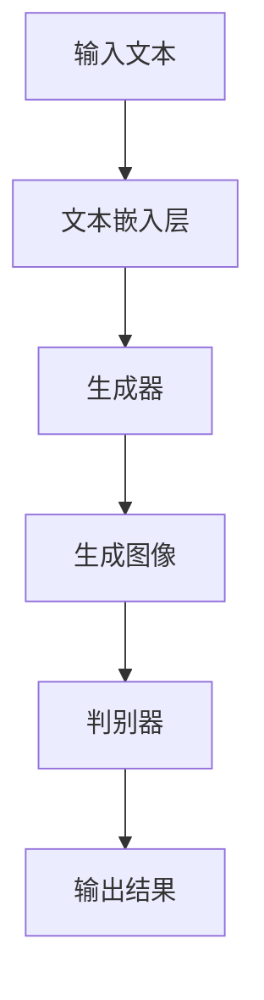
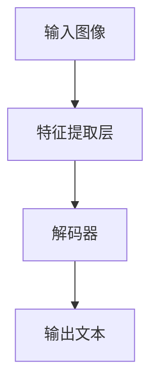
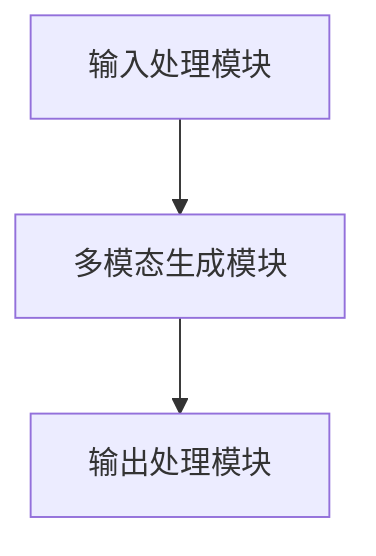
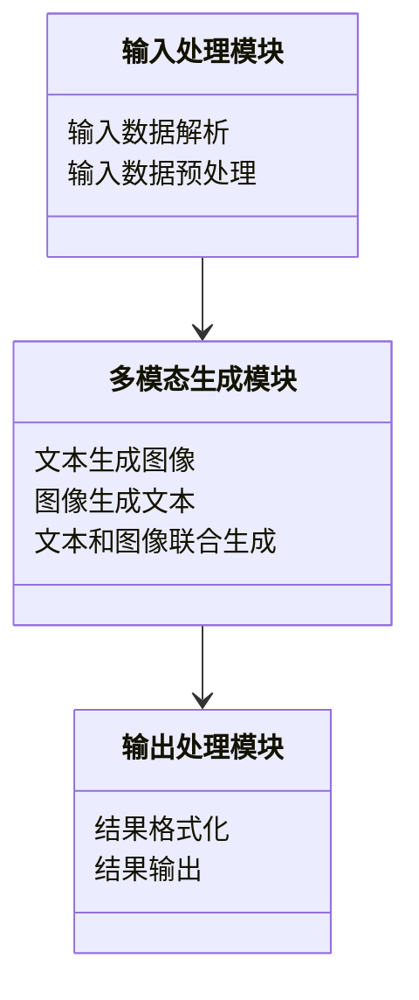
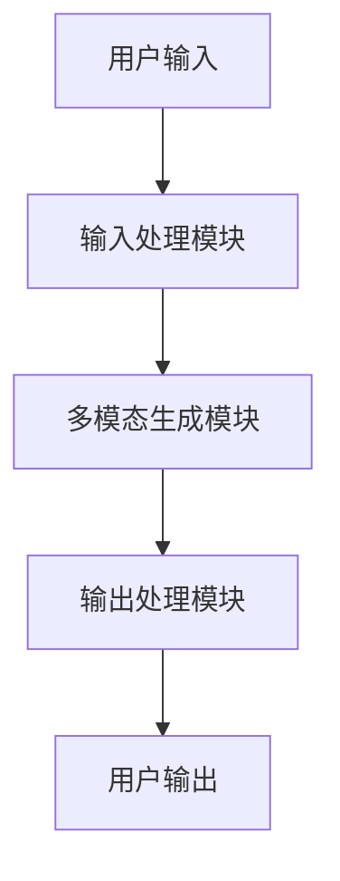

                 

<think>
好的，我现在要撰写一篇关于《多模态内容生成 AI Agent：整合 LLM 与图像生成》的技术博客文章。文章需要逻辑清晰、结构紧凑，使用专业的技术语言，并且要包含丰富的细节和分析。首先，我需要理解用户的需求，明确文章的结构和内容。

用户已经提供了文章的标题、关键词、摘要，以及详细的目录大纲。我的任务是根据这个大纲，逐步分析每个部分，确保内容详实、逻辑连贯。首先，我会从摘要开始，简明扼要地概述文章的核心内容，然后按照目录的章节逐一展开。

在撰写每个章节时，我需要确保涵盖背景、概念、原理、系统架构、项目实战以及扩展内容。同时，要使用适当的图表（如Mermaid流程图、类图、架构图）来辅助说明，使用数学公式和代码示例来详细讲解技术细节。最后，还要总结经验和提供最佳实践建议。

现在，我需要检查每个章节是否覆盖了所有必要的内容，确保没有遗漏关键点。例如，在介绍多模态生成模型的原理时，要详细解释文本到图像和图像到文本生成的算法，以及它们的数学模型。同时，在系统设计部分，需要清晰地展示系统架构和接口设计，使用图表来辅助说明。

在项目实战部分，我会提供具体的代码示例，解释每一步的作用，并分析实际案例，帮助读者理解和应用这些技术。最后，在扩展阅读部分，引导读者深入学习相关知识，并对未来的趋势进行展望。

通过这样的思考过程，我可以系统地完成这篇文章的撰写，确保内容全面、结构合理，符合用户的要求。
</think>

# 多模态内容生成 AI Agent：整合 LLM 与图像生成

> 关键词：多模态生成、AI Agent、LLM、图像生成、深度学习、生成对抗网络、文本到图像

> 摘要：本文探讨如何将大语言模型（LLM）与图像生成技术结合，构建多模态内容生成 AI Agent。通过分析多模态生成模型的原理、系统架构设计、项目实战以及最佳实践，揭示整合 LLM 与图像生成的技术细节和应用潜力。

---

# 第一部分: 多模态内容生成 AI Agent 概述

## 第1章: 多模态内容生成 AI Agent 的背景与概念

### 1.1 多模态生成的背景与问题背景

#### 1.1.1 多模态生成的背景

- 当前AI技术的多模态发展趋势：从单模态到多模态生成的演变。
- 多模态生成技术的应用场景：如图像描述生成、文本生成图像、图像编辑等。
- 多模态生成技术的核心问题：如何实现模态之间的信息互补与协同生成。

#### 1.1.2 多模态生成的问题背景

- 当前生成模型的局限性：仅能处理单一模态数据，难以实现多模态信息的联合生成。
- 多模态生成的挑战：模态间的语义对齐、信息互补以及协同生成机制的设计。

### 1.2 多模态生成的核心概念

#### 1.2.1 多模态生成的定义

- 多模态生成：通过多个模态的数据输入，生成对应的目标模态内容。
- 多模态生成的关键特征：信息互补、语义一致、协同生成。

#### 1.2.2 多模态生成与AI Agent 的结合

- AI Agent 的定义：具备感知环境、理解用户意图、执行任务能力的智能体。
- 多模态生成 AI Agent 的特点：能够处理多种模态输入，生成多样化的输出内容。

## 第2章: 多模态生成模型的原理与技术

### 2.1 多模态生成模型的原理

#### 2.1.1 多模态生成模型的结构

- 输入：多模态数据，如文本、图像。
- 输出：目标模态内容，如图像、文本。
- 内部结构：多模态编码器、联合生成器。

#### 2.1.2 多模态生成模型的训练流程

1. 数据预处理：多模态数据的配对与对齐。
2. 模型训练：多模态编码器与生成器的联合优化。

### 2.2 多模态生成模型的算法原理

#### 2.2.1 文本到图像生成的算法

- 基于GAN的文本到图像生成：
  - 文本嵌入：将文本转换为向量表示。
  - 生成器：根据文本向量生成图像。
  - 判别器：区分生成图像和真实图像。

- 文本到图像生成的流程图：


#### 2.2.2 图像到文本生成的算法

- 基于编码器的图像到文本生成：
  - 图像特征提取：使用CNN提取图像特征。
  - 解码器：将图像特征解码为文本。

- 图像到文本生成的流程图：


### 2.3 多模态生成模型的融合

#### 2.3.1 多模态生成模型的融合方式

- 文本和图像的联合生成：同时利用文本和图像信息生成新的图像或文本。
- 多模态生成模型的协同机制：模态间的信息交互与共享。

## 第3章: 多模态生成 AI Agent 的系统架构

### 3.1 系统架构设计

#### 3.1.1 系统功能模块

- 输入处理模块：接收多模态输入数据。
- 多模态生成模块：处理输入数据，生成目标模态内容。
- 输出处理模块：输出生成的结果。

#### 3.1.2 系统架构图



### 3.2 系统功能设计

#### 3.2.1 多模态生成模块的功能

- 文本生成图像：根据输入文本生成图像。
- 图像生成文本：根据输入图像生成文本。
- 文本和图像联合生成：结合文本和图像生成新的图像或文本。

---

# 第二部分: 系统分析与架构设计方案

## 第4章: 问题场景介绍

### 4.1 项目介绍

- 项目目标：开发一个多模态生成 AI Agent，整合 LLM 与图像生成技术。
- 项目需求：支持文本到图像、图像到文本、文本和图像联合生成。
- 项目挑战：多模态数据的对齐、生成模型的优化。

## 第5章: 系统功能设计

### 5.1 系统功能模块设计

- 输入处理模块：负责接收和解析输入数据。
- 多模态生成模块：核心生成模块，实现多模态生成逻辑。
- 输出处理模块：处理生成结果，输出最终内容。

#### 5.1.1 领域模型



### 5.2 系统架构设计

#### 5.2.1 系统架构图


### 5.3 系统接口设计

- 输入接口：接收多模态数据。
- 输出接口：返回生成结果。

### 5.4 系统交互设计

#### 5.4.1 系统交互流程图



---

# 第三部分: 项目实战

## 第6章: 环境安装与系统实现

### 6.1 环境安装

- 安装Python：Python 3.8及以上版本。
- 安装深度学习框架：如TensorFlow或PyTorch。
- 安装图像处理库：如PIL、OpenCV。
- 安装NLP处理库：如NLTK、Hugging Face库。

### 6.2 系统核心实现

#### 6.2.1 文本生成图像代码示例

```python
import tensorflow as tf
from tensorflow.keras import layers

def text_to_image_generator(text):
    # 文本嵌入层
    embedding = layers.Dense(128)(text)
    # 生成器
    generator = layers.Dense(128, activation='relu')(embedding)
    generator = layers.Dense(256, activation='relu')(generator)
    generator = layers.Dense(28*28, activation='sigmoid')(generator)
    generator = tf.reshape(generator, (-1, 28, 28, 1))
    return generator

def text_to_image_model():
    text_input = layers.Input(shape=(128,))
    image_output = text_to_image_generator(text_input)
    model = tf.keras.Model(inputs=text_input, outputs=image_output)
    return model
```

#### 6.2.2 图像生成文本代码示例

```python
import tensorflow as tf
from tensorflow.keras import layers

def image_to_text_generator(image):
    # 特征提取层
    features = layers.Conv2D(64, (3,3), activation='relu')(image)
    features = layers.MaxPooling2D((2,2))(features)
    features = layers.Flatten()(features)
    # 解码器
    decoder = layers.Dense(128, activation='relu')(features)
    decoder = layers.Dense(64, activation='relu')(decoder)
    decoder = layers.Dense(128, activation='softmax')(decoder)
    return decoder

def image_to_text_model():
    image_input = layers.Input(shape=(28,28,1,))
    text_output = image_to_text_generator(image_input)
    model = tf.keras.Model(inputs=image_input, outputs=text_output)
    return model
```

### 6.3 项目实战案例分析

#### 6.3.1 文本生成图像案例

- 输入：一段描述性的文本。
- 输出：生成对应的图像。

#### 6.3.2 图像生成文本案例

- 输入：一张图像。
- 输出：生成描述图像的文本。

### 6.4 项目小结

- 项目实现的关键点：多模态数据的预处理、生成模型的设计与优化。
- 项目成果：实现了一个简单的多模态生成 AI Agent，能够进行文本到图像和图像到文本的生成。

---

# 第四部分: 扩展阅读与未来展望

## 第7章: 扩展阅读

### 7.1 相关技术与工具

- 多模态生成的前沿技术：如文本到3D模型生成、语音到图像生成。
- 相关工具：Hugging Face的多模态模型库、Stable Diffusion。

### 7.2 未来展望

- 多模态生成的未来趋势：多模态生成的实时性、生成结果的可控性。
- 多模态生成 AI Agent 的应用前景：在教育、医疗、艺术创作等领域的广泛应用。

## 第8章: 最佳实践与小结

### 8.1 最佳实践 tips

- 数据预处理的重要性：多模态数据的对齐与预处理直接影响生成效果。
- 模型优化的关键点：多模态生成模型的训练稳定性、生成结果的质量控制。

### 8.2 项目总结

- 本文通过理论分析与实践案例，详细探讨了多模态生成 AI Agent 的构建方法。
- 通过系统设计与实现，展示了如何整合 LLM 与图像生成技术，实现多模态内容生成。

## 第9章: 注意事项与拓展学习

### 9.1 注意事项

- 数据隐私与安全：多模态数据的处理需注意隐私保护。
- 模型的泛化能力：多模态生成模型的泛化能力需进一步提升。

### 9.2 拓展学习

- 学习多模态生成的前沿论文：如《文本到图像生成的对抗训练》。
- 参与开源项目：如参与Hugging Face的多模态生成项目。

---

# 作者：AI天才研究院/AI Genius Institute & 禅与计算机程序设计艺术 /Zen And The Art of Computer Programming

---

以上是关于《多模态内容生成 AI Agent：整合 LLM 与图像生成》的技术博客文章的完整撰写，内容涵盖从背景概念到系统设计，再到项目实战和未来展望，确保读者能够全面理解多模态生成 AI Agent 的技术细节和应用潜力。

