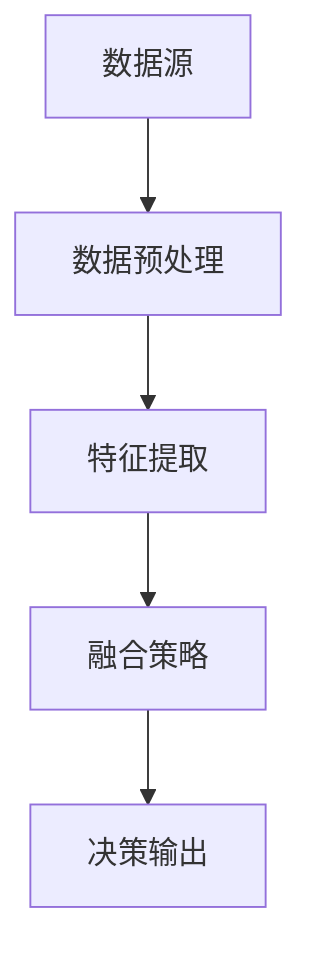
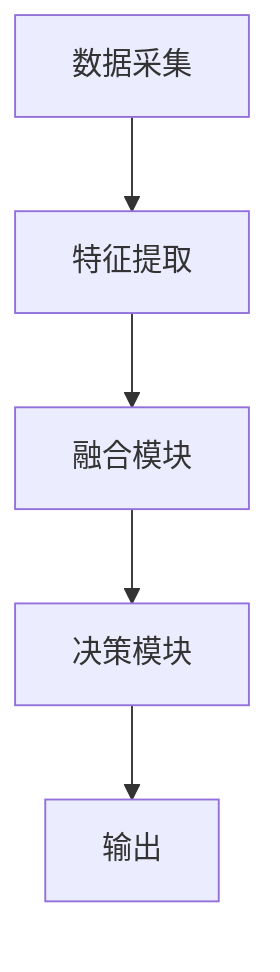
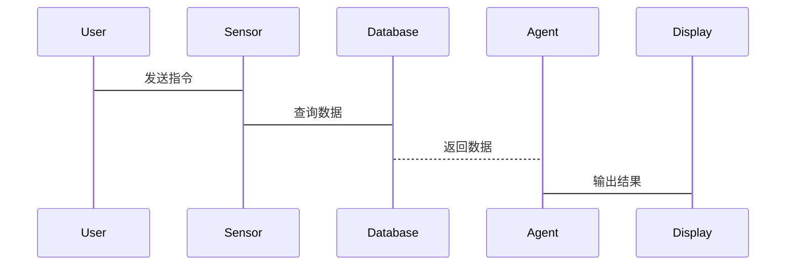

                 


# 多模态融合：增强AI Agent的感知能力

**关键词**：多模态融合、AI Agent、感知能力、数据融合、多模态算法

**摘要**：本文探讨了多模态融合技术在增强AI Agent感知能力中的应用。通过分析多模态数据的融合方法、算法原理、系统架构以及实际案例，展示了如何通过多模态数据的高效融合提升AI Agent的理解和决策能力，从而实现更智能、更人性化的交互体验。

---

# 第一部分：多模态融合的背景与核心概念

## 第1章：多模态融合的背景与问题背景

### 1.1 多模态融合的定义与背景

#### 1.1.1 多模态数据的定义
多模态数据指的是来自不同感官渠道或数据类型的输入，例如图像、文本、语音、传感器数据等。这些数据类型各自具有独特的信息，结合它们可以提供更全面的感知能力。

#### 1.1.2 多模态融合的背景与意义
在AI Agent领域，单一模态的数据往往不足以满足复杂场景的需求。例如，一个智能助手可能需要同时理解用户的语音指令和屏幕上的视觉信息。通过多模态融合，AI Agent可以更好地理解上下文，提高准确性和用户体验。

#### 1.1.3 多模态融合的核心问题
- 数据异构性：不同模态的数据具有不同的特征和表示方式，如何有效结合这些数据是一个挑战。
- 信息冗余与互补性：某些模态的数据可能提供冗余信息，而其他模态则可能提供互补信息，如何权衡这些问题至关重要。
- 融合策略的选择：选择合适的融合方法（如早期融合、晚期融合）是实现高效多模态融合的关键。

### 1.2 多模态融合的技术发展

#### 1.2.1 多模态数据处理的历史演变
从早期的单一模态处理到多模态数据的逐步整合，技术的发展经历了从简单拼接到深度学习驱动的融合过程。

#### 1.2.2 多模态融合技术的演进
- 早期的特征级融合：直接将不同模态的特征向量进行拼接或加权求和。
- 基于深度学习的融合：利用神经网络结构（如注意力机制、图卷积网络）进行高层次的特征交互。
- 模型轻量化与实时性优化：针对实时应用（如自动驾驶、实时语音助手），模型的计算效率和延迟成为关键考量。

#### 1.2.3 当前技术的瓶颈与挑战
- 数据异构性带来的处理复杂性。
- 融合模型的可解释性不足。
- 实时应用中的计算效率问题。

### 1.3 多模态融合的应用场景

#### 1.3.1 计算机视觉中的多模态融合
- 图像与文本的联合检索：通过多模态数据提升检索的准确性和相关性。
- 视频分析中的多模态数据融合：结合图像、语音和传感器数据进行行为识别。

#### 1.3.2 自然语言处理中的多模态融合
- 跨模态对话系统：结合文本和语音进行对话理解。
- 多语言多模态机器翻译：利用图像和文本信息进行跨语言翻译。

#### 1.3.3 跨模态检索与推荐系统
- 基于图像和文本的联合推荐：根据用户的视觉和文本偏好进行个性化推荐。
- 多模态内容推荐：结合视频、文本和用户行为数据进行精准推荐。

## 1.4 本章小结
本章介绍了多模态融合的定义、背景和核心问题，分析了技术发展的历程与现状，并探讨了其在不同领域的应用场景。通过这些内容，读者可以理解多模态融合的重要性和广泛的应用潜力。

---

## 第2章：多模态融合的核心概念与联系

### 2.1 多模态数据流的处理流程

#### 2.1.1 数据采集与预处理
- 数据采集：通过传感器、摄像头、麦克风等设备获取多模态数据。
- 数据预处理：对采集的数据进行标准化、去噪、归一化等处理，以便后续的特征提取。

#### 2.1.2 特征提取与表示
- 文本特征提取：使用词嵌入（如Word2Vec、BERT）提取文本的语义特征。
- 图像特征提取：利用卷积神经网络（CNN）提取图像的空间和语义特征。
- 语音特征提取：通过梅尔频谱图和声学模型提取语音特征。

#### 2.1.3 多模态数据的融合策略
- 早期融合：在特征提取阶段就进行模态间的融合。
- 晚期融合：在决策阶段进行模态间的融合。
- 混合融合：结合早期和晚期融合的优点，分阶段进行特征和决策的结合。

### 2.2 多模态融合的原理与机制

#### 2.2.1 多模态数据的关联性分析
- 数据关联性：分析不同模态数据之间的相关性，确定哪些模态数据对最终结果有更大的影响。
- 关联性度量：使用相关系数、互信息等方法衡量模态间的关联程度。

#### 2.2.2 融合方法的选择与优化
- 基于注意力机制的融合：通过自注意力机制对不同模态的特征进行加权。
- 基于图神经网络的融合：构建模态间的图结构，利用图卷积网络进行特征交互。
- 基于对比学习的融合：通过对比不同模态的特征，增强特征的区分性。

#### 2.2.3 融合结果的评估与验证
- 评估指标：使用准确率、召回率、F1值等指标衡量融合效果。
- 对比实验：通过与单一模态或简单融合方法的对比，验证多模态融合的有效性。

### 2.3 多模态融合的ER实体关系图

```mermaid
erDiagram
    User {
        id
        name
        input_data
    }
    Agent {
        id
        model
        output_decision
    }
    Sensor {
        id
        type
        sensor_data
    }
    Database {
        id
        data_type
        stored_data
    }
    Display {
        id
        screen_size
        output_visual
    }
    User --> Sensor: 触发
    Sensor --> Database: 存储
    Database --> Agent: 查询
    Agent --> Display: 输出
```

### 2.4 多模态融合的数据流图



### 2.5 本章小结
本章详细讲解了多模态数据的处理流程和融合策略，分析了多模态融合的原理和机制，并通过ER图和数据流图展示了系统的整体架构。这些内容为后续的算法实现和系统设计奠定了基础。

---

## 第3章：多模态融合的算法原理

### 3.1 多模态融合算法的分类

#### 3.1.1 基于特征融合的方法
- 晚期融合：将不同模态的特征向量拼接后进行分类或回归。
- 早期融合：在特征提取阶段就进行模态间的交互。

#### 3.1.2 基于决策融合的方法
- 在决策阶段对不同模态的输出结果进行加权或投票。
- 适用于分类任务，能够结合多个决策源的信息。

#### 3.1.3 基于多模态注意力机制的方法
- 使用自注意力机制对不同模态的特征进行加权，突出重要的信息。
- 通过交叉注意力机制实现模态间的特征交互。

### 3.2 多模态融合算法的实现流程

#### 3.2.1 数据预处理与特征提取
- 文本数据：分词、词嵌入。
- 图像数据：归一化、提取特征向量。
- 语音数据：分帧、提取MFCC特征。

#### 3.2.2 融合策略的选择与实现
- 选择适合任务的融合方法：如注意力机制、对比学习。
- 实现融合模块：编写代码实现特征的加权和交互。

#### 3.2.3 融合结果的评估与优化
- 使用验证集评估融合效果。
- 根据评估结果优化融合策略。

### 3.3 多模态融合算法的数学模型

#### 3.3.1 多模态注意力机制
$$
\alpha_i = \frac{e^{w_i^T x_i}}{\sum_{j=1}^n e^{w_j^T x_j}}
$$
其中，$x_i$ 是第$i$个模态的特征向量，$w_i$ 是对应的权重向量，$\alpha_i$ 是注意力权重。

#### 3.3.2 多模态对比学习
$$
L = \frac{1}{N} \sum_{i=1}^N \log(\text{softmax}(s_i)),
$$
其中，$s_i$ 是第$i$对模态的相似度得分，$N$ 是模态对的数量。

#### 3.3.3 多模态决策融合
$$
p(y|x_1, x_2, ..., x_m) = \sum_{i=1}^m \lambda_i p(y|x_i),
$$
其中，$\lambda_i$ 是第$i$个模态的权重，$p(y|x_i)$ 是单模态决策模型的输出概率。

### 3.4 本章小结
本章详细介绍了多模态融合算法的分类和实现流程，并通过数学公式和图表展示了注意力机制和对比学习的原理。这些内容为后续的系统设计和项目实现提供了理论基础。

---

## 第4章：多模态融合的系统分析与架构设计

### 4.1 系统分析与设计

#### 4.1.1 问题场景介绍
- 多模态数据来源：图像、文本、语音、传感器数据等。
- 系统目标：通过融合多模态数据，提升AI Agent的感知和决策能力。

#### 4.1.2 项目介绍
- 项目名称：多模态AI Agent感知系统。
- 项目目标：实现对多模态数据的高效融合，提升系统的准确性和实时性。

#### 4.1.3 系统功能设计
- 数据采集模块：负责采集多模态数据。
- 特征提取模块：对数据进行预处理和特征提取。
- 融合模块：实现多模态数据的融合。
- 决策模块：基于融合后的特征生成最终的决策输出。

#### 4.1.4 系统架构设计


### 4.2 系统架构设计

#### 4.2.1 数据采集模块
- 功能：通过摄像头、麦克风等设备采集图像、语音等数据。
- 输入：原始数据流。
- 输出：预处理后的数据。

#### 4.2.2 特征提取模块
- 功能：将预处理后的数据转换为特征向量。
- 输入：预处理后的数据。
- 输出：特征向量。

#### 4.2.3 融合模块
- 功能：对不同模态的特征进行融合。
- 输入：各模态的特征向量。
- 输出：融合后的特征向量或直接的决策结果。

#### 4.2.4 决策模块
- 功能：基于融合后的特征生成最终的决策。
- 输入：融合后的特征向量。
- 输出：决策结果。

### 4.3 系统接口设计
- 数据接口：定义数据的输入格式和接口协议。
- 融合接口：定义各模态特征的交互方式和接口规范。

### 4.4 系统交互流程图



### 4.5 本章小结
本章从系统架构的角度分析了多模态融合的实现流程，通过模块化设计展示了系统的整体结构，并通过流程图展示了各模块之间的协作关系。

---

## 第5章：多模态融合的项目实战

### 5.1 项目环境安装与配置

#### 5.1.1 环境要求
- 操作系统：Linux/Windows/MacOS。
- 语言：Python 3.8及以上版本。
- 框架：TensorFlow/PyTorch。
- 依赖库：numpy、pandas、scikit-learn、matplotlib。

#### 5.1.2 安装步骤
```bash
pip install numpy
pip install pandas
pip install scikit-learn
pip install matplotlib
pip install tensorflow
```

### 5.2 系统核心实现源代码

#### 5.2.1 数据预处理模块
```python
import numpy as np

def preprocess_data(data):
    # 数据标准化
    mean = np.mean(data)
    std = np.std(data)
    return (data - mean) / std
```

#### 5.2.2 特征提取模块
```python
import tensorflow as tf

def extract_features(input_data):
    model = tf.keras.Sequential([
        tf.keras.layers.Dense(64, activation='relu'),
        tf.keras.layers.Dense(32, activation='relu')
    ])
    return model.predict(input_data)
```

#### 5.2.3 多模态融合模块
```python
def multimodal_fusion(features1, features2):
    # 使用注意力机制进行融合
    attention = tf.nn.softmax(tf.matmul(features1, tf.transpose(features2)))
    fused_features = tf.matmul(attention, features2)
    return fused_features
```

#### 5.2.4 决策模块
```python
def make_decision(fused_features):
    model = tf.keras.Sequential([
        tf.keras.layers.Dense(10, activation='softmax')
    ])
    return model.predict(fused_features)
```

### 5.3 代码应用解读与分析
- 数据预处理模块：对输入数据进行标准化处理，确保各模态数据的可比性。
- 特征提取模块：使用神经网络提取特征，将原始数据转换为高维向量。
- 多模态融合模块：通过注意力机制对不同模态的特征进行加权融合。
- 决策模块：基于融合后的特征生成最终的决策结果。

### 5.4 实际案例分析

#### 5.4.1 案例背景
一个智能助手需要同时理解用户的语音指令和屏幕上的视觉信息，以提供更精准的服务。

#### 5.4.2 系统功能实现
- 语音识别模块：识别用户的语音指令。
- 图像识别模块：识别用户界面上的视觉元素。
- 多模态融合模块：结合语音和图像信息，生成最终的决策指令。

#### 5.4.3 实验结果与分析
- 准确率：通过实验验证多模态融合后的准确率明显高于单一模态。
- 实时性：通过优化算法和硬件加速，确保系统的实时响应。

### 5.5 项目小结
本章通过一个实际案例展示了多模态融合技术的实现过程，从环境配置到代码实现，再到实验验证，详细讲解了项目的每一步。通过本章的学习，读者可以掌握多模态融合技术的实际应用方法。

---

## 第6章：多模态融合的总结与展望

### 6.1 总结

#### 6.1.1 多模态融合的核心价值
- 提高AI Agent的感知能力。
- 增强系统的准确性和鲁棒性。
- 提供更丰富、更智能的用户体验。

#### 6.1.2 多模态融合的实现关键点
- 数据预处理与特征提取。
- 融合策略的选择与优化。
- 模型的可解释性和实时性。

### 6.2 未来展望

#### 6.2.1 技术发展的趋势
- 更高效的融合算法：如基于Transformer的多模态交互模型。
- 更智能的融合策略：如自适应融合、动态权重分配。
- 更广泛的应用场景：如元宇宙、增强现实、智能驾驶等。

#### 6.2.2 研究方向
- 模型的轻量化与边缘计算。
- 融合模型的可解释性研究。
- 多模态数据的实时处理与优化。

### 6.3 最佳实践 Tips
- 数据预处理是关键：确保数据的高质量和一致性。
- 选择合适的融合策略：根据任务需求选择早期融合或晚期融合。
- 模型优化：通过调参和剪枝优化模型的性能和效率。

### 6.4 小结
多模态融合技术在AI Agent中的应用前景广阔，随着技术的不断发展，未来的AI Agent将具备更强的感知和决策能力，为人类提供更智能、更便捷的服务。

---

# 作者：AI天才研究院/AI Genius Institute & 禅与计算机程序设计艺术 /Zen And The Art of Computer Programming

---

通过以上内容，我们详细探讨了多模态融合技术在增强AI Agent感知能力中的应用，从理论到实践，为读者提供了一个全面的视角。希望这篇文章能够为相关领域的研究和应用提供有价值的参考和启发。

