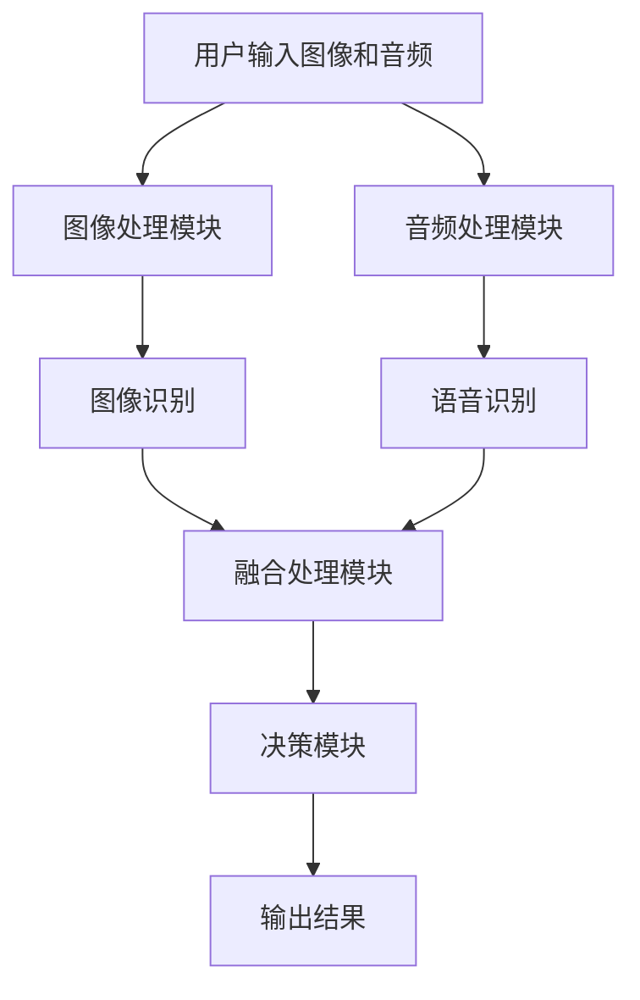
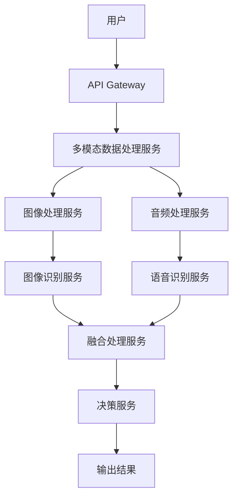
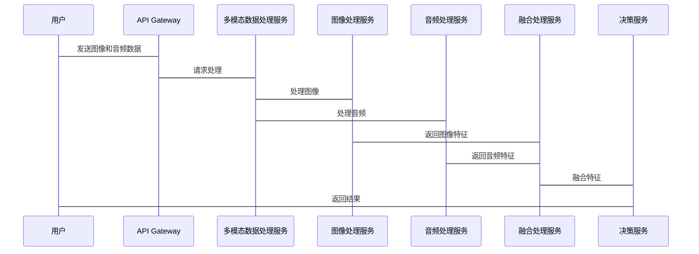

                 


# 多模态输入处理：让AI Agent理解图像和音频

> 关键词：多模态输入处理、AI Agent、图像处理、音频处理、跨模态融合

> 摘要：多模态输入处理是实现AI Agent理解图像和音频的关键技术。本文详细探讨了多模态数据的定义、特点及其在AI Agent中的应用，分析了多模态数据处理的核心概念和算法原理，通过实际案例展示了多模态AI代理系统的构建过程，并总结了最佳实践和未来发展方向。

---

## 第1章: 多模态输入处理的背景与问题描述

### 1.1 多模态数据的定义与特点

#### 1.1.1 多模态数据的定义
多模态数据是指来自不同感官渠道（如视觉、听觉、触觉等）的多种类型数据的组合。例如，图像和音频的结合可以提供更丰富的信息。

#### 1.1.2 多模态数据的特征
- **异质性**：不同模态的数据具有不同的特征和结构。
- **互补性**：各模态数据可以互补，提供更全面的信息。
- **多样性**：数据来源和形式多样化。

#### 1.1.3 多模态数据的分类
- **结构化数据**：如文本、数值。
- **非结构化数据**：如图像、音频。
- **混合数据**：结合结构化和非结构化数据。

### 1.2 多模态输入处理的背景与意义

#### 1.2.1 多模态数据在AI Agent中的重要性
AI Agent需要处理多种输入类型以更全面地理解环境。

#### 1.2.2 当前AI Agent的局限性
- **单模态处理**：难以利用多模态信息。
- **信息不完整**：依赖单一模态可能导致理解偏差。

#### 1.2.3 多模态输入处理的必要性
- 提供更丰富的信息。
- 提高AI Agent的理解能力。

### 1.3 多模态输入处理的核心问题

#### 1.3.1 多模态数据的融合挑战
- 数据对齐困难。
- 融合方法的选择。

#### 1.3.2 不同模态数据的特征差异
- 图像数据的二维性。
- 音频数据的时间序列特性。

#### 1.3.3 多模态输入处理的目标
- 提供更准确的理解。
- 实现多模态数据的有效融合。

### 1.4 多模态输入处理的应用场景

#### 1.4.1 图像与文本的结合应用
- 图像描述生成。
- 文本到图像的生成。

#### 1.4.2 音频与图像的结合应用
- 视频内容理解。
- 情感分析。

#### 1.4.3 多模态数据在智能交互中的应用
- 跨模态对话系统。
- 智能助手的多感官交互。

### 1.5 本章小结
本章介绍了多模态数据的定义、特点及其在AI Agent中的重要性，分析了多模态输入处理的核心问题和应用场景。

---

## 第2章: 多模态数据处理的核心概念与联系

### 2.1 多模态数据处理的核心概念

#### 2.1.1 多模态数据的特征提取
- 图像：提取纹理、形状特征。
- 音频：提取音调、节奏特征。

#### 2.1.2 多模态数据的表示方法
- 图像：使用CNN提取特征向量。
- 音频：使用MFCC提取特征向量。

#### 2.1.3 多模态数据的融合方式
- 早期融合：在特征提取前融合。
- 晚期融合：在特征提取后融合。

#### 2.1.4 多模态数据的对齐问题
- 时间对齐：如视频和音频的时间同步。
- 空间对齐：如图像中的物体定位。

#### 2.1.5 多模态数据的关联性分析
- 相似性计算：如余弦相似度。
- 相关性分析：如皮尔逊相关系数。

#### 2.1.6 多模态数据的协同处理
- 融合策略：加权融合、注意力机制。

### 2.2 多模态数据处理的核心原理

#### 2.2.1 多模态数据的对齐问题
- 数据对齐是确保不同模态数据在语义上一致的关键。

#### 2.2.2 多模态数据的关联性分析
- 分析不同模态数据之间的相关性，以便更好地协同处理。

#### 2.2.3 多模态数据的协同处理
- 通过融合策略，结合不同模态的信息，提升整体理解能力。

### 2.3 多模态数据处理的概念结构与核心要素

#### 2.3.1 核心要素组成
- 数据源：图像、音频。
- 特征提取：CNN、MFCC。
- 融合方式：加权融合、注意力机制。
- 输出结果：语义理解。

#### 2.3.2 多模态数据处理的流程
1. 数据采集：获取图像和音频数据。
2. 特征提取：分别提取图像和音频特征。
3. 数据对齐：确保不同模态数据的时间或空间一致。
4. 融合策略：选择合适的融合方式。
5. 输出结果：生成语义理解或决策。

#### 2.3.3 多模态数据处理的挑战
- 数据异质性：不同模态数据的特征差异大。
- 计算复杂度：多模态数据处理需要大量计算资源。
- 信息冗余：不同模态数据可能存在冗余信息。

### 2.4 多模态数据处理的核心要素对比表格

| 核心要素 | 图像数据 | 音频数据 |
|----------|----------|----------|
| 数据类型 | 二维像素值 | 一维时间序列 |
| 特征提取 | CNN | MFCC |
| 数据对齐 | 空间对齐 | 时间对齐 |
| 融合方式 | 图像注意力 | 音频关键词提取 |

### 2.5 多模态数据处理的ER实体关系图

```mermaid
erDiagram
    actor User {
        <text>uid
        <text>role
    }
    agent AI-Agent {
        <text>agent_id
        <text>agent_type
    }
    modality Image {
        <text>image_id
        <text>image_data
    }
    modality Audio {
        <text>audio_id
        <text>audio_data
    }
    Image --> modality.Image
    Audio --> modality.Audio
    User --> AI-Agent
    AI-Agent --> modality.Image
    AI-Agent --> modality.Audio
```

### 2.6 本章小结
本章详细阐述了多模态数据处理的核心概念，包括特征提取、表示方法和融合方式，并通过对比表格和ER图展示了不同模态数据的特点和关系。

---

## 第3章: 多模态数据处理的算法原理与数学模型

### 3.1 多模态数据融合的算法原理

#### 3.1.1 多模态数据融合方法
- 早期融合：在特征提取前融合。
- 晚期融合：在特征提取后融合。

#### 3.1.2 多模态数据融合的流程
1. 特征提取：提取图像和音频特征。
2. 数据对齐：确保不同模态数据的时间或空间一致。
3. 融合策略：选择合适的融合方式。
4. 输出结果：生成语义理解或决策。

#### 3.1.3 多模态数据融合的实现步骤
- 使用CNN提取图像特征。
- 使用MFCC提取音频特征。
- 使用注意力机制进行融合。

#### 3.1.4 多模态数据融合的代码示例

```python
import numpy as np
from tensorflow.keras.layers import Input, Dense, Concatenate, Activation
from tensorflow.keras.models import Model

# 图像特征提取
image_input = Input(shape=(128, 128, 3))
x = Conv2D(32, (3,3), activation='relu')(image_input)
x = MaxPooling2D((2,2))(x)
image_features = Dense(64, activation='relu')(x)

# 音频特征提取
audio_input = Input(shape=(128,))
x = Dense(32, activation='relu')(audio_input)
audio_features = Dense(64, activation='relu')(x)

# 融合策略：拼接
merged = Concatenate()([image_features, audio_features])
output = Dense(1, activation='sigmoid')(merged)

model = Model(inputs=[image_input, audio_input], outputs=output)
model.compile(optimizer='adam', loss='binary_crossentropy', metrics=['accuracy'])
```

### 3.2 跨模态注意力机制的算法原理

#### 3.2.1 注意力机制的原理
- 通过权重分配，关注重要信息。

#### 3.2.2 跨模态注意力机制的实现
- 使用自注意力机制，跨模态特征交互。

#### 3.2.3 跨模态注意力机制的数学模型

$$
\text{Attention}(Q, K, V) = \text{softmax}\left(\frac{QK^T}{\sqrt{d_k}}\right)V
$$

其中，$Q$ 是查询向量，$K$ 是键向量，$V$ 是值向量，$d_k$ 是维度。

### 3.3 多模态数据融合的数学模型

#### 3.3.1 多模态融合的公式
- 使用加权融合：

$$
f_{\text{final}} = \alpha f_{\text{image}} + (1-\alpha) f_{\text{audio}}
$$

其中，$\alpha$ 是权重系数。

#### 3.3.2 多模态融合的实现步骤
- 计算图像和音频特征。
- 确定融合权重。
- 输出融合结果。

### 3.4 本章小结
本章详细讲解了多模态数据融合的算法原理和数学模型，通过代码示例和公式推导，展示了如何实现多模态数据的有效融合。

---

## 第4章: 多模态AI代理系统的系统分析与架构设计

### 4.1 多模态AI代理系统的功能设计

#### 4.1.1 系统功能模块
- 图像处理模块：图像识别、目标检测。
- 音频处理模块：语音识别、情感分析。
- 融合处理模块：多模态数据融合、语义理解。
- 决策模块：基于多模态输入做出决策。

#### 4.1.2 功能流程图



### 4.2 多模态AI代理系统的架构设计

#### 4.2.1 系统架构设计



#### 4.2.2 系统接口设计
- 输入接口：接收图像和音频数据。
- 输出接口：输出语义理解和决策结果。

#### 4.2.3 系统交互流程图



### 4.3 本章小结
本章通过功能设计、架构设计和交互流程图，详细展示了多模态AI代理系统的构建过程。

---

## 第5章: 多模态AI代理系统的项目实战

### 5.1 项目环境安装与配置

#### 5.1.1 环境要求
- Python 3.8+
- TensorFlow 2.0+
- OpenCV 4.5+
- librosa

#### 5.1.2 安装依赖
```bash
pip install tensorflow==2.0.0 numpy==1.21.0 opencv-python==4.5.5.52 librosa
```

### 5.2 项目核心实现代码

#### 5.2.1 图像处理模块

```python
import cv2
import numpy as np

def process_image(image_path):
    img = cv2.imread(image_path)
    gray = cv2.cvtColor(img, cv2.COLOR_BGR2GRAY)
    edges = cv2.Canny(gray, 100, 200)
    return edges
```

#### 5.2.2 音频处理模块

```python
import librosa
import numpy as np

def process_audio(audio_path):
    audio, sr = librosa.load(audio_path, sr=16000)
    mfccs = librosa.feature.mfcc(y=audio, sr=sr, n_mfcc=13)
    return mfccs.T
```

#### 5.2.3 融合与决策模块

```python
from tensorflow.keras.layers import Input, Dense, Concatenate, Activation
from tensorflow.keras.models import Model

def build_model():
    image_input = Input(shape=(128, 128, 3))
    x = Conv2D(32, (3,3), activation='relu')(image_input)
    x = MaxPooling2D((2,2))(x)
    image_features = Dense(64, activation='relu')(x)

    audio_input = Input(shape=(13,))
    x = Dense(32, activation='relu')(audio_input)
    audio_features = Dense(64, activation='relu')(x)

    merged = Concatenate()([image_features, audio_features])
    output = Dense(1, activation='sigmoid')(merged)

    model = Model(inputs=[image_input, audio_input], outputs=output)
    model.compile(optimizer='adam', loss='binary_crossentropy', metrics=['accuracy'])
    return model
```

#### 5.2.4 项目实现步骤
1. 安装依赖。
2. 编写图像处理模块。
3. 编写音频处理模块。
4. 构建融合模型。
5. 训练模型。
6. 测试模型。

### 5.3 项目实战案例分析

#### 5.3.1 案例描述
- 图像输入：一张猫的图片。
- 音频输入：猫的叫声。

#### 5.3.2 系统处理流程
1. 图像处理模块提取猫的图像特征。
2. 音频处理模块提取猫叫声的MFCC特征。
3. 融合模块将图像和音频特征融合。
4. 决策模块输出“猫”的语义理解。

#### 5.3.3 案例分析
- 图像特征：猫的纹理和形状。
- 音频特征：猫叫声的音调和节奏。
- 融合结果：图像和音频特征共同确认是猫。

### 5.4 本章小结
本章通过项目实战，展示了多模态AI代理系统的实现过程，包括环境配置、核心代码编写和案例分析。

---

## 第6章: 多模态输入处理的总结与展望

### 6.1 本章总结
- 多模态数据处理是AI Agent理解图像和音频的关键技术。
- 需要克服数据异质性、对齐问题等挑战。

### 6.2 最佳实践 tips
- 数据预处理：确保不同模态数据的对齐。
- 模型选择：根据具体任务选择合适的融合策略。
- 训练数据：多模态数据需要平衡不同模态的样本数量。

### 6.3 未来发展方向
- 更高效的融合方法。
- 更强大的模型架构。
- 更广泛的应用场景。

### 6.4 注意事项
- 数据隐私：注意保护用户数据隐私。
- 算法解释性：确保模型的可解释性。
- 系统性能：优化系统的计算效率。

### 6.5 拓展阅读
- 多模态学习的经典论文。
- 最新的研究成果。

### 6.6 本章小结
本章总结了多模态输入处理的重要性和未来发展方向，并给出了实际应用中的建议。

---

## 作者信息

作者：AI天才研究院/AI Genius Institute & 禅与计算机程序设计艺术 /Zen And The Art of Computer Programming

---

通过以上内容，您已经完成了《多模态输入处理：让AI Agent理解图像和音频》的技术博客文章的撰写。这篇文章详细探讨了多模态数据处理的核心概念、算法原理和系统设计，并通过实际案例展示了如何实现一个多模态AI代理系统。希望这篇文章能为您提供有价值的技术见解和实践指导。

