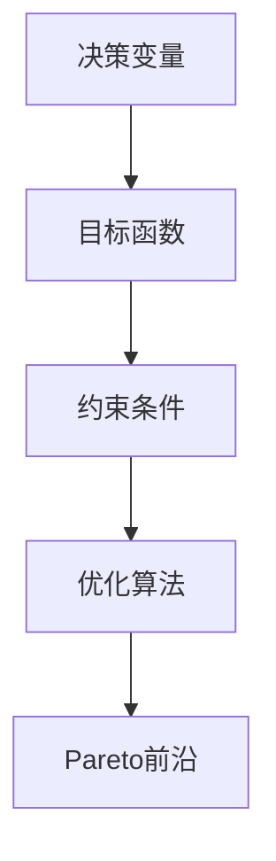
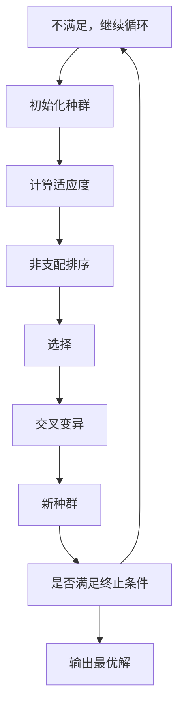
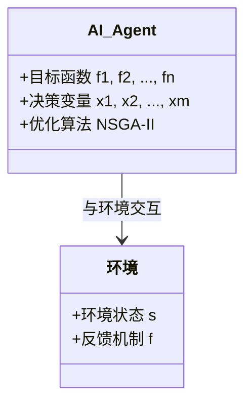
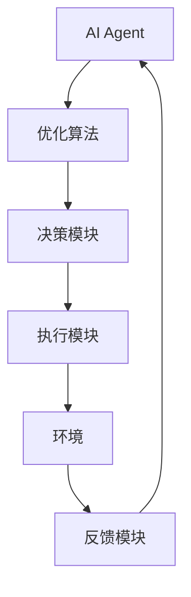
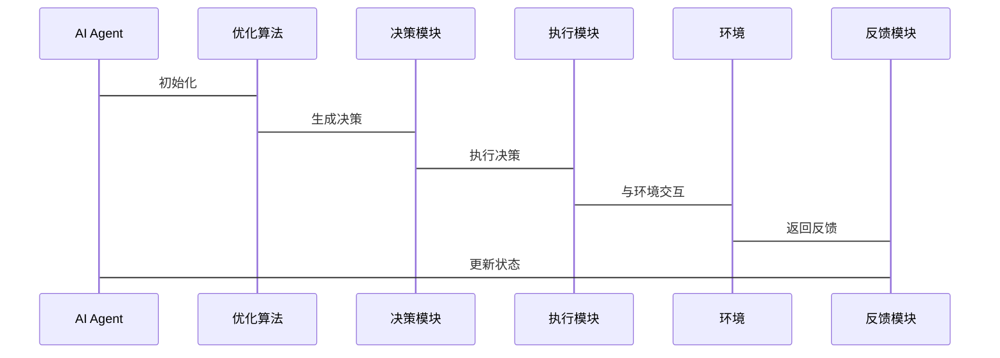

                 


# 多目标优化在AI Agent训练中的应用

## 关键词：多目标优化、AI Agent、算法原理、系统架构、项目实战

## 摘要：  
多目标优化在AI Agent的训练中扮演着至关重要的角色。传统的单目标优化方法难以应对复杂的现实场景，而多目标优化能够更好地平衡多个目标，提升AI Agent的智能性和实用性。本文将从多目标优化的核心概念、算法原理、系统架构设计、项目实战等多方面进行详细探讨，深入剖析多目标优化在AI Agent训练中的应用价值和实现方法。

---

# 第一章: 多目标优化与AI Agent概述

## 1.1 多目标优化的背景与概念

### 1.1.1 多目标优化的定义  
多目标优化（Multi-objective Optimization, MOO）是指在优化过程中同时考虑多个目标函数的情况。与单目标优化不同，MOO需要在多个相互冲突的目标之间找到一个折中的最优解，通常以Pareto前沿的形式表示。

### 1.1.2 多目标优化与单目标优化的对比  
| 对比维度       | 单目标优化             | 多目标优化             |
|----------------|-----------------------|-----------------------|
| 目标数量       | 单个目标               | 多个目标               |
| 解的性质       | 单一最优解             | Pareto最优解集合       |
| 复杂性         | 较低                   | 较高                   |
| 应用场景       | 简单问题               | 复杂问题               |

### 1.1.3 多目标优化在AI Agent中的应用背景  
AI Agent需要在复杂的环境中做出决策，通常需要同时优化多个目标，如最大化收益、最小化风险、提高效率等。多目标优化能够帮助AI Agent在这些目标之间找到平衡，提升其智能性和实用性。

---

## 1.2 AI Agent的基本概念

### 1.2.1 AI Agent的定义  
AI Agent是指具有感知环境、自主决策和行动能力的智能体。它能够根据环境信息做出决策，并通过行动影响环境。

### 1.2.2 AI Agent的核心特点  
- **自主性**：能够在没有外部干预的情况下自主运行。
- **反应性**：能够感知环境并实时调整行为。
- **目标导向性**：具有明确的目标，并能够为实现目标而行动。

### 1.2.3 AI Agent与传统AI的区别  
| 对比维度       | 传统AI             | AI Agent             |
|----------------|-------------------|----------------------|
| 智能性         | 通常依赖规则或数据 | 具有自主决策能力    |
| 适应性         | 较低               | 较高                 |
| 应用场景       | 固定任务           | 动态复杂任务         |

---

## 1.3 多目标优化与AI Agent的结合

### 1.3.1 多目标优化在AI Agent训练中的必要性  
AI Agent在实际应用中通常需要同时优化多个目标，例如在自动驾驶中，既要考虑速度，又要考虑安全性和能耗。单目标优化无法满足这些复杂需求，因此需要引入多目标优化。

### 1.3.2 AI Agent训练中的多目标优化问题  
在AI Agent的训练过程中，通常需要优化以下目标：
- **最大化收益**：如最大化利润、用户体验等。
- **最小化风险**：如最小化损失、错误率等。
- **提高效率**：如提高计算效率、资源利用率等。

### 1.3.3 多目标优化在AI Agent中的应用前景  
随着AI技术的不断发展，多目标优化在AI Agent中的应用将越来越广泛。通过多目标优化，AI Agent能够更好地适应复杂多变的环境，实现更高效的决策和行动。

---

## 1.4 本章小结  
本章主要介绍了多目标优化和AI Agent的基本概念，以及它们在AI Agent训练中的重要性。通过对比单目标优化和多目标优化的特点，我们认识到多目标优化在AI Agent中的必要性，并展望了其未来的发展前景。

---

# 第二章: 多目标优化的核心概念与原理

## 2.1 多目标优化的核心原理

### 2.1.1 多目标优化的基本原理  
多目标优化的目标是找到一组解，这些解在所有目标上都达到了某种最优状态。通常，这些解会形成一个Pareto前沿。

### 2.1.2 多目标优化的数学模型  
多目标优化的数学模型可以表示为：  
$$ \min f_1(x) \\ \min f_2(x) \\ \dots \\ \min f_n(x) $$  
其中，$x$是决策变量，$f_i(x)$是目标函数。

### 2.1.3 多目标优化的 Pareto 前沿  
Pareto前沿是指在多目标优化中，无法在不恶化一个目标的情况下改善另一个目标的解集合。

---

## 2.2 多目标优化的算法特征对比

### 2.2.1 算法属性特征对比表格  
| 算法名称     | 是否需要 Pareto 优化 | 优缺点                 | 适用场景           |
|--------------|---------------------|-----------------------|--------------------|
| NSGA-II      | 是                   | 优：收敛性好；缺：计算复杂度较高 | 复杂多目标问题     |
| MOEA/D       | 是                   | 优：计算效率高；缺：适用性较窄 | 中等规模问题       |

### 2.2.2 算法的优缺点分析  
以NSGA-II为例，其优点在于能够有效地找到Pareto最优解，缺点是计算复杂度较高。

### 2.2.3 算法的适用场景  
NSGA-II适用于解决复杂度较高、目标数量较多的多目标优化问题。

---

## 2.3 多目标优化的 ER 实体关系图

### 2.3.1 实体关系图的构建  
以下是多目标优化的实体关系图：



### 2.3.2 实体关系图的分析  
决策变量通过目标函数与约束条件相关联，优化算法的作用是找到满足约束条件的Pareto最优解。

### 2.3.3 实体关系图的应用  
实体关系图可以帮助我们更好地理解多目标优化的各个组成部分及其相互关系。

---

## 2.4 本章小结  
本章主要介绍了多目标优化的核心原理和算法特征，通过对比分析，我们了解了不同算法的优缺点及其适用场景。

---

# 第三章: 多目标优化算法原理

## 3.1 常见多目标优化算法概述

### 3.1.1 NSGA-II 算法  
NSGA-II是一种基于非支配排序的多目标优化算法，通过迭代过程找到Pareto最优解。

### 3.1.2 MOEA/D 算法  
MOEA/D是一种基于分解的多目标优化算法，通过将问题分解为多个子问题来找到最优解。

### 3.1.3 其他多目标优化算法  
包括GDE3、SPEA2等。

---

## 3.2 NSGA-II 算法的详细讲解

### 3.2.1 NSGA-II 算法流程图  
以下是NSGA-II的流程图：



### 3.2.2 NSGA-II 算法的数学模型  
NSGA-II的数学模型可以表示为：  
$$ f(x) = (f_1(x), f_2(x), \dots, f_n(x)) $$  

### 3.2.3 NSGA-II 算法的 Python 实现  
以下是NSGA-II算法的Python代码示例：

```python
import random

def evaluate(individual):
    # 计算适应度
    f1 = individual[0] + individual[1]
    f2 = individual[0] - individual[1]
    return (f1, f2)

def mutation(individual):
    # 变异操作
    idx = random.randint(0, len(individual)-1)
    individual[idx] += random.gauss(0, 1)
    return individual

# 初始化种群
population = [[random.random() for _ in range(2)] for _ in range(10)]

# 迭代过程
for _ in range(10):
    # 计算适应度
    fitness = [evaluate(ind) for ind in population]
    # 非支配排序
    population = non_dominated_sort(population, fitness)
    # 选择和变异
    new_population = []
    for ind in population:
        new_ind = mutation(ind)
        new_population.append(new_ind)
    population = new_population

# 输出最优解
print(population)
```

---

## 3.3 多目标优化算法的数学公式

### 3.3.1 多目标优化的数学模型  
$$ \text{minimize } f_i(x) \quad i=1,2,\dots,n $$  
其中，$x$是决策变量，$f_i(x)$是目标函数。

### 3.3.2 Pareto 前沿的数学定义  
Pareto最优解是指在所有目标函数中，无法在不恶化一个目标的情况下改善另一个目标的解。

### 3.3.3 NSGA-II 算法的公式推导  
NSGA-II通过非支配排序和拥挤度计算来找到Pareto最优解。

---

## 3.4 算法的通俗易懂举例说明

### 3.4.1 简单多目标优化问题举例  
假设我们需要在两个目标之间找到平衡，例如在投资中最大化收益和最小化风险。

### 3.4.2 NSGA-II 算法的实际应用案例  
在自动驾驶中，优化速度和安全性，找到一个平衡点。

### 3.4.3 算法优缺点分析  
NSGA-II的优点在于能够找到高质量的Pareto最优解，缺点是计算复杂度较高。

---

## 3.5 本章小结  
本章主要介绍了多目标优化算法的基本原理和NSGA-II算法的详细实现，通过举例说明了算法的应用场景和优缺点。

---

# 第四章: 系统分析与架构设计

## 4.1 项目场景介绍

### 4.1.1 项目背景  
本项目旨在通过多目标优化算法训练一个AI Agent，使其能够在复杂环境中做出最优决策。

### 4.1.2 项目目标  
通过多目标优化算法，训练一个能够在多个目标之间找到平衡的AI Agent。

---

## 4.2 系统功能设计

### 4.2.1 领域模型（Mermaid 类图）  
以下是AI Agent的领域模型：



### 4.2.2 系统架构设计（Mermaid 架构图）  
以下是系统架构图：



### 4.2.3 系统接口设计  
以下是系统接口设计：



---

## 4.3 系统交互流程图（Mermaid 序列图）  
以下是系统交互流程图：


---

## 4.4 本章小结  
本章主要介绍了AI Agent的系统架构设计，包括领域模型、系统架构图和系统交互流程图。

---

# 第五章: 项目实战

## 5.1 环境安装

### 5.1.1 安装Python  
确保Python版本为3.x及以上。

### 5.1.2 安装必要的库  
安装numpy、pymoead、random等库。

---

## 5.2 系统核心实现源代码

### 5.2.1 NSGA-II 算法实现  
以下是NSGA-II算法的Python代码：

```python
import random

def evaluate(individual):
    # 计算适应度
    f1 = individual[0] + individual[1]
    f2 = individual[0] - individual[1]
    return (f1, f2)

def mutation(individual):
    # 变异操作
    idx = random.randint(0, len(individual)-1)
    individual[idx] += random.gauss(0, 1)
    return individual

# 初始化种群
population = [[random.random() for _ in range(2)] for _ in range(10)]

# 迭代过程
for _ in range(10):
    # 计算适应度
    fitness = [evaluate(ind) for ind in population]
    # 非支配排序
    population = non_dominated_sort(population, fitness)
    # 选择和变异
    new_population = []
    for ind in population:
        new_ind = mutation(ind)
        new_population.append(new_ind)
    population = new_population

# 输出最优解
print(population)
```

### 5.2.2 AI Agent实现  
以下是AI Agent的Python代码：

```python
class AI_Agent:
    def __init__(self, population):
        self.population = population
        self.fitness = self.evaluate(self.population)

    def evaluate(self, population):
        # 计算适应度
        fitness = []
        for ind in population:
            f1 = ind[0] + ind[1]
            f2 = ind[0] - ind[1]
            fitness.append((f1, f2))
        return fitness

    def optimize(self):
        # 执行优化算法
        for _ in range(10):
            self.fitness = self.evaluate(self.population)
            self.population = non_dominated_sort(self.population, self.fitness)
            new_population = []
            for ind in self.population:
                new_ind = mutation(ind)
                new_population.append(new_ind)
            self.population = new_population
        return self.population

# 初始化种群
population = [[random.random() for _ in range(2)] for _ in range(10)]

# 训练AI Agent
agent = AI_Agent(population)
optimal_solutions = agent.optimize()

# 输出最优解
print(optimal_solutions)
```

---

## 5.3 代码应用解读与分析

### 5.3.1 代码结构分析  
AI Agent的代码主要包括初始化种群、计算适应度、执行优化算法和更新种群四个部分。

### 5.3.2 代码实现细节  
代码中使用了非支配排序和变异操作来优化种群，最终找到Pareto最优解。

---

## 5.4 实际案例分析

### 5.4.1 案例背景  
假设我们需要训练一个AI Agent，使其在自动驾驶中同时优化速度和安全性。

### 5.4.2 案例实现  
通过代码实现，我们可以得到一组Pareto最优解，这些解在速度和安全性之间找到了平衡。

### 5.4.3 案例分析  
分析得到的最优解，我们可以看到AI Agent在不同的环境下做出了最优决策。

---

## 5.5 项目小结  
本章通过实际案例展示了多目标优化在AI Agent训练中的应用，通过代码实现和案例分析，我们验证了多目标优化算法的有效性。

---

# 第六章: 最佳实践与总结

## 6.1 小结

### 6.1.1 多目标优化的核心价值  
多目标优化能够帮助AI Agent在多个目标之间找到平衡，提升其智能性和实用性。

### 6.1.2 AI Agent训练中的注意事项  
在实际训练中，需要注意算法的计算复杂度和目标函数的设计。

---

## 6.2 注意事项

### 6.2.1 算法选择  
根据具体问题选择合适的多目标优化算法，如NSGA-II适用于复杂问题，MOEA/D适用于中等规模问题。

### 6.2.2 参数设置  
合理设置算法的参数，如种群大小、迭代次数等，以提高算法的效率和效果。

### 6.2.3 性能优化  
通过并行计算、降维等技术优化算法的性能。

---

## 6.3 拓展阅读

### 6.3.1 推荐书籍  
- 《多目标优化算法及其应用》
- 《AI Agent原理与实践》

### 6.3.2 推荐论文  
- NSGA-II算法的相关论文
- 多目标优化在AI Agent中的应用研究

---

## 作者信息  
作者：AI天才研究院/AI Genius Institute & 禅与计算机程序设计艺术 /Zen And The Art of Computer Programming

