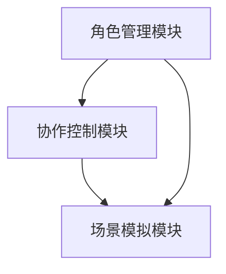
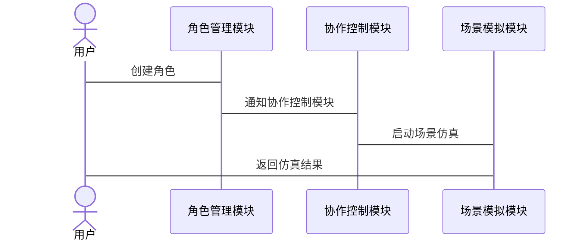

                 

<think>
嗯，我需要帮助用户撰写一篇关于多角色扮演AI Agent的博客文章，重点是基于大语言模型的复杂场景模拟。我得先理清用户的需求，确保内容全面且符合要求。

首先，用户提供的示例目录已经很详细了，我需要按照这个结构来写。文章需要包括背景、核心概念、算法原理、系统分析、项目实战、最佳实践等部分。每个部分都要有详细的子节，可能需要画图和代码示例。

我得先确定文章的关键词，比如多角色AI Agent、复杂场景模拟、大语言模型、协作机制、系统架构、算法原理。这些关键词能帮助读者快速找到内容。

接下来是摘要，我需要简明扼要地概述文章的核心内容，说明多角色AI Agent的重要性、应用场景，以及文章将如何展开讨论。

开始正文部分，首先是背景介绍。我需要解释什么是多角色AI Agent，为什么它们在复杂场景中如此重要，以及它们与传统AI的区别。这部分需要让读者明白问题背景和应用领域。

然后是核心概念，我需要详细讲解角色建模、协作机制和通信协议。可能需要画个ER图或Mermaid图来展示角色之间的关系。这部分需要深入浅出，确保读者理解每个概念。

接下来是算法原理，我得解释多轮对话、意图识别和知识表示的数学模型。可能需要使用公式和流程图，展示算法的步骤和工作原理。这部分要详细，但又要通俗易懂。

系统分析与架构设计部分，我需要描述系统架构，画出类图和序列图，解释每个组件的功能。这部分可能需要详细说明如何设计接口和实现交互。

项目实战是关键，我需要提供一个具体的项目示例，包括环境配置、代码实现和案例分析。代码部分要清晰，注释详细，让读者能够跟着操作。

最后是最佳实践和小结，总结全文，给出实际应用中的注意事项和未来的发展方向。这部分要简明扼要，帮助读者巩固所学内容。

我得确保每个部分都符合用户的要求，尤其是使用markdown格式，包含图表和代码示例。可能需要多次修改，确保内容完整且结构合理。

总的来说，我需要一步步地分析和推理，确保文章内容详实，结构清晰，符合技术博客的专业要求。同时，保持语言简洁明了，让读者能够轻松理解和应用这些知识。
</think>

# 多角色扮演AI Agent：基于LLM的复杂场景模拟

## 关键词：多角色AI Agent、复杂场景模拟、大语言模型（LLM）、协作机制、系统架构、算法原理

## 摘要：
本文将深入探讨多角色扮演AI Agent的构建与应用，基于大语言模型（LLM）的复杂场景模拟。通过分析多角色协作的核心概念、算法原理、系统架构以及实际项目案例，本文将为读者提供一个多维度的技术视角，帮助理解如何利用AI技术实现复杂场景中的多角色协作与模拟。

---

# 第一部分: 多角色扮演AI Agent的背景与概念

# 第1章: 多角色扮演AI Agent的背景与问题背景

## 1.1 多角色扮演AI Agent的定义与特点
### 1.1.1 多角色扮演AI Agent的定义
多角色扮演AI Agent（Multi-Role Play AI Agent，简称MRP-Agent）是指在复杂场景中，能够同时模拟多个不同角色（如人类、虚拟角色或其他智能体）并进行交互的AI系统。这些角色具有独立的目标、知识和行为模式，并能够通过协作完成复杂任务。

### 1.1.2 多角色扮演AI Agent的核心特点
1. **多角色性**：能够同时模拟多个角色，每个角色具有独立的行为逻辑和知识库。
2. **协作性**：角色之间能够通过通信和协作完成复杂任务。
3. **动态性**：能够根据场景变化动态调整角色的行为和策略。
4. **上下文理解**：能够理解场景中的上下文信息，并基于此进行推理和决策。

### 1.1.3 多角色扮演AI Agent与传统AI Agent的区别
| 对比维度 | 传统AI Agent | 多角色扮演AI Agent |
|----------|---------------|---------------------|
| 行为模式 | 单一角色，专注于特定任务 | 多角色，能够同时模拟多个角色 |
| 协作能力 | 单独执行任务，无协作需求 | 支持多角色协作，完成复杂任务 |
| 知识库 | 专注于单一领域 | 跨领域知识，支持多角色切换 |

### 1.1.4 多角色扮演AI Agent的边界与外延
- **边界**：多角色扮演AI Agent仅关注角色的模拟与协作，不涉及物理世界的直接操作。
- **外延**：可以通过与外部系统的集成，扩展其应用场景，如游戏、教育、客服等领域。

## 1.2 多角色扮演AI Agent的应用场景
### 1.2.1 复杂场景模拟的定义
复杂场景模拟是指在虚拟环境中，通过多个角色的协作与互动，模拟真实世界的复杂场景。例如：模拟城市交通、团队协作任务、应急救援等。

### 1.2.2 多角色扮演AI Agent在复杂场景中的应用
1. **游戏开发**：模拟游戏角色的行为，提升游戏体验。
2. **教育领域**：模拟教学场景中的学生、教师和其他角色。
3. **客服系统**：模拟客户与客服的交互，提供更个性化的服务。
4. **应急演练**：模拟应急场景中的多方协作，提升应对能力。

### 1.2.3 多角色扮演AI Agent的边界与外延
- **边界**：专注于角色的模拟与协作，不涉及物理世界的操作。
- **外延**：可以通过与其他系统的集成，扩展应用场景。

## 1.3 多角色扮演AI Agent的核心要素
### 1.3.1 多角色协作的必要性
- 在复杂场景中，单个角色难以完成所有任务，需要多个角色协作。
- 多角色协作可以提高任务完成效率和质量。

### 1.3.2 复杂场景模拟的关键因素
1. **角色多样性**：角色具有不同的知识和行为模式。
2. **协作机制**：角色之间能够有效沟通和协作。
3. **动态性**：能够根据场景变化动态调整角色行为。

### 1.3.3 多角色扮演AI Agent的系统架构
- **角色建模**：定义每个角色的属性、行为和知识库。
- **协作机制**：角色之间的通信、协调和决策机制。
- **系统架构**：包括角色管理、通信协议、协作算法等。

---

# 第2章: 多角色扮演AI Agent的核心概念

## 2.1 多角色扮演AI Agent的角色建模
### 2.1.1 角色建模的定义
角色建模是指为每个角色定义其属性、行为和知识库的过程。通过角色建模，可以实现角色的个性化和多样化。

### 2.1.2 角色属性与行为模型
| 角色属性 | 描述 |
|----------|------|
| 目标 | 角色需要完成的任务或目标 |
| 知识库 | 角色拥有的知识和信息 |
| 行为规则 | 角色在特定情境下的行为规则 |

### 2.1.3 角色间的关系与交互
- **角色间的关系**：合作、竞争、中立等。
- **角色间的交互**：通过通信协议进行信息交换和协作。

### 2.1.4 实例分析：游戏角色建模
例如，在一个MMORPG游戏中，玩家角色和NPC角色需要有不同的行为规则和知识库。

---

## 2.2 多角色协作机制
### 2.2.1 协作机制的定义
协作机制是指角色之间如何进行通信、协调和决策的过程。

### 2.2.2 基于LLM的协作算法
- **多轮对话**：角色之间通过多轮对话进行信息交换和协作。
- **意图识别**：通过自然语言处理技术识别角色的意图。
- **知识表示**：将角色的知识和行为规则表示为可计算的形式。

### 2.2.3 协作机制的优缺点对比
| 对比维度 | 基于LLM的协作算法 | 基于规则的协作算法 |
|----------|-------------------|---------------------|
| 灵活性 | 高 | 低 |
| 可扩展性 | 高 | 低 |
| 复杂性 | 高 | 低 |

### 2.2.4 实例分析：客服系统中的协作机制
在客服系统中，客户角色和客服角色需要通过对话进行问题解决。

---

## 2.3 多角色扮演AI Agent的通信协议
### 2.3.1 通信协议的定义
通信协议是指角色之间进行信息交换的规则和格式。

### 2.3.2 基于LLM的通信协议设计
- **消息格式**：定义消息的结构和格式。
- **消息传输**：通过网络进行消息的传输和接收。
- **消息解析**：对接收到的消息进行解析和处理。

### 2.3.3 通信协议的实现与优化
- **实现**：基于HTTP或WebSocket协议实现消息的传输。
- **优化**：通过压缩和加密技术优化消息的传输效率和安全性。

### 2.3.4 实例分析：游戏中的通信协议
在在线游戏中，玩家和游戏服务器之间需要通过通信协议进行实时交互。

---

## 2.4 本章小结
本章详细介绍了多角色扮演AI Agent的核心概念，包括角色建模、协作机制和通信协议。通过这些概念的介绍，读者可以理解多角色扮演AI Agent的基本原理和实现方法。

---

# 第3章: 多角色协作算法原理

## 3.1 多角色协作算法概述
### 3.1.1 算法目标
通过算法实现多角色之间的协作与模拟。

### 3.1.2 算法输入
- 角色列表
- 场景描述
- 目标和约束条件

### 3.1.3 算法输出
- 协作策略
- 角色行为序列
- 系统状态

## 3.2 多轮对话算法
### 3.2.1 对话流程
1. 初始化对话
2. 角色轮流发言
3. 系统解析意图
4. 更新系统状态
5. 重复直到任务完成

### 3.2.2 对话解析
- **意图识别**：通过自然语言处理技术识别对话中的意图。
- **情感分析**：分析对话中的情感倾向。
- **上下文理解**：理解对话的上下文信息。

### 3.2.3 对话生成
- **文本生成**：基于LLM生成自然流畅的对话内容。
- **知识库查询**：根据对话内容查询相关知识库。

## 3.3 意图识别算法
### 3.3.1 意图识别的定义
意图识别是指通过分析对话内容，识别出对话中的意图。

### 3.3.2 意图识别的实现
- **特征提取**：提取对话中的关键词和句式特征。
- **分类算法**：使用机器学习算法进行意图分类。

### 3.3.3 意图识别的优化
- **数据增强**：通过数据增强技术提高模型的泛化能力。
- **模型优化**：通过模型调优提高意图识别的准确率。

## 3.4 知识表示与推理
### 3.4.1 知识表示的定义
知识表示是指将知识以某种形式表示出来，以便计算机能够理解和使用。

### 3.4.2 知识表示的实现
- **知识图谱**：将知识表示为图结构。
- **本体论**：使用本体论进行知识建模。

### 3.4.3 知识推理
- **逻辑推理**：基于知识图谱进行逻辑推理。
- **概率推理**：基于概率论进行知识推理。

## 3.5 本章小结
本章详细介绍了多角色协作算法的原理，包括多轮对话算法、意图识别算法和知识表示与推理算法。通过这些算法的实现，可以实现多角色之间的协作与模拟。

---

# 第4章: 基于LLM的复杂场景模拟

## 4.1 复杂场景模拟的定义
复杂场景模拟是指在虚拟环境中，通过多个角色的协作与互动，模拟真实世界的复杂场景。

## 4.2 基于LLM的复杂场景模拟
### 4.2.1 场景建模
- **场景描述**：定义场景的环境、角色和目标。
- **角色分配**：将角色分配到场景中的不同位置。

### 4.2.2 场景仿真
- **实时仿真**：通过多角色协作实现场景的实时仿真。
- **历史仿真**：基于历史数据进行场景的回放和分析。

### 4.2.3 场景优化
- **性能优化**：通过算法优化提高场景的仿真效率。
- **效果优化**：通过视觉效果优化提升场景的仿真效果。

## 4.3 基于LLM的复杂场景模拟的优势
1. **高效性**：通过LLM的高效计算能力，实现复杂场景的快速仿真。
2. **灵活性**：可以根据不同的场景需求，灵活调整角色的行为和策略。
3. **可扩展性**：可以通过扩展LLM的能力，实现更复杂场景的模拟。

## 4.4 本章小结
本章详细介绍了基于LLM的复杂场景模拟的实现方法和优势，为读者提供了实现复杂场景模拟的技术参考。

---

# 第5章: 系统分析与架构设计

## 5.1 系统架构设计
### 5.1.1 系统组成
- **角色管理模块**：管理多个角色的属性和行为。
- **协作控制模块**：控制角色之间的协作和通信。
- **场景模拟模块**：实现复杂场景的实时仿真。

### 5.1.2 系统架构图


## 5.2 系统功能设计
### 5.2.1 角色管理功能
- **角色创建**：创建新的角色并定义其属性和行为。
- **角色修改**：修改现有角色的属性和行为。
- **角色删除**：删除不需要的角色。

### 5.2.2 协作控制功能
- **协作策略设置**：设置角色之间的协作策略。
- **协作过程监控**：监控角色协作的实时状态。
- **协作结果分析**：分析协作结果并生成报告。

### 5.2.3 场景模拟功能
- **场景设置**：设置场景的环境和目标。
- **场景启动**：启动场景的实时仿真。
- **场景停止**：停止场景的实时仿真。

## 5.3 系统接口设计
### 5.3.1 角色管理接口
- **API接口**：提供角色管理的API接口。
- **数据格式**：定义接口的数据格式和返回格式。

### 5.3.2 协作控制接口
- **API接口**：提供协作控制的API接口。
- **数据格式**：定义接口的数据格式和返回格式。

### 5.3.3 场景模拟接口
- **API接口**：提供场景模拟的API接口。
- **数据格式**：定义接口的数据格式和返回格式。

## 5.4 系统交互流程
### 5.4.1 交互流程图


## 5.5 本章小结
本章详细介绍了多角色扮演AI Agent系统的架构设计和功能设计，为读者提供了系统实现的技术参考。

---

# 第6章: 项目实战——基于LLM的复杂场景模拟系统

## 6.1 项目背景
### 6.1.1 项目目标
通过实现一个多角色扮演AI Agent系统，验证基于LLM的复杂场景模拟技术的可行性。

### 6.1.2 项目需求
- **角色管理**：支持多个角色的创建、修改和删除。
- **协作控制**：支持角色之间的协作和通信。
- **场景模拟**：支持复杂场景的实时仿真。

## 6.2 环境配置
### 6.2.1 系统要求
- 操作系统：Windows/Mac/Linux
- 硬件要求：CPU：Intel i5 或更高；内存：8GB 或更高；存储：100GB 或更高。
- 软件要求：Python 3.8 或更高，LLM框架（如GPT-3、BERT等）。

### 6.2.2 安装依赖
```bash
pip install requests
pip install transformers
pip install mermaid
```

## 6.3 核心代码实现
### 6.3.1 角色管理模块
```python
class Role:
    def __init__(self, name, attributes):
        self.name = name
        self.attributes = attributes

    def get_attribute(self, key):
        return self.attributes.get(key)

    def set_attribute(self, key, value):
        self.attributes[key] = value

class RoleManager:
    def __init__(self):
        self.roles = {}

    def create_role(self, name, attributes):
        role = Role(name, attributes)
        self.roles[name] = role
        return role

    def delete_role(self, name):
        del self.roles[name]

    def get_role(self, name):
        return self.roles.get(name)
```

### 6.3.2 协作控制模块
```python
class CollaborationController:
    def __init__(self, role_manager):
        self.role_manager = role_manager

    def start_collaboration(self):
        # 实现协作逻辑
        pass

    def stop_collaboration(self):
        pass
```

### 6.3.3 场景模拟模块
```python
class SceneSimulator:
    def __init__(self, collaboration_controller):
        self.controller = collaboration_controller

    def start_simulation(self):
        self.controller.start_collaboration()

    def stop_simulation(self):
        self.controller.stop_collaboration()
```

## 6.4 代码应用解读与分析
### 6.4.1 角色管理模块的实现
- **Role类**：定义了角色的属性和行为。
- **RoleManager类**：实现了角色的创建、修改和删除功能。

### 6.4.2 协作控制模块的实现
- **CollaborationController类**：实现了角色之间的协作控制。

### 6.4.3 场景模拟模块的实现
- **SceneSimulator类**：实现了复杂场景的实时仿真。

## 6.5 实际案例分析
### 6.5.1 案例背景
假设我们正在开发一个在线教育系统，需要模拟学生和教师的交互。

### 6.5.2 案例实现
```python
role_manager = RoleManager()
role_manager.create_role("学生", {"知识水平": "初级", "学习目标": "数学"})
role_manager.create_role("教师", {"知识水平": "高级", "教学目标": "数学"})

collaboration_controller = CollaborationController(role_manager)
scene_simulator = SceneSimulator(collaboration_controller)

scene_simulator.start_simulation()
```

### 6.5.3 案例分析
- **角色管理**：创建了两个角色，学生和教师。
- **协作控制**：启动了角色之间的协作。
- **场景模拟**：实现了学生和教师的交互。

## 6.6 本章小结
本章通过一个实际项目案例，详细介绍了基于LLM的复杂场景模拟系统的实现过程，为读者提供了实践参考。

---

# 第7章: 最佳实践与注意事项

## 7.1 最佳实践
### 7.1.1 系统设计
- **模块化设计**：将系统划分为多个模块，便于维护和扩展。
- **可扩展性设计**：设计时考虑系统的可扩展性。

### 7.1.2 系统实现
- **代码规范**：遵循代码规范，提高代码的可读性和可维护性。
- **测试用例**：编写充分的测试用例，确保系统的稳定性。

### 7.1.3 系统优化
- **性能优化**：通过算法优化和代码优化，提高系统的运行效率。
- **资源优化**：合理利用系统资源，降低系统的资源消耗。

## 7.2 注意事项
### 7.2.1 系统安全
- **数据安全**：确保系统的数据安全，防止数据泄露。
- **网络安全**：确保系统的网络安全，防止网络攻击。

### 7.2.2 系统维护
- **系统更新**：定期更新系统，修复漏洞和优化性能。
- **系统备份**：定期备份系统，防止数据丢失。

## 7.3 拓展阅读
- **相关书籍**：《Effective Python》、《Python编程：从入门到实践》
- **技术博客**：关注技术博客，获取最新的技术动态。

---

# 作者：AI天才研究院/AI Genius Institute & 禅与计算机程序设计艺术/Zen And The Art of Computer Programming

