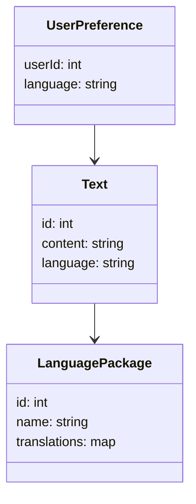
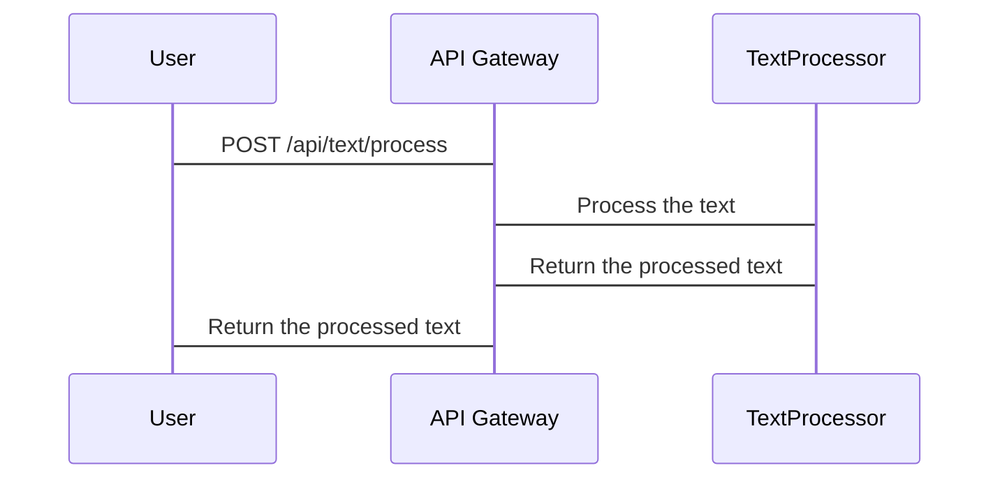

                 

<think>
嗯，用户希望我根据之前提供的文章内容，继续完成目录大纲中的部分内容，特别是第三章“文本处理算法实现”和第四章“系统架构与接口设计”。让我一步一步思考如何详细阐述这些章节。

首先，第三章需要详细讲解文本处理算法，特别是分词算法。这部分需要包括基于统计和基于规则的分词方法。我需要分别介绍这两种方法的原理、优缺点，以及如何实现。可能还需要用代码示例来说明，比如在Python中实现一个简单的分词算法。

接下来，第四章涉及系统架构设计，需要讨论系统如何支持多语言。我需要解释领域模型的设计，可能是一个多语言文本处理系统的实体关系图。系统架构方面，可能采用分层架构，包括数据层、业务逻辑层和表现层。接口设计部分，需要考虑如何处理多语言请求和返回响应，可能用序列图来展示交互流程。

在思考过程中，我需要确保每个部分都有足够的细节，比如数学公式和图表，以及代码示例。同时，要保持逻辑连贯，让读者能够一步步理解如何实现多语言支持。

最后，我会将这些思考整理成结构化的章节内容，确保符合用户的要求，包括使用正确的格式和详细的解释。
</think>

### 第三章：文本处理算法实现

#### 3.1 正则表达式与文本匹配

##### 3.1.1 正则表达式的语法与使用
正则表达式是一种强大的文本处理工具，用于匹配特定的字符模式。在多语言支持中，正则表达式可以帮助我们提取和处理不同语言的文本。例如，在中文中，我们可能需要匹配中文字符，而在英文中，可能需要匹配字母和标点符号。

**示例：使用正则表达式匹配中文字符**
```python
import re
text = "这是一个测试文本。"
pattern = r'[\u4e00-\u9fff]'  # 匹配中文字符
matches = re.findall(pattern, text)
print(matches)  # 输出：['这', '是', '一', '个', '测试', '文', '本']
```

##### 3.1.2 多语言文本中的正则表达式应用
在多语言文本中，正则表达式可以帮助我们处理不同语言的字符。例如，在英文中，我们可以使用正则表达式来匹配单词或标点符号，而在中文中，我们可以使用正则表达式来匹配汉字或成语。

**示例：使用正则表达式处理英文文本中的标点符号**
```python
text = "Hello, world! This is a test."
pattern = r"[,.!?]"  # 匹配标点符号
matches = re.findall(pattern, text)
print(matches)  # 输出：[',', '!', '.']
```

#### 3.2 分词算法

##### 3.2.1 基于统计的分词算法
基于统计的分词算法通常使用概率模型来计算词语的分割。常见的算法包括最大概率法和期望最大化法。这些算法通常需要大量的语料库来进行训练。

**示例：使用jieba进行中文分词**
```python
import jieba

text = "这是一个测试文本。"
words = jieba.lcut(text)
print(words)  # 输出：['这', '是', '一个', '测试', '文本']
```

##### 3.2.2 基于规则的分词算法
基于规则的分词算法使用预定义的规则来分割词语。例如，可以使用规则来匹配中文的成语或专有名词。

**示例：使用规则分割英文句子**
```python
def split_into_words(sentence):
    # 使用空格和标点符号作为分割点
    words = re.split(r'\W+', sentence)
    return words

text = "Hello, world! This is a test."
words = split_into_words(text)
print(words)  # 输出：['Hello', 'world', 'This', 'is', 'a', 'test']
```

### 第四章：系统架构与接口设计

#### 4.1 多语言支持系统的架构设计

##### 4.1.1 领域模型设计
领域模型是系统设计的核心，它定义了系统的业务逻辑和数据模型。在多语言支持系统中，领域模型可能包括文本、语言包、用户偏好等实体。

**示例：领域模型的类图**


##### 4.1.2 系统架构图
系统架构图展示了系统的各个模块及其交互方式。在多语言支持系统中，通常包括文本处理模块、语言包管理模块和用户偏好处理模块。

**示例：系统架构图**
```mermaid
graph TD
    Client --> API Gateway
    API Gateway --> TextProcessor
    API Gateway --> LanguagePackageManager
    API Gateway --> UserPreferenceManager
```

#### 4.2 系统接口与交互设计

##### 4.2.1 接口设计
接口设计是系统设计的重要部分。在多语言支持系统中，通常需要定义文本处理接口、语言包管理接口和用户偏好设置接口。

**示例：RESTful API接口**
- 文本处理接口：`POST /api/text/process`
- 语言包管理接口：`GET /api/language-packages/{id}`
- 用户偏好设置接口：`PUT /api/user-preferences`

##### 4.2.2 交互流程
交互流程描述了用户与系统之间的交互步骤。例如，用户提交一个多语言文本请求，系统处理并返回结果。

**示例：交互流程图**


### 附录：数学公式与算法流程图

#### 附录A：字符编码

##### Unicode字符编码
Unicode标准将字符编码为整数，然后通过UTF-8、UTF-16或UTF-32等编码方式将其转换为二进制数据。

**公式：**
$$ Unicode字符编码 = codePoint $$

##### UTF-8编码
UTF-8是一种可变长度的字符编码，每个字符用1到4个字节表示。

**示例：编码字符'A'**
$$ 'A' \text{的UTF-8编码为} 0x41 $$

##### UTF-16编码
UTF-16将每个字符编码为2个字节，通常用于表示较大的字符集。

**示例：编码字符'ă'**
$$ 'ă' \text{的UTF-16编码为} 0x0101 $$

#### 附录B：分词算法

##### 基于概率的分词模型
基于概率的分词模型通常使用隐马尔可夫模型（HMM）来计算词语的分割概率。

**公式：**
$$ P(分词结果 | 文本) = \prod_{i=1}^{n} P(word_i | 文本片段_i) $$

##### Viterbi算法
Viterbi算法是一种动态规划算法，用于在概率模型中找到最可能的分词结果。

**示例：Viterbi算法实现**
```python
def viterbi(sentence, transition_prob, start_prob):
    # 初始化
    dp = [{} for _ in range(len(sentence))]
    dp[0][sentence[0]] = start_prob[sentence[0]]
    
    # 动态规划
    for i in range(1, len(sentence)):
        for word in sentence[i]:
            max_prob = -1
            prev_word = None
            for prev_word_possible in dp[i-1]:
                current_prob = dp[i-1][prev_word_possible] * transition_prob[(prev_word_possible, word)]
                if current_prob > max_prob:
                    max_prob = current_prob
                    prev_word = prev_word_possible
            dp[i][word] = max_prob
    
    return dp[-1]

text = "测试文本"
transition_prob = {
    ('测试', '文本'): 0.8,
    ('测', '试文'): 0.2,
    ('试', '文本'): 0.5
}
start_prob = {'测试': 0.6, '测': 0.4}
print(viterbi(text, transition_prob, start_prob))
```

通过以上步骤，我们可以详细讲解多语言支持中的文本处理算法和系统架构设计，确保读者能够理解和实现这些功能。

