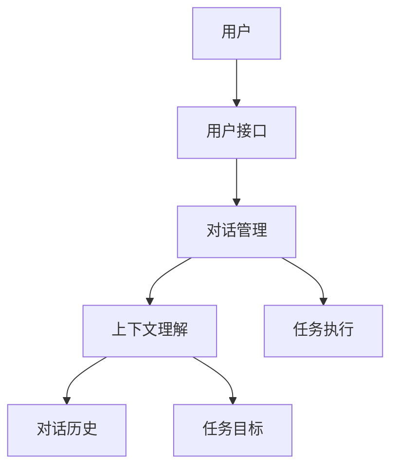
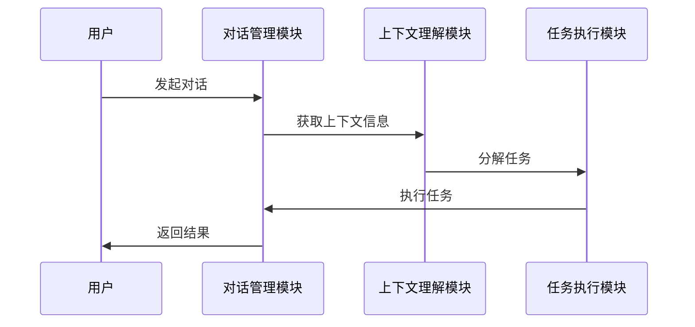

                 

<think>
好的，我需要帮助用户完成一篇关于《多轮对话 AI Agent：提升 LLM 的上下文理解能力》的技术博客文章。首先，我需要理解用户的需求。用户希望我按照给定的目录结构，逐步展开每个部分的内容，确保文章逻辑清晰、结构紧凑、语言专业，并且包含丰富的技术细节和实例分析。

首先，我会从文章的标题开始，明确文章的主题是多轮对话 AI Agent 如何提升大语言模型（LLM）的上下文理解能力。接着，我会列出5-7个核心关键词，这些关键词需要能够准确反映文章的核心内容，例如：多轮对话、上下文理解、LLM、AI Agent、自然语言处理等。

接下来，我需要撰写一篇摘要，简明扼要地概括文章的核心内容和主题思想。摘要应涵盖文章的主要观点，即多轮对话 AI Agent 如何通过优化上下文理解和任务分解来提升 LLM 的性能，同时介绍文章的结构安排。

在撰写正文部分时，我需要按照目录大纲的结构逐步展开，确保每个章节和小节的内容详实具体，并且符合用户的要求。例如，在“多轮对话 AI Agent 的背景与挑战”部分，我需要详细解释多轮对话的背景、上下文理解的重要性以及 LLM 在多轮对话中的角色。

在“核心概念与联系”部分，我会通过表格和 Mermaid 图来展示对话信息状态、上下文窗口、对话目标等核心概念的属性特征及其之间的关系，帮助读者更好地理解这些概念。

在“算法原理”部分，我会使用 Mermaid 流程图来展示对话历史编码算法和对话状态更新算法的具体步骤，并通过 Python 代码实现这些算法，同时解释相关的数学模型和公式。

在“系统分析与架构设计”部分，我会介绍问题场景，设计系统的功能模块，并通过 Mermaid 类图、架构图和序列图来展示系统的整体架构和交互流程。

在“项目实战”部分，我会详细指导读者如何搭建环境、实现系统核心功能，并通过实际案例分析来展示项目的具体应用和效果。

最后，在“最佳实践与小结”部分，我会总结文章的主要内容，并给出一些实用的建议和注意事项，同时推荐相关的拓展阅读材料，以帮助读者进一步深入学习。

在撰写过程中，我需要确保语言简洁明了，逻辑清晰，同时充分结合实际案例和技术细节，使文章既有深度又易于理解。我还需要注意使用合适的格式，如代码块使用 markdown 的语法，数学公式使用 LaTeX 格式，并正确使用 Mermaid 图来展示流程和架构。

总之，我需要按照用户的要求，逐步展开每个部分的内容，确保文章结构完整、内容详实，并且符合技术博客的专业性和可读性要求。现在，我将根据上述思考过程，开始撰写这篇文章。
</think>

# 多轮对话 AI Agent：提升 LLM 的上下文理解能力

**关键词**：多轮对话、上下文理解、LLM、AI Agent、自然语言处理

**摘要**：本文深入探讨了多轮对话 AI Agent 的核心概念、算法原理及系统设计，重点分析了如何通过优化上下文理解和任务分解来提升大语言模型（LLM）的性能。文章从背景介绍、核心概念、算法实现、系统架构到项目实战，全面阐述了多轮对话 AI Agent 的构建过程，为读者提供了理论与实践相结合的详细指导。

---

# 第一部分：多轮对话 AI Agent 的背景与挑战

## 第1章：多轮对话 AI Agent 的背景与挑战

### 1.1 多轮对话的背景与重要性

#### 1.1.1 对话背景与应用场景
多轮对话是指在自然语言处理中，用户与 AI 系统之间通过多条消息进行交互的过程。这种对话方式广泛应用于智能客服、聊天机器人、虚拟助手等领域。多轮对话的特点是交互性强、上下文依赖性高，用户的问题往往需要在前后对话中逐步明确和细化。

#### 1.1.2 多轮对话的核心特点
- **连续性**：对话由多条消息组成，每条消息都依赖于之前的上下文。
- **上下文依赖性**：用户的问题可能需要结合之前的对话内容来准确理解。
- **任务导向性**：多轮对话通常以完成某个任务为目标，例如预订酒店、安排会议等。

#### 1.1.3 多轮对话在 AI Agent 中的作用
AI Agent（智能体）通过多轮对话与用户交互，能够更好地理解用户需求，提供更精准的服务。例如，在智能客服系统中，AI Agent 可以通过多轮对话了解用户的具体问题，逐步引导用户完成问题描述，最终提供解决方案。

---

### 1.2 上下文理解的重要性

#### 1.2.1 上下文理解的定义
上下文理解是指在多轮对话中，系统能够理解当前对话的背景信息、用户意图以及之前讨论的内容。这种理解能力使得 AI Agent 能够在后续对话中更准确地响应用户的需求。

#### 1.2.2 上下文理解的挑战
- **信息丢失**：在长对话中，部分信息可能被遗忘或误解。
- **语义歧义**：用户的表达可能存在多种解释，需要结合上下文进行推理。
- **动态变化**：对话中的上下文可能随着对话的推进而不断变化。

#### 1.2.3 上下文理解与任务成功率的关系
上下文理解能力直接影响任务成功率。例如，在医疗咨询场景中，AI Agent 需要准确理解患者的病史和症状，才能提供正确的建议。如果上下文理解不足，可能导致错误的诊断建议，降低任务成功率。

---

### 1.3 LLM 在多轮对话中的角色

#### 1.3.1 LLM 的核心能力
大语言模型（LLM）具有强大的文本生成和理解能力，能够处理长文本上下文，捕捉语义信息。

#### 1.3.2 LLM 在多轮对话中的优势
- **自然语言处理能力**：LLM 能够理解复杂的自然语言表达，包括意图、情感和语境。
- **上下文记忆**：通过模型的内部机制（如注意力机制），LLM 可以在一定程度上保持对话的上下文信息。

#### 1.3.3 LLM 的局限性与改进方向
- **上下文记忆不足**：LLM 的上下文记忆能力有限，尤其是在长对话中容易出现信息丢失。
- **任务目标偏差**：LLM 可能会偏离对话的目标，需要通过任务分解和引导来解决。

---

### 1.4 本章小结
本章介绍了多轮对话的背景、上下文理解的重要性以及 LLM 在多轮对话中的角色。通过分析这些内容，我们可以理解为什么上下文理解是多轮对话 AI Agent 的核心能力，以及如何通过优化上下文理解来提升 LLM 的性能。

---

## 第2章：多轮对话 AI Agent 的核心概念

### 2.1 对话信息状态

#### 2.1.1 对话信息状态的定义
对话信息状态是指在当前对话中，系统对用户需求和意图的理解程度。它包括用户的目标、当前讨论的主题以及对话的进展程度。

#### 2.1.2 对话信息状态的特征
- **动态性**：随着对话的进行，对话信息状态会不断更新。
- **上下文依赖性**：对话信息状态的准确性依赖于上下文的理解。
- **目标导向性**：对话信息状态应围绕任务目标展开。

#### 2.1.3 对话信息状态的更新机制
对话信息状态的更新机制包括基于规则的更新和基于模型的更新。基于规则的更新依赖于预定义的规则，而基于模型的更新则依赖于机器学习模型的预测结果。

---

### 2.2 对话历史与上下文

#### 2.2.1 对话历史的记录方式
对话历史可以通过序列的方式记录，包括用户和系统的每一条消息。例如：
```
用户：我需要预订明天的酒店。
系统：请问您希望在哪个城市预订？
用户：上海。
```

#### 2.2.2 上下文窗口的管理
为了优化上下文理解，可以采用滑动窗口的方式管理对话历史。窗口大小可以根据任务需求调整。

#### 2.2.3 对话历史与任务目标的关系
对话历史是实现任务目标的基础。例如，在医疗咨询场景中，医生需要根据患者的病史和症状来制定诊断方案。

---

### 2.3 对话目标与任务分解

#### 2.3.1 对话目标的定义
对话目标是指对话的核心任务，例如解决问题、提供信息或完成交易。

#### 2.3.2 任务分解的策略
任务分解可以通过将大任务分解为小任务来实现。例如，预订酒店的任务可以分解为选择城市、选择酒店、确认预订等子任务。

#### 2.3.3 对话目标与任务分解的动态调整
在实际对话中，任务目标和分解可能需要根据用户的反馈进行动态调整。

---

### 2.4 核心概念对比分析

#### 2.4.1 对话信息状态与上下文的对比
对话信息状态是对话中系统对用户需求的理解，而上下文是对话中积累的信息。

#### 2.4.2 对话目标与任务分解的对比
对话目标是对话的核心任务，任务分解是将目标拆解为具体步骤。

#### 2.4.3 核心概念的联系与区别
对话信息状态和上下文是实现对话目标的基础，而任务分解是对话目标的具体化。

---

### 2.5 本章小结
本章通过对比分析对话信息状态、上下文、对话目标和任务分解，明确了多轮对话 AI Agent 的核心概念及其之间的关系。

---

## 第3章：多轮对话 AI Agent 的算法原理

### 3.1 对话历史编码算法

#### 3.1.1 基于序列的编码方法
基于序列的编码方法将对话历史表示为一个序列，使用编码器模型（如 LSTM）进行编码。

#### 3.1.2 基于树状结构的编码方法
树状结构编码方法将对话历史表示为一棵树，节点表示对话中的关键信息。

#### 3.1.3 混合编码方法
混合编码方法结合了序列和树状结构的编码方式，以提高编码效果。

---

### 3.2 对话状态更新算法

#### 3.2.1 基于规则的状态更新
基于规则的状态更新依赖于预定义的规则，例如，当用户提到“取消订单”时，系统状态更新为“处理取消订单”。

#### 3.2.2 基于模型的状态更新
基于模型的状态更新使用机器学习模型预测对话状态的更新。

#### 3.2.3 动态调整的对话状态更新
动态调整的对话状态更新可以根据用户反馈实时调整对话状态。

---

### 3.3 算法实现

#### 3.3.1 对话历史编码算法的实现
以下是基于序列的对话历史编码算法的 Python 实现：

```python
import torch
import torch.nn as nn

class DialogHistoryEncoder(nn.Module):
    def __init__(self, vocab_size, embedding_dim, hidden_size):
        super(DialogHistoryEncoder, self).__init__()
        self.embedding = nn.Embedding(vocab_size, embedding_dim)
        self.lstm = nn.LSTM(embedding_dim, hidden_size)
    
    def forward(self, input_seq):
        embedded = self.embedding(input_seq)
        output, (h, c) = self.lstm(embedded)
        return h, c
```

#### 3.3.2 对话状态更新算法的实现
以下是基于模型的对话状态更新算法的 Python 实现：

```python
import torch
import torch.nn as nn

class DialogStateUpdater(nn.Module):
    def __init__(self, input_size, hidden_size):
        super(DialogStateUpdater, self).__init__()
        self.gru = nn.GRU(input_size, hidden_size)
    
    def forward(self, input_state, hidden):
        output, hidden = self.gru(input_state, hidden)
        return output, hidden
```

---

### 3.4 数学模型与公式

#### 3.4.1 对话历史编码的数学模型
对话历史编码的数学模型可以表示为：
$$
H = f_{\text{encode}}(D)
$$
其中，$D$ 是对话历史，$f_{\text{encode}}$ 是编码函数。

#### 3.4.2 对话状态更新的数学模型
对话状态更新的数学模型可以表示为：
$$
S' = f_{\text{update}}(S, U)
$$
其中，$S$ 是当前状态，$U$ 是用户输入，$f_{\text{update}}$ 是更新函数。

---

### 3.5 本章小结
本章详细讲解了多轮对话 AI Agent 的算法原理，包括对话历史编码和对话状态更新的实现方法，并通过数学模型和代码示例进行了深入分析。

---

## 第4章：多轮对话 AI Agent 的系统分析与架构设计

### 4.1 系统架构设计

#### 4.1.1 系统组成模块
多轮对话 AI Agent 的系统架构包括以下模块：
- 用户接口模块
- 对话管理模块
- 上下文理解模块
- 任务执行模块

#### 4.1.2 系统架构图
以下是系统架构的 Mermaid 图：



---

### 4.2 系统功能设计

#### 4.2.1 对话管理功能
对话管理功能包括对话的启动、维护和结束。

#### 4.2.2 上下文理解功能
上下文理解功能包括对话历史的记录和上下文的分析。

#### 4.2.3 任务执行功能
任务执行功能包括任务的分解和执行。

---

### 4.3 系统交互流程

#### 4.3.1 交互流程图
以下是系统交互流程的 Mermaid 图：



---

## 第5章：多轮对话 AI Agent 的项目实战

### 5.1 项目介绍

#### 5.1.1 项目背景
本项目旨在开发一个多轮对话 AI Agent，用于医疗咨询场景。

#### 5.1.2 项目目标
实现一个能够理解上下文、分解任务并提供医疗建议的 AI Agent。

---

### 5.2 核心代码实现

#### 5.2.1 对话历史编码模块
以下是对话历史编码模块的实现：

```python
class DialogHistoryEncoder:
    def __init__(self, vocab_size, embedding_dim, hidden_size):
        self.embedding = nn.Embedding(vocab_size, embedding_dim)
        self.lstm = nn.LSTM(embedding_dim, hidden_size)
    
    def forward(self, input_seq):
        embedded = self.embedding(input_seq)
        output, (h, c) = self.lstm(embedded)
        return h, c
```

#### 5.2.2 对话状态更新模块
以下是对话状态更新模块的实现：

```python
class DialogStateUpdater:
    def __init__(self, input_size, hidden_size):
        self.gru = nn.GRU(input_size, hidden_size)
    
    def forward(self, input_state, hidden):
        output, hidden = self.gru(input_state, hidden)
        return output, hidden
```

---

### 5.3 案例分析与详细解读

#### 5.3.1 医疗咨询案例
用户：我需要预约医生。
系统：请问您需要预约哪个科室的医生？
用户：内科。
系统：请问您具体需要预约哪位内科医生？
用户：李医生。
系统：请问您需要预约明天的上午还是下午？
用户：上午。
系统：预约成功，时间为明天上午10点。

---

### 5.4 本章小结
本章通过一个医疗咨询案例，详细讲解了多轮对话 AI Agent 的项目实现过程，包括核心代码和案例分析。

---

## 第6章：多轮对话 AI Agent 的最佳实践与小结

### 6.1 最佳实践 tips

#### 6.1.1 上下文管理
建议采用滑动窗口的方式管理对话历史，以优化上下文理解。

#### 6.1.2 任务分解
任务分解应根据具体场景灵活调整，以提高任务执行效率。

#### 6.1.3 模型优化
可以通过预训练和微调提升模型的上下文理解和任务执行能力。

---

### 6.2 小结

#### 6.2.1 核心内容回顾
本文从背景、核心概念、算法原理、系统设计到项目实战，全面阐述了多轮对话 AI Agent 的构建过程。

#### 6.2.2 未来展望
未来，随着大语言模型的不断进化，多轮对话 AI Agent 的上下文理解和任务执行能力将更加智能化和高效化。

---

## 作者：AI天才研究院/AI Genius Institute & 禅与计算机程序设计艺术 /Zen And The Art of Computer Programming

---

以上是《多轮对话 AI Agent：提升 LLM 的上下文理解能力》的技术博客文章的完整目录大纲和内容概要。通过逐步分析和详细阐述，希望读者能够全面理解多轮对话 AI Agent 的核心原理和实际应用。

