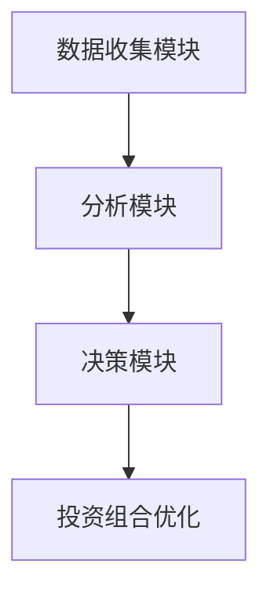

                 


# 大卫·温特斯的周期性行业价值投资

## 关键词：周期性行业，价值投资，大卫·温特斯，投资策略，行业分析

## 摘要：  
本文深入探讨大卫·温特斯在周期性行业中的价值投资策略。通过分析周期性行业的特点、价值评估方法和投资策略，结合数学模型和系统设计，提供实用的指导和案例分析，帮助投资者在周期性行业中找到投资机会。

---

## 第一部分: 周期性行业的价值投资基础

### 第1章: 周期性行业的基本概念

#### 1.1 周期性行业的定义与特点
- **周期性行业的定义**：周期性行业是指其业绩波动与经济周期密切相关的行业，如能源、材料、工业等。
- **周期性行业的波动性特征**：行业收益和股价在经济周期中呈现周期性波动。
- **周期性行业的分类与范围**：主要分为萧条行业、复苏行业、增长行业和衰退行业。

#### 1.2 价值投资的基本原理
- **价值投资的核心理念**：寻找市场价格低于内在价值的投资标的。
- **周期性行业中的价值投资机会**：在行业低谷时买入，在行业高峰时卖出。
- **价值投资与周期性行业的结合**：通过分析行业周期，选择合适的时机进行投资。

### 第2章: 行业周期分析

#### 2.1 行业周期的阶段划分
- **萧条阶段**：需求下降，供给过剩，企业盈利能力下降。
- **复苏阶段**：需求逐步恢复，供给开始调整。
- **超额利润阶段**：需求超过供给，企业盈利能力上升。
- **衰退阶段**：需求下降，供给过剩，企业盈利能力下降。

#### 2.2 行业周期的影响因素
- **经济指标的影响**：GDP增长率、利率、通货膨胀率等。
- **行业供需关系**：行业供需变化影响价格和利润。
- **政策环境的影响**：政府政策和法规对行业的影响。

---

## 第二部分: 价值评估方法

### 第3章: 财务指标分析

#### 3.1 财务指标的定义与作用
- **市盈率（P/E）**：股价与每股收益的比率，用于评估股票是否被高估或低估。
- **市净率（P/B）**：股价与每股净资产的比率，用于评估股票的价值。
- **股息率**：股息与股价的比率，用于评估投资回报。

#### 3.2 价值评估的核心方法
- **相对估值法**：比较股票与行业平均市盈率、市净率等指标。
- **绝对估值法**：通过现金流折现法评估企业内在价值。

#### 3.3 行业周期与价值评估
- **萧条阶段**：关注低市盈率和低市净率的股票。
- **复苏阶段**：寻找市盈率开始上升的股票。
- **超额利润阶段**：关注高市盈率和高市净率的股票。
- **衰退阶段**：寻找低市盈率和低市净率的股票。

---

## 第三部分: 数学模型与公式

### 第4章: 数学模型与公式

#### 4.1 市盈率计算
$$ \text{市盈率} = \frac{\text{股价}}{\text{每股收益}} $$

#### 4.2 市净率计算
$$ \text{市净率} = \frac{\text{股价}}{\text{每股净资产}} $$

#### 4.3 行业周期预测模型
- **ARIMA模型**：用于预测行业周期的变化。
- **回归分析**：分析经济指标对行业周期的影响。

#### 4.4 投资组合优化
- **均值-方差优化**：通过优化投资组合的风险和收益。

---

## 第四部分: 系统分析与架构设计

### 第5章: 系统架构设计

#### 5.1 投资决策系统
- **数据收集模块**：收集行业数据、经济指标等。
- **分析模块**：分析行业周期、评估企业价值。
- **决策模块**：制定投资策略。

#### 5.2 系统架构图


---

## 第五部分: 项目实战

### 第6章: 项目实战

#### 6.1 实际案例分析
- **案例：能源行业投资分析**：
  - 分析能源行业的周期阶段。
  - 计算相关财务指标。
  - 制定投资策略。

#### 6.2 代码实现
- **Python代码示例**：
  ```python
  import pandas as pd
  import numpy as np

  # 示例数据
  data = {'行业': ['能源', '材料', '工业'],
          '市盈率': [15, 20, 25],
          '市净率': [2, 3, 4]}
  df = pd.DataFrame(data)

  # 计算投资价值
  df['投资价值'] = '中等'
  df.loc[df['市盈率'] < 15, '投资价值'] = '高'
  df.loc[df['市净率'] > 3, '投资价值'] = '低'

  print(df)
  ```

#### 6.3 案例分析解读
- **能源行业的周期阶段**：假设能源行业处于萧条阶段，市盈率较低，适合买入。
- **投资策略**：在萧条阶段买入低市盈率股票，衰退阶段卖出。

---

## 第六部分: 总结与展望

### 第7章: 总结与展望

#### 7.1 总结
- **周期性行业的价值投资策略**：通过分析行业周期，选择合适的投资时机。
- **数学模型与系统设计**：利用数学模型和系统设计优化投资决策。

#### 7.2 未来展望
- **AI在投资中的应用**：利用人工智能技术进一步优化投资策略。
- **新兴行业的周期性分析**：关注新兴行业的周期性特点。

---

## 作者信息

作者：AI天才研究院/AI Genius Institute & 禅与计算机程序设计艺术 /Zen And The Art of Computer Programming

