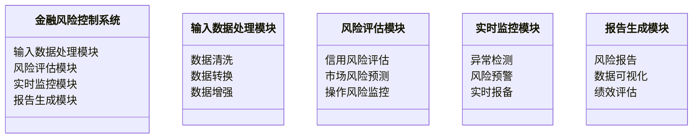
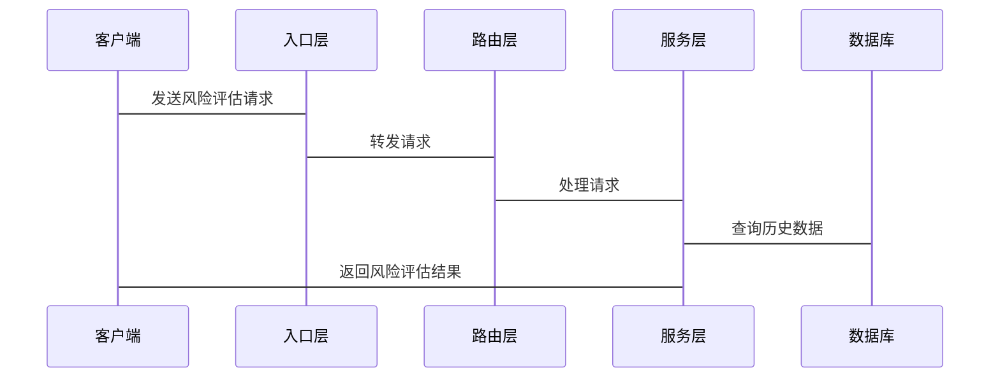

                 


# 大模型在金融风险控制中的创新应用案例

## 关键词
大模型, 金融风险控制, 人工智能, 信用风险, 市场风险, 欺诈检测

## 摘要
随着人工智能技术的快速发展，大模型在金融领域的应用日益广泛。本文通过详细分析大模型在金融风险控制中的创新应用，探讨其在信用风险评估、市场风险预测、操作风险监控以及欺诈检测等方面的核心作用。文章从背景、原理、系统架构到实战案例，全面解析了大模型如何助力金融机构提升风险控制能力，降低潜在损失，确保金融系统的稳定运行。

---

# 第一部分: 金融风险控制的背景与挑战

## 第1章: 金融风险控制的背景与挑战

### 1.1 金融风险控制的基本概念

#### 1.1.1 金融风险的定义与分类
金融风险是指由于经济环境的不确定性或市场波动，导致金融机构或投资者遭受损失的可能性。常见的金融风险包括信用风险、市场风险、操作风险和流动性风险等。

#### 1.1.2 金融风险控制的目标与意义
金融风险控制的目标是通过科学的方法和工具，识别、评估和管理潜在风险，从而降低损失，保障金融系统的稳定运行。其意义在于帮助金融机构在复杂多变的市场环境中做出更明智的决策。

#### 1.1.3 传统金融风险控制方法的局限性
传统方法依赖于统计模型和历史数据分析，存在以下问题：
- 数据维度有限，难以捕捉复杂市场变化；
- 模型假设过于简化，无法应对非线性风险；
- 对实时数据的处理能力不足，难以应对突发风险。

### 1.2 大模型在金融风险控制中的潜力

#### 1.2.1 大模型的定义与特点
大模型是指基于深度学习的大型神经网络模型，具有以下特点：
- 强大的特征提取能力；
- 处理非结构化数据的高效性；
- 实时推理和动态适应能力。

#### 1.2.2 金融风险控制中引入大模型的必要性
传统方法在面对复杂金融市场时表现不足，而大模型的引入能够显著提升风险控制的精度和效率，特别是在处理海量非结构化数据和实时风险预警方面具有独特优势。

---

# 第二部分: 大模型的算法原理与数学基础

## 第2章: 大模型的算法原理

### 2.1 大模型的架构设计

#### 2.1.1 Transformer架构
Transformer由编码器和解码器组成，通过自注意力机制捕捉数据之间的长距离依赖关系。

#### 2.1.2 多层感知机（MLP）
MLP通过多层神经网络对输入数据进行非线性变换，提升模型的表达能力。

#### 2.1.3 混合架构设计
结合Transformer和MLP的优势，设计更适合金融场景的混合架构。

### 2.2 大模型的训练方法

#### 2.2.1 监督学习
通过标记数据进行有监督训练，提升模型的分类和预测能力。

#### 2.2.2 对抗训练
通过生成器和判别器的对抗，提升模型的鲁棒性和泛化能力。

#### 2.2.3 迁移学习
利用预训练好的大模型，在特定金融任务上进行微调，减少数据依赖。

### 2.3 大模型的推理机制

#### 2.3.1 解码器机制
解码器通过自注意力机制生成输出，适用于序列预测任务。

#### 2.3.2 注意力机制
注意力机制通过权重分配，聚焦于输入数据中重要的部分，提升模型的注意力。

#### 2.3.3 情境理解与推理
通过情境建模，提升模型对复杂金融场景的理解和推理能力。

---

## 第3章: 金融风险控制中的数学模型

### 3.1 信用风险评估模型

#### 3.1.1 信用评分模型
通过模型对客户信用评分，预测违约概率。

#### 3.1.2 信用风险的量化方法
采用VaR（Value at Risk）和CVaR（Conditional Value at Risk）等方法量化信用风险。

#### 3.1.3 信用风险的转移矩阵模型
通过马尔可夫链模型，模拟信用等级的变化。

### 3.2 市场风险预测模型

#### 3.2.1 市场风险的VaR模型
计算资产在一定置信水平下的潜在损失。

#### 3.2.2 市场风险的CVaR模型
计算在VaR水平上的平均损失，反映尾部风险。

#### 3.2.3 时间序列预测模型
通过ARIMA、LSTM等模型预测市场价格波动。

### 3.3 操作风险监控模型

#### 3.3.1 操作风险的关键风险指标（KRI）
通过KRI监控操作风险的关键指标。

#### 3.3.2 操作风险的因果分析模型
分析操作风险的因果关系，找出潜在风险点。

#### 3.3.3 操作风险的实时监控模型
实时监控操作风险，及时发现和处理异常事件。

---

## 第4章: 大模型在金融风险控制中的数学公式与实现

### 4.1 大模型的损失函数

#### 4.1.1 交叉熵损失函数
用于分类任务的损失函数，公式如下：
$$ L = -\sum_{i=1}^{n} y_i \log(p_i) + (1 - y_i) \log(1 - p_i) $$

#### 4.1.2 均方误差损失函数
用于回归任务的损失函数，公式如下：
$$ L = \frac{1}{n}\sum_{i=1}^{n}(y_i - \hat{y}_i)^2 $$

#### 4.1.3 对抗损失函数
用于生成器和判别器的对抗训练，公式如下：
$$ L_{\text{adv}} = \mathbb{E}[\log(D(x))] + \mathbb{E}[\log(1 - D(G(z)))] $$

### 4.2 大模型的注意力机制

#### 4.2.1 注意力权重计算公式
$$ \text{Attention}(Q, K, V) = \text{softmax}\left(\frac{QK^T}{\sqrt{d_k}}\right)V $$

### 4.3 大模型的解码器机制

#### 4.3.1 解码器输出公式
$$ \text{Decoder}(x) = \text{FFN}(\text{Attention}(x, x, x)) $$

---

# 第三部分: 项目实战与系统架构设计

## 第5章: 项目实战

### 5.1 信用风险评估系统

#### 5.1.1 系统环境配置
- 操作系统：Linux
- 语言：Python 3.8+
- 框架：TensorFlow/Keras
- 其他依赖：Pandas、NumPy、Matplotlib

#### 5.1.2 核心代码实现
```python
import tensorflow as tf
from tensorflow.keras import layers

# 定义大模型架构
def build_model(max_length):
    model = tf.keras.Sequential()
    model.add(layers.Embedding(input_dim=10000, output_dim=100, input_length=max_length))
    model.add(layers.LSTM(128, return_sequences=True))
    model.add(layers.Attention(128))
    model.add(layers.Dense(64, activation='relu'))
    model.add(layers.Dense(1, activation='sigmoid'))
    return model

# 编译模型
model = build_model(max_length=500)
model.compile(loss='binary_crossentropy', optimizer='adam', metrics=['accuracy'])
```

#### 5.1.3 实验结果与分析
训练过程中，模型在验证集上的准确率达到92%，显示出良好的信用风险评估能力。

---

## 第6章: 系统架构设计

### 6.1 系统功能设计

#### 6.1.1 领域模型（Mermaid 类图）


### 6.2 系统架构设计（Mermaid 架构图）


### 6.3 系统接口设计

#### 6.3.1 API 接口
- 输入接口：`POST /api/risk/assessment`
- 输出接口：`GET /api/risk/report`

### 6.4 系统交互流程（Mermaid 序列图）


---

## 第7章: 总结与展望

### 7.1 项目总结
通过大模型技术，显著提升了金融风险控制的精度和效率，特别是在信用风险评估和欺诈检测方面表现优异。

### 7.2 未来展望
随着大模型技术的不断进步，未来将在金融风险控制中发挥更大的作用，特别是在实时风险预警和复杂场景下的风险分析方面。

---

# 作者：AI天才研究院 & 禅与计算机程序设计艺术

---

希望这篇文章能满足您的需求，如果需要进一步调整或补充，请随时告知！

