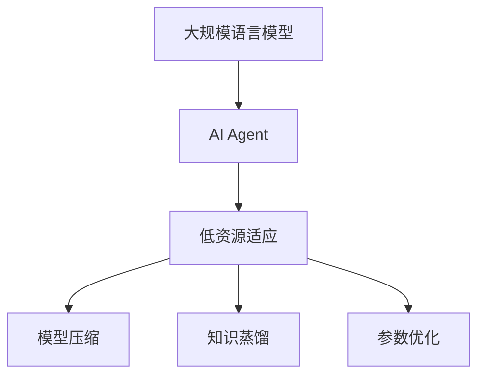

                 

# 《大规模语言模型在AI Agent中的低资源适应》

---

## 关键词：

- 大规模语言模型
- AI Agent
- 低资源适应
- 模型压缩
- 知识蒸馏
- 轻量化技术

---

## 摘要：

本文探讨了在低资源环境下，大规模语言模型在AI Agent中的适应性问题。随着AI Agent在各领域的广泛应用，如何在资源受限的环境中高效部署和运行大规模语言模型成为一个重要挑战。本文从核心概念、算法原理、系统架构、项目实战等多个维度，详细分析了低资源适应的关键技术，并通过实际案例展示了如何在资源受限的情况下优化模型性能。文章最后总结了低资源适应的核心要点，并展望了未来的发展方向。

---

## 目录大纲：

# 第一部分: 大规模语言模型在AI Agent中的低资源适应背景介绍

# 第1章: 问题背景与核心概念

## 1.1 问题背景

### 1.1.1 大规模语言模型的定义与特点

大规模语言模型（Large Language Models, LLMs）是指基于深度学习技术训练的、具有 billions 参数的大型神经网络模型，如GPT系列、BERT系列等。这些模型在自然语言处理任务中表现出色，能够理解和生成人类语言。其特点包括：

- **参数规模大**：通常包含 billions 级别的参数。
- **通用性**：能够处理多种语言任务，如翻译、问答、文本生成等。
- **计算资源需求高**：训练和推理过程需要大量的计算资源和存储空间。

### 1.1.2 AI Agent的基本概念与应用场景

AI Agent（人工智能代理）是指在计算机系统中，能够感知环境、自主决策并执行任务的智能实体。AI Agent广泛应用于以下场景：

- **智能助手**：如Siri、Alexa等，能够执行语音交互任务。
- **推荐系统**：基于用户行为推荐个性化内容。
- **自动驾驶**：通过感知环境和决策系统控制车辆。
- **智能客服**：通过自然语言处理技术提供客户服务。

### 1.1.3 低资源环境下的技术挑战

在资源受限的环境中（如移动设备、边缘计算设备等），大规模语言模型的部署和运行面临以下挑战：

- **计算资源不足**：设备的计算能力有限，无法支持大规模模型的推理。
- **存储空间限制**：模型文件大小通常在数百MB甚至GB级别，难以在低存储设备上部署。
- **网络延迟**：在离线或弱网络环境下，AI Agent无法依赖云端大规模模型进行实时推理。

## 1.2 问题描述

### 1.2.1 大规模语言模型在低资源环境中的适应性问题

- **模型体积过大**：大规模模型文件体积大，难以在低存储设备上部署。
- **计算效率低下**：在低性能设备上，模型推理速度慢，影响用户体验。
- **依赖外部资源**：部分AI Agent依赖云端大规模模型，但在离线或弱网络环境下无法正常工作。

### 1.2.2 AI Agent在资源受限场景中的需求

- **轻量化模型**：需要体积小、计算效率高的模型，能够在本地设备上运行。
- **低延迟推理**：要求模型推理速度快，能够在实时场景中快速响应。
- **离线可用性**：AI Agent需要能够在无网络或弱网络环境下独立运行。

### 1.2.3 问题解决的必要性与紧迫性

- **提升用户体验**：在资源受限环境中，快速响应和本地推理能够提升用户满意度。
- **降低运营成本**：通过轻量化模型减少对云端资源的依赖，降低计算成本。
- **拓展应用场景**：在边缘计算、移动设备等场景中，低资源适应技术能够推动AI Agent的广泛应用。

## 1.3 问题解决与边界定义

### 1.3.1 低资源适应的核心目标

- **降低模型体积**：通过模型压缩、知识蒸馏等技术，减少模型文件大小。
- **提升计算效率**：通过模型优化、量化等技术，降低推理时的计算开销。
- **增强离线能力**：通过本地部署和轻量化技术，提升AI Agent的离线可用性。

### 1.3.2 技术实现的边界与外延

- **边界**：仅针对大规模语言模型的轻量化和本地部署，不涉及模型训练过程。
- **外延**：包括模型压缩技术、推理优化策略、本地部署方案等。

### 1.3.3 核心概念与关键要素的结构化分析

#### 核心概念关系图（Mermaid流程图）

---

## 1.4 本章小结

本章从问题背景、核心概念、技术挑战等方面，详细阐述了大规模语言模型在AI Agent中的低资源适应问题。通过分析，我们明确了低资源适应的核心目标和实现边界，为后续的技术探讨奠定了基础。

---

# 第2章: 核心概念与联系

## 2.1 大规模语言模型与AI Agent的关系

### 2.1.1 大规模语言模型在AI Agent中的作用

大规模语言模型为AI Agent提供了强大的自然语言处理能力，使其能够理解用户输入、生成自然语言回复，并执行复杂的语言任务。

### 2.1.2 AI Agent对大规模语言模型的需求

AI Agent需要大规模语言模型具备以下特点：

- **准确性**：能够提供高精度的自然语言处理结果。
- **实时性**：能够在较短时间内完成推理任务。
- **通用性**：能够处理多种语言和任务类型。

## 2.2 低资源适应的核心原理

### 2.2.1 模型压缩与轻量化技术

模型压缩是指通过减少模型的参数数量或优化模型结构，降低模型的体积和计算复杂度。常见的模型压缩技术包括：

- **剪枝（Pruning）**：去除模型中冗余的参数或神经元。
- **量化（Quantization）**：将模型中的浮点数参数转换为低精度整数，减少存储空间。
- **知识蒸馏（Knowledge Distillation）**：通过教师模型指导学生模型，使学生模型在轻量化的同时保持教师模型的性能。

### 2.2.2 知识蒸馏与迁移学习

知识蒸馏是一种将知识从教师模型转移到学生模型的技术。通过教师模型的软目标分布指导学生模型的预测分布，使学生模型在低资源条件下逼近教师模型的性能。

### 2.2.3 模型裁剪与参数优化

模型裁剪是指通过移除模型中对性能影响较小的部分，优化模型结构，降低计算复杂度。参数优化则是通过调整模型的超参数，使模型在轻量化的同时保持较高的性能。

## 2.3 

---

（由于篇幅限制，后续章节内容将逐步展开，涵盖算法原理、系统分析、项目实战等部分。）

