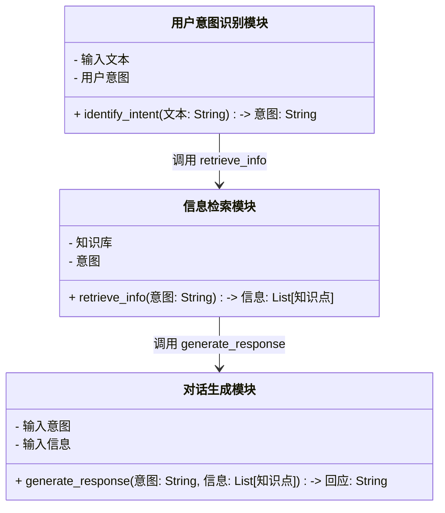

                 


# 大规模语言模型在AI Agent中的微调技巧

> 关键词：大规模语言模型, AI Agent, 微调技巧, 机器学习, 系统架构设计

> 摘要：本文深入探讨了大规模语言模型在AI Agent中的微调技巧，从理论到实践，详细分析了微调的关键步骤、系统架构设计和实际应用案例。文章结合具体实例，通过详细的数学公式和系统架构图，帮助读者全面理解大规模语言模型在AI Agent中的应用和优化方法。

---

# 第1章: 大规模语言模型与AI Agent概述

## 1.1 大规模语言模型的背景与现状

### 1.1.1 从传统NLP到大规模语言模型的演进

自然语言处理（NLP）经历了从规则驱动到数据驱动的转变。早期的NLP主要依赖手动编写规则，这种方式效率低下且难以处理复杂场景。随着深度学习的兴起，特别是 transformer 架构的提出，大规模语言模型（如GPT、BERT）逐渐成为NLP领域的主流。

**技术背景：**
- **规则驱动NLP**：基于语法和语义规则，适用于简单任务（如分词、词性标注）。
- **统计驱动NLP**：使用机器学习模型（如SVM、随机森林）处理文本数据，但仍依赖特征工程。
- **深度学习驱动NLP**：通过神经网络模型（如RNN、LSTM、transformer）实现端到端学习，性能显著提升。

### 1.1.2 大规模语言模型的核心特点

大规模语言模型具有以下关键特点：
1. **预训练**：通过大量未标注文本进行自监督学习，模型能够理解语言的上下文关系。
2. **参数量大**：参数量通常在亿级别，能够捕捉复杂的语言模式。
3. **微调能力**：通过在特定任务上的微调（Fine-tuning），模型可以适应不同应用场景。
4. **多任务学习**：能够同时处理多种NLP任务（如文本生成、问答系统、情感分析）。

### 1.1.3 AI Agent的定义与应用场景

AI Agent（智能代理）是一种能够感知环境并采取行动以实现目标的智能体。在AI Agent中，大规模语言模型主要用于以下场景：
1. **对话生成**：生成自然流畅的对话响应。
2. **任务执行**：通过理解和执行复杂任务（如预订机票、 scheduling meetings）。
3. **知识检索**：从大规模知识库中检索相关信息。
4. **决策支持**：辅助决策过程中的信息分析和推理。

## 1.2 大规模语言模型与AI Agent的结合

### 1.2.1 语言模型在AI Agent中的作用

语言模型在AI Agent中的作用可以分为以下几个方面：
1. **理解输入**：通过自然语言理解（NLU）技术，将用户输入的自然语言转化为结构化的信息。
2. **生成输出**：通过自然语言生成（NLG）技术，将结构化的信息转化为自然语言输出。
3. **知识整合**：将语言模型与知识库（如知识图谱）结合，实现信息的准确检索和推理。

### 1.2.2 AI Agent的典型应用场景

AI Agent在多个领域有广泛应用，包括：
1. **智能客服**：通过对话生成和任务执行，提供高效的客户支持。
2. **智能助手**：如Siri、Alexa等，帮助用户完成日常任务。
3. **企业级应用**：在企业内部，AI Agent可以用于自动化流程、信息检索等。

### 1.2.3 微调技术在AI Agent中的重要性

微调技术是将大规模语言模型应用于特定任务的关键步骤。通过微调，模型能够适应特定领域的数据和任务需求，提升性能和准确性。在AI Agent中，微调技术主要用于以下方面：
1. **任务特定优化**：针对对话生成、任务执行等特定任务进行微调。
2. **领域适应**：将模型适应特定领域（如医疗、金融）的数据和语言风格。
3. **性能优化**：通过微调，提升模型在特定任务上的生成质量和响应速度。

## 1.3 本章小结

本章介绍了大规模语言模型的背景、核心特点以及其在AI Agent中的应用。通过分析AI Agent的典型应用场景，强调了微调技术在模型适应特定任务中的重要性。下一章将深入探讨大规模语言模型的内部机制，为后续的微调技巧奠定理论基础。

---

# 第2章: 大规模语言模型的内部机制

## 2.1 大规模语言模型的结构与训练

### 2.1.1 模型结构概述

以 transformer 模型为例，其核心结构包括编码器（Encoder）和解码器（Decoder）。编码器负责将输入序列编码为上下文表示，解码器则基于编码器的输出生成目标序列。

**关键组件：**
1. **自注意力机制（Self-Attention）**：计算输入序列中每个位置与其他位置的相关性，捕捉长距离依赖关系。
2. **前馈神经网络（Feed-forward Network）**：对输入进行非线性变换，提取高级特征。

### 2.1.2 预训练与微调的区别

预训练和微调是大规模语言模型训练的两个阶段：
1. **预训练**：在大规模通用数据集上进行无监督学习，目标是最大化预测下一个词的概率。
2. **微调**：在特定任务的数据集上进行有监督学习，调整模型参数以适应具体任务。

### 2.1.3 微调的数学模型

假设我们有一个预训练好的语言模型，其参数为 $\theta$。在微调阶段，我们使用特定任务的数据集 $\mathcal{D} = \{ (x_i, y_i) \}$，其中 $x_i$ 是输入，$y_i$ 是目标输出。微调的目标是最小化损失函数 $\mathcal{L}$：

$$ \mathcal{L}(\theta) = \frac{1}{N} \sum_{i=1}^N \mathcal{L}(x_i, y_i; \theta) $$

其中，$N$ 是数据集的大小。

---

## 2.2 微调技术的核心原理

### 2.2.1 参数调整的原理

微调的本质是通过反向传播算法调整模型参数，使得模型在特定任务上的预测结果与真实结果一致。具体步骤如下：
1. **前向传播**：将输入数据通过模型，计算出预测结果。
2. **计算损失**：使用损失函数（如交叉熵损失）衡量预测结果与真实结果的差距。
3. **反向传播**：通过链式法则，计算每个参数的梯度。
4. **参数更新**：使用优化算法（如Adam）更新参数。

### 2.2.2 微调的数学公式

假设我们有一个预训练好的语言模型，其输出为 $p(y|x; \theta)$。在微调阶段，我们使用特定任务的损失函数 $\mathcal{L}_{\text{task}}$ 进行优化：

$$ \theta' = \theta - \eta \nabla_{\theta} \mathcal{L}_{\text{task}} $$

其中，$\eta$ 是学习率，$\nabla_{\theta} \mathcal{L}_{\text{task}}$ 是损失函数对参数 $\theta$ 的梯度。

### 2.2.3 微调与迁移学习的联系

微调是迁移学习的一种具体实现。迁移学习的目标是将预训练模型的知识迁移到新任务中，而微调通过在新任务数据上调整模型参数实现这一目标。

---

## 2.3 本章小结

本章详细介绍了大规模语言模型的内部结构和训练机制，并探讨了微调技术的核心原理。通过数学公式的推导，帮助读者理解微调的实现过程。下一章将结合AI Agent的任务特点，深入探讨微调的具体技巧和应用场景。

---

# 第3章: AI Agent的核心概念与任务分解

## 3.1 AI Agent的任务分解

### 3.1.1 任务分解的基本原则

任务分解是将复杂任务拆解为多个子任务，每个子任务由一个或多个模块负责。基本原则包括：
1. **模块化**：每个子任务相对独立，便于单独优化和维护。
2. **层次化**：任务分解可以分为多个层次，从宏观到微观逐步细化。
3. **可扩展性**：分解后的子任务应具备一定的扩展性，便于后续功能的添加和优化。

### 3.1.2 任务分解的步骤与方法

任务分解的步骤通常包括：
1. **需求分析**：明确任务目标和约束条件。
2. **功能拆解**：将任务分解为多个子任务，并定义每个子任务的输入和输出。
3. **模块划分**：将子任务分配给不同的模块或组件。

### 3.1.3 任务分解的案例分析

以智能客服为例，任务分解可以包括以下子任务：
1. **用户意图识别**：识别用户的请求类型（如查询、投诉）。
2. **信息检索**：从知识库中检索相关信息。
3. **对话生成**：根据检索结果生成回复。

---

## 3.2 知识表示与推理

### 3.2.1 知识图谱的构建

知识图谱是一种结构化的知识表示形式，由实体和关系组成。构建知识图谱的关键步骤包括：
1. **数据收集**：从多种数据源（如文本、数据库）收集知识。
2. **实体识别**：识别文本中的实体（如人名、地名）。
3. **关系抽取**：抽取实体之间的关系（如“人名是公司创始人”）。

### 3.2.2 推理机制的实现

推理机制是通过知识图谱进行推断的过程。常见的推理方法包括：
1. **基于规则的推理**：通过预定义的规则进行推理。
2. **基于概率的推理**：使用概率模型（如马尔可夫逻辑网络）进行推理。
3. **基于学习的推理**：使用机器学习模型（如RNN、transformer）进行推理。

---

## 3.3 决策机制与策略优化

### 3.3.1 决策树的构建

决策树是一种树状结构，用于表示可能的决策路径。构建决策树的关键步骤包括：
1. **特征选择**：选择能够最好地分割数据的特征。
2. **树的生成**：根据特征选择生成树的结构。
3. **剪枝**：去除可能导致过拟合的节点。

### 3.3.2 策略优化的算法

策略优化的算法包括：
1. **贪心算法**：逐步优化局部最优解，最终达到全局最优。
2. **动态规划**：通过分解问题为更小的子问题，逐个解决。
3. **强化学习**：通过与环境交互，学习最优策略。

---

## 3.4 本章小结

本章详细介绍了AI Agent的核心概念，包括任务分解、知识表示与推理、决策机制与策略优化。通过案例分析和算法介绍，帮助读者理解AI Agent的工作原理。下一章将结合大规模语言模型，探讨微调的具体技巧和系统架构设计。

---

# 第4章: 大规模语言模型的微调技巧

## 4.1 微调的总体策略

### 4.1.1 数据准备与清洗

数据准备是微调的第一步，关键步骤包括：
1. **数据收集**：收集与任务相关的数据。
2. **数据清洗**：去除噪声数据，确保数据质量。
3. **数据标注**：对数据进行标注，便于模型训练。

### 4.1.2 参数调整的策略

参数调整是微调的核心，关键点包括：
1. **学习率调整**：选择合适的学习率，避免训练过程中的过拟合或欠拟合。
2. **批量大小**：调整批量大小，平衡训练速度和模型性能。
3. **训练轮数**：确定训练的轮数，避免过训练或欠训练。

### 4.1.3 微调的步骤与流程

微调的步骤通常包括：
1. **加载预训练模型**：加载预训练好的大规模语言模型。
2. **定义任务**：明确微调的目标任务。
3. **准备数据集**：收集、清洗和标注任务相关的数据。
4. **微调模型**：在特定任务数据上进行微调训练。
5. **评估与优化**：评估模型性能，根据结果进行优化。

---

## 4.2 微调的具体实现

### 4.2.1 数据准备与清洗的详细步骤

数据准备的具体步骤包括：
1. **数据收集**：从多个数据源收集数据，确保数据的多样性和代表性。
2. **数据清洗**：去除重复数据、噪声数据和无关数据，确保数据质量。
3. **数据标注**：根据任务需求，对数据进行标注，如分类任务中的标签标注。

### 4.2.2 参数调整的具体策略

参数调整的具体策略包括：
1. **学习率调整**：使用学习率衰减策略，逐步降低学习率，避免过拟合。
2. **批量大小调整**：根据硬件资源和模型规模，选择合适的批量大小。
3. **训练轮数调整**：通过验证集评估模型性能，确定最佳训练轮数。

### 4.2.3 微调的实现细节

微调的具体实现细节包括：
1. **模型加载**：加载预训练好的语言模型。
2. **任务定义**：明确微调的目标任务，并定义任务的输入和输出。
3. **数据预处理**：对数据进行预处理，如分词、去除停用词等。
4. **模型训练**：在特定任务数据上进行微调训练，使用合适的优化算法和损失函数。
5. **模型评估**：通过验证集和测试集评估模型性能，调整超参数优化模型。

---

## 4.3 本章小结

本章详细探讨了大规模语言模型的微调技巧，包括数据准备、参数调整和实现细节。通过具体的步骤和策略，帮助读者掌握微调的核心方法。下一章将从系统架构的角度，探讨大规模语言模型在AI Agent中的应用设计。

---

# 第5章: 系统分析与架构设计方案

## 5.1 问题场景介绍

### 5.1.1 问题描述

以智能客服为例，系统需要处理大量的用户咨询，包括问题解答、信息查询等。为了提高响应速度和准确性，需要设计一个高效的AI Agent系统。

### 5.1.2 项目介绍

本项目旨在设计一个基于大规模语言模型的智能客服系统，通过微调技术提升系统的对话生成和任务执行能力。

---

## 5.2 系统功能设计

### 5.2.1 领域模型设计

领域模型设计包括以下几个部分：
1. **用户意图识别模块**：识别用户的请求类型。
2. **信息检索模块**：从知识库中检索相关信息。
3. **对话生成模块**：根据检索结果生成回复。

**领域模型类图（Mermaid）：**



---

## 5.3 系统架构设计

### 5.3.1 系统架构图（Mermaid）


---

## 5.4 系统接口设计

### 5.4.1 系统交互流程（Mermaid）

```mermaid
sequenceDiagram

    用户 --> API网关: 发送请求
    API网关 --> 业务逻辑层: 转发请求
    业务逻辑层 --> 用户意图识别模块: 调用identify_intent
    用户意图识别模块 --> 返回意图
    业务逻辑层 --> 信息检索模块: 调用retrieve_info
    信息检索模块 --> 返回信息
    业务逻辑层 --> 对话生成模块: 调用generate_response
    对话生成模块 --> 返回回应
    业务逻辑层 <-- 返回回应
    API网关 <-- 返回回应
    用户 <-- 返回回应
```

---

## 5.5 本章小结

本章从系统架构和接口设计的角度，详细探讨了大规模语言模型在AI Agent中的应用设计。通过类图和序列图的展示，帮助读者理解系统的整体结构和交互流程。

---

# 第6章: 项目实战

## 6.1 环境安装

### 6.1.1 安装Python环境

```bash
python -m pip install --user -r requirements.txt
```

### 6.1.2 安装相关库

```bash
pip install transformers torch numpy
```

---

## 6.2 系统核心实现

### 6.2.1 加载预训练模型

```python
from transformers import AutoTokenizer, AutoModelForMaskedLM

tokenizer = AutoTokenizer.from_pretrained('bert-base-uncased')
model = AutoModelForMaskedLM.from_pretrained('bert-base-uncased')
```

### 6.2.2 数据预处理

```python
def preprocess_data(data):
    tokenized_data = tokenizer(data['text'], padding=True, truncation=True, return_tensors='np')
    return tokenized_data
```

### 6.2.3 微调训练

```python
from torch.utils.data import Dataset, DataLoader
import torch.nn as nn
import torch.optim as optim

class CustomDataset(Dataset):
    def __init__(self, data, tokenizer):
        self.data = data
        self.tokenizer = tokenizer
    
    def __len__(self):
        return len(self.data)
    
    def __getitem__(self, idx):
        text = self.data['text'][idx]
        label = self.data['label'][idx]
        encoding = self.tokenizer(text, padding=True, truncation=True, return_tensors='pt')
        return {
            'input_ids': encoding['input_ids'].long(),
            'attention_mask': encoding['attention_mask'].long(),
            'labels': torch.tensor(label, dtype=torch.long)
        }

def train_model(model, tokenizer, data, num_epochs=3, batch_size=32, learning_rate=2e-5):
    dataset = CustomDataset(data, tokenizer)
    dataloader = DataLoader(dataset, batch_size=batch_size, shuffle=True)
    
    optimizer = optim.Adam(model.parameters(), lr=learning_rate)
    criterion = nn.CrossEntropyLoss()
    
    model.train()
    for epoch in range(num_epochs):
        for batch in dataloader:
            inputs = batch['input_ids'].to('cuda')
            attention_mask = batch['attention_mask'].to('cuda')
            labels = batch['labels'].to('cuda')
            
            outputs = model(inputs, attention_mask=attention_mask)
            loss = criterion(outputs.logits, labels)
            
            optimizer.zero_grad()
            loss.backward()
            optimizer.step()
```

---

## 6.3 代码应用解读与分析

### 6.3.1 加载预训练模型

通过 `AutoTokenizer` 和 `AutoModelForMaskedLM` 加载预训练好的BERT模型。

### 6.3.2 数据预处理

将文本数据转换为模型可接受的格式，包括分词、填充和截断。

### 6.3.3 微调训练

定义数据集和数据加载器，使用Adam优化器和交叉熵损失函数进行微调训练。

---

## 6.4 实际案例分析

### 6.4.1 案例分析

以智能客服为例，假设我们有一个包含客户咨询记录的数据集，通过微调训练，模型能够生成更准确和自然的回复。

---

## 6.5 项目小结

本章通过实际案例，详细讲解了大规模语言模型在AI Agent中的微调实现。从环境搭建到代码实现，帮助读者掌握微调的具体步骤和技巧。

---

# 第7章: 最佳实践、小结与展望

## 7.1 最佳实践 tips

### 7.1.1 数据准备

- 数据质量至关重要，确保数据清洗和标注的准确性。
- 数据多样性有助于提升模型的泛化能力。

### 7.1.2 参数调整

- 学习率和批量大小的选择对模型性能影响较大，建议进行网格搜索或使用自动调参工具。
- 训练轮数不宜过多，避免过拟合。

### 7.1.3 系统优化

- 系统架构设计应注重模块化和扩展性。
- 使用缓存机制优化数据访问速度。

## 7.2 小结

本文从理论到实践，全面探讨了大规模语言模型在AI Agent中的微调技巧。通过详细的数学公式、系统架构图和代码示例，帮助读者掌握微调的核心方法和实现步骤。

## 7.3 注意事项

- 微调过程中，需注意模型过拟合和欠拟合的问题。
- 系统设计时，需考虑可扩展性和可维护性。

## 7.4 拓展阅读

- 建议读者进一步阅读《Deep Learning》（Ian Goodfellow等著）和《Effective Pre-trained Transfer Learning》（Hugging Face官方文档）。

---

# 附录: 工具与框架

## 附录A: 微调工具

### 附录A.1 Hugging Face Transformers库

Hugging Face的Transformers库是大规模语言模型微调的首选工具，提供了丰富的模型和接口。

### 附录A.2 PyTorch框架

PyTorch是一个强大的深度学习框架，支持自定义模型和分布式训练。

---

## 附录B: 参考文献

1. Vaswani, A., et al. "Attention Is All You Need." arXiv preprint arXiv:1706.03798 (2017).
2. Radford, A., et al. "Language models are few-shot learners." arXiv preprint arXiv:1909.08795 (2019).
3. Zhang, Y., et al. "BERT: Pre-training of deep bidirectional transformers for language understanding." arXiv preprint arXiv:1810.04699 (2018).

---

# 作者：AI天才研究院/AI Genius Institute & 禅与计算机程序设计艺术 /Zen And The Art of Computer Programming

