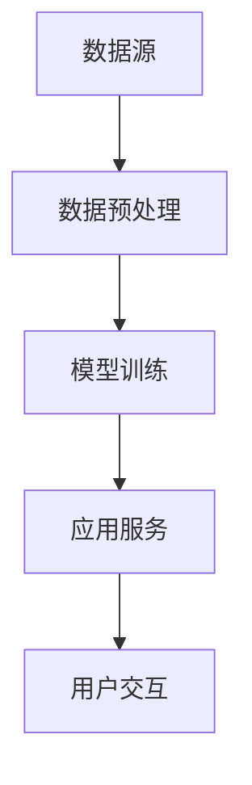
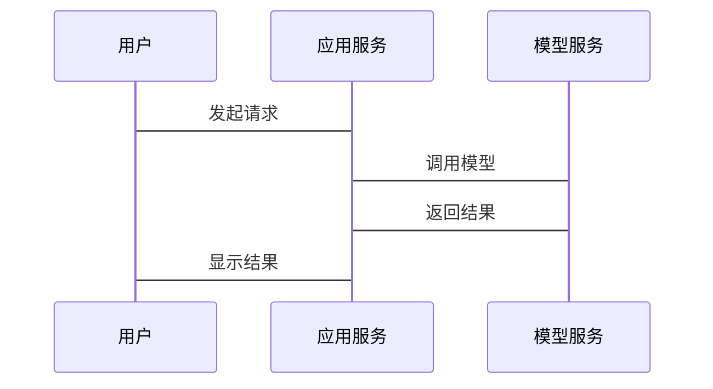

                 

<think>
嗯，用户让我设计一本关于《大语言模型在金融领域的应用》的目录大纲，并且详细描述了结构和内容要求。看起来用户是一位技术专家，可能正在撰写技术博客或者书籍，需要一个详细且逻辑清晰的目录。

首先，我需要分析用户的深层需求。他希望这本书不仅涵盖理论，还要有实际应用，包括项目实战和系统架构设计。这意味着目录需要分阶段，从概述、技术原理到应用场景，再到系统实现和案例分析。

接下来，我得确保每个章节都有足够的细节，比如在技术原理部分，需要数学模型和公式，可能要用Latex表示。系统架构部分要用Mermaid图来展示流程，这样读者可以直观理解。

我还需要考虑读者的背景，可能是技术人员或金融从业者，因此内容需要专业但易于理解。每个章节的标题要吸引人，同时内容要深入，确保读者能系统地掌握知识。

最后，我要确保整个目录结构紧凑，逻辑清晰，符合用户要求的10000到12000字。这样，作者就能按照这个大纲一步步展开内容，写出一篇高质量的技术博客。
</think>

# 大语言模型在金融领域的应用

> 关键词：大语言模型, 金融领域, 人工智能, 投资分析, 风险管理, 系统架构

> 摘要：随着大语言模型技术的快速发展，其在金融领域的应用日益广泛。本文从大语言模型的基本概念出发，深入探讨其在金融投资分析、风险管理、客户服务等领域的应用场景，并结合实际案例分析其系统架构设计与实现过程。通过详细讲解大语言模型的技术原理、系统架构和项目实战，本文旨在为读者提供一个全面、系统地理解大语言模型在金融领域应用的视角。

---

# 第一部分: 大语言模型在金融领域的应用概述

## 第1章: 大语言模型与金融领域的结合

### 1.1 大语言模型的定义与核心概念

#### 1.1.1 大语言模型的定义
大语言模型（Large Language Models, LLMs）是指基于深度学习技术构建的、具有大规模参数的自然语言处理模型。这类模型通常采用Transformer架构，通过大量的训练数据学习语言的规律，能够生成自然流畅的文本或理解文本的含义。

#### 1.1.2 大语言模型的核心特点
- **大规模参数量**：大语言模型通常包含 billions 甚至 trillions 的参数，能够捕捉复杂的语言模式。
- **多任务学习能力**：通过预训练，模型可以适应多种不同的任务，如文本生成、问答系统、情感分析等。
- **上下文理解能力**：模型能够理解文本的上下文关系，生成连贯的对话或分析。

#### 1.1.3 金融领域与大语言模型的结合背景
金融领域涉及大量的文本数据，如财务报告、市场新闻、交易记录等。传统的金融分析方法依赖于人工经验或简单的统计模型，难以应对复杂多变的市场环境。大语言模型的引入为金融领域的数据处理、分析和决策提供了新的可能性。

### 1.2 大语言模型在金融领域的优势

#### 1.2.1 提高金融数据分析效率
大语言模型可以快速处理海量金融文本数据，提取关键信息，生成摘要或报告，显著提高数据分析效率。

#### 1.2.2 优化金融模型构建
通过大语言模型的文本理解和生成能力，可以辅助构建更复杂的金融模型，优化投资策略和风险评估。

#### 1.2.3 改善客户服务体验
大语言模型可以用于智能客服系统，提供个性化的金融咨询服务，提升客户体验。

### 1.3 大语言模型在金融领域的挑战

#### 1.3.1 数据隐私与安全问题
金融数据涉及大量敏感信息，如何在利用大语言模型进行分析的同时保护数据隐私是一个重要挑战。

#### 1.3.2 模型的可解释性
大语言模型的决策过程通常缺乏透明性，这在金融领域尤其重要，因为需要对模型的输出进行严格解释和验证。

#### 1.3.3 技术与业务的融合难度
大语言模型的技术复杂性较高，金融领域的业务逻辑又非常专业，如何将两者有效结合是一个难题。

### 1.4 本章小结
本章介绍了大语言模型的基本概念和核心特点，并探讨了其在金融领域的应用背景和优势。同时，也分析了当前面临的主要挑战。

---

## 第2章: 大语言模型的核心算法原理

### 2.1 大语言模型的训练过程

#### 2.1.1 预训练目标
大语言模型的预训练目标通常包括：
- **语言模型任务**：预测句子中的下一个单词。
- **文本摘要**：将长文本压缩为简洁的摘要。
- **问答系统**：根据上下文回答问题。

#### 2.1.2 微调过程
在金融领域，通常需要对大语言模型进行微调（Fine-tuning），以适应特定的金融任务。微调过程包括：
1. 数据清洗与标注：根据金融场景选择合适的训练数据，并进行标注。
2. 模型参数微调：在特定任务上进一步优化模型参数。

#### 2.1.3 模型的适用性
通过预训练和微调，大语言模型可以在金融领域实现多种任务，如文本分类、情感分析、实体识别等。

### 2.2 大语言模型的数学模型

#### 2.2.1 变量定义
- **输入序列**：$x_1, x_2, ..., x_n$，其中$x_i$表示输入的第i个词的嵌入向量。
- **输出序列**：$y_1, y_2, ..., y_m$，其中$y_j$表示输出的第j个词的嵌入向量。

#### 2.2.2 模型公式
大语言模型的核心是Transformer架构，其编码层和解码层的计算公式如下：

**编码层**：
$$
\text{Attention}(Q, K, V) = \text{softmax}\left(\frac{QK^T}{\sqrt{d_k}}\right)V
$$

其中，$Q$、$K$、$V$分别是查询、键和值矩阵。

**解码层**：
$$
\text{Decoder}(x, y) = \text{Self-attention}(y) + \text{Cross-attention}(x, y)
$$

### 2.3 大语言模型的训练数据与优化策略

#### 2.3.1 数据预处理
- **分词**：将文本数据进行分词处理，生成词典。
- **数据增强**：通过数据增强技术（如同义词替换）增加训练数据的多样性。
- **数据清洗**：去除噪音数据，确保训练数据的质量。

#### 2.3.2 模型优化算法
- **Adam优化器**：常用的大语言模型优化算法，结合动量和自适应学习率。
- **学习率调度器**：通过调整学习率，防止模型过拟合。

#### 2.3.3 超参数调优
- **批次大小**：影响训练效率和模型性能。
- **学习率**：影响模型收敛速度和效果。
- **训练轮数**：影响模型的训练深度。

### 2.4 本章小结
本章详细介绍了大语言模型的核心算法原理，包括训练过程、数学模型和优化策略。

---

## 第3章: 大语言模型在金融领域的应用场景

### 3.1 金融投资分析

#### 3.1.1 金融文本分析
- **财务报告分析**：通过大语言模型分析公司财务报告，提取关键信息，评估公司财务状况。
- **新闻情感分析**：分析市场新闻的情感倾向，预测股票价格走势。

#### 3.1.2 市场趋势预测
- **时间序列分析**：利用大语言模型预测股票价格、汇率等金融指标的走势。
- **市场情绪分析**：结合新闻、社交媒体等多源数据，预测市场情绪变化。

### 3.2 风险管理

#### 3.2.1 风险评估
- **信用风险评估**：通过分析企业财务数据和市场信息，评估企业的信用风险。
- **市场风险评估**：预测市场波动对投资组合的影响。

#### 3.2.2 风险控制
- **风险预警系统**：利用大语言模型实时监控市场动态，识别潜在风险。

### 3.3 客户服务

#### 3.3.1 智能客服
- **自动问答系统**：为客户提供个性化的金融咨询服务。
- **客户情绪分析**：通过分析客户对话，识别客户情绪，提供更贴心的服务。

### 3.4 本章小结
本章介绍了大语言模型在金融领域的多种应用场景，包括投资分析、风险管理和服务优化。

---

## 第4章: 大语言模型的系统架构与实现

### 4.1 系统功能模块划分

#### 4.1.1 数据采集模块
- **数据源**：从财务报告、新闻、社交媒体等多源数据中采集金融数据。
- **数据预处理**：对采集的数据进行清洗、分词和标注。

#### 4.1.2 模型训练模块
- **模型选择**：选择适合金融任务的大语言模型。
- **微调训练**：在特定金融任务上对模型进行微调。

#### 4.1.3 应用服务模块
- **API接口**：提供模型调用接口，供上层应用使用。
- **结果展示**：将模型输出结果以可视化形式呈现给用户。

### 4.2 系统架构图



### 4.3 系统接口设计

#### 4.3.1 API接口定义
- **输入接口**：接收用户输入的金融数据或查询请求。
- **输出接口**：返回模型处理后的结果，如预测值、分析报告等。

#### 4.3.2 接口调用流程
1. 用户发起请求，通过输入接口传入数据。
2. 应用服务模块调用大语言模型进行处理。
3. 处理结果通过输出接口返回给用户。

#### 4.3.3 接口安全设计
- **身份验证**：通过API密钥或令牌验证用户身份。
- **数据加密**：对敏感数据进行加密处理，确保数据安全。

### 4.4 系统交互流程



### 4.5 本章小结
本章详细介绍了大语言模型在金融领域的系统架构设计，包括功能模块划分、接口设计和系统交互流程。

---

## 第5章: 项目实战与案例分析

### 5.1 项目实战

#### 5.1.1 环境安装与配置
- **安装Python**：确保安装了最新版本的Python。
- **安装依赖库**：安装如TensorFlow、PyTorch、Hugging Face等大语言模型相关的库。

#### 5.1.2 系统核心实现源代码

```python
# 示例代码：基于大语言模型的股票价格预测
import transformers
from transformers import AutoModelForCausalLM, AutoTokenizer

# 加载预训练模型
model_name = "gpt2"
model = AutoModelForCausalLM.from_pretrained(model_name)
tokenizer = AutoTokenizer.from_pretrained(model_name)

# 定义输入
input_text = "股票代码：AAPL\n最新股价：150.25\n市场趋势：上涨\n预测未来三天股价："

# 调用模型生成预测结果
inputs = tokenizer.encode(input_text, return_tensors="pt")
outputs = model.generate(inputs, max_length=50, do_sample=True)
predicted_text = tokenizer.decode(outputs[0], skip_special_tokens=True)

print(predicted_text)
```

#### 5.1.3 代码应用解读与分析
上述代码展示了如何使用大语言模型进行股票价格预测。模型基于GPT-2架构，输入包括股票代码、最新股价和市场趋势，输出预测的股价走势。

### 5.2 案例分析

#### 5.2.1 案例背景
某金融机构希望通过大语言模型分析市场新闻，预测股票价格走势。

#### 5.2.2 数据处理
- 采集过去一年的市场新闻和对应股票价格数据。
- 对新闻文本进行情感分析，提取关键词和情感倾向。

#### 5.2.3 模型训练
- 使用预训练的大语言模型，进行微调，训练模型在特定任务上的表现。

#### 5.2.4 模型评估
- 通过回测（Backtesting）验证模型的预测准确性。
- 对比传统方法和大语言模型的预测效果，评估模型的优越性。

### 5.3 本章小结
本章通过实际案例分析，详细讲解了大语言模型在金融领域的项目实战过程，包括环境配置、代码实现和案例分析。

---

## 第6章: 最佳实践与未来展望

### 6.1 最佳实践

#### 6.1.1 数据安全与隐私保护
- **数据加密**：对敏感数据进行加密处理。
- **访问控制**：限制只有授权人员可以访问金融数据。

#### 6.1.2 模型可解释性
- **可视化工具**：通过可视化工具展示模型的决策过程。
- **结果验证**：对模型的输出进行严格验证，确保结果的可解释性。

#### 6.1.3 技术与业务的融合
- **跨团队协作**：技术团队与业务团队紧密合作，确保模型的实际应用效果。
- **持续优化**：根据实际应用反馈，持续优化模型和系统架构。

### 6.2 未来展望
大语言模型在金融领域的应用前景广阔，未来可能会在以下几个方面取得更大的突破：
- **更复杂的投资策略**：通过大语言模型实现更复杂的投资策略。
- **实时数据分析**：提高实时数据分析能力，提升金融交易的效率。
- **多模态分析**：结合图像、音频等多种数据形式，进行多模态分析。

### 6.3 本章小结
本章总结了大语言模型在金融领域应用的最佳实践，并展望了未来的发展方向。

---

## 第7章: 总结与展望

### 7.1 总结
本文从大语言模型的基本概念出发，深入探讨了其在金融领域的应用场景、系统架构和实现过程。通过实际案例分析，展示了大语言模型在金融领域的巨大潜力。

### 7.2 展望
随着大语言模型技术的不断进步，其在金融领域的应用将更加广泛和深入。未来，如何克服数据隐私、模型可解释性等挑战，将是大语言模型在金融领域应用的重要研究方向。

---

## 作者

作者：AI天才研究院/AI Genius Institute & 禅与计算机程序设计艺术 /Zen And The Art of Computer Programming

