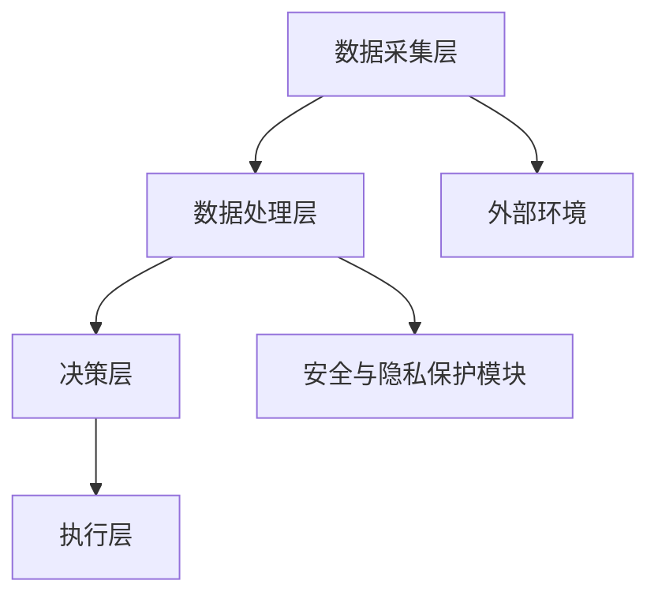
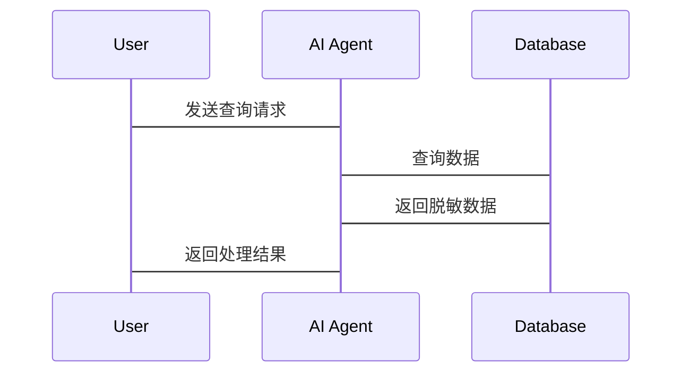

                 


# 安全与隐私保护：构建可信赖的AI Agent

---

## 关键词：  
AI Agent、安全、隐私保护、数据脱敏、差分隐私、同态加密、可信赖系统  

---

## 摘要：  
随着人工智能技术的快速发展，AI Agent（智能体）在各个领域的应用越来越广泛。然而，AI Agent的智能化和自主性也带来了安全与隐私保护的挑战。本文从AI Agent的基本概念出发，分析安全与隐私保护的重要性，探讨隐私保护的核心技术，详细讲解可信赖AI Agent的系统设计，并通过实际案例展示如何在AI Agent中实现安全与隐私保护。文章最后总结了构建可信赖AI Agent的关键点，并展望了未来的研究方向。

---

# 第1章: AI Agent与安全隐私概述

## 1.1 AI Agent的基本概念  
### 1.1.1 AI Agent的定义与特点  
AI Agent是一种能够感知环境、自主决策并执行任务的智能体。它通过传感器获取信息，利用算法进行分析和决策，最终实现预定目标。AI Agent的特点包括自主性、反应性、主动性和社会性。  

### 1.1.2 AI Agent的核心组成与功能  
AI Agent的核心组成包括感知模块、推理模块、决策模块和执行模块。其功能包括数据采集、信息处理、目标设定、决策制定和任务执行。  

### 1.1.3 AI Agent的分类与应用场景  
AI Agent可以根据智能水平分为反应式和认知式；根据应用场景分为服务机器人、自动驾驶和智能助手等。  

## 1.2 安全与隐私保护的重要性  
### 1.2.1 数字化时代的安全威胁  
在数字化时代，AI Agent面临的数据泄露、恶意攻击和隐私滥用等问题日益严重。  

### 1.2.2 隐私保护的法律与伦理要求  
《通用数据保护条例》（GDPR）和《健康保险 portability and accountability act》（HIPAA）等法规要求企业和组织必须保护用户隐私。  

### 1.2.3 AI Agent中的安全与隐私挑战  
AI Agent中的数据通常涉及用户隐私信息，如位置、行为和健康数据。这些数据容易被滥用，导致隐私泄露和安全威胁。  

## 1.3 可信赖AI Agent的核心要素  
### 1.3.1 可信赖AI的定义与标准  
可信赖AI是指在设计、开发和使用过程中，能够满足用户信任、符合伦理和法律要求的AI系统。  

### 1.3.2 安全性、隐私性与可信赖性之间的关系  
安全性是AI Agent的基本要求，隐私性是可信赖性的重要组成部分，三者相辅相成，共同构建可信赖的AI系统。  

### 1.3.3 构建可信赖AI Agent的关键技术  
构建可信赖AI Agent需要从数据采集、存储、处理和传输等环节进行全面的安全与隐私保护设计。  

## 1.4 本章小结  
本章介绍了AI Agent的基本概念、安全与隐私保护的重要性，以及构建可信赖AI Agent的核心要素。

---

# 第2章: AI Agent中的安全与隐私威胁

## 2.1 常见的安全威胁类型  
### 2.1.1 数据泄露  
数据泄露是AI Agent面临的主要威胁之一，可能导致用户隐私信息被滥用。  

### 2.1.2 恶意攻击  
恶意攻击者可能通过漏洞入侵AI Agent，窃取数据或破坏系统。  

### 2.1.3 隐私滥用  
部分企业或组织可能将用户隐私数据用于未经授权的目的，违反隐私保护原则。  

## 2.2 安全威胁的来源与影响  
### 2.2.1 内部威胁  
内部员工可能因疏忽或恶意行为导致数据泄露。  

### 2.2.2 外部威胁  
外部攻击者可能通过网络攻击、钓鱼邮件等方式入侵AI Agent系统。  

### 2.2.3 数据泄露对AI Agent的影响  
数据泄露可能导致用户信任度下降，甚至引发法律诉讼和财务损失。  

## 2.3 安全威胁的评估与应对策略  
### 2.3.1 安全威胁评估方法  
通过风险评估矩阵（RAM）等方法，评估安全威胁的严重性和发生概率。  

### 2.3.2 安全威胁应对的多层次策略  
从技术、管理和法律等多层次制定应对策略，包括数据加密、访问控制和安全审计等。  

### 2.3.3 安全威胁的动态变化与应对措施  
安全威胁是动态变化的，AI Agent需要通过持续监测和更新安全策略来应对新威胁。  

## 2.4 本章小结  
本章分析了AI Agent面临的安全与隐私威胁，并提出了应对策略。

---

# 第3章: 隐私保护的核心技术

## 3.1 数据脱敏技术  
### 3.1.1 数据脱敏的定义与实现方法  
数据脱敏是指对敏感数据进行处理，使其在失去原始数据含义的同时保持数据的可用性。  

### 3.1.2 数据脱敏的关键技术与挑战  
常用的数据脱敏技术包括替换、泛化和扰乱等。挑战在于如何在脱敏后保持数据的可用性和真实性。  

### 3.1.3 数据脱敏在AI Agent中的应用  
数据脱敏技术广泛应用于数据采集和存储环节，确保敏感数据的安全性。  

## 3.2 差分隐私技术  
### 3.2.1 差分隐私的定义与原理  
差分隐私是一种通过在数据中加入随机噪声来保护隐私的技术，确保单个数据的贡献无法被识别。  

### 3.2.2 差分隐私的实现方法与优缺点  
差分隐私的实现方法包括拉普拉斯机制和指数机制等。优点是隐私保护能力强，缺点是可能增加数据处理的复杂性。  

### 3.2.3 差分隐私在AI Agent中的应用案例  
例如，在医疗AI Agent中，差分隐私技术可用于保护患者隐私数据。  

## 3.3 同态加密技术  
### 3.3.1 同态加密的定义与原理  
同态加密是一种允许在加密数据上进行计算的技术，结果解密后与原始数据计算结果一致。  

### 3.3.2 同态加密的实现方法与应用场景  
同态加密适用于需要在云端进行数据处理的场景，如金融和医疗领域。  

### 3.3.3 同态加密在AI Agent中的应用优势  
同态加密可以在不泄露原始数据的情况下，支持AI Agent的模型训练和推理。  

## 3.4 本章小结  
本章介绍了数据脱敏、差分隐私和同态加密等隐私保护技术，并分析了它们在AI Agent中的应用。

---

# 第4章: 可信赖AI Agent的系统设计

## 4.1 系统架构设计  
### 4.1.1 可信赖AI Agent的系统组成  
可信赖AI Agent的系统通常包括数据采集层、数据处理层、决策层和执行层。  

### 4.1.2 安全与隐私保护的分层架构  
通过分层架构设计，确保每一层都有相应的安全与隐私保护措施。  

### 4.1.3 系统架构设计的优缺点分析  
分层架构的优点是易于管理和扩展，缺点是可能导致系统复杂性增加。  

## 4.2 系统功能设计  
### 4.2.1 数据采集与处理模块  
数据采集模块通过传感器获取数据，数据处理模块对数据进行清洗和预处理。  

### 4.2.2 安全与隐私保护模块  
通过加密、脱敏和隐私保护算法，确保数据在处理和传输过程中的安全性。  

### 4.2.3 决策与执行模块  
决策模块基于处理后的数据制定决策，执行模块将决策转化为具体行动。  

## 4.3 系统架构图  
以下是一个可信赖AI Agent的系统架构图：



## 4.4 本章小结  
本章详细讲解了可信赖AI Agent的系统设计，包括架构设计和功能设计。

---

# 第5章: 安全与隐私保护的法律与伦理

## 5.1 安全与隐私保护的法律框架  
### 5.1.1 GDPR与隐私保护  
GDPR要求企业明确数据处理的目的和合法性，确保数据主体的知情权和同意权。  

### 5.1.2 其他相关法律与标准  
除了GDPR，各国还有其他隐私保护法规和标准，如《加州消费者隐私法》（CCPA）。  

## 5.2 隐私权与数据主权的冲突与协调  
### 5.2.1 隐私权的定义与保护  
隐私权是指个人对自身信息的控制权，是可信赖AI Agent设计中的核心要素。  

### 5.2.2 数据主权与跨境数据传输  
数据主权要求数据应存储在本国境内，这与AI Agent的全球化应用可能存在冲突。  

## 5.3 构建可信赖AI Agent的伦理与责任  
### 5.3.1 隐私保护的伦理要求  
AI Agent的设计和使用必须遵循伦理原则，确保用户隐私不受侵犯。  

### 5.3.2 可信赖AI Agent的责任归属  
AI Agent的决策可能导致后果，责任归属需要明确界定。  

### 5.3.3 透明性与用户知情权  
可信赖AI Agent应提供透明的信息披露机制，确保用户知情和控制其数据。  

## 5.4 本章小结  
本章探讨了安全与隐私保护的法律与伦理问题，分析了隐私权与数据主权的冲突，并提出了构建可信赖AI Agent的伦理与责任框架。

---

# 第6章: 项目实战——构建可信赖AI Agent

## 6.1 项目背景与目标  
### 6.1.1 项目背景  
本项目旨在开发一个具备安全与隐私保护功能的智能助手AI Agent。  

### 6.1.2 项目目标  
通过数据脱敏、差分隐私和同态加密等技术，确保AI Agent的安全与隐私保护能力。  

## 6.2 项目环境与工具  
### 6.2.1 开发环境  
Python 3.8、Jupyter Notebook、PostgreSQL数据库。  

### 6.2.2 开发工具  
TensorFlow、PyTorch、Scikit-learn、Pandas等。  

## 6.3 系统核心实现  
### 6.3.1 数据脱敏实现  
代码示例：  
```python
def data_masking(data, mask_rate=0.5):
    masked_data = data.copy()
    masked_data[data < mask_rate] = 0
    return masked_data
```

### 6.3.2 差分隐私实现  
代码示例：  
```python
import numpy as np

def laplace_mechanism(data, sensitivity, epsilon):
    noise = np.random.laplace(0, sensitivity / epsilon, len(data))
    return data + noise
```

### 6.3.3 同态加密实现  
代码示例：  
```python
from cryptography.hazmat.primitives import serialization, hashes
from cryptography.hazmat.primitives.asymmetric import padding, rsa

def generate_keypair():
    key = rsa.generate_private_key(
        public_exponent=65537,
        key_size=2048
    )
    private_key = key.private_bytes(serialization.Encoding.PEM, serialization.PrivateFormat.TraditionalOpenSSL, encryption_algorithm=serialization.NoEncryption())
    public_key = key.public_key().public_bytes(serialization.Encoding.PEM, serialization.PublicFormat.SubjectPublicKeyInfo)
    return private_key, public_key
```

## 6.4 系统交互图  
以下是一个AI Agent的系统交互图：



## 6.5 项目总结  
通过本项目，我们成功实现了具备安全与隐私保护功能的AI Agent，验证了数据脱敏、差分隐私和同态加密等技术的有效性。

---

# 第7章: 总结与展望

## 7.1 总结  
本文从AI Agent的基本概念出发，分析了安全与隐私保护的重要性，详细讲解了隐私保护的核心技术，提出了构建可信赖AI Agent的系统设计，并通过项目实战展示了技术实现。  

## 7.2 展望  
未来的研究方向包括更高效的数据脱敏算法、更强大的差分隐私技术，以及更安全的同态加密算法。此外，还需要进一步研究AI Agent的伦理与法律问题，确保其可持续发展。

---

## 最佳实践 Tips  
- 在设计AI Agent时，始终将安全与隐私保护放在首位。  
- 使用数据脱敏、差分隐私和同态加密等技术保护用户隐私。  
- 定期进行安全审计和漏洞扫描，确保系统安全。  

---

## 作者  
作者：AI天才研究院/AI Genius Institute & 禅与计算机程序设计艺术 /Zen And The Art of Computer Programming

