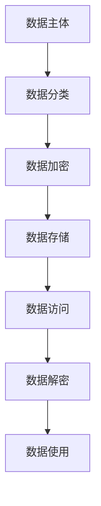

                 

<think>
嗯，用户让我设计一本关于《安全性与数据隐私》的目录大纲，并且已经提供了一个详细的大纲。看起来用户需要我以这个大纲为基础，撰写一篇技术博客文章。首先，我需要明确文章的结构和每个部分的具体内容，确保覆盖所有要求的部分，比如背景介绍、核心概念、算法原理、系统设计、项目实战等。

接下来，我需要考虑每个部分的详细内容，确保每个章节都有足够的深度和详细性。比如，在背景介绍部分，我需要涵盖数据隐私的重要性、现状以及挑战。核心概念部分需要详细讲解数据隐私和安全的基本原理，可能包括数据分类、加密技术、访问控制等。

在算法原理部分，我需要详细解释各种加密算法，如AES和RSA，同时展示它们的数学模型和流程图。系统设计部分需要介绍如何在实际系统中实现数据隐私保护，包括系统架构图和交互图。项目实战部分，我需要选择一个具体的案例，展示如何开发一个数据加密系统，包括环境安装、核心代码实现和案例分析。

我还需要注意格式要求，使用markdown格式，并在适当的地方插入Mermaid图表和LaTeX公式。文章末尾需要添加作者信息，确保整篇文章结构清晰，内容详实。

现在，我需要将这些思考转化为具体的目录结构，并根据每个部分撰写详细的内容。确保文章字数在10000到12000字之间，每个小节内容丰富，详细讲解每个主题，同时使用图表和公式增强可读性。
</think>

# 安全性与数据隐私

> 关键词：数据隐私，安全性，加密算法，隐私保护，系统架构

> 摘要：本文系统地探讨了数据隐私与安全的核心概念、算法原理、系统架构设计以及实际项目中的应用。通过详细分析数据隐私的重要性、基本原理、加密算法的数学模型以及系统架构设计，结合实际案例，展示了如何在现实场景中实现数据隐私保护。

---

# 第一部分: 数据安全与隐私保护背景介绍

## 第1章: 数据隐私与安全的重要性

### 1.1 数据隐私的背景与现状

#### 1.1.1 数据隐私的重要性
在当今数字化时代，数据已成为最重要的资产之一。个人隐私、企业机密、国家安全都与数据密切相关。数据隐私保护的重要性日益凸显，尤其是在大数据、人工智能快速发展的背景下，如何保护数据隐私成为全球关注的焦点。

#### 1.1.2 当前数据隐私面临的挑战
随着信息技术的飞速发展，数据的收集、存储和处理变得越来越便捷，但也带来了诸多数据隐私问题。数据泄露事件频发，用户信息被滥用，甚至涉及国家安全的事件时有发生。这些挑战促使我们更加重视数据隐私保护。

#### 1.1.3 数据隐私的解决方法与边界
数据隐私保护需要从技术、法律、管理等多个方面入手。技术手段包括加密、匿名化处理等；法律手段包括制定严格的隐私保护法规；管理手段包括建立完善的隐私保护制度。数据隐私保护的边界在于在保护隐私的同时，不影响数据的合理利用和共享。

### 1.2 数据隐私的核心概念

#### 1.2.1 数据隐私的定义与特征
数据隐私指的是对个人或组织的敏感数据进行保护，防止未经授权的访问、泄露或滥用。其核心特征包括：
1. **合法性**：数据的收集、处理和使用必须符合相关法律法规。
2. **完整性**：确保数据的完整性和准确性，防止数据被篡改。
3. **机密性**：保护数据不被未经授权的人员访问。
4. **可用性**：在合法授权的情况下，确保数据可以被及时访问和使用。

#### 1.2.2 数据隐私与数据安全的关系
数据隐私与数据安全密切相关，但又不完全相同。数据安全侧重于保护数据的完整性、机密性和可用性，而数据隐私更关注如何在保护数据的同时，确保数据的合理使用和共享。数据隐私是数据安全的重要组成部分，而数据安全则是实现数据隐私的手段。

#### 1.2.3 数据隐私的核心要素组成
数据隐私的核心要素包括：
1. **数据主体**：数据的拥有者或授权使用方。
2. **数据分类**：根据敏感程度对数据进行分类管理。
3. **访问控制**：基于身份认证和权限管理，控制数据的访问范围。
4. **加密技术**：通过加密算法保护数据的机密性。

---

## 第2章: 数据隐私与安全的基本原理

### 2.1 数据隐私的核心概念与联系

#### 2.1.1 数据隐私的属性特征对比
以下表格对比了数据隐私和数据安全的核心属性：

| 属性 | 数据隐私 | 数据安全 |
|------|----------|----------|
| 核心目标 | 防止未经授权的数据访问和泄露 | 保护数据的完整性、机密性和可用性 |
| 实现手段 | 加密技术、匿名化、访问控制 | 网络防火墙、入侵检测系统、加密技术 |
| 关注点 | 数据的合法使用和共享 | 数据的保护和防篡改 |

#### 2.1.2 数据隐私的ER实体关系图
以下是一个简单的数据隐私实体关系图：

```mermaid
er
    entity 数据主体 {
        id: 整数
        name: 字符串
    }
    entity 数据 {
        id: 整数
        value: 字符串
        类别: 字符串
    }
    entity 权限 {
        id: 整数
        类型: 字符串
        级别: 整数
    }
    数据主体 -> 数据: 拥有
    数据主体 -> 权限: 拥有
    数据 -> 数据主体: 属于
```

---

## 第3章: 数据隐私与安全的算法实现

### 3.1 数据加密算法的数学模型

#### 3.1.1 AES加密算法的数学模型
AES（高级加密标准）是一种常用的对称加密算法，其加密和解密过程可以通过以下数学模型表示：

$$ E(K, P) = C $$
$$ D(K, C) = P $$

其中，$K$ 是加密密钥，$P$ 是明文，$C$ 是密文。

#### 3.1.2 RSA加密算法的数学模型
RSA是一种公钥加密算法，其加密和解密过程涉及大整数的分解和模运算：

加密过程：
$$ C = P^k \mod n $$

解密过程：
$$ P = C^d \mod n $$

其中，$k$ 是公钥，$d$ 是私钥，$n$ 是模数。

### 3.2 隐私保护算法的数学模型

#### 3.2.1 同态加密算法
同态加密允许在加密数据的情况下进行计算，结果仍保持加密状态。其基本数学模型如下：

$$ E(x + y) = E(x) + E(y) $$
$$ E(x \times y) = E(x) \times E(y) $$

---

## 第4章: 数据隐私与安全的系统架构设计

### 4.1 系统功能设计

#### 4.1.1 数据分类与分级
数据分类是数据隐私保护的基础，通常根据数据的敏感程度进行分类。例如：

- **低敏感数据**：如公开信息。
- **中敏感数据**：如用户基本信息。
- **高敏感数据**：如用户身份信息、财务数据。

#### 4.1.2 数据访问控制
通过权限管理，确保只有授权用户才能访问特定数据。常见的权限管理模型包括：

1. **基于角色的访问控制（RBAC）**：根据用户角色分配权限。
2. **基于属性的访问控制（ABAC）**：根据用户属性（如位置、时间）动态分配权限。

### 4.2 系统架构设计

#### 4.2.1 系统架构图
以下是一个简单的数据隐私保护系统架构图：



---

## 第5章: 数据隐私与安全的项目实战

### 5.1 项目背景与需求分析

#### 5.1.1 项目背景
假设我们正在开发一个用户隐私数据保护系统，需要对用户的敏感信息（如身份证号、手机号）进行加密存储和处理。

### 5.2 系统核心实现

#### 5.2.1 环境安装与配置
需要安装以下工具和库：
- Python 3.8+
- 加密库：`cryptography`
- 权限管理库：`flask-security`

#### 5.2.2 核心代码实现

##### 数据加密模块
```python
from cryptography.fernet import Fernet

# 生成密钥
key = Fernet.generate_key()
cipher = Fernet(key)

# 加密数据
def encrypt_data(data):
    encrypted_data = cipher.encrypt(data.encode())
    return encrypted_data

# 解密数据
def decrypt_data(encrypted_data):
    decrypted_data = cipher.decrypt(encrypted_data).decode()
    return decrypted_data
```

##### 权限管理模块
```python
from flask_security import RoleMixin, UserMixin

# 用户角色模型
class Role(db.Model, RoleMixin):
    id = db.Column(db.Integer, primary_key=True, nullable=False)
    name = db.Column(db.String(80), unique=True)
    description = db.Column(db.Text())

# 用户模型
class User(db.Model, UserMixin):
    id = db.Column(db.Integer, primary_key=True, nullable=False)
    email = db.Column(db.String(255), unique=True)
    password = db.Column(db.String(255))
    active = db.Column(db.Boolean())
    roles = db.relationship('Role', secondary='user_roles', backref=db.backref('users', lazy='dynamic'))
```

### 5.3 项目小结与优化建议

#### 5.3.1 项目小结
通过本项目，我们实现了一个基本的数据隐私保护系统，包括数据加密和权限管理功能。系统能够对敏感数据进行加密存储，并通过角色权限管理确保只有授权用户才能访问数据。

#### 5.3.2 优化建议
1. **增强加密算法**：采用更强大的加密算法，如AES-256。
2. **实现数据匿名化**：对数据进行匿名化处理，如模糊化处理。
3. **日志监控**：添加数据访问日志，便于审计和追踪。

---

## 第6章: 数据隐私与安全的最佳实践

### 6.1 数据隐私保护的注意事项

#### 6.1.1 加密算法的选择
选择合适的加密算法是数据隐私保护的关键。对于高敏感数据，建议使用强加密算法（如AES-256）。

#### 6.1.2 权限管理的实施
确保权限管理的严格性，避免权限滥用。定期审查和更新权限策略。

### 6.2 数据隐私保护的法律与合规

#### 6.2.1 GDPR合规
欧盟的《通用数据保护条例》（GDPR）要求企业必须采取措施保护用户隐私，确保数据处理的合法性。

#### 6.2.2 其他法律要求
不同国家和地区有不同的数据隐私保护法规，企业需要根据具体情况遵守相关法律法规。

### 6.3 数据隐私保护的技术趋势

#### 6.3.1 隐私计算技术
隐私计算技术（如同态加密、安全多方计算）在数据隐私保护中具有重要应用前景。

#### 6.3.2 区块链技术
区块链的不可篡改性和透明性为数据隐私保护提供了新的思路。

---

## 第7章: 总结与展望

### 7.1 本文总结

通过本文的探讨，我们系统地分析了数据隐私与安全的核心概念、算法原理、系统架构设计以及实际项目中的应用。数据隐私保护是当前信息技术发展中的重要课题，需要从技术、法律、管理等多个方面综合施策。

### 7.2 对未来研究的展望

未来，数据隐私保护将面临更多挑战和机遇。随着人工智能和大数据技术的进一步发展，如何在保护隐私的前提下，充分利用数据价值，将是数据隐私保护领域的重要研究方向。

---

## 作者

作者：AI天才研究院/AI Genius Institute & 禅与计算机程序设计艺术 /Zen And The Art of Computer Programming

