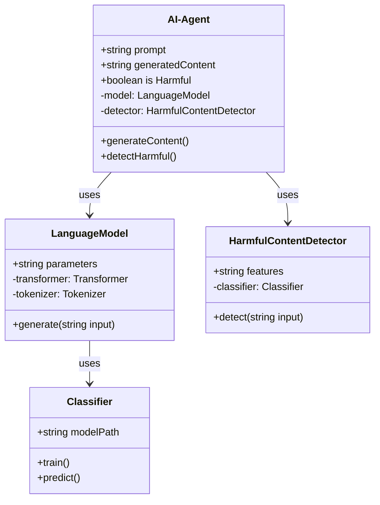
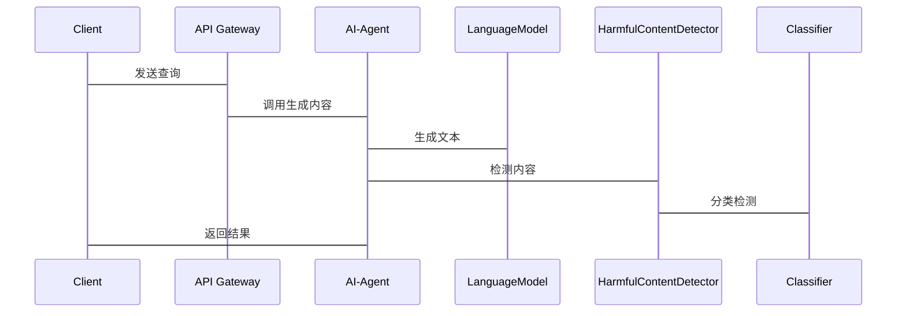

                 


# 安全性考虑：防止AI Agent产生有害内容

---

## 关键词

AI Agent，有害内容，安全性，内容检测，生成式AI，风险管理

---

## 摘要

随着生成式AI技术的快速发展，AI Agent在内容生成中的应用越来越广泛。然而，这种技术也可能被滥用，导致生成有害内容，如仇恨言论、虚假信息等。本文将从AI Agent的基本概念出发，详细分析其生成有害内容的机制，探讨如何通过算法和系统设计来检测和防止有害内容的产生。通过实际案例和项目实战，本文将为读者提供一套完整的解决方案，确保AI Agent的安全使用。

---

## 第1章：AI Agent与有害内容的背景

### 1.1 AI Agent的基本概念

#### 1.1.1 AI Agent的定义与核心要素

AI Agent（人工智能代理）是指能够感知环境并采取行动以实现目标的智能实体。它通常具备以下核心要素：

- **感知能力**：通过传感器或数据输入获取环境信息。
- **决策能力**：基于感知信息进行分析和决策。
- **行动能力**：通过执行器或输出模块采取行动。
- **学习能力**：通过机器学习算法不断优化自身行为。

#### 1.1.2 AI Agent的分类与应用场景

AI Agent可以根据功能和智能水平分为多种类型：

- **简单反应式AI Agent**：基于当前感知做出反应，不具备记忆或规划能力。
- **基于模型的AI Agent**：具备内部状态和模型，能够进行规划和推理。
- **学习型AI Agent**：通过机器学习算法不断优化性能。

应用场景包括自动驾驶、智能助手、内容生成等。

#### 1.1.3 AI Agent在内容生成中的作用

AI Agent可以通过自然语言处理技术生成文本内容，例如撰写文章、回答问题、创作诗歌等。其核心优势在于高效性和智能化，但同时也带来了生成有害内容的风险。

---

### 1.2 有害内容的定义与分类

#### 1.2.1 有害内容的定义

有害内容是指那些可能对个人或社会造成负面影响的信息，包括：

- **仇恨言论**：基于种族、性别、宗教等的歧视性言论。
- **虚假信息**：虚假新闻、谣言等。
- **暴力内容**：鼓励暴力行为的内容。
- **色情内容**：未成年人不宜接触的内容。

#### 1.2.2 有害内容的分类

| 类别         | 描述                     |
|--------------|--------------------------|
| 仇恨言论     | 基于偏见的攻击性言论     |
| 虚假信息     | 虚假新闻、谣言           |
| 暴力内容     | 鼓励暴力或自残的内容     |
| 色情内容     | 违反伦理或法律的内容     |

#### 1.2.3 有害内容的传播机制

有害内容通常通过社交媒体、论坛等平台传播，利用算法推荐机制快速扩散，对社会造成恶劣影响。

---

### 1.3 AI Agent生成有害内容的背景与问题

#### 1.3.1 AI Agent生成有害内容的现象

随着生成式AI技术的进步，AI Agent能够生成越来越复杂的文本内容，但同时也增加了生成有害内容的风险。

#### 1.3.2 有害内容对社会的影响

有害内容可能导致社会分裂、恐慌、个人名誉损失等问题，甚至引发暴力事件。

#### 1.3.3 AI Agent生成有害内容的原因与挑战

- **技术原因**：AI模型可能学习到偏见或有害信息。
- **滥用原因**：恶意用户可能利用AI生成有害内容。
- **监管挑战**：难以实时检测和阻止有害内容的生成。

---

## 第2章：AI Agent生成内容的核心机制

### 2.1 AI Agent的内容生成模型

#### 2.1.1 生成式AI的基本原理

生成式AI（Generative AI）通过深度学习模型生成新的内容。常用模型包括：

- **循环神经网络（RNN）**：用于序列生成。
- **Transformer模型**：基于注意力机制，广泛应用于自然语言处理。

#### 2.1.2 大语言模型（如GPT系列）的工作机制

GPT模型通过训练大量文本数据，学习语言的统计规律，生成连贯的文本内容。其核心在于预测下一个词的概率分布。

#### 2.1.3 内容生成的数学模型与公式

生成式AI的输出概率可以通过以下公式表示：

$$ P(y|x) = \text{模型预测的概率分布} $$

其中，\( x \) 是输入，\( y \) 是输出。

---

### 2.2 有害内容的识别与检测

#### 2.2.1 有害内容的特征分析

有害内容通常具备以下特征：

- **语义特征**：包含攻击性、歧视性词汇。
- **语境特征**：上下文可能涉及敏感话题。
- **语法特征**：语言表达可能异常或不连贯。

#### 2.2.2 基于语义理解的有害内容检测

语义理解技术（如BERT）可以分析文本的语义意图，识别有害内容。

#### 2.2.3 有害内容检测的算法原理

有害内容检测算法通常基于以下步骤：

1. **特征提取**：提取文本的语义、语法等特征。
2. **分类模型训练**：使用有监督学习算法（如SVM、神经网络）训练分类器。
3. **内容检测**：将输入文本输入分类器，判断是否为有害内容。

---

### 2.3 AI Agent与有害内容的关系

#### 2.3.1 AI Agent生成有害内容的路径

AI Agent可能通过以下路径生成有害内容：

1. **模型训练阶段**：训练数据中包含有害内容。
2. **生成阶段**：用户输入偏见或有害提示。

#### 2.3.2 有害内容对AI Agent的影响

有害内容可能影响模型的中立性，导致生成的内容带有偏见或毒性。

#### 2.3.3 AI Agent生成有害内容的边界与外延

AI Agent生成有害内容的边界在于模型的设计和用户输入的控制。外延则涉及技术、伦理和法律等多个方面。

---

## 第3章：有害内容检测的算法原理

### 3.1 基于概率的有害内容检测

#### 3.1.1 概率模型的基本原理

基于概率的检测方法通过计算文本属于有害内容的概率，进行分类。

$$ P(\text{有害}|x) = \frac{P(x|\text{有害})P(\text{有害})}{P(x)} $$

其中，\( P(x|\text{有害}) \) 是在有害内容下生成文本\( x \)的概率，\( P(\text{有害}) \) 是有害内容的先验概率。

#### 3.1.2 基于语言模型的有害内容检测

语言模型可以计算文本的困惑度（Perplexity），困惑度较低的文本更可能属于有害内容。

---

## 第4章：系统分析与架构设计

### 4.1 问题场景介绍

设计一个检测有害内容的系统，需要考虑以下问题：

- 如何实时检测有害内容？
- 如何保证检测的准确性？
- 如何处理大量数据？

### 4.2 项目介绍

本项目旨在开发一个AI Agent，能够实时检测并阻止生成有害内容。

### 4.3 系统功能设计

#### 4.3.1 功能模块

- **内容生成模块**：生成文本内容。
- **有害内容检测模块**：检测生成内容是否为有害内容。
- **反馈模块**：提供检测结果和改进建议。

#### 4.3.2 领域模型（Mermaid 类图）



### 4.4 系统架构设计（Mermaid 架构图）


### 4.5 系统接口设计

- **输入接口**：接收用户的查询或提示。
- **输出接口**：返回生成内容或检测结果。

### 4.6 系统交互（Mermaid 序列图）



---

## 第5章：项目实战

### 5.1 环境安装

需要安装以下工具和库：

- Python 3.8+
- TensorFlow或Keras
- Hugging Face库
- Scikit-learn

### 5.2 核心实现源代码

#### 5.2.1 数据预处理

```python
import pandas as pd
from sklearn.model_selection import train_test_split

# 加载数据集
data = pd.read_csv('有害内容数据.csv')
X_train, X_test, y_train, y_test = train_test_split(data['text'], data['label'])
```

#### 5.2.2 模型训练

```python
from sklearn.naive_bayes import MultinomialNB
from sklearn.feature_extraction.text import TfidfVectorizer

# 特征提取
vectorizer = TfidfVectorizer()
X_train_vec = vectorizer.fit_transform(X_train)
X_test_vec = vectorizer.transform(X_test)

# 训练模型
model = MultinomialNB()
model.fit(X_train_vec, y_train)
```

#### 5.2.3 模型评估

```python
from sklearn.metrics import accuracy_score

# 预测
y_pred = model.predict(X_test_vec)
print(f'准确率: {accuracy_score(y_test, y_pred)}')
```

---

## 第6章：总结与最佳实践

### 6.1 总结

本文详细探讨了AI Agent生成有害内容的机制，并提出了基于概率和语义理解的检测方法。通过系统设计和项目实战，展示了如何构建一个高效的有害内容检测系统。

### 6.2 最佳实践 tips

- **模型选择**：选择适合任务的模型，并进行充分的训练。
- **数据处理**：确保数据多样性和代表性。
- **实时检测**：部署实时检测机制，及时阻止有害内容的传播。
- **用户教育**：教育用户正确使用AI Agent，避免滥用。

### 6.3 注意事项

- 定期更新模型，以应对新的有害内容形式。
- 注意模型的泛化能力，避免过拟合特定有害内容。
- 遵守相关法律法规，确保内容检测的合法性。

### 6.4 拓展阅读

- 《AI风险管理：伦理与安全》
- 《深度学习中的内容生成与检测》
- 《自然语言处理中的有害内容检测》

---

## 作者

作者：AI天才研究院/AI Genius Institute & 禅与计算机程序设计艺术 /Zen And The Art of Computer Programming

--- 

本文通过详细分析AI Agent生成有害内容的机制，结合算法原理和系统设计，为防止有害内容的产生提供了切实可行的解决方案。希望本文能为相关领域的研究和实践提供有价值的参考。

