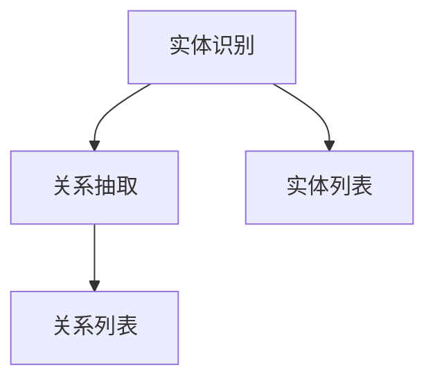
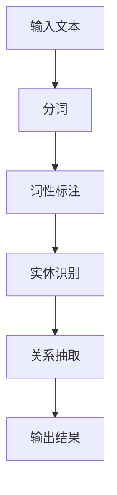

                 

# 实体识别与关系抽取：增强AI Agent的理解深度

## 关键词：实体识别，关系抽取，自然语言处理，深度学习，AI Agent

## 摘要：实体识别与关系抽取是自然语言处理中的两大核心技术，能够显著增强AI Agent对文本的理解深度。本文将系统性地阐述实体识别与关系抽取的核心概念、算法原理、系统架构及项目实战，通过丰富的案例分析和详细的代码实现，帮助读者深入理解并掌握这两项技术。最后，本文将总结最佳实践和未来研究方向，为AI Agent的开发提供理论支持与实践指导。

---

# 第1章: 实体识别与关系抽取概述

## 1.1 实体识别与关系抽取的背景

### 1.1.1 问题背景与问题描述

在自然语言处理（NLP）领域，文本的理解深度是衡量AI Agent智能水平的重要指标。实体识别（NER, Named Entity Recognition）与关系抽取（RE, Relation Extraction）是两项核心任务，旨在从文本中提取出具有语义价值的信息。实体识别关注于识别文本中的命名实体，如人名、地名、组织名等；关系抽取则关注于发现实体之间的关系，如“X是Y的CEO”中的“是”关系。

随着AI Agent在智能客服、智能助手、自动驾驶等领域的广泛应用，实体识别与关系抽取的重要性日益凸显。然而，这两项任务也面临着诸多挑战，如命名实体的多样性、关系类型的复杂性、文本的语境依赖性等。

### 1.1.2 实体识别与关系抽取的目标

实体识别的目标是将文本中的命名实体准确地识别并分类；关系抽取的目标则是发现实体之间的语义关系，并建立实体间的知识图谱。这两项任务的结合能够显著提升AI Agent对文本的理解能力，使其能够更准确地执行任务，如信息检索、问答系统、对话生成等。

### 1.1.3 实体识别与关系抽取的边界与外延

实体识别的边界在于识别文本中的命名实体，但不涉及实体的属性或上下文信息；关系抽取的边界在于发现实体间的语义关系，但不涉及关系的推理或扩展。实体识别与关系抽取的外延则包括基于规则的方法、统计方法和深度学习方法的结合，以及在多语言、多领域中的应用。

### 1.1.4 实体识别与关系抽取的概念结构

图1展示了实体识别与关系抽取的概念结构：

---

## 1.2 实体识别与关系抽取的核心要素

### 1.2.1 实体识别的定义与特点

实体识别（NER）是指从文本中识别出命名实体并进行分类的过程。常见的命名实体类型包括：

- 人名（PER）
- 地名（LOC）
- 组织名（ORG）
- 时间（TIME）
- 数量（NUMBER）

实体识别的特点包括：

- 细粒度：能够识别实体的起始和结束位置。
- 多样性：支持多种语言和领域。
- 高精度：结合上下文信息提高识别准确率。

### 1.2.2 关系抽取的定义与特点

关系抽取（RE）是指从文本中抽取实体间的关系并进行分类的过程。常见的关系类型包括：

- 属于（is-a）
- 组成（part-of）
- 位置（located-in）
- 时间（happened-before）

关系抽取的特点包括：

- 关联性：能够发现实体间的语义联系。
- 复杂性：涉及多步推理和上下文分析。
- 可扩展性：支持动态添加新的关系类型。

### 1.2.3 实体识别与关系抽取的关系

实体识别是关系抽取的基础，因为关系抽取需要基于实体识别的结果。没有准确的实体识别，关系抽取将无法正确识别实体间的关联。两者的关系可以用图2表示：

---

## 1.3 实体识别与关系抽取的核心要素

### 1.3.1 实体识别的核心要素

- **实体类型**：定义命名实体的类别。
- **实体边界**：识别实体的起始和结束位置。
- **上下文信息**：利用上下文信息提高识别准确率。

### 1.3.2 关系抽取的核心要素

- **关系类型**：定义实体间的关系类别。
- **实体对**：识别关系中的两个实体。
- **关系强度**：量化关系的强度或置信度。

### 1.3.3 实体识别与关系抽取的流程

实体识别与关系抽取的流程可以用图3表示：

---

## 1.4 本章小结

本章主要介绍了实体识别与关系抽取的背景、目标、核心概念及核心要素。实体识别与关系抽取是自然语言处理中的两大核心技术，能够显著提升AI Agent对文本的理解深度。接下来，我们将深入探讨实体识别与关系抽取的核心概念与联系。

---

（由于篇幅限制，后续章节将逐步展开，涵盖算法原理、系统架构、项目实战等内容。）

