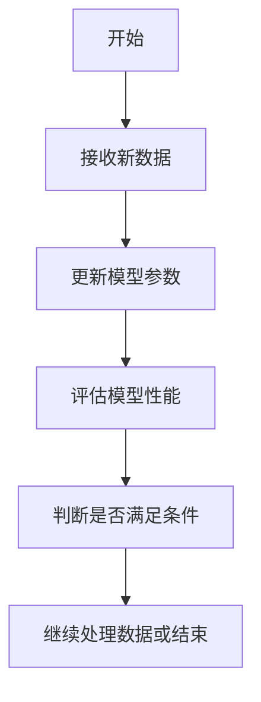

                 


# 实时学习AI Agent：LLM的在线增量学习

**关键词：** 实时学习AI Agent，在线增量学习，大语言模型（LLM），机器学习，AI代理，增量算法

**摘要：** 本文深入探讨实时学习AI Agent的核心概念、算法原理和系统架构，结合实际案例，详细阐述大语言模型（LLM）的在线增量学习技术。通过对比分析、系统设计和项目实战，帮助读者掌握实时学习AI Agent的构建方法，理解其在企业级应用中的重要性。

---

## 正文

### 第一部分：实时学习AI Agent的背景与基础

#### 第1章：实时学习AI Agent的背景与问题背景

##### 1.1 实时学习AI Agent的背景

- **从传统AI到实时学习AI的演进**
  传统AI依赖于预训练模型，在线增量学习的需求推动AI向实时学习方向发展。
  
- **大语言模型（LLM）的发展与在线增量学习的需求**
  LLM的实时性需求促使在线增量学习技术的兴起，提升模型的适应性和实时性。

- **实时学习AI Agent在企业级应用中的重要性**
  实时学习AI Agent能够快速响应和处理动态数据，在企业级应用中具有重要价值。

##### 1.2 问题背景与问题描述

- **在线增量学习的核心问题**
  需要在线处理数据，逐步优化模型，适应动态变化。

- **实时学习AI Agent面临的挑战**
  包括数据流处理、模型更新效率、计算资源分配等问题。

- **问题解决的必要性与目标**
  提升模型的实时性和适应性，实现动态环境下的高效决策。

##### 1.3 问题解决思路与边界

- **在线增量学习的基本思路**
  通过持续更新模型参数，适应新的数据。

- **实时学习AI Agent的边界与外延**
  明确实时学习的适用范围和限制条件。

- **核心概念与关键要素**
  包括模型更新机制、数据流处理、反馈机制等。

##### 1.4 核心概念与联系

- **实时学习AI Agent的核心概念**
  实时性、在线性、增量性。

- **LLM与在线增量学习的关系**
  LLM提供基础能力，增量学习提升其实时性和适应性。

- **核心概念的ER实体关系图**
  通过ER图展示实时学习AI Agent和LLM的关系。

### 第2章：实时学习AI Agent的核心概念与原理

#### 2.1 核心概念的详细讲解

- **实时学习AI Agent的定义与特点**
  实时性、在线性、动态适应性。

- **在线增量学习的基本原理**
  在线处理数据，逐步优化模型。

- **LLM在实时学习中的角色**
  提供基础语言模型能力，支持增量学习。

#### 2.2 核心概念的对比分析

- **实时学习与离线学习的对比**
  实时学习在线处理数据，离线学习批量处理。

- **增量学习与迁移学习的对比**
  增量学习逐步优化，迁移学习跨任务复用。

- **实时学习AI Agent与其他AI代理的对比**
  强调实时性和在线增量学习的独特性。

#### 2.3 核心概念的ER实体关系图

- **实时学习AI Agent的实体关系图**
  展示实时学习AI Agent与其他组件的关系。

- **LLM与增量学习的实体关系**
  描述LLM如何支持增量学习。

### 第3章：实时学习AI Agent的算法原理

#### 3.1 算法原理概述

- **在线增量学习的基本算法**
  包括经验重放、策略梯度等。

- **实时学习AI Agent的算法框架**
  统一的框架设计，支持在线增量学习。

- **算法的数学模型与公式**
  使用数学公式描述算法的核心思想。

#### 3.2 算法原理的详细讲解

- **经验重放机制**
  通过存储历史数据，避免过时策略影响。

- **策略梯度**
  使用策略梯度方法优化模型参数。

#### 3.3 算法流程图



#### 3.4 算法数学模型

- **梯度下降公式**
  $$ W_{new} = W - \eta \cdot \nabla L $$
  
- **Q-learning公式**
  $$ Q(s, a) = Q(s, a) + \alpha [r + \gamma V(s')] - Q(s, a) $$

### 第四部分：系统分析与架构设计

#### 第4章：实时学习AI Agent的系统分析与架构设计

##### 4.1 系统分析

- **问题场景介绍**
  动态环境下的实时学习需求。

- **系统目标与范围**
  实时处理数据，优化模型。

- **系统功能设计**
  包括数据处理、模型更新、反馈机制等。

- **领域模型（mermaid类图）**
  展示系统功能模块及其关系。

##### 4.2 系统架构设计

- **系统架构图（mermaid架构图）**
  展示系统整体架构。

- **系统接口设计**
  明确系统与外部组件的接口。

- **系统交互流程（mermaid序列图）**
  描述系统交互流程。

### 第五部分：项目实战

#### 第5章：实时学习AI Agent的项目实战

##### 5.1 环境配置

- **开发环境要求**
  安装Python、TensorFlow等工具。

##### 5.2 核心代码实现

- **数据流处理代码**
  ```python
  def process_data(data_stream):
      for data in data_stream:
          update_model(data)
  ```

- **模型更新代码**
  ```python
  def update_model(new_data):
      # 更新模型参数
  ```

##### 5.3 代码解读与分析

- **数据流处理**
  实时读取数据流，更新模型参数。

- **模型更新机制**
  使用在线算法逐步优化模型。

##### 5.4 实际案例分析

- **案例介绍**
  具体应用场景的案例分析。

- **案例实现**
  展示如何实现实时学习AI Agent。

- **案例分析**
  讨论案例的成功经验与挑战。

### 第六部分：最佳实践

#### 第6章：实时学习AI Agent的最佳实践

##### 6.1 经验总结

- **开发经验**
  代码优化、性能调优。

- **部署经验**
  高可用性设计、容错机制。

##### 6.2 小结

- **核心要点总结**
  强调实时性和在线增量学习的重要性。

##### 6.3 注意事项

- **性能优化**
  提供优化建议，确保系统高效运行。

- **模型更新策略**
  合理设计模型更新频率，避免过载。

##### 6.4 拓展阅读

- **相关技术**
  引荐其他相关领域的学习资料。

- **未来研究方向**
  提出未来可能的研究方向。

---

**作者：AI天才研究院 & 禅与计算机程序设计艺术**

---

这篇文章详细讲解了实时学习AI Agent的核心概念、算法原理和系统架构，并结合实际案例，帮助读者全面理解LLM的在线增量学习技术。希望对您有所帮助！

