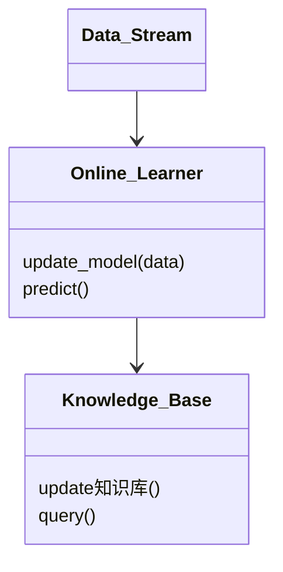
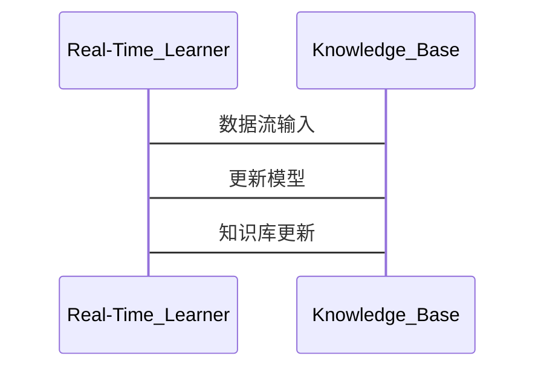

                 


# 实时学习：即时更新AI Agent的知识库

> 关键词：实时学习，AI Agent，知识库，在线学习，增量学习，流数据处理

> 摘要：实时学习是一种能够让AI Agent的知识库随着数据流的实时更新而不断优化的技术。本文将从实时学习的核心概念、算法原理、系统设计到实际应用进行详细分析，探讨如何实现AI Agent知识库的实时更新，以满足动态环境下的智能决策需求。

---

# 第一部分: 实时学习与AI Agent知识库的背景

## 第1章: 实时学习与AI Agent概述

### 1.1 实时学习的背景与重要性
#### 1.1.1 传统学习与实时学习的对比
传统机器学习算法通常基于静态数据集进行离线训练，而实时学习则强调在动态数据流中逐步学习和更新模型。实时学习能够快速响应数据的变化，适用于实时决策和反馈场景。

#### 1.1.2 AI Agent的基本概念
AI Agent是一种智能体，能够感知环境、执行任务并做出决策。其核心能力依赖于知识库的准确性和实时性。

#### 1.1.3 实时学习在AI Agent中的作用
实时学习使AI Agent能够在动态环境中不断优化其知识库，提升决策的准确性和响应速度。

### 1.2 问题背景与问题描述
#### 1.2.1 知识库实时更新的需求
在动态环境中，数据不断变化，传统离线学习方法无法满足实时更新的需求。

#### 1.2.2 AI Agent的知识库管理挑战
知识库的实时更新需要处理高频数据流，同时保证更新的准确性和效率。

#### 1.2.3 实时学习的核心问题
如何在数据流中高效地更新知识库，同时保持模型的稳定性和准确性。

### 1.3 问题解决与边界
#### 1.3.1 实时学习的解决方案
采用在线学习算法，结合数据流处理技术，实现知识库的实时更新。

#### 1.3.2 知识库实时更新的边界与外延
实时更新的边界包括数据流的速度、模型更新的频率以及计算资源的限制。

#### 1.3.3 核心概念的结构与组成
实时学习系统由数据流、在线学习算法、知识库和反馈机制四部分组成。

---

## 第2章: 实时学习与知识库管理的核心概念

### 2.1 实时学习的原理
#### 2.1.1 实时学习的定义与特征
实时学习是一种基于数据流的在线学习方法，能够在数据到达时立即更新模型。

#### 2.1.2 实时学习与在线学习的区别
在线学习强调数据流的处理，而实时学习更注重快速响应和实时更新。

#### 2.1.3 实时学习的核心算法
实时学习的核心算法包括在线分类、回归和聚类算法。

### 2.2 AI Agent的知识库管理
#### 2.2.1 知识库的结构与特点
知识库通常包括事实库、规则库和案例库，具有动态更新和可扩展性。

#### 2.2.2 知识库的更新机制
知识库的更新机制包括全量更新和增量更新两种方式。

#### 2.2.3 知识库与AI Agent行为的关系
知识库是AI Agent行为决策的基础，实时更新的知识库能够提升决策的准确性。

### 2.3 实时学习与知识库管理的联系
#### 2.3.1 实时学习如何支持知识库更新
实时学习通过在线算法实时更新知识库，确保知识库内容的时效性。

#### 2.3.2 知识库如何影响AI Agent的实时学习能力
知识库的质量直接影响AI Agent的实时学习效果，高质量的知识库能够提升学习效率。

#### 2.3.3 实时学习与知识库管理的协同优化
通过协同优化实时学习算法和知识库管理策略，能够实现知识库的高效更新和AI Agent的智能决策。

### 2.4 核心概念对比表
| 概念 | 特性 | 对比维度 |
|------|------|----------|
| 实时学习 | 数据流处理 | 高频更新 |
| 在线学习 | 数据流处理 | 低频更新 |
| 知识库更新 | 实时性 | 增量更新 |

### 2.5 实时学习与知识库管理的ER实体关系图
```mermaid
erDiagram
    actor Real-Time_Learner {
        <name>
        <timestamp>
    }
    actor Knowledge_Base {
        <id>
        <content>
    }
    Real-Time_Learner --> Knowledge_Base
    Real-Time_Learner --> Algorithm
    Algorithm --> Knowledge_Base
```

---

## 第3章: 实时学习的核心算法与实现

### 3.1 实时学习算法概述
#### 3.1.1 在线分类算法
在线分类算法包括感知机、随机梯度下降和支持向量机等。

#### 3.1.2 流数据处理算法
流数据处理算法包括滑动窗口和分组处理等技术。

#### 3.1.3 增量学习算法
增量学习算法包括增量决策树和增量聚类等方法。

### 3.2 算法原理与实现
#### 3.2.1 实时学习算法的数学模型
在线分类的数学模型如下：
$$ f(x) = \text{sign}(w \cdot x + b) $$
其中，$w$ 是权重向量，$x$ 是输入特征，$b$ 是偏置项。

#### 3.2.2 实时学习算法的代码实现
```python
def online_learning(data_stream):
    model = LinearClassifier()
    for batch in data_stream:
        model.update(batch)
    return model
```

#### 3.2.3 算法实现的优缺点对比
| 算法 | 优点 | 缺点 |
|------|------|------|
| 感知机 | 实时性好 | 易受噪声影响 |
| 随机梯度下降 | 计算效率高 | 收敛速度慢 |
| 支持向量机 | 分类准确率高 | 参数敏感 |

---

## 第4章: 系统分析与架构设计

### 4.1 系统功能设计
#### 4.1.1 领域模型设计
领域模型包括数据流处理模块、在线学习模块和知识库更新模块。



#### 4.1.2 系统架构设计
系统架构采用分层架构，包括数据层、算法层和知识库层。


#### 4.1.3 系统接口设计
系统接口包括数据输入接口、算法调用接口和知识库更新接口。

#### 4.1.4 系统交互流程
系统交互流程包括数据接收、算法更新和知识库更新三个阶段。



---

## 第5章: 项目实战与案例分析

### 5.1 项目环境安装
#### 5.1.1 系统需求
需要安装Python、NumPy和Scikit-learn库。

#### 5.1.2 环境配置
```bash
pip install numpy scikit-learn
```

### 5.2 核心代码实现
#### 5.2.1 在线学习算法实现
```python
from sklearn.linear_model import SGDClassifier

class Online_Learner:
    def __init__(self):
        self.model = SGDClassifier()

    def update_model(self, X, y):
        self.model.partial_fit(X, y)
```

#### 5.2.2 知识库更新实现
```python
class Knowledge_Base:
    def __init__(self):
        self.data = {}

    def update_knowledge_base(self, key, value):
        self.data[key] = value
```

### 5.3 代码解读与分析
在线学习算法通过部分拟合的方式逐步更新模型，知识库通过键值对的方式存储和更新数据。

### 5.4 实际案例分析
通过股票价格预测案例，展示实时学习算法在动态数据流中的应用。

---

## 第6章: 总结与展望

### 6.1 总结
实时学习通过在线算法实现知识库的实时更新，提升AI Agent的智能决策能力。

### 6.2 未来展望
未来的研究方向包括实时学习的优化算法、知识库的高效存储技术和多模态数据的实时学习方法。

---

## 第7章: 最佳实践与注意事项

### 7.1 最佳实践
- 定期监控模型性能
- 使用适当的评价指标
- 选择合适的在线学习算法

### 7.2 注意事项
- 数据流的质量会影响学习效果
- 模型更新频率需要合理设置
- 知识库的存储和访问效率需要优化

---

## 第8章: 附录

### 8.1 常用工具与库
- Python的Scikit-learn库
- TensorFlow的在线学习模块

### 8.2 参考文献
- 《机器学习实战》
- 《在线学习算法综述》

---

# 作者：AI天才研究院/AI Genius Institute & 禅与计算机程序设计艺术 /Zen And The Art of Computer Programming

---

以上是《实时学习：即时更新AI Agent的知识库》的完整目录和部分章节内容，希望对您有所帮助！

