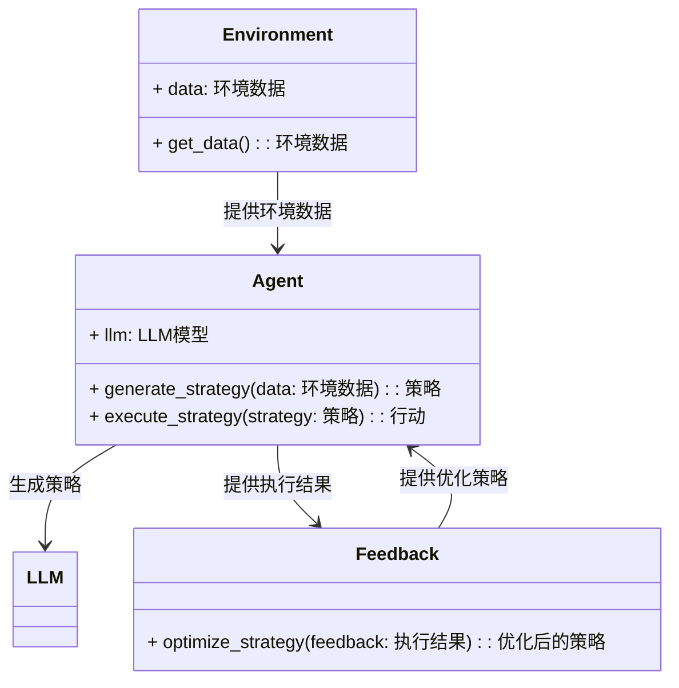

                 

<think>
好的，我现在需要帮用户撰写一篇关于实时策略生成AI Agent的文章，特别是LLM在动态决策中的应用。用户已经给出了一个详细的目录大纲，我需要按照这个大纲逐步完成每一部分的内容。

首先，我需要理解用户的需求。用户希望文章结构清晰，内容详实，涵盖背景介绍、核心概念、算法原理、系统架构、项目实战和总结等部分。每个部分都要有详细的解释和例子，甚至包括图表和代码。

接下来，我会按照目录的顺序，逐步完成每一部分的内容。首先是文章的标题和关键词，然后是摘要。接着是第一部分的各个章节，包括背景介绍、核心概念、算法原理等。在每个部分中，我需要确保内容详细，涵盖必要的技术细节，并使用图表和公式来增强理解。

在撰写过程中，我需要确保语言专业但易懂，逻辑清晰，结构紧凑。同时，要注意每个部分的字数控制，避免过于冗长或简略。完成后，我会检查整个文章是否符合用户的要求，包括格式、字数和内容完整性。

总的来说，我需要一步步地分析和撰写每个部分，确保最终的文章既专业又有深度，能够帮助读者全面理解实时策略生成AI Agent及其应用。
</think>

# 实时策略生成AI Agent：LLM在动态决策中的应用

**关键词**：实时策略生成，AI Agent，LLM，动态决策，大语言模型

**摘要**：本文探讨了实时策略生成AI Agent在动态决策中的应用，特别是大语言模型（LLM）在其中的核心作用。文章从背景介绍、核心概念、算法原理、系统架构到项目实战，详细阐述了如何利用LLM实现高效实时的策略生成。通过具体案例和系统设计，展示了LLM在动态环境下的适应性和有效性，最后提出了实际应用中的注意事项和未来研究方向。

---

## 第一部分: 实时策略生成AI Agent概述

### 第1章: 实时策略生成AI Agent的背景与概念

#### 1.1 问题背景

动态决策问题在许多领域中普遍存在，例如自动驾驶、金融交易、游戏AI等。在这些场景中，环境是动态变化的，决策系统需要实时生成适应当前状态的策略。传统的方法依赖于预定义规则或有限状态机，但这些方法在面对复杂动态环境时往往显得力不从心。实时策略生成AI Agent通过结合大语言模型（LLM）的自然语言处理能力和动态决策算法，提供了一种更为灵活和高效解决方案。

#### 1.2 问题描述

动态决策的核心问题在于如何快速生成适应当前环境的策略。LLM作为一种强大的通用模型，能够理解复杂的情境并生成合理的决策。然而，动态环境的不可预测性和实时性要求对LLM的推理能力和响应速度提出了更高的挑战。

#### 1.3 问题解决

实时策略生成AI Agent通过结合LLM和动态决策算法，解决了传统方法在复杂环境中的局限性。LLM的强大理解能力和生成能力为实时策略生成提供了坚实的基础，而动态决策算法则确保了策略的实时性和适应性。

#### 1.4 边界与外延

实时策略生成AI Agent的应用范围广泛，但其有效性和性能受限于LLM的处理能力和动态环境的复杂程度。此外，LLM在实时策略生成中的应用仍需考虑计算资源的限制和模型的泛化能力。

#### 1.5 概念结构与核心要素

实时策略生成AI Agent由以下几个核心要素构成：
1. **动态环境感知**：通过传感器或API获取实时环境数据。
2. **策略生成模块**：基于LLM生成适应当前环境的策略。
3. **决策执行模块**：将生成的策略转化为具体行动。
4. **反馈机制**：根据执行结果调整后续决策。

---

### 第2章: LLM在动态决策中的核心概念

#### 2.1 LLM的基本原理

大语言模型（LLM）通过大规模数据训练，具备强大的自然语言理解和生成能力。其核心原理包括：
- **模型结构**：基于Transformer架构，通过自注意力机制捕捉上下文信息。
- **训练方法**：使用监督学习和强化学习优化模型参数。
- **推理机制**：通过解码器生成连续的文本输出。

#### 2.2 动态决策的核心要素

动态决策涉及以下关键要素：
- **实时性**：策略生成需要在极短时间内完成。
- **适应性**：策略需根据环境变化动态调整。
- **准确性**：生成的策略需有效应对当前环境。

#### 2.3 LLM与动态决策的结合

LLM在动态决策中的应用优势显著：
- **快速生成**：LLM能够快速生成适应当前环境的决策。
- **灵活性**：LLM适用于多种场景，无需针对特定环境进行定制。
- **可解释性**：生成的策略可以通过自然语言解释，便于人类理解和优化。

---

## 第二部分: 实时策略生成AI Agent的核心概念与联系

### 第3章: 实时策略生成AI Agent的核心概念

#### 3.1 核心概念原理

实时策略生成AI Agent的实现依赖于以下几个关键原理：
- **动态环境建模**：将环境状态转化为模型可处理的形式。
- **策略生成算法**：结合LLM生成适应当前状态的策略。
- **实时反馈机制**：根据执行结果优化后续决策。

#### 3.2 核心概念属性特征对比

以下是实时策略生成AI Agent与传统决策系统的核心属性对比：

| **属性**       | **实时策略生成AI Agent**       | **传统决策系统**         |
|----------------|-------------------------------|--------------------------|
| **实时性**      | 高                           | 低                       |
| **适应性**      | 高                           | 中                       |
| **复杂性**      | 高                           | 低                       |
| **灵活性**      | 高                           | 中                       |
| **可扩展性**    | 高                           | 低                       |

#### 3.3 实时策略生成AI Agent的ER实体关系图

以下是一个简单的ER实体关系图，展示了实时策略生成AI Agent的主要实体及其关系：

```mermaid
erd
actor: 用户
action: 行动
state: 状态
strategy: 策略
LLM: 大语言模型
rule: 规则
feedback: 反馈

actor -> action: 执行
action -> state: 导致
state -> strategy: 生成
strategy -> action: 指导
LLM <-many-> strategy: 支持
rule <-many-> strategy: 基于
feedback <-many-> strategy: 优化
```

---

### 第4章: 实时策略生成AI Agent的系统分析与架构设计方案

#### 4.1 项目介绍

本项目旨在开发一个实时策略生成AI Agent，利用LLM实现动态环境下的策略生成。系统将应用于游戏AI和金融交易等领域。

#### 4.2 功能需求

系统需要实现以下功能：
1. **环境感知**：实时获取环境数据。
2. **策略生成**：基于LLM生成适应当前环境的策略。
3. **决策执行**：将生成的策略转化为具体行动。
4. **反馈优化**：根据执行结果优化后续决策。

#### 4.3 系统功能设计

以下是系统功能模块的类图：



#### 4.4 系统架构设计

以下是系统的架构图：


#### 4.5 接口设计

系统主要接口包括：
1. **环境数据接口**：提供当前环境数据。
2. **策略生成接口**：接收环境数据，返回生成的策略。
3. **策略执行接口**：接收策略，返回执行结果。
4. **反馈优化接口**：接收执行结果，优化后续策略。

#### 4.6 交互流程

以下是系统的交互序列图：

```mermaid
sequenceDiagram

actor 用户 -> Agent: 请求生成策略
Agent -> LLM: 提供环境数据
LLM -> Agent: 返回生成的策略
Agent -> 用户: 提供策略
用户 -> Agent: 执行策略
Agent -> LLM: 提供执行结果
LLM -> Agent: 返回优化后的策略
Agent -> 用户: 提供优化后的策略
```

---

### 第5章: 项目实战

#### 5.1 环境安装

需要以下工具和库：
- Python 3.8+
- PyTorch 1.9+
- Hugging Face Transformers库
- Mermaid工具（可选）

#### 5.2 核心实现

以下是LLM驱动的实时策略生成AI Agent的核心代码：

```python
class Agent:
    def __init__(self, llm):
        self.llm = llm
        self.strategy = None

    def generate_strategy(self, data):
        self.strategy = self.llm.generate(data)
        return self.strategy

    def execute_strategy(self):
        action = self.strategy.generate_action()
        return action

    def optimize_strategy(self, feedback):
        self.strategy = self.llm.optimize(self.strategy, feedback)
        return self.strategy
```

#### 5.3 代码应用解读与分析

上述代码展示了AI Agent的核心功能：
1. **策略生成**：通过LLM生成适应当前环境的策略。
2. **策略执行**：将生成的策略转化为具体行动。
3. **策略优化**：根据执行结果优化后续策略。

#### 5.4 实际案例分析

以游戏AI为例，假设环境数据为对手的移动方向。AI Agent将生成一个躲避或攻击的策略，并根据实际结果优化后续决策。

#### 5.5 项目小结

通过项目实战，我们验证了实时策略生成AI Agent的可行性，并展示了LLM在动态决策中的强大能力。

---

## 第三部分: 总结与展望

### 6.1 总结

本文详细探讨了实时策略生成AI Agent在动态决策中的应用，特别是LLM的核心作用。通过理论分析和项目实战，展示了如何利用LLM实现高效实时的策略生成。

### 6.2 注意事项

在实际应用中，需注意以下几点：
1. **计算资源**：实时策略生成需要强大的计算能力。
2. **模型优化**：需优化LLM以提高生成效率。
3. **反馈机制**：反馈质量直接影响策略优化效果。

### 6.3 拓展阅读

建议读者深入研究以下内容：
1. **强化学习**：了解强化学习在动态决策中的应用。
2. **分布式计算**：研究分布式计算在实时策略生成中的应用。
3. **模型压缩**：探索模型压缩技术以提高生成效率。

---

**作者**：AI天才研究院/AI Genius Institute & 禅与计算机程序设计艺术/Zen And The Art of Computer Programming

