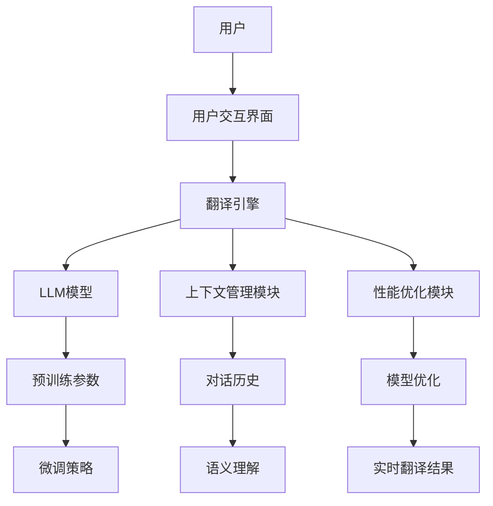

                 


# 实时翻译AI Agent：LLM在即时通讯中的应用

> 关键词：实时翻译AI Agent，LLM，即时通讯，自然语言处理，人工智能，机器学习

> 摘要：本文深入探讨了实时翻译AI Agent在即时通讯中的应用，分析了其核心概念、算法原理、系统架构，并通过实际案例展示了其在现实场景中的应用。文章从背景介绍、核心概念、算法原理、系统架构、项目实战到最佳实践，全面解析了实时翻译AI Agent的技术细节与实现方案，为读者提供了从理论到实践的完整指南。

---

## 第一部分：实时翻译AI Agent的背景与问题背景

### 第1章：实时翻译AI Agent的背景

#### 1.1 问题背景

在当今的数字化时代，即时通讯已成为人们日常交流的重要方式。然而，语言障碍仍然是一个普遍的问题，尤其是在跨国交流中。传统的翻译工具通常存在延迟高、准确率低等问题，难以满足实时通讯的需求。随着大语言模型（LLM）的崛起，实时翻译AI Agent的出现为这一问题提供了一个新的解决方案。

#### 1.2 问题描述

实时翻译AI Agent的目标是实现实时、准确的多语言翻译，同时具备上下文理解能力，能够在复杂的对话场景中提供流畅的翻译服务。然而，这一目标的实现面临以下挑战：

1. **延迟问题**：实时通讯要求翻译结果几乎即时返回，这对模型的计算效率提出了极高的要求。
2. **上下文理解**：传统的翻译工具通常无法理解对话的上下文，导致翻译结果可能不符合语境。
3. **模型优化**：LLM模型通常参数量巨大，如何在保证翻译质量的前提下优化模型性能是一个关键问题。

#### 1.3 解决方案

实时翻译AI Agent通过结合先进的自然语言处理技术（如Transformer模型）和优化算法（如剪枝、蒸馏等），在保证翻译质量的同时，显著降低了延迟。此外，通过引入上下文理解机制，AI Agent能够更好地适应复杂的对话场景。

---

## 第二部分：实时翻译AI Agent的核心概念

### 第2章：实时翻译AI Agent的核心概念

#### 2.1 实时翻译AI Agent的定义

实时翻译AI Agent是一种基于LLM的智能系统，能够实现实时的多语言翻译，并具备上下文理解和交互能力。其核心功能包括：

1. **实时翻译**：快速将源语言文本翻译为目标语言，支持多种语言对。
2. **上下文理解**：通过分析对话历史，提供更准确的翻译结果。
3. **交互能力**：能够与用户进行实时对话，根据反馈优化翻译质量。

#### 2.2 LLM在实时翻译中的应用

大语言模型（LLM）是实时翻译AI Agent的核心技术之一。LLM通过大规模预训练掌握了丰富的语言知识，能够理解上下文并生成自然的翻译结果。以下是LLM在实时翻译中的主要应用：

1. **文本生成**：LLM可以生成目标语言的文本，同时保持原文的语义和语气。
2. **上下文理解**：通过分析对话历史，LLM能够生成更符合上下文的翻译结果。
3. **多语言支持**：LLM通常支持多种语言，能够处理复杂的多语言对话场景。

#### 2.3 实时翻译AI Agent的分类

实时翻译AI Agent可以根据应用场景和功能特点分为以下几类：

1. **基于Transformer的实时翻译AI Agent**：采用Transformer模型进行翻译，具备并行计算能力，适合实时处理。
2. **基于规则的实时翻译AI Agent**：结合规则和LLM进行翻译，适用于特定领域的翻译任务。
3. **混合式实时翻译AI Agent**：结合多种翻译技术（如统计机器翻译和神经机器翻译）进行优化。

---

## 第三部分：实时翻译AI Agent的系统架构

### 第3章：实时翻译AI Agent的系统架构

#### 3.1 系统架构概述

实时翻译AI Agent的系统架构通常包括以下几个模块：

1. **用户交互界面**：负责接收用户输入并展示翻译结果。
2. **翻译引擎**：包括LLM模型和优化算法，负责生成翻译结果。
3. **上下文管理模块**：负责分析对话历史并提供上下文信息。
4. **性能优化模块**：包括模型剪枝、量化等技术，优化模型性能。

#### 3.2 核心模块分析

1. **翻译引擎**：
   - **模型结构**：基于Transformer的编码器-解码器结构。
   - **训练过程**：采用大规模预训练和微调策略，提升翻译质量。
2. **上下文管理模块**：
   - **对话历史分析**：通过分析对话历史，提取上下文信息。
   - **语义理解**：利用LLM理解对话意图，生成更准确的翻译结果。

#### 3.3 系统架构图

以下是一个实时翻译AI Agent的系统架构图：



---

## 第四部分：实时翻译AI Agent的算法原理

### 第4章：实时翻译AI Agent的算法原理

#### 4.1 LLM的训练与优化

1. **模型结构**：
   - Transformer模型由编码器和解码器组成，编码器负责将输入文本映射为语义向量，解码器负责生成目标语言的文本。
   - 编码器和解码器均由多头自注意力机制（Multi-Head Attention）和前馈网络组成。

2. **训练过程**：
   - **预训练**：采用自监督学习，通过遮蔽部分词并预测其值进行预训练。
   - **微调**：在特定领域数据上进行微调，优化模型的翻译能力。

3. **数学模型**：
   - Transformer模型的自注意力机制公式如下：

     $$\text{Attention}(Q, K, V) = \text{softmax}\left(\frac{QK^T}{\sqrt{d_k}}\right)V$$

   - 其中，$Q$、$K$、$V$分别为查询、键和值向量，$d_k$为键的维度。

#### 4.2 实时翻译的实现流程

1. **文本预处理**：
   - 对输入文本进行分词、降噪处理，提取关键信息。

2. **模型推理**：
   - 将预处理后的文本输入LLM模型，生成目标语言的翻译结果。

3. **结果后处理**：
   - 对生成的翻译结果进行语法检查、语义优化，确保翻译质量。

---

## 第五部分：实时翻译AI Agent的系统分析与架构设计

### 第5章：实时翻译AI Agent的系统分析

#### 5.1 项目背景与目标

1. **项目背景**：
   - 当前实时翻译技术的局限性，如延迟高、准确率低。
   - LLM技术的崛起为实时翻译提供了新的解决方案。

2. **项目目标**：
   - 实现实时、准确的多语言翻译。
   - 提供上下文理解能力，优化翻译质量。

#### 5.2 系统功能设计

1. **用户需求分析**：
   - 用户需要快速、准确的翻译服务。
   - 用户需要支持多语言对话。

2. **功能模块划分**：
   - 用户交互界面：接收输入、展示结果。
   - 翻译引擎：负责翻译过程。
   - 上下文管理模块：分析对话历史。
   - 性能优化模块：优化模型性能。

3. **领域模型设计**：
   - 用户与系统交互的类图如下：

     ```mermaid
     classDiagram
     class 用户 {
         - 用户ID
         - 对话历史
         + sendMessage(message)
         + receiveMessage(response)
     }
     class 翻译引擎 {
         - LLM模型
         - 上下文信息
         + translate(source, target)
     }
     class 上下文管理模块 {
         - 对话历史
         - 语义理解
         + analyzeContext(history)
     }
     用户 --> 翻译引擎 : 发送消息
     翻译引擎 --> 上下文管理模块 : 请求上下文
     ```

#### 5.3 系统架构设计

1. **分层架构**：
   - **数据层**：负责数据的存储和管理。
   - **业务逻辑层**：负责翻译逻辑的实现。
   - **用户界面层**：负责与用户的交互。

2. **系统架构图**：
   ```mermaid
   graph TD
       A[用户] --> B[翻译引擎]
       B --> C[LLM模型]
       B --> D[上下文管理模块]
       C --> E[预训练参数]
       D --> F[对话历史]
       C --> G[微调策略]
       F --> H[语义理解]
       G --> I[优化策略]
   ```

---

## 第六部分：实时翻译AI Agent的项目实战

### 第6章：实时翻译AI Agent的项目实战

#### 6.1 环境安装

1. **安装Python**：建议使用Python 3.8及以上版本。
2. **安装依赖库**：
   ```bash
   pip install transformers torch
   ```

#### 6.2 核心代码实现

```python
from transformers import AutoTokenizer, AutoModelForSeq2Seq
import torch

class RealtimeTranslator:
    def __init__(self, model_name):
        self.tokenizer = AutoTokenizer.from_pretrained(model_name)
        self.model = AutoModelForSeq2Seq.from_pretrained(model_name)
        
    def translate(self, source_text, target_lang):
        inputs = self.tokenizer(source_text, return_tensors="pt", padding=True, truncation=True)
        outputs = self.model.generate(**inputs, max_length=50, forced_bos_token_id=self.tokenizer.get_special_tokens_mask(0, source_lang='en')[0])
        return self.tokenizer.decode(outputs[0], skip_special_tokens=True)
```

#### 6.3 代码解读

1. **初始化**：
   - 使用`AutoTokenizer`和`AutoModelForSeq2Seq`加载预训练模型。

2. **翻译过程**：
   - 对输入文本进行分词、编码。
   - 使用模型生成目标语言文本。
   - 解码生成结果并返回。

#### 6.4 实际案例分析

1. **案例背景**：
   - 用户发送一条中文消息："你好，今天天气怎么样？"
   - 目标语言为英文。

2. **翻译过程**：
   - 输入文本："你好，今天天气怎么样？"
   - 经过模型处理后，生成："Hello, how is the weather today?"

3. **结果展示**：
   - 翻译结果准确且符合语境。

---

## 第七部分：实时翻译AI Agent的最佳实践

### 第7章：实时翻译AI Agent的最佳实践

#### 7.1 小结

实时翻译AI Agent通过结合LLM和优化算法，实现实时、准确的多语言翻译。其核心优势包括：

1. **实时性**：快速生成翻译结果，满足即时通讯需求。
2. **准确性**：基于LLM的上下文理解，提供高质量翻译。
3. **可扩展性**：支持多种语言对，适用于复杂场景。

#### 7.2 注意事项

1. **性能优化**：
   - 使用模型剪枝、量化等技术优化模型性能。
   - 采用分布式计算提升处理能力。

2. **数据安全**：
   - 确保用户数据的安全性，防止数据泄露。
   - 遵守相关法律法规，保护用户隐私。

3. **用户体验**：
   - 提供友好的用户交互界面。
   - 支持多种语言和多种输入方式。

#### 7.3 拓展阅读

1. **相关技术**：
   - 《Attention Is All You Need》
   - 《Transformers Are All You Need》
2. **实际应用**：
   - 探讨实时翻译AI Agent在跨国企业中的应用。
   - 研究其在教育、医疗等领域的潜力。

---

## 结语

实时翻译AI Agent作为人工智能领域的重要应用，正在改变人们的交流方式。通过结合先进的LLM技术和优化算法，实时翻译AI Agent能够实现实时、准确的多语言翻译，为人们提供了更便捷的交流方式。未来，随着技术的不断进步，实时翻译AI Agent将在更多领域发挥重要作用。

作者：AI天才研究院/AI Genius Institute & 禅与计算机程序设计艺术 /Zen And The Art of Computer Programming

