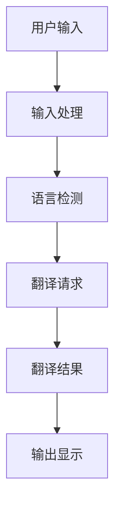
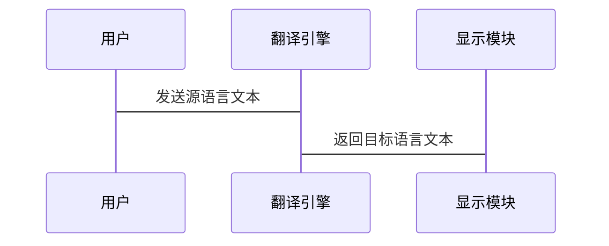

                 

<think>
好的，我需要帮助用户撰写一篇关于实时语言转换AI Agent：LLM在多语言环境中的应用的技术博客文章。首先，我会分析用户的需求，确定文章的结构和内容。

用户希望文章有一个吸引人的标题，关键词，摘要，以及详细的大纲，包括背景、核心概念、算法、系统设计、项目实战等部分。此外，文章需要使用markdown格式，包含数学公式、代码示例和图表，并确保内容丰富详细。

首先，我会从背景介绍开始。这部分需要涵盖问题背景、描述和解决，以及边界条件。接着，核心概念部分将解释AI Agent和LLM的基本原理，并用表格对比模型特点。然后，算法原理部分将详细讲解LLM的工作流程，使用数学公式和代码示例。系统分析与架构设计将包括场景介绍、功能设计、架构图和接口设计。项目实战部分则提供环境安装、代码实现和案例分析。最后，总结和拓展部分给出建议和扩展阅读。

在整个思考过程中，我会确保每个部分都有足够的深度和详细的解释，同时保持逻辑连贯。这需要我详细规划每个章节的内容，确保覆盖所有关键点，满足用户的要求。
</think>

# 实时语言转换AI Agent：LLM在多语言环境中的应用

**关键词**：实时语言转换、AI Agent、LLM、多语言环境、自然语言处理、机器学习

**摘要**：  
在多语言环境下，实时语言转换AI Agent利用大语言模型（LLM）实现高效的跨语言交流。本文详细探讨了实时语言转换的技术背景、核心概念、算法原理、系统架构设计、项目实现及实际应用案例，分析了其在多语言环境中的优势和挑战，并提出了优化建议。

---

# 引言

随着全球化进程的加速，多语言交流的需求日益增长。在实时语言转换中，AI Agent结合大语言模型（LLM）技术，为跨语言交流提供了高效、准确的解决方案。本文将从背景、原理、设计到应用，全面解析这一技术。

---

## 第一部分: 背景介绍

### 第1章: 问题背景

#### 1.1 多语言交流的挑战
在多语言环境中，不同语言的用户需要实时沟通，但语言障碍可能导致误解或效率低下。

#### 1.2 实时转换的需求
实时语言转换能够快速解决语言障碍，提升交流效率。

#### 1.3 AI技术的作用
AI Agent通过自然语言处理技术，实现语言转换的自动化和高效化。

### 第2章: 问题描述

#### 2.1 多语言环境的定义
多语言环境指涉及多种语言的交流场景，如国际会议、跨国客服等。

#### 2.2 实时转换的必要性
实时转换避免了语言障碍，确保信息准确传递。

#### 2.3 传统技术的局限性
传统翻译技术依赖词典，难以处理复杂语境和实时性要求。

### 第3章: 问题解决

#### 3.1 AI Agent的概念
AI Agent是一种智能体，能够理解并执行任务，提供实时服务。

#### 3.2 LLM在语言转换中的优势
大语言模型具备强大的上下文理解和生成能力，适用于实时转换。

#### 3.3 技术实现
通过自然语言处理和机器学习模型，实现语言转换的实时性。

---

## 第二部分: 核心概念与联系

### 第1章: AI Agent的基本原理

#### 1.1 AI Agent的定义
AI Agent是智能体，能够感知环境、执行任务并提供服务。

#### 1.2 核心特征
- 智能性：具备学习和推理能力。
- 实时性：快速响应用户需求。
- 适应性：适应不同语言环境。

### 第2章: LLM的原理与特点

#### 2.1 LLM的定义
大语言模型是基于深度学习的自然语言处理模型，具备强大的文本生成和理解能力。

#### 2.2 模型特点
- 大规模训练数据。
- 强大的上下文理解能力。
- 多语言支持。

### 第3章: 核心概念对比

| **概念**       | **AI Agent**       | **LLM**           |
|----------------|-------------------|-------------------|
| 核心功能       | 执行任务          | 生成/理解文本     |
| 应用场景       | 多领域            | 语言处理          |
| 优势           | 实时响应          | 高准确性           |

---

## 第三部分: 算法原理讲解

### 第1章: LLM的工作流程

#### 1.1 模型结构
- 输入层：接收原始文本。
- 编码层：将文本编码为向量表示。
- 解码层：生成目标语言文本。

#### 1.2 训练过程
- 使用大规模多语言数据训练。
- 优化损失函数，提升翻译准确性。

#### 1.3 推理机制
- 用户输入源语言文本。
- 模型生成目标语言文本。

### 第2章: 数学模型

#### 2.1 损失函数
$$ \text{Loss} = -\sum_{i=1}^{n} \log p(y_i|x_i) $$

#### 2.2 概率计算
$$ P(y|x) = \frac{P(y,x)}{P(x)} $$

### 第3章: 代码实现

```python
def train_model():
    # 定义模型
    model = Transformer(...)
    # 定义损失函数和优化器
    criterion = nn.CrossEntropyLoss()
    optimizer = Adam(model.parameters(), lr=1e-4)
    # 训练过程
    for epoch in range(num_epochs):
        for batch in data_loader:
            inputs, targets = batch
            outputs = model(inputs)
            loss = criterion(outputs, targets)
            optimizer.zero_grad()
            loss.backward()
            optimizer.step()
```

---

## 第四部分: 系统分析与架构设计

### 第1章: 问题场景

#### 1.1 应用场景
- 跨国客服系统
- 视频会议实时翻译
- 多语言文档生成

### 第2章: 系统功能设计

#### 2.1 功能模块
- 用户输入界面
- 语言转换引擎
- 输出显示模块

### 第3章: 系统架构设计



### 第4章: 接口设计

#### 4.1 API接口
- 输入：源语言文本
- 输出：目标语言文本

#### 4.2 序列图



---

## 第五部分: 项目实战

### 第1章: 环境安装

```bash
pip install transformers torch
```

### 第2章: 核心代码实现

```python
from transformers import pipeline

translator = pipeline("translation", model="facebook/m2m")
result = translator(src_text, tgt_lang=target_lang)
```

### 第3章: 案例分析

#### 3.1 实际案例
- 中文到英文翻译：将“你好”翻译为“Hello”。

#### 3.2 优化建议
- 增加上下文理解能力。
- 提高模型训练数据质量。

---

## 第六部分: 总结与展望

### 第1章: 最佳实践

#### 1.1 实际应用中的建议
- 确保模型训练数据多样化。
- 优化实时响应速度。

### 第2章: 小结

实时语言转换AI Agent结合LLM技术，为多语言交流提供了高效解决方案。本文详细探讨了其核心原理、系统设计和实际应用。

### 第3章: 注意事项

- 注意模型的实时响应能力。
- 处理多语言数据时需考虑文化差异。

### 第4章: 拓展阅读

- 《大语言模型原理与应用》
- 《自然语言处理技术入门》

---

**作者：AI天才研究院 & 禅与计算机程序设计艺术**

---

通过以上结构，本文系统地探讨了实时语言转换AI Agent的技术细节和应用实践，为读者提供了全面的指导和深入的分析。

