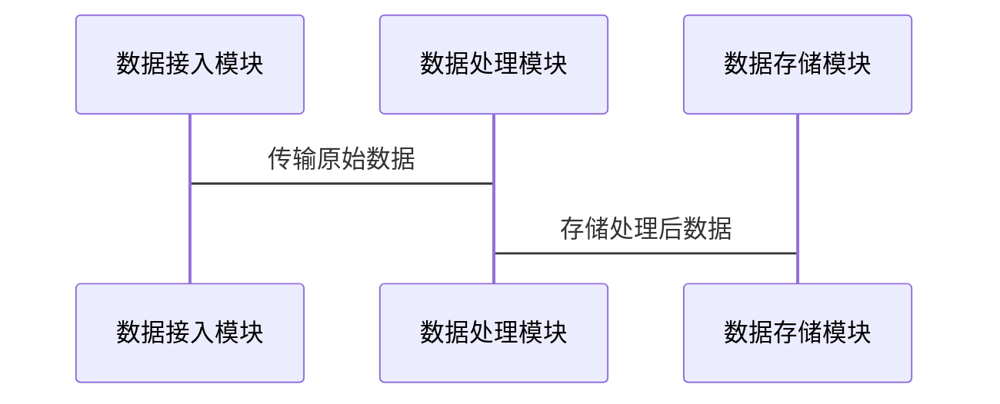

                 


# 实时金融数据接入与处理：技术与挑战

> 关键词：实时金融数据、数据接入、数据处理、流数据、数据清洗、算法实现

> 摘要：本文深入探讨了实时金融数据接入与处理的技术细节与挑战。从背景介绍到系统架构设计，再到项目实战与优化，全面解析了实时金融数据处理的核心技术。通过详细的技术分析和实际案例，本文为读者提供了从理论到实践的全面指导。

---

## 第一部分: 实时金融数据的背景与挑战

### 第1章: 实时金融数据的背景与挑战

#### 1.1 实时金融数据的重要性
实时金融数据是金融领域中的核心资源，其准确性和及时性直接影响金融决策的质量。金融市场的高频交易、风险控制和投资策略优化都依赖于实时数据的支持。

#### 1.2 金融数据的特点
| 特性 | 描述 |
|------|------|
| 实时性 | 数据需在毫秒级别更新 |
| 多样性 | 包括股票、期货、外汇等多种类型 |
| 高频性 | 数据生成速度极高，每秒可达数千条 |
| 稳定性 | 数据源需稳定，避免中断 |

#### 1.3 数据接入与处理的挑战
| 挑战 | 描述 |
|------|------|
| 数据源多样性 | 不同数据源格式和接口差异大 |
| 数据实时性 | 高频数据处理对系统性能要求高 |
| 数据质量 | 数据可能包含错误或缺失值 |

---

## 第二部分: 实时金融数据接入技术

### 第2章: 数据源与接入方式

#### 2.1 数据源的分类
- **市场数据源**：如股票交易所、期货交易所等。
- **新闻数据源**：财经新闻、公司公告等。
- **社交媒体数据源**：Twitter、Reddit等平台的用户评论。

#### 2.2 数据接入的方式
- **API接口接入**：通过RESTful API或WebSocket协议实时获取数据。
- **文件批量导入**：定期从CSV或JSON文件中导入历史数据。
- **实时流数据接入**：通过Kafka、RabbitMQ等消息队列订阅实时数据流。

#### 2.3 数据接入的实现
- **API接口设计**：定义清晰的接口规范，确保数据格式统一。
- **消息队列的使用**：采用Kafka进行实时数据流的高效分发。

---

## 第三部分: 数据处理与分析技术

### 第3章: 数据清洗与预处理

#### 3.1 数据清洗的必要性
- **数据清洗目标**：去除噪声数据，确保数据准确性。
- **数据清洗步骤**：
  1. 数据去重
  2. 异常值处理
  3. 数据格式统一

#### 3.2 数据预处理的技术
- **数据标准化**：对数值型数据进行标准化处理。
- **数据特征提取**：通过统计分析提取关键特征。

#### 3.3 数据清洗与预处理的实现
```python
import pandas as pd

# 数据清洗示例
def clean_data(df):
    # 去重
    df = df.drop_duplicates()
    # 处理缺失值
    df = df.dropna()
    # 数据标准化
    df['price'] = (df['price'] - df['price'].mean()) / df['price'].std()
    return df

# 数据预处理示例
def preprocess_data(df):
    # 特征提取
    df['volatility'] = df['price'].std()
    return df

# 示例数据
data = {'price': [100, 200, 300, 200, 150]}
df = pd.DataFrame(data)
df = clean_data(df)
df = preprocess_data(df)
print(df)
```

---

## 第四部分: 实时数据处理的算法实现

### 第4章: 数据流处理算法

#### 4.1 数据流处理的基本概念
- **数据流**：实时、连续的数据序列。
- **处理目标**：快速提取有价值的信息。

#### 4.2 常见的数据流处理算法
- **滑动窗口算法**：用于计算滑动窗口内的统计值。
- **基于队列的处理算法**：通过队列实现数据的高效处理。
- **基于流图的处理算法**：利用流图模型进行实时数据分析。

#### 4.3 数据流处理算法的实现
```python
import itertools

# 滑动窗口算法实现
def sliding_window(data, window_size):
    for i in range(len(data) - window_size + 1):
        yield data[i:i+window_size]

# 示例数据
data = [1, 2, 3, 4, 5, 6, 7, 8, 9, 10]
window_size = 3

# 使用滑动窗口算法计算平均值
for window in sliding_window(data, window_size):
    print(sum(window) / window_size)
```

---

## 第五部分: 系统架构与实现

### 第5章: 系统架构设计

#### 5.1 系统功能模块设计
- **数据接入模块**：负责数据的采集和接收。
- **数据处理模块**：执行数据清洗和预处理。
- **数据存储模块**：存储处理后的数据。
- **数据分析模块**：对数据进行实时分析和可视化。

#### 5.2 系统架构设计
- **分层架构**：将系统划分为数据层、业务逻辑层和表现层。
- **微服务架构**：通过服务化设计提高系统的可扩展性和维护性。

#### 5.3 系统接口设计
- **数据接入接口**：定义API接口规范。
- **数据处理接口**：定义数据处理模块的输入输出接口。
- **数据分析接口**：定义数据分析模块的查询接口。

#### 5.4 系统交互流程设计


---

## 第六部分: 项目实战与优化

### 第6章: 项目实战

#### 6.1 项目环境搭建
- **工具安装**：安装Python、Pandas、NumPy等工具。
- **数据源选择**：选择可靠的金融数据源。

#### 6.2 系统核心实现源代码
```python
import pandas as pd
from kafka import KafkaConsumer, KafkaProducer

# 数据生产者
def data_producer():
    producer = KafkaProducer(bootstrap_servers='localhost:9092')
    for price in range(1, 100):
        producer.send('finance_data', str(price))
    producer.close()

# 数据消费者
def data_consumer():
    consumer = KafkaConsumer('finance_data', group_id='finance_group',
                              bootstrap_servers='localhost:9092')
    for message in consumer:
        print(message.value)
    consumer.close()
```

#### 6.3 代码应用解读与分析
- **数据生产者**：实时生成模拟金融数据。
- **数据消费者**：接收并处理实时数据流。

#### 6.4 案例分析
- **案例场景**：实时股票价格监控。
- **案例实现**：通过Kafka实现股票价格的实时监控。

---

## 第七部分: 最佳实践与总结

### 7.1 最佳实践 tips
- **性能优化**：使用高效的数据结构和算法。
- **安全性考虑**：确保数据传输和存储的安全性。
- **扩展性设计**：采用模块化设计，方便系统扩展。

### 7.2 小结
本文从实时金融数据的背景、接入、处理到系统架构设计，再到项目实战，全面解析了实时金融数据处理的技术与挑战。通过实际案例和代码实现，为读者提供了从理论到实践的全面指导。

### 7.3 注意事项
- 数据处理前需确保数据源的稳定性。
- 系统设计时需考虑高可用性和容错性。

### 7.4 拓展阅读
- 推荐阅读《Data Pipeline Design Patterns》和《Real-Time Data Processing with Apache Kafka》。

---

作者：AI天才研究院/AI Genius Institute & 禅与计算机程序设计艺术 /Zen And The Art of Computer Programming

