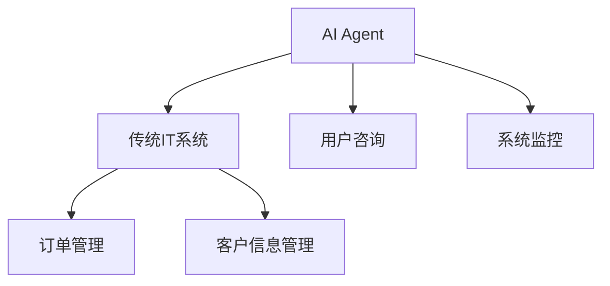
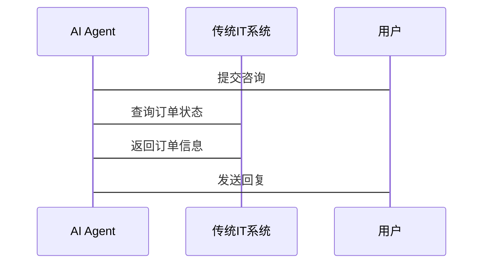

                 

<think>
好的，我将按照您的要求撰写一篇关于《实现AI Agent与传统IT系统无缝集成》的技术博客文章。我们先来看一下目录大纲：

---

# 实现AI Agent与传统IT系统无缝集成

> 关键词：AI Agent，传统IT系统，无缝集成，系统架构，算法原理，项目实战

> 摘要：本文深入探讨如何将AI Agent与传统IT系统无缝集成，通过分析核心概念、算法原理、系统架构设计和项目实战，提供一套完整的解决方案，帮助技术从业者实现AI与传统IT系统的高效协同。

---

接下来我们将按照目录大纲逐步撰写文章内容。让我们从背景介绍开始。

---

## 第1章: 问题背景与描述

### 1.1 问题背景

#### 1.1.1 传统IT系统的局限性
传统IT系统在企业中发挥着重要作用，但随着业务复杂性和数据量的激增，其局限性逐渐显现：
- **灵活性不足**：传统IT系统通常基于固定的流程和规则，难以快速适应业务变化。
- **数据孤岛问题**：系统间数据互通性差，导致信息分散，难以形成统一的决策依据。
- **智能化不足**：传统系统主要依赖人工操作和规则引擎，缺乏自主学习和优化能力。

#### 1.1.2 AI Agent的崛起与潜力
AI Agent（智能体）作为一种能够感知环境、自主决策并执行任务的智能实体，正在快速崛起：
- **自主性**：AI Agent能够独立完成任务，减少对人工干预的依赖。
- **学习能力**：通过机器学习和深度学习技术，AI Agent能够不断优化自身行为。
- **适应性**：AI Agent能够根据环境变化动态调整策略，适应复杂场景。

#### 1.1.3 无缝集成的必要性与目标
将AI Agent与传统IT系统无缝集成，旨在：
- **提升系统整体效率**：通过AI Agent的智能化能力，优化传统系统的流程和决策。
- **实现数据互通**：消除系统间的信息孤岛，形成统一的数据流。
- **增强系统适应性**：使传统IT系统能够快速响应变化，适应新的业务需求。

### 1.2 问题描述

#### 1.2.1 当前系统集成的主要挑战
- **技术差异**：传统IT系统基于确定性规则，而AI Agent依赖概率性算法，两者在技术实现上存在差异。
- **数据格式不兼容**：传统系统通常使用结构化数据，而AI Agent可能需要非结构化数据进行处理。
- **安全性问题**：AI Agent的自主决策可能带来新的安全风险，需要确保系统的安全性。

#### 1.2.2 AI Agent与传统IT系统的协同需求
- **任务协同**：AI Agent需要能够理解并执行传统系统中的任务。
- **数据协同**：系统间需要实现数据的共享与转换。
- **控制协同**：AI Agent需要在传统系统的框架下进行决策和执行。

#### 1.2.3 集成后的预期效果与价值
- **效率提升**：通过AI Agent的自动化能力，减少人工操作，提高系统运行效率。
- **决策优化**：利用AI Agent的学习能力，优化传统系统的决策过程。
- **扩展性增强**：使传统系统能够灵活扩展，适应新的业务需求。

### 1.3 问题解决思路

#### 1.3.1 分析问题的关键点
- 理解传统IT系统和AI Agent的核心特点。
- 分析两者在功能、数据、接口等方面的差异。
- 确定集成的目标和范围。

#### 1.3.2 解决方案的初步构想
- 设计一个中间层，用于实现AI Agent与传统系统的数据互通和任务协同。
- 制定统一的数据格式和接口规范，确保系统间的兼容性。
- 开发必要的适配器，实现系统间的通信与协作。

#### 1.3.3 实现路径的选择与优化
- 选择合适的AI Agent框架（如Rasa、Starlette等）。
- 设计系统间的通信协议，确保数据的安全性和高效性。
- 实现数据转换和任务调度的逻辑。

### 1.4 边界与外延

#### 1.4.1 集成的边界条件
- AI Agent的决策范围限制在特定领域，避免越界操作。
- 确保集成系统在异常情况下的可回滚性。
- 设定明确的权限控制，防止越权操作。

#### 1.4.2 相关概念的外延与扩展
- AI Agent的多智能体协同。
- 高可用性和容错机制。
- 智能合约与自动化决策。

#### 1.4.3 与其他技术的关联性分析
- 与云计算、边缘计算的结合。
- 与区块链技术的结合，确保数据的安全性和不可篡改性。
- 与物联网（IoT）的结合，实现物理世界与数字世界的无缝连接。

### 1.5 核心概念结构与组成

#### 1.5.1 核心概念的层次分解
- **顶层概念**：AI Agent与传统IT系统的集成。
- **中间层**：数据互通、任务协同、接口适配。
- **底层**：算法实现、系统架构设计、安全性保障。

#### 1.5.2 关键要素的定义与属性
| 关键要素       | 定义                                                                 | 属性                                                                 |
|----------------|--------------------------------------------------------------------|----------------------------------------------------------------------|
| AI Agent       | 具备感知、决策、执行能力的智能实体                                   | 自主性、学习性、适应性                                               |
| 传统IT系统     | 基于规则和流程的传统信息系统                                         | 结构化数据、确定性规则、刚性流程                                     |
| 数据互通       | 系统间数据的共享与转换                                               | 数据格式转换、数据安全性、数据一致性                               |
| 任务协同       | AI Agent与传统系统之间的任务协作                                   | 任务调度、任务分解、任务执行                                       |
| 接口适配       | 系统间通信的接口规范                                               | API设计、消息队列、数据流控制                                       |

#### 1.5.3 概念之间的关系与依赖
- AI Agent依赖于数据互通和接口适配才能与传统系统协同工作。
- 任务协同是实现系统集成的核心，依赖于数据互通和接口适配的支持。
- 系统架构设计是实现无缝集成的基础，需要综合考虑数据、任务和接口等多个方面。

---

## 第2章: AI Agent与传统IT系统的集成原理

### 2.1 AI Agent的核心原理

#### 2.1.1 AI Agent的基本定义
AI Agent是一种能够感知环境、自主决策并执行任务的智能实体，具备以下核心特征：
- **自主性**：能够在没有外部干预的情况下自主运行。
- **反应性**：能够实时感知环境变化并做出反应。
- **学习性**：能够通过数据和经验不断优化自身行为。

#### 2.1.2 AI Agent的主要特点与优势
- **智能化**：基于机器学习和深度学习技术，具备强大的数据分析和决策能力。
- **适应性**：能够根据环境变化动态调整策略，适应复杂场景。
- **可扩展性**：支持模块化设计，便于扩展和集成。

#### 2.1.3 AI Agent的内部工作机制
AI Agent的工作流程通常包括以下几个阶段：
1. **感知环境**：通过传感器、API或其他数据源获取环境信息。
2. **决策制定**：基于获取的信息，结合历史数据和目标，制定行动方案。
3. **执行任务**：根据决策结果，执行相应的操作。
4. **反馈与优化**：根据执行结果进行反馈，并优化自身的决策模型。

### 2.2 传统IT系统的构成与特点

#### 2.2.1 传统IT系统的组成部分
传统IT系统通常包括以下几个部分：
- **数据层**：存储系统的数据，如数据库、文件系统等。
- **业务逻辑层**：实现系统的业务逻辑，如订单处理、用户管理等。
- **表现层**：与用户交互的界面，如Web界面、移动应用等。

#### 2.2.2 传统IT系统的运行模式
传统IT系统的运行模式通常是基于规则和流程的，依赖于确定性的算法和结构化数据。其特点是：
- **稳定性**：系统运行稳定，可靠性高。
- **可预测性**：系统的输出结果可以预测，基于固定的规则和流程。
- **刚性**：系统难以快速适应变化，缺乏灵活性。

#### 2.2.3 传统IT系统的局限性与改进方向
- **缺乏智能化**：传统系统难以处理复杂、动态的业务场景。
- **数据孤岛问题**：系统间数据互通性差，难以形成统一的决策依据。
- **效率低下**：人工操作和固定流程可能导致效率降低。

### 2.3 AI Agent与传统IT系统的联系

#### 2.3.1 两者的核心联系
AI Agent与传统IT系统的联系主要体现在以下几个方面：
- **数据互通**：AI Agent需要从传统系统中获取数据，传统系统也需要AI Agent的处理结果。
- **任务协同**：AI Agent可以协助传统系统完成某些任务，提高效率。
- **系统增强**：通过AI Agent的智能化能力，增强传统系统的决策能力和适应性。

#### 2.3.2 集成的主要方式与路径
- **API集成**：通过API接口实现AI Agent与传统系统的数据互通和任务协同。
- **消息队列**：使用消息队列（如Kafka、RabbitMQ）实现系统间的异步通信。
- **数据转换层**：设计一个数据转换层，实现数据格式的转换和兼容。

#### 2.3.3 集成后的系统优势
- **智能化提升**：AI Agent的引入使系统具备自主决策和学习能力。
- **效率提高**：通过自动化处理和优化，提高系统运行效率。
- **灵活性增强**：系统能够快速适应变化，支持新的业务需求。

---

## 第3章: AI Agent与传统IT系统的对比分析

### 3.1 AI Agent与传统IT系统的对比分析

| 对比维度         | AI Agent                               | 传统IT系统                             |
|------------------|--------------------------------------|---------------------------------------|
| 核心功能         | 感知环境、自主决策、执行任务         | 执行固定规则、处理结构化数据           |
| 数据处理方式     | 支持非结构化数据，具备学习能力       | 处理结构化数据，依赖固定规则           |
| 系统灵活性       | 高，能够快速适应变化                 | 低，难以快速适应变化                   |
| 决策方式         | 基于概率模型和机器学习，具有不确定性 | 基于确定性规则，结果可预测             |
| 适用场景         | 复杂、动态的业务场景                 | 稳定、规则明确的业务场景               |

### 3.2 实体关系图（ER图）

```mermaid
er
    actor(AI Agent)
    actor(传统IT系统)
    relation(调用)
    relation(数据交互)
```

---

## 第4章: AI Agent的算法原理与实现

### 4.1 AI Agent的算法原理

#### 4.1.1 AI Agent的核心算法
AI Agent的核心算法通常包括以下几个方面：
- **感知算法**：如自然语言处理（NLP）、计算机视觉（CV）等。
- **决策算法**：如强化学习（Reinforcement Learning）、深度学习（Deep Learning）等。
- **执行算法**：如自动化脚本、API调用等。

#### 4.1.2 算法的数学模型
AI Agent的决策过程通常基于概率论和优化算法。以下是一个简单的决策模型示例：

$$ P(a|e) = \frac{P(e|a)P(a)}{P(e)} $$

其中：
- \( P(a|e) \) 表示在环境 \( e \) 下采取行动 \( a \) 的概率。
- \( P(e|a) \) 表示采取行动 \( a \) 后出现环境 \( e \) 的概率。
- \( P(a) \) 表示采取行动 \( a \) 的先验概率。
- \( P(e) \) 表示环境 \( e \) 的全概率。

#### 4.1.3 算法的实现步骤
1. **感知环境**：通过传感器或其他数据源获取环境信息。
2. **决策制定**：基于感知到的信息，结合历史数据和目标，制定行动方案。
3. **执行任务**：根据决策结果，执行相应的操作。
4. **反馈与优化**：根据执行结果进行反馈，并优化自身的决策模型。

#### 4.1.4 算法的优化技巧
- **在线学习**：实时更新模型参数，适应环境变化。
- **分布式计算**：利用分布式计算技术，提高系统的处理能力。
- **模型压缩**：通过模型压缩技术，减少计算资源的消耗。

---

## 第5章: AI Agent与传统IT系统的系统架构设计

### 5.1 系统分析与架构设计

#### 5.1.1 项目场景介绍
假设我们正在设计一个智能客服系统，其中AI Agent负责处理用户的咨询，传统IT系统负责订单管理、客户信息管理等。

#### 5.1.2 系统功能设计
- **AI Agent功能**：
  - 用户咨询处理。
  - 自动派单。
  - 监控系统状态。
- **传统IT系统功能**：
  - 订单管理。
  - 客户信息管理。
  - 数据存储与查询。

#### 5.1.3 系统架构设计



#### 5.1.4 接口设计
- **AI Agent调用传统系统接口**：
  - API接口：`/api/order/query?orderId=123`
  - 返回格式：JSON
- **传统系统调用AI Agent接口**：
  - API接口：`/api/agent/predict`
  - 请求格式：POST请求，包含用户咨询内容。

#### 5.1.5 交互流程图



---

## 第6章: 项目实战

### 6.1 环境安装

#### 6.1.1 安装Python环境
```bash
python --version
pip install --upgrade pip
```

#### 6.1.2 安装相关库
```bash
pip install numpy
pip install scikit-learn
pip install requests
pip install flask
```

### 6.2 系统核心实现源代码

#### 6.2.1 AI Agent核心代码
```python
import requests
import json

class AI_Agent:
    def __init__(self, api_key):
        self.api_key = api_key

    def perceive(self, input_data):
        # 感知环境，处理输入数据
        pass

    def decide(self, input_data):
        # 决策逻辑，返回行动方案
        pass

    def execute(self, action):
        # 执行操作，调用传统IT系统接口
        pass
```

#### 6.2.2 传统IT系统接口代码
```python
from flask import Flask, request, jsonify

app = Flask(__name__)

@app.route('/api/order/query', methods=['GET'])
def query_order():
    # 获取订单信息
    order_id = request.args.get('orderId')
    # 返回JSON格式的数据
    return jsonify({'status': 'success', 'order_id': order_id})

if __name__ == '__main__':
    app.run(debug=True)
```

### 6.3 案例分析与详细讲解

#### 6.3.1 案例场景
假设我们正在实现一个智能客服系统，AI Agent负责处理用户的咨询，传统IT系统负责订单管理。

#### 6.3.2 实现细节
- **AI Agent感知环境**：接收用户的咨询内容。
- **AI Agent决策**：根据咨询内容，判断是否需要查询订单状态。
- **AI Agent执行**：调用传统IT系统的API接口，查询订单状态。
- **传统系统返回结果**：返回订单信息。
- **AI Agent反馈**：根据查询结果，生成回复内容并返回给用户。

### 6.4 项目小结

#### 6.4.1 项目实现的关键点
- **API接口设计**：确保系统间的通信流畅。
- **数据格式转换**：实现数据的兼容性。
- **异常处理**：确保系统在异常情况下的稳定性。

#### 6.4.2 项目实现的价值
- **提升效率**：通过AI Agent的自动化能力，提高系统的响应速度。
- **增强用户体验**：提供智能化的咨询服务，提升用户满意度。
- **降低人工成本**：减少对人工客服的依赖，降低企业运营成本。

---

## 第7章: 最佳实践、小结、注意事项与拓展阅读

### 7.1 最佳实践

#### 7.1.1 API设计
- **明确接口规范**：确保接口的可读性和可维护性。
- **版本控制**：为接口制定版本控制策略，避免因接口变更导致的兼容性问题。

#### 7.1.2 数据处理
- **数据清洗**：在AI Agent与传统系统交互前，确保数据的干净和一致性。
- **数据加密**：在数据传输过程中，确保数据的安全性。

#### 7.1.3 系统监控
- **实时监控**：监控系统的运行状态，及时发现并解决问题。
- **日志管理**：记录系统的运行日志，便于问题排查。

### 7.2 小结

通过本文的深入探讨，我们了解了如何将AI Agent与传统IT系统无缝集成。从背景介绍到系统架构设计，再到项目实战，我们逐步展示了实现这一目标的关键步骤和方法。通过本文的学习，读者可以掌握AI Agent的核心原理、系统集成的实现方法，以及如何在实际项目中应用这些技术。

### 7.3 注意事项

- **数据安全**：在数据传输和处理过程中，确保数据的安全性，防止数据泄露。
- **系统兼容性**：确保AI Agent与传统系统的兼容性，避免因技术差异导致的集成问题。
- **异常处理**：在系统集成过程中，充分考虑异常情况，制定相应的处理策略。

### 7.4 拓展阅读

- **AI Agent相关书籍**：《AI Agent Programming》、《Multi-Agent Systems》。
- **系统集成相关书籍**：《Enterprise Integration Patterns》、《SOA Design Patterns》。
- **技术博客与开源项目**：关注GitHub上的相关开源项目，学习先进的实现方法。

---

## 作者

作者：AI天才研究院/AI Genius Institute & 禅与计算机程序设计艺术/Zen And The Art of Computer Programming

---

以上是《实现AI Agent与传统IT系统无缝集成》的完整目录和部分正文内容。接下来，我将继续按照目录大纲撰写完整文章，确保每一部分内容详实具体，满足技术博客的专业性和可读性。

