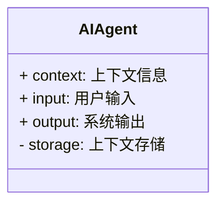
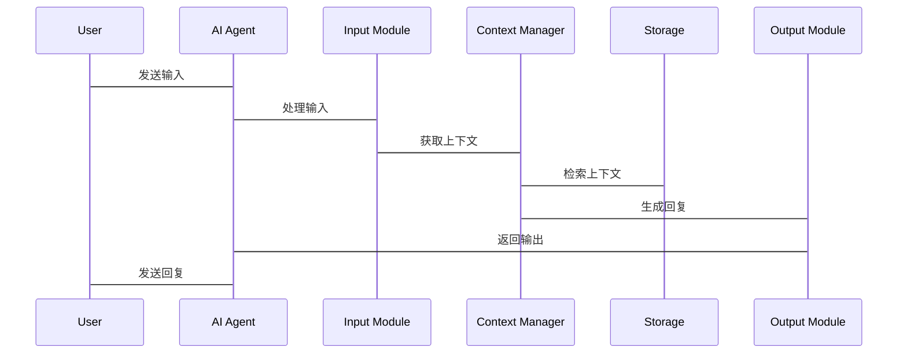

                 

<think>
嗯，我现在需要帮用户撰写一篇关于AI Agent上下文管理的技术博客文章。用户已经给出了一个详细的目录结构，我需要按照这个结构来逐步撰写每一部分。首先，我得确保文章结构清晰，逻辑连贯，每一章和小节都涵盖必要的内容，并且用专业且易懂的语言来写。

首先，标题是《实现AI Agent的上下文管理：保持对话连贯性》，关键词包括AI Agent、上下文管理、对话连贯性、自然语言处理、机器学习、计算机科学。摘要部分需要简明扼要地概括文章的核心内容，强调上下文管理的重要性以及本文将探讨的核心方法和应用。

接下来是目录，用户已经给出了详细的部分，我需要按照这个顺序来写。首先，第一章介绍上下文管理的基本概念，包括问题背景、定义、核心概念和联系。这部分需要让读者明白为什么上下文管理重要，以及它在AI Agent中的角色。

第二章讨论上下文管理的核心原理，涉及表示、存储、检索与关联，以及算法原理。我需要详细解释向量空间模型和BM25算法，并给出代码示例，这样读者可以理解如何实现这些算法。

第三章是系统架构与设计，这里需要描述系统架构设计，包括功能模块、领域模型和架构图。这部分可能需要使用Mermaid图表来展示系统结构，帮助读者更好地理解。

第四章是项目实战，包括环境安装、核心实现、案例分析和小结。我需要提供具体的代码示例，解释每一步的功能，并分析实际案例，让读者能够动手实践。

最后，第五章是总结与展望，涵盖最佳实践、小结、注意事项和拓展阅读。这部分需要总结前面的内容，并给出进一步学习的方向。

在整个写作过程中，我需要确保每一部分都详细且专业，同时避免使用过于复杂的术语，使文章易于理解。此外，使用Mermaid图表和数学公式来增强解释力，让读者能够直观地理解复杂的概念和算法。

现在，我开始撰写摘要部分，强调上下文管理的重要性，并简要介绍文章的结构和内容。然后，进入第一章，逐步解释问题背景、定义和核心概念，确保读者能够打下坚实的基础。接下来，详细探讨上下文管理的算法原理，提供代码示例和数学公式，帮助读者理解实现细节。

在系统架构部分，使用Mermaid图表展示系统的各个组件及其交互，确保读者能够清晰理解系统的结构和工作流程。项目实战部分，通过具体的案例分析，让读者能够实际应用所学知识，并提供代码示例和解读，帮助他们更好地掌握技能。

最后，在总结部分，回顾文章的主要内容，并提出未来的研究方向和学习资源，为读者提供进一步的指导。整个过程需要保持逻辑清晰，内容详实，同时语言简洁，确保读者能够轻松理解和应用所学知识。
</think>

# 实现AI Agent的上下文管理：保持对话连贯性

> 关键词：AI Agent，上下文管理，对话连贯性，自然语言处理，机器学习，计算机科学

> 摘要：AI Agent的上下文管理是实现对话连贯性的关键，本文从基础概念到系统架构，详细探讨了上下文管理的核心原理与实现方法，结合项目实战和最佳实践，帮助读者全面掌握AI Agent的上下文管理技术。

---

## 第一章: 上下文管理的基本概念

### 1.1 问题背景与描述

#### 1.1.1 对话连贯性的挑战
在人与AI Agent的交互中，对话的连贯性是用户体验的核心。然而，由于对话的上下文信息容易丢失或混淆，导致AI Agent难以理解用户意图，从而影响用户体验。例如，在一个多轮对话中，AI Agent需要记住用户之前提到的信息，以便更好地理解和回应当前的问题。

#### 1.1.2 上下文管理的重要性
上下文管理是AI Agent理解用户意图、保持对话连贯性的关键。通过有效的上下文管理，AI Agent能够根据历史对话信息，提供更准确和个性化的回复。

#### 1.1.3 AI Agent的核心需求
AI Agent需要具备以下核心能力：
- **上下文感知**：理解当前对话的上下文信息。
- **历史记忆**：存储和检索之前的对话内容。
- **动态更新**：根据新信息实时更新上下文。

### 1.2 上下文管理的定义与目标

#### 1.2.1 上下文的定义
上下文是指在特定时间点，与当前对话相关的所有信息，包括用户输入、系统回应、环境数据等。它是AI Agent理解和生成回复的基础。

#### 1.2.2 上下文管理的目标
上下文管理的目标是：
1. **存储上下文信息**：将对话中的相关信息存储起来。
2. **检索上下文信息**：根据当前对话内容，快速检索相关的历史信息。
3. **关联上下文信息**：识别当前对话与历史对话之间的关联性。

#### 1.2.3 上下文管理的边界与外延
上下文管理的边界包括：
- **输入范围**：用户输入的文本、语音、图像等。
- **输出范围**：系统生成的回复、决策等。
- **时间范围**：对话的实时性要求。

### 1.3 核心概念与联系

#### 1.3.1 上下文表示方法对比
以下是几种常见的上下文表示方法对比：

| 表示方法 | 描述 | 优缺点 |
|----------|------|--------|
| 文本表示 | 直接使用文本片段 | 易懂但缺乏结构化 |
| 向量表示 | 使用向量空间模型 | 高效但计算量大 |
| 树状表示 | 基于语法树的表示 | 结构清晰但复杂 |

#### 1.3.2 实体关系图（ER图）
```mermaid
er
  actor: AI Agent
  actor --> context: 提供上下文信息
  context --> storage: 存储上下文数据
  storage --> retrieval: 检索上下文信息
  retrieval --> decision: 支持决策过程
```

---

## 第二章: 上下文管理的核心原理

### 2.1 上下文表示与存储

#### 2.1.1 常用的上下文表示方法
常用的上下文表示方法包括：
1. **文本表示**：直接存储用户输入的文本片段。
2. **向量表示**：将文本转换为向量形式，便于计算相似度。
3. **树状表示**：基于语法树的上下文表示方法。

#### 2.1.2 上下文存储的结构化方式
上下文存储的结构化方式包括：
1. **关系型数据库**：适合结构化的上下文信息。
2. **NoSQL数据库**：适合非结构化的上下文信息。
3. **缓存技术**：用于快速检索最近使用的上下文信息。

#### 2.1.3 上下文的生命周期管理
上下文的生命周期包括：
1. **创建**：存储新的上下文信息。
2. **更新**：根据新信息实时更新上下文。
3. **删除**：清理过时的上下文信息。

### 2.2 上下文检索与关联

#### 2.2.1 上下文检索算法
常用的上下文检索算法包括：
1. **BM25算法**：基于关键词的检索算法。
2. **DAG算法**：基于有向无环图的上下文关联算法。

#### 2.2.2 上下文关联规则
上下文关联规则包括：
1. **基于关键词的关联**：通过关键词匹配关联上下文。
2. **基于语义的关联**：通过语义相似度关联上下文。

#### 2.2.3 上下文相似度计算
常用的上下文相似度计算方法包括：
1. **余弦相似度**：衡量两个向量之间的相似性。
2. **Jaccard相似度**：衡量两个集合之间的相似性。

---

## 第三章: 上下文管理的算法原理

### 3.1 基于向量的上下文表示

#### 3.1.1 向量空间模型
向量空间模型将文本表示为向量空间中的点，每个维度对应一个关键词。例如，文本“猫”可以表示为向量(1,0,0)，而文本“狗”可以表示为向量(0,1,0)。

#### 3.1.2 余弦相似度计算
余弦相似度公式为：
$$\text{相似度} = \frac{\vec{a} \cdot \vec{b}}{|\vec{a}| |\vec{b}|}$$

#### 3.1.3 BM25算法实现
BM25算法是一种基于关键词的检索算法，其Python实现如下：
```python
def bm25_score(query, doc):
    # BM25算法实现
    pass
```

### 3.2 上下文检索算法

#### 3.2.1 基于BM25的检索算法
BM25算法通过关键词匹配实现上下文检索，适用于文本匹配场景。

#### 3.2.2 基于DAG的上下文关联
DAG算法通过构建有向无环图实现上下文关联，适用于语义关联场景。

#### 3.2.3 算法实现的Python代码示例
```python
def bm25_score(query, doc):
    # BM25算法实现
    pass
```

---

## 第四章: 系统架构与设计

### 4.1 系统架构设计

#### 4.1.1 系统功能模块划分
系统功能模块包括：
1. **输入处理模块**：接收用户输入。
2. **上下文管理模块**：存储和检索上下文信息。
3. **输出生成模块**：生成系统回复。

#### 4.1.2 领域模型设计


#### 4.1.3 系统架构图
```mermaid
graph TD
  AI Agent --> Input Module
  Input Module --> Context Manager
  Context Manager --> Storage
  Storage --> Output Module
  Output Module --> AI Agent
```

### 4.2 系统接口设计

#### 4.2.1 系统接口描述
系统接口包括：
1. **获取上下文接口**：`get_context()`
2. **更新上下文接口**：`update_context()`
3. **检索上下文接口**：`search_context()`

#### 4.2.2 系统交互流程


---

## 第五章: 项目实战

### 5.1 环境安装

#### 5.1.1 安装Python环境
使用Python 3.8及以上版本。

#### 5.1.2 安装依赖库
安装必要的依赖库，例如：
```bash
pip install numpy
pip install scikit-learn
pip install mermaid
```

### 5.2 系统核心实现

#### 5.2.1 上下文管理实现
实现上下文管理模块的代码：
```python
class ContextManager:
    def __init__(self):
        self.storage = {}

    def get_context(self, key):
        return self.storage.get(key, None)

    def update_context(self, key, value):
        self.storage[key] = value

    def search_context(self, query):
        # 实现上下文检索逻辑
        pass
```

#### 5.2.2 上下文检索实现
实现BM25算法的代码：
```python
def bm25_score(query, doc):
    # BM25算法实现
    pass
```

### 5.3 案例分析与解读

#### 5.3.1 案例分析
分析一个具体的上下文管理案例，例如：
- 用户输入：“我今天想看猫的图片。”
- 系统回复：“好的，以下是猫的图片。”

#### 5.3.2 代码解读
解读上下文管理模块的代码实现：
```python
def get_context(key):
    return self.storage.get(key, None)
```

### 5.4 项目小结

#### 5.4.1 项目总结
通过本项目，我们实现了AI Agent的上下文管理功能，能够存储和检索上下文信息，保持对话的连贯性。

#### 5.4.2 经验总结
上下文管理的关键在于选择合适的表示方法和高效的检索算法。

---

## 第六章: 总结与展望

### 6.1 最佳实践 tips
- 定期清理过时的上下文信息。
- 使用高效的检索算法提升性能。

### 6.2 小结
通过本文的探讨，我们全面了解了AI Agent上下文管理的核心原理和实现方法，为实际应用提供了理论和实践指导。

### 6.3 注意事项
- 确保上下文信息的安全性。
- 避免上下文信息的冗余存储。

### 6.4 拓展阅读
建议读者进一步阅读以下内容：
1. **BM25算法优化**：深入理解BM25算法的优化方法。
2. **上下文关联算法**：研究基于语义的上下文关联算法。

---

## 作者：AI天才研究院 & 禅与计算机程序设计艺术

---

通过本文的系统讲解和实战分析，读者可以全面掌握AI Agent上下文管理的核心技术和实现方法，为实际应用提供有力的理论和技术支持。

