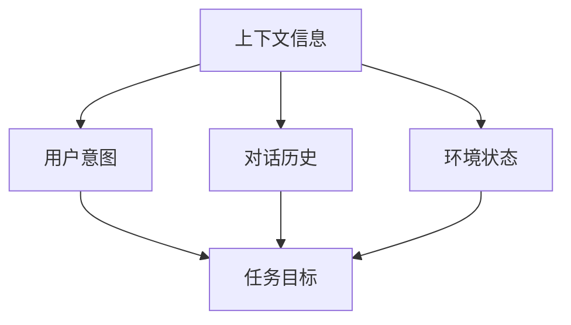
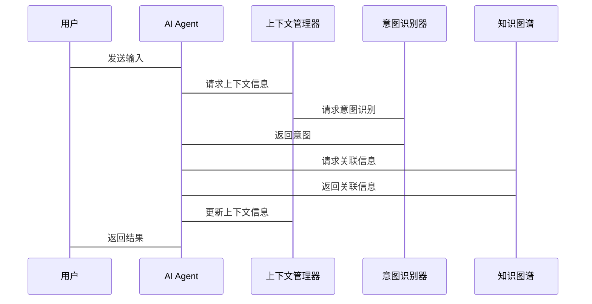

                 


# 实现AI Agent的动态上下文管理

> 关键词：AI Agent，动态上下文管理，自然语言处理，知识图谱，分布式系统，上下文理解

> 摘要：本文深入探讨AI Agent动态上下文管理的实现方法，涵盖问题背景、核心概念、算法原理、系统架构设计及项目实战。通过Mermaid图表、数学公式和代码示例，系统分析动态上下文管理的关键技术，帮助读者全面掌握其实现方法。

---

## 第一部分：AI Agent的动态上下文管理背景与核心概念

### 第1章：动态上下文管理的背景与问题描述

#### 1.1 问题背景

- **AI Agent的基本概念**
  - AI Agent是具备感知环境、自主决策和执行任务的智能体，广泛应用于自然语言处理、机器人控制等领域。
- **动态上下文管理的定义**
  - 动态上下文管理指AI Agent在与用户交互过程中，实时更新和维护上下文信息，确保信息的相关性和准确性。
- **核心要素**
  - **上下文信息**：用户意图、对话历史、环境状态等。
  - **更新机制**：根据新输入动态调整上下文。
  - **关联性评估**：确保上下文信息与当前任务的相关性。

#### 1.2 问题描述

- **AI Agent在实际应用中的挑战**
  - 上下文信息容易过时或不准确。
  - 动态环境中的信息更新需要高效机制。
  - 上下文管理的准确性直接影响用户体验。
- **动态上下文管理的核心问题**
  - 如何实时更新上下文信息。
  - 如何评估信息的相关性。
  - 如何高效存储和检索上下文数据。
- **问题解决的必要性**
  - 提高AI Agent的交互效率和准确性。
  - 优化用户体验，增强系统实用性。

#### 1.3 问题解决思路

- **动态上下文管理的解决方案**
  - 实时感知环境变化。
  - 基于意图识别更新上下文。
  - 使用知识图谱构建关联信息。
- **解决方案的核心思想**
  - 结合自然语言处理和知识图谱技术，实现上下文的动态更新和关联。
- **实现路径**
  1. 实时收集用户输入和环境数据。
  2. 利用意图识别技术提取关键信息。
  3. 更新知识图谱中的上下文信息。
  4. 基于关联性评估筛选相关信息。

#### 1.4 边界与外延

- **动态上下文管理的边界**
  - 仅关注上下文的动态更新和管理。
  - 不涉及AI Agent的具体任务执行。
- **相关概念的对比**
  - **上下文管理**：静态与动态的区别。
  - **知识图谱**：数据结构与上下文管理的关系。
  - **自然语言处理**：文本理解与上下文管理的联系。
- **技术的外延与扩展**
  - 未来可能扩展至实时语义理解、分布式系统集成等。

#### 1.5 核心要素组成

- **动态上下文管理的核心要素**
  - 实时数据采集。
  - 意图识别。
  - 知识图谱构建。
  - 关联性评估。
- **各要素之间的关系**
  - 数据采集为上下文管理提供基础。
  - 意图识别帮助提取关键信息。
  - 知识图谱构建提供信息关联性。
  - 关联性评估优化信息筛选。
- **核心要素的实现方式**
  - 数据采集：传感器、API接口。
  - 意图识别：基于Transformer的模型。
  - 知识图谱构建：实体识别、关系抽取。
  - 关联性评估：基于语义相似度计算。

### 第2章：动态上下文管理的核心概念与联系

#### 2.1 核心概念原理

- **动态上下文管理的原理**
  - 基于意图识别和知识图谱的动态更新。
  - 结合实时数据和历史信息进行关联分析。
- **核心算法的实现原理**
  - 使用Transformer模型进行上下文关联分析。
  - 基于注意力机制进行信息筛选和权重分配。
- **算法的核心思想**
  - 通过自注意力机制捕捉上下文信息的相关性。
  - 利用动态更新策略实时调整上下文内容。

#### 2.2 核心概念属性特征对比

- **动态上下文管理的属性特征**
  - **实时性**：上下文信息需要实时更新。
  - **关联性**：信息之间具有语义关联。
  - **准确性**：上下文信息需准确反映当前状态。
- **各属性特征的对比分析**
  - **实时性** vs **准确性**：实时性可能导致信息不准确，需权衡。
  - **关联性** vs **复杂性**：关联性越高，系统复杂性越大。
  - **可扩展性** vs **效率**：可扩展性要求系统具备高效处理能力。

#### 2.3 ER实体关系图架构



---

## 第三部分：动态上下文管理的算法原理

### 第3章：动态上下文管理的算法原理

#### 3.1 算法原理讲解

- **动态上下文管理的算法流程**
  1. 实时采集用户输入和环境数据。
  2. 利用意图识别模型提取用户意图。
  3. 更新知识图谱中的上下文信息。
  4. 基于自注意力机制进行信息关联分析。
  5. 根据关联性评估筛选相关信息。
  6. 返回优化后的上下文信息。
- **算法的核心步骤**
  - 数据预处理：清洗和转换输入数据。
  - 意图识别：基于Transformer模型提取意图。
  - 知识图谱更新：添加新信息并维护关联关系。
  - 自注意力机制：计算信息间的注意力权重。
  - 关联性评估：筛选相关性高的信息。
- **算法的实现细节**
  - 使用预训练的Transformer模型进行意图识别。
  - 基于图嵌入技术进行知识图谱的更新和关联分析。

#### 3.2 算法的数学模型与公式

- **损失函数**
  $$ L = \frac{1}{N}\sum_{i=1}^{N}(y_i - \hat{y}_i)^2 $$
  其中，$y_i$是真实标签，$\hat{y}_i$是预测值，$N$是样本数量。
- **梯度下降**
  $$ \theta = \theta - \eta \frac{\partial L}{\partial \theta} $$
  其中，$\theta$是模型参数，$\eta$是学习率，$\frac{\partial L}{\partial \theta}$是损失函数对参数的梯度。

#### 3.3 代码实现与应用解读

```python
import torch
import torch.nn as nn

# 定义意图识别模型
class IntentClassifier(nn.Module):
    def __init__(self, input_dim, output_dim):
        super(IntentClassifier, self).__init__()
        self.fc = nn.Linear(input_dim, output_dim)
    
    def forward(self, x):
        return self.fc(x)

# 实例化模型
model = IntentClassifier(128, 5)
criterion = nn.CrossEntropyLoss()
optimizer = torch.optim.Adam(model.parameters(), lr=0.001)

# 训练过程
for epoch in range(num_epochs):
    for inputs, labels in dataloaders:
        outputs = model(inputs)
        loss = criterion(outputs, labels)
        optimizer.zero_grad()
        loss.backward()
        optimizer.step()
```

---

## 第四部分：动态上下文管理的系统分析与架构设计

### 第4章：系统分析与架构设计

#### 4.1 系统背景与问题场景

- **项目背景**
  - 实现一个支持动态上下文管理的AI Agent，用于智能对话系统。
- **问题场景**
  - 用户与AI Agent进行多轮对话，上下文信息需要实时更新。

#### 4.2 系统功能设计

- **领域模型设计**
  ```mermaid
  classDiagram
      class 上下文管理器 {
          String current_context;
          void update_context(String context);
      }
      class 意图识别器 {
          String identify_intent(String input);
      }
      class 知识图谱 {
          String get_associated_context(String intent);
      }
      上下文管理器 --> 意图识别器: 提供上下文信息
      上下文管理器 --> 知识图谱: 获取关联信息
  ```

- **系统架构设计**
  ```mermaid
  rectangle 系统边界 {
      网络层
      数据层
      业务逻辑层
  }
  ```

- **系统接口设计**
  - API接口：提供上下文更新、意图识别等功能。
  - 接口规范：RESTful API，支持JSON格式数据传输。

#### 4.3 交互流程设计



---

## 第五部分：动态上下文管理的项目实战

### 第5章：项目实战

#### 5.1 环境安装与配置

- **安装依赖**
  ```bash
  pip install torch transformers mermaid4jupyter
  ```

#### 5.2 核心功能实现

- **上下文存储与更新**
  ```python
  class ContextManager:
      def __init__(self):
          self.context = {}
      
      def update_context(self, key, value):
          self.context[key] = value
      
      def get_context(self, key):
          return self.context.get(key, None)
  ```

- **意图识别实现**
  ```python
  class IntentRecognizer:
      def __init__(self, model_path):
          self.model = load_model(model_path)
      
      def recognize_intent(self, input_text):
          return self.model.predict(input_text)
  ```

#### 5.3 代码实现与案例分析

- **代码实现**
  ```python
  context_manager = ContextManager()
  intent_recognizer = IntentRecognizer("intent_model.pth")
  
  def process_input(input_text):
      intent = intent_recognizer.recognize_intent(input_text)
      context_manager.update_context("current_intent", intent)
      return context_manager.get_context("current_intent")
  ```

- **案例分析**
  - 输入：“我需要预订一张去北京的机票。”
    - 意图识别结果：预订机票。
    - 更新上下文：current_intent = "book_flight"

---

## 第六部分：动态上下文管理的最佳实践与小结

### 第6章：最佳实践

#### 6.1 实践总结

- **成功经验**
  - 使用预训练模型提升意图识别准确率。
  - 通过知识图谱构建实现高效信息关联。
- **常见问题**
  - 上下文信息更新不及时。
  - 关联性评估不够准确。
- **解决方案**
  - 使用分布式系统提升数据处理效率。
  - 引入实时反馈机制优化上下文管理。

#### 6.2 小结与展望

- **小结**
  - 动态上下文管理是实现高效AI Agent的关键技术。
  - 通过结合自然语言处理和知识图谱技术，可以显著提升系统性能。
- **展望**
  - 探索更高效的上下文更新算法。
  - 研究分布式系统在动态上下文管理中的应用。

#### 6.3 注意事项

- **数据隐私**
  - 注意用户数据的隐私保护，确保数据安全。
- **性能优化**
  - 优化算法复杂度，提升系统处理效率。
- **系统稳定性**
  - 确保系统的高可用性，避免单点故障。

#### 6.4 拓展阅读

- **推荐书籍**
  - 《深度学习》
  - 《自然语言处理实战》
- **推荐论文**
  - Transformer模型相关论文。
  - 知识图谱构建与应用论文。

---

## 作者：AI天才研究院/AI Genius Institute & 禅与计算机程序设计艺术/Zen And The Art of Computer Programming

