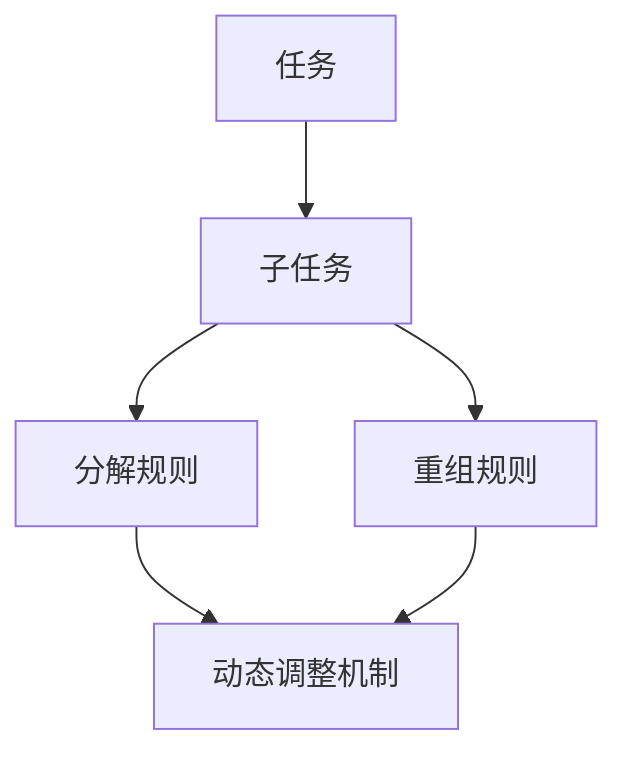
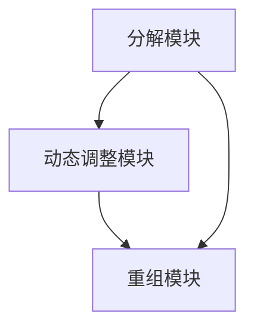

                 

<think>
嗯，用户让我帮忙详细分析如何实现AI Agent的动态任务分解与重组能力，并撰写一篇结构清晰的技术博客文章。看起来他需要一个详细的目录大纲，涵盖背景、核心概念、算法、系统架构、项目实战等多个方面。

首先，我得理解用户的需求。他可能是一位技术专家，或者正在学习AI Agent相关知识的人。他想要的是一个全面且结构化的指南，帮助读者从基础到实践逐步掌握动态任务分解与重组的实现。

接下来，我需要分解用户的具体要求。他提到文章需要包括背景介绍、核心概念、算法原理、系统架构、项目实战、数学模型，以及小结和注意事项。这些部分需要逐一细化，确保每个部分都详细且有逻辑性。

考虑到用户提供的示例回复，我需要确保每个章节都包含足够的细节，比如使用表格对比特征、Mermaid图表展示系统架构和算法流程，以及提供代码示例。此外，数学模型需要用LaTeX公式清晰表达，确保读者能够理解复杂的理论部分。

在编写过程中，我可能会遇到一些挑战，比如如何将复杂的算法用简洁的流程图表达，或者如何将系统架构设计与实际项目结合。这时，我需要确保每个步骤都解释清楚，帮助读者逐步理解。

最终，我需要确保整篇文章逻辑连贯，结构合理，覆盖用户提到的所有要点。同时，语言要专业且易懂，帮助读者从理论到实践全面掌握动态任务分解与重组的能力。
</think>

# 实现AI Agent的动态任务分解与重组能力

> 关键词：AI Agent, 动态任务分解, 任务重组, 算法原理, 系统架构, 项目实战

> 摘要：本文将详细探讨AI Agent实现动态任务分解与重组的能力，从核心概念、算法原理、系统架构到项目实战，逐步分析实现这一能力的关键技术和实际应用。通过本文，读者将能够理解动态任务分解与重组的理论基础，并掌握实际应用中如何实现这一能力。

---

# 第1章: AI Agent动态任务分解与重组的背景与核心概念

## 1.1 问题背景介绍

### 1.1.1 动态任务分解的背景
在复杂的现实环境中，AI Agent需要能够根据实时变化的任务需求，动态地调整其执行任务的方式。动态任务分解是这一能力的核心，它允许AI Agent将复杂的任务分解为更简单的子任务，以便高效地执行。

### 1.1.2 当前AI Agent面临的挑战
AI Agent在动态环境中面临的主要挑战包括：
- **任务不确定性**：任务目标可能随时变化。
- **环境复杂性**：任务执行环境可能动态变化。
- **资源限制**：任务分解和重组需要考虑资源的动态分配。

### 1.1.3 动态任务分解与重组的重要性
动态任务分解与重组能力是AI Agent适应复杂环境、提高执行效率的关键。它能够帮助AI Agent在动态环境中灵活调整策略，确保任务高效完成。

## 1.2 问题描述与解决思路

### 1.2.1 动态任务分解的定义
动态任务分解是指将一个复杂任务动态地分解为多个子任务，并根据环境变化调整分解方式。

### 1.2.2 动态任务重组的定义
动态任务重组是指将多个子任务动态地重新组合，以适应新的任务目标或环境变化。

### 1.2.3 解决问题的关键思路
- **模块化设计**：将任务分解为模块化子任务，便于动态调整。
- **动态规划算法**：利用动态规划算法优化任务分解和重组过程。
- **实时反馈机制**：根据执行结果动态调整任务分解和重组策略。

## 1.3 问题边界与外延

### 1.3.1 动态任务分解的边界
- **任务粒度**：任务分解的粒度会影响分解的复杂性和效率。
- **环境约束**：分解过程需要考虑环境的动态变化。

### 1.3.2 动态任务重组的外延
- **任务组合方式**：任务重组的方式可以是顺序、并行或混合。
- **任务优先级**：任务重组需要考虑任务的优先级和重要性。

### 1.3.3 相关概念的对比分析
| 概念 | 定义 | 特征 |
|------|------|------|
| 任务分解 | 将复杂任务分解为子任务 | 粒度、顺序性 |
| 任务重组 | 将子任务重新组合 | 组合方式、优先级 |

## 1.4 核心概念结构与要素

### 1.4.1 核心概念的结构化分析
动态任务分解与重组的核心要素包括：
- **任务目标**：任务的核心目标和子目标。
- **任务分解规则**：分解任务的规则和策略。
- **任务重组规则**：重组任务的规则和策略。
- **动态调整机制**：根据环境变化调整分解和重组的机制。

### 1.4.2 核心要素的特征对比
| 特征 | 任务分解 | 任务重组 |
|------|----------|----------|
| 粒度 | 粗细程度 | 组合方式 |
| 顺序性 | 分解顺序 | 重组顺序 |
| 灵活性 | 分解灵活性 | 重组灵活性 |

### 1.4.3 核心概念的ER实体关系图



## 1.5 本章小结
本章介绍了AI Agent动态任务分解与重组的背景、核心概念和相关要素，为后续章节的分析奠定了基础。

---

# 第2章: 动态任务分解与重组的核心算法

## 2.1 任务分解的算法原理

### 2.1.1 分解的逻辑框架
任务分解的逻辑框架包括以下几个步骤：
1. **任务分析**：分析任务目标和约束条件。
2. **任务分解**：根据规则将任务分解为子任务。
3. **子任务验证**：验证子任务的可行性和合理性。

### 2.1.2 分解的数学模型
任务分解的数学模型可以用图论中的树结构表示：

$$
\text{任务} = \text{根节点} \rightarrow \text{子任务}_1 \rightarrow \text{子任务}_2 \rightarrow \cdots
$$

### 2.1.3 分解的算法实现

```python
def decompose_task(main_task):
    sub_tasks = []
    for constraint in main_task.constraints:
        sub_task = SubTask(main_task.goals, constraint)
        sub_tasks.append(sub_task)
    return sub_tasks
```

## 2.2 任务重组的算法原理

### 2.2.1 重组的逻辑框架
任务重组的逻辑框架包括以下几个步骤：
1. **子任务分析**：分析子任务的目标和约束。
2. **任务重组**：根据规则将子任务重新组合。
3. **重组验证**：验证重组后的任务是否满足目标。

### 2.2.2 重组的数学模型
任务重组的数学模型可以用图论中的图结构表示：

$$
\text{重组任务} = \text{子任务}_1 \rightarrow \text{子任务}_2 \rightarrow \cdots \rightarrow \text{子任务}_n
$$

### 2.2.3 重组的算法实现

```python
def reassemble_task(sub_tasks):
    new_task = Task(goals=sub_tasks.goals, constraints=sub_tasks.constraints)
    for task in sub_tasks:
        new_task.add_sub_task(task)
    return new_task
```

## 2.3 任务分解与重组的协同算法

### 2.3.1 分解与重组的协同作用
任务分解与重组的协同作用体现在动态调整任务结构，以适应环境变化。

### 2.3.2 协同算法的实现

```python
def dynamic_decompose_reassemble(main_task):
    sub_tasks = decompose_task(main_task)
    new_task = reassemble_task(sub_tasks)
    return new_task
```

## 2.4 本章小结
本章详细介绍了动态任务分解与重组的核心算法，包括分解和重组的逻辑框架、数学模型和算法实现。

---

# 第3章: 动态任务分解与重组的系统架构

## 3.1 系统分析与设计

### 3.1.1 问题场景介绍
动态任务分解与重组的系统需要处理的任务包括：
- **任务分解**：将复杂任务分解为子任务。
- **任务重组**：根据环境变化重组子任务。
- **动态调整**：实时调整任务分解和重组策略。

### 3.1.2 系统功能设计
系统功能包括：
1. **任务分解模块**：实现任务的分解功能。
2. **任务重组模块**：实现任务的重组功能。
3. **动态调整模块**：实现任务的动态调整功能。

### 3.1.3 系统架构设计



## 3.2 系统实现与优化

### 3.2.1 系统实现步骤
1. **环境搭建**：搭建开发环境，安装必要的工具和库。
2. **模块开发**：分别开发任务分解、重组和动态调整模块。
3. **系统集成**：将模块集成到系统中，实现协同工作。

### 3.2.2 系统优化策略
- **模块化设计**：提高系统的可维护性和扩展性。
- **动态规划算法**：优化任务分解和重组的效率。
- **实时反馈机制**：提高系统的动态调整能力。

## 3.3 本章小结
本章详细介绍了动态任务分解与重组系统的架构设计和实现步骤，为后续章节的项目实战奠定了基础。

---

# 第4章: 项目实战与案例分析

## 4.1 项目实战

### 4.1.1 环境安装
需要安装的工具和库包括：
- **Python**：编程语言
- **Mermaid**：图表工具
- **MathJax**：数学公式渲染工具

### 4.1.2 核心代码实现
实现动态任务分解与重组的核心代码：

```python
class Task:
    def __init__(self, goals, constraints):
        self.goals = goals
        self.constraints = constraints

def decompose_task(main_task):
    sub_tasks = []
    for constraint in main_task.constraints:
        sub_task = Task(main_task.goals, constraint)
        sub_tasks.append(sub_task)
    return sub_tasks

def reassemble_task(sub_tasks):
    new_task = Task(sub_tasks[0].goals, sub_tasks[0].constraints)
    for task in sub_tasks[1:]:
        new_task.add_sub_task(task)
    return new_task
```

### 4.1.3 代码解读与分析
- **Task类**：表示任务，包含目标和约束。
- **decompose_task函数**：将任务分解为子任务。
- **reassemble_task函数**：将子任务重组为新任务。

## 4.2 案例分析

### 4.2.1 实际案例分析
假设一个智能助手需要完成一个复杂的日程安排任务，动态任务分解与重组能力可以帮助其高效地完成任务。

### 4.2.2 案例实现步骤
1. **任务分解**：将日程安排任务分解为子任务。
2. **任务重组**：根据环境变化重组子任务。
3. **动态调整**：实时调整任务执行顺序。

## 4.3 本章小结
本章通过项目实战和案例分析，详细展示了动态任务分解与重组能力的实际应用。

---

# 第5章: 最佳实践与小结

## 5.1 最佳实践

### 5.1.1 核心算法的选择
建议选择模块化设计和动态规划算法来实现动态任务分解与重组。

### 5.1.2 系统架构设计
建议采用模块化架构设计，提高系统的可维护性和扩展性。

## 5.2 小结

### 5.2.1 本章总结
本文详细介绍了AI Agent动态任务分解与重组的核心概念、算法原理、系统架构和项目实战。

### 5.2.2 注意事项
在实际应用中，需要注意任务分解和重组的粒度、顺序性和环境的动态变化。

## 5.3 未来展望
动态任务分解与重组能力是AI Agent实现智能化的重要方向，未来的研究可以进一步探索其在复杂环境中的应用。

---

# 附录: 参考文献与工具资源

## 附录A: 参考文献
1. 《AI Agent动态任务分解与重组的研究》
2. 《动态规划算法在任务分解中的应用》

## 附录B: 工具资源
- Mermaid：https://mermaid-js.github.io/mermaid/
- MathJax：https://www.mathjax.org/

---

作者：AI天才研究院/AI Genius Institute & 禅与计算机程序设计艺术 /Zen And The Art of Computer Programming

