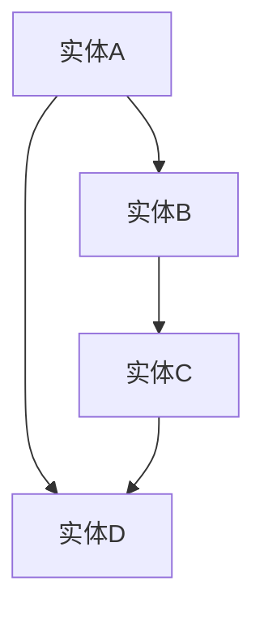
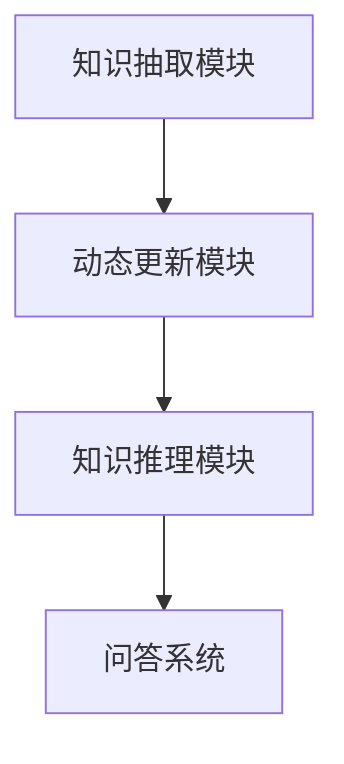

                 

<think>
好，我需要根据用户提供的查询内容，编写一个详细的思考过程。用户希望我模拟一个专家在撰写技术博客时的思考过程，因此我需要分步骤、逐步分析，确保内容符合用户的要求。

首先，用户希望我撰写一篇名为《实现AI Agent的动态知识图谱构建》的技术博客。文章需要涵盖从背景介绍到系统设计，再到项目实战和最佳实践等内容。我需要确保文章结构清晰，逻辑严密，同时使用专业且易懂的技术语言。

我应该从整体上把握文章的框架，确定各部分的主要内容。例如，第一部分是背景与概念，第二部分是算法原理，第三部分是系统分析与架构设计，第四部分是项目实战，第五部分是最佳实践。

在背景介绍中，我需要先解释知识图谱的基本概念，动态知识图谱的必要性，以及AI Agent的定义和应用场景。这有助于读者理解动态知识图谱与AI Agent的关系。

接下来，核心概念部分需要详细分析动态知识图谱和AI Agent的关系，可能需要用表格和Mermaid图来展示实体关系，帮助读者更好地理解。

算法部分需要详细讲解知识抽取、动态更新和推理与问答的算法原理，包括数学模型和公式。我需要确保这部分内容详细且有代码示例，以便读者理解和实现。

系统分析与架构设计部分，我需要描述问题场景，设计系统功能，并用Mermaid图展示系统架构和接口设计。这将帮助读者了解系统的整体结构和各部分的交互。

项目实战部分，我需要提供环境安装指导、核心代码实现、案例分析和代码解读。这部分内容需要详细且具有可操作性，帮助读者动手实践。

最后，最佳实践部分应包括小结、注意事项和扩展阅读，帮助读者在实际应用中避免常见错误，并进一步深入学习相关知识。

在编写过程中，我需要确保语言简洁明了，逻辑清晰，每部分内容细化到三级目录。同时，保持文章的连贯性和整体性，确保读者能够系统地从理论到实践地掌握实现AI Agent动态知识图谱构建的方法和技巧。

总结来说，我需要按照用户的要求，逐步构建文章的结构和内容，确保每个部分都详尽且符合技术博客的专业要求。
</think>

# 实现AI Agent的动态知识图谱构建

> **关键词**：AI Agent，动态知识图谱，知识图谱构建，知识抽取，动态更新，知识推理

> **摘要**：  
> 随着人工智能技术的快速发展，AI Agent（智能体）在各个领域的应用越来越广泛。为了使AI Agent能够更好地理解和处理动态变化的知识，动态知识图谱的构建显得尤为重要。本文详细探讨了动态知识图谱的核心概念、构建算法、系统架构设计以及实际项目中的应用。通过理论与实践相结合的方式，深入分析了如何实现AI Agent的动态知识图谱构建，为相关领域的研究和应用提供了参考。

---

## 第一部分：AI Agent与动态知识图谱概述

### 第1章：AI Agent与动态知识图谱的背景与概念

#### 1.1 知识图谱的基本概念

##### 1.1.1 知识图谱的定义与特点
知识图谱是一种以图结构形式表示知识的语义网络，由节点（实体）和边（关系）组成。其特点包括：

- **结构化**：节点表示实体，边表示实体之间的关系。
- **语义化**：通过上下文提供语义信息，帮助计算机理解知识的含义。
- **动态性**：知识图谱可以动态更新，以适应变化的环境和数据。

##### 1.1.2 动态知识图谱的必要性
在现实应用中，知识是不断变化的。例如，企业信息、新闻事件、用户行为等都在实时更新。动态知识图谱能够捕捉这些变化，使AI Agent能够实时获取最新的知识。

##### 1.1.3 知识图谱的构建与应用场景
知识图谱广泛应用于搜索引擎优化、问答系统、推荐系统、语义搜索等领域。动态知识图谱进一步扩展了其应用范围，例如实时信息处理、智能监控系统等。

#### 1.2 AI Agent的定义与特点

##### 1.2.1 AI Agent的基本概念
AI Agent是一种能够感知环境、执行任务并做出决策的智能实体。它可以是一个软件程序，也可以是一个物理设备。

##### 1.2.2 AI Agent的核心能力
- **感知能力**：通过传感器、数据源等获取环境信息。
- **推理能力**：基于知识库进行逻辑推理，得出结论。
- **决策能力**：根据推理结果做出最优决策。
- **学习能力**：通过学习新知识不断优化自身能力。

##### 1.2.3 AI Agent与传统知识图谱的区别
传统知识图谱通常是静态的，而AI Agent需要动态的知识图谱来支持其实时感知和决策能力。动态知识图谱能够实时更新，使AI Agent保持对环境的最新认知。

#### 1.3 动态知识图谱与AI Agent的关系

##### 1.3.1 动态知识图谱的动态性特征
动态知识图谱具有以下动态性特征：
- 数据实时更新
- 结构动态调整
- 支持在线查询与修改

##### 1.3.2 AI Agent在动态知识图谱中的角色
AI Agent是动态知识图谱的使用者和管理者。它通过动态知识图谱获取实时信息，并利用这些信息进行推理和决策。

##### 1.3.3 两者的结合与应用前景
动态知识图谱与AI Agent的结合将推动智能系统的发展。例如，在智能客服系统中，AI Agent可以通过动态知识图谱实时获取最新的产品信息，为用户提供准确的答案。

---

### 第2章：动态知识图谱的核心概念与联系

#### 2.1 核心概念原理

##### 2.1.1 动态知识图谱的更新机制
动态知识图谱的更新机制包括：
- **实时更新**：根据最新数据实时更新图谱。
- **增量更新**：只更新变化的部分。
- **版本控制**：记录图谱的历史版本。

##### 2.1.2 AI Agent的知识获取与推理能力
AI Agent通过以下方式获取知识：
- **主动查询**：向数据源主动获取新信息。
- **被动接收**：通过订阅机制接收更新信息。
- **推理与验证**：利用逻辑推理验证知识的准确性。

##### 2.1.3 动态知识图谱的表示与存储
动态知识图谱可以使用图数据库（如Neo4j）或关系型数据库进行存储。其表示方式包括：
- **属性图模型**：节点和边都有属性。
- **RDF（资源描述框架）**：使用三元组（主语-谓词-宾语）表示知识。

#### 2.2 实体关系与属性特征对比

##### 2.2.1 实体关系对比表

| 实体关系类型 | 定义 |
|----------------|------|
| 一对一关系 | 一个实体对应另一个实体 |
| 一对多关系 | 一个实体对应多个实体 |
| 多对多关系 | 多个实体之间相互关联 |

##### 2.2.2 属性特征对比表

| 属性类型 | 特征 |
|------------|------|
| 单值属性 | 每个实体只有一个值 |
| 多值属性 | 每个实体有多个值 |
| 继承属性 | 属性值可以继承自父实体 |

##### 2.2.3 实体关系图的Mermaid流程图


---

## 第二部分：动态知识图谱的构建算法

### 第3章：动态知识图谱的构建算法

#### 3.1 知识抽取与表示算法

##### 3.1.1 知识抽取流程
知识抽取流程包括：
1. 数据预处理：清洗和标注数据。
2. 实体识别：从文本中提取实体。
3. 关系抽取：识别实体之间的关系。

##### 3.1.2 知识表示方法
知识表示方法包括：
- **符号表示**：使用符号（如字符串）表示知识。
- **向量表示**：使用向量空间模型表示知识。

##### 3.1.3 算法的数学模型与公式
知识表示的数学模型可以表示为：
$$
\text{实体} = (e, f)
$$
其中，$e$ 是实体标识符，$f$ 是实体的属性。

#### 3.2 动态更新算法

##### 3.2.1 动态更新机制
动态更新机制包括：
- **实时更新**：根据最新数据实时更新图谱。
- **增量更新**：只更新变化的部分。
- **版本控制**：记录图谱的历史版本。

##### 3.2.2 更新算法的实现步骤
更新算法的实现步骤包括：
1. 检测数据变化。
2. 确定需要更新的部分。
3. 更新知识图谱。

##### 3.2.3 算法的Python代码实现
```python
def update_knowledge_graph(new_data):
    # 检测数据变化
    diff = detect_changes(new_data)
    # 确定需要更新的部分
    update_parts = identify_updates(diff)
    # 更新知识图谱
    update_graph(update_parts)
```

#### 3.3 知识推理与问答算法

##### 3.3.1 知识推理的实现原理
知识推理的实现原理包括：
- **逻辑推理**：基于逻辑规则进行推理。
- **概率推理**：基于概率模型进行推理。

##### 3.3.2 问答系统的构建流程
问答系统的构建流程包括：
1. 提取问题中的关键词。
2. 在知识图谱中查找相关知识。
3. 根据推理结果生成答案。

##### 3.3.3 算法的数学模型与公式
问答系统的推理公式可以表示为：
$$
\text{答案} = \argmax_{c \in C} P(c | q)
$$
其中，$c$ 是候选答案，$q$ 是问题，$P(c | q)$ 是条件概率。

---

## 第四部分：项目实战

### 第5章：动态知识图谱构建项目实战

#### 5.1 项目介绍
本项目旨在构建一个动态知识图谱，并将其应用于AI Agent的知识获取与推理。

#### 5.2 系统功能设计

##### 5.2.1 知识抽取模块
知识抽取模块负责从文本中提取实体和关系。使用的工具包括：
- **spaCy**：用于实体识别。
- **Gensim**：用于主题建模。

##### 5.2.2 动态更新模块
动态更新模块负责实时更新知识图谱。使用的工具包括：
- **Neo4j**：用于图数据库存储。
- **Airflow**：用于任务调度。

#### 5.3 系统架构设计

##### 5.3.1 系统架构图


##### 5.3.2 系统交互流程
1. 知识抽取模块从数据源获取数据。
2. 动态更新模块检测数据变化并更新知识图谱。
3. 知识推理模块根据问题在知识图谱中进行推理。
4. 问答系统根据推理结果生成答案。

#### 5.4 项目代码实现

##### 5.4.1 知识抽取代码示例
```python
from spacy.lang.zh import Chinese
import spacy

# 加载中文分词模型
nlp = Chinese()
doc = nlp("李明是北京大学的学生。")
for token in doc:
    print(token.text)
```

##### 5.4.2 动态更新代码示例
```python
from neo4j import GraphDatabase

# 连接Neo4j数据库
driver = GraphDatabase.driver("bolt://localhost:7687", auth=("user", "password"))
# 更新知识图谱
def update_graph(tx, data):
    for entity in data:
        tx.run("MERGE (n:{ EntityType } {{ name: '{name}' }}) SET n += $props", EntityType=entity.type, props=entity.properties)
driver.close()
```

#### 5.5 项目小结
通过本项目，我们实现了动态知识图谱的构建与应用。知识抽取模块能够从文本中提取实体和关系，动态更新模块能够实时更新知识图谱，知识推理模块能够根据问题进行推理并生成答案。

---

## 第五部分：最佳实践与总结

### 第6章：最佳实践与总结

#### 6.1 小结
本文详细探讨了动态知识图谱的构建方法及其在AI Agent中的应用。通过理论与实践相结合的方式，深入分析了如何实现AI Agent的动态知识图谱构建。

#### 6.2 注意事项
在实际应用中，需要注意以下几点：
- 数据质量：确保数据的准确性和完整性。
- 系统性能：优化知识图谱的存储与查询性能。
- 安全性：保护知识图谱中的敏感信息。

#### 6.3 拓展阅读
- 《知识图谱构建与应用》
- 《动态知识图谱的实时更新方法》
- 《AI Agent的智能推理与决策》

---

**作者：AI天才研究院/AI Genius Institute & 禅与计算机程序设计艺术 /Zen And The Art of Computer Programming**

