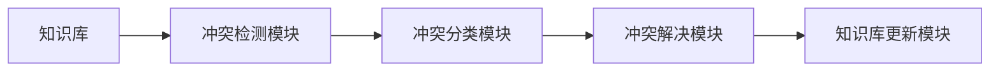

                 

<think>
嗯，我现在需要帮用户撰写一篇技术博客，主题是《实现AI Agent的动态知识库冲突解决机制》。用户还提供了一个详细的目录大纲，我需要按照这个大纲来撰写文章，确保每个部分都详细且符合要求。

首先，我需要理解用户的需求。用户希望文章结构清晰，逻辑严密，内容专业且易于理解。文章需要涵盖背景、核心概念、算法原理、系统架构、项目实战和总结等部分，每个部分都要有详细的解释和示例。

接下来，我会按照目录大纲逐步展开每个章节的内容。首先是引言部分，介绍AI Agent和动态知识库的背景，明确问题，然后是解决思路。接下来是核心概念，详细讲解冲突检测、分类和解决策略。然后是算法部分，用数学模型和Python代码来说明。之后是系统架构设计，用Mermaid图展示。项目实战部分包括代码实现和案例分析。最后是总结和最佳实践。

在撰写过程中，我需要确保每个部分都包含足够的细节，比如在算法部分，用Mermaid流程图展示检测和解决过程，并提供代码示例。同时，数学公式要用LaTeX格式，确保正确性和可读性。在系统架构部分，使用类图和交互图来展示模块之间的关系。

我还需要注意文章的结构，确保每个章节之间有良好的过渡，逻辑连贯。此外，语言要专业但通俗易懂，避免过于复杂的术语堆砌，同时保持技术深度。

现在，我需要开始撰写每个章节，确保每个部分都符合用户的要求，并且内容丰富、详细。遇到复杂概念时，我会尝试用例子或图表来辅助说明，确保读者能够理解。

在写作过程中，可能会遇到一些挑战，比如如何用简单的语言解释复杂的算法，或者如何将理论与实际项目结合。这时候，我需要查阅相关资料，确保信息的准确性，并参考已有的项目案例，提供具体的代码和分析。

总之，我会按照用户提供的目录大纲，一步步展开内容，确保每个部分都详尽且符合要求，最终完成一篇高质量的技术博客文章。
</think>

# 实现AI Agent的动态知识库冲突解决机制

## 关键词：AI Agent, 动态知识库, 冲突解决, 知识图谱, 算法原理, 系统架构, 项目实战

## 摘要：  
AI Agent在动态知识库中面临知识冲突的问题，如何有效解决这些冲突是实现高效知识管理的关键。本文从理论到实践，系统性地探讨了动态知识库冲突解决机制的实现方法，包括核心概念、算法原理、系统架构设计和项目实战。通过详细分析冲突检测、分类与解决策略，结合具体实现代码和案例分析，为AI Agent的知识管理提供了一套完整的解决方案。

---

## 第一部分：引言

### 第1章：AI Agent与动态知识库的背景

#### 1.1 AI Agent的基本概念
- **1.1.1 AI Agent的定义**  
  AI Agent（智能体）是指能够感知环境、自主决策并执行任务的智能系统。它可以分为简单反射Agent和基于模型的反射Agent两类。  
- **1.1.2 AI Agent的核心特征**  
  - **自主性**：能够自主决策和行动。  
  - **反应性**：能够实时感知环境并做出反应。  
  - **目标导向**：以特定目标为导向执行任务。  
- **1.1.3 动态知识库的特性**  
  动态知识库是指能够实时更新、自适应调整的知识存储系统，具有以下特点：  
  - 数据来源多样：包括结构化数据、非结构化数据和外部API调用。  
  - 高实时性：能够快速响应变化。  
  - 自适应性：能够根据上下文调整知识表示方式。  

#### 1.2 问题背景与描述
- **1.2.1 知识库冲突的定义**  
  知识库冲突是指在知识库中存在相互矛盾或不一致的知识条目。例如，同一实体在不同数据源中有不同的属性描述。  
- **1.2.2 冲突产生的原因**  
  - 数据来源多样化导致的信息不一致。  
  - 数据更新过程中出现的版本冲突。  
  - 知识表示方式的差异。  
- **1.2.3 冲突对AI Agent的影响**  
  - 降低决策的准确性。  
  - 影响系统的实时性和响应速度。  
  - 增加计算复杂度。  

#### 1.3 解决思路与目标
- **1.3.1 确定解决冲突的目标**  
  - 最大化知识一致性。  
  - 最小化冲突对决策的影响。  
  - 提高系统的可解释性。  
- **1.3.2 设计解决机制的基本思路**  
  - **检测冲突**：识别知识库中的冲突条目。  
  - **分类冲突**：根据冲突的性质进行分类。  
  - **解决冲突**：选择合适的策略消除冲突。  
- **1.3.3 机制的核心要素**  
  - 冲突检测算法。  
  - 冲突分类模型。  
  - 冲突解决策略。  

---

## 第二部分：冲突解决机制的核心概念

### 第2章：动态知识库冲突解决机制

#### 2.1 冲突检测机制
- **2.1.1 冲突检测的定义**  
  冲突检测是指在知识库中发现相互矛盾或不一致的知识条目的过程。  
- **2.1.2 基于规则的冲突检测方法**  
  - **规则定义**：通过预定义的规则检测冲突。例如，检测同一实体的属性是否存在矛盾描述。  
  - **规则匹配**：将知识库中的条目与规则进行匹配，发现冲突。  
- **2.1.3 基于相似度的冲突检测方法**  
  - **相似度计算**：使用余弦相似度或Jaccard相似度衡量条目之间的相似性。  
  - **冲突识别**：当相似度低于阈值时，认为存在冲突。  

#### 2.2 冲突分类与解决策略
- **2.2.1 冲突的分类标准**  
  - **冲突类型**：逻辑冲突、语义冲突和表示冲突。  
  - **冲突严重程度**：分为高、中、低三个级别。  
- **2.2.2 不同冲突类型的解决策略**  
  - **逻辑冲突**：通过逻辑推理消除冲突。  
  - **语义冲突**：通过语义分析和上下文信息调整知识表示。  
  - **表示冲突**：通过统一知识表示方式消除冲突。  
- **2.2.3 策略选择的影响因素**  
  - 冲突的类型。  
  - 冲突的严重程度。  
  - 知识库的更新频率。  

---

## 第三部分：算法原理

### 第3章：冲突检测与分类算法

#### 3.1 冲突检测算法
- **3.1.1 基于规则的冲突检测流程**  
  ```mermaid
  graph LR
      A[开始] --> B[加载知识库]
      B --> C[遍历知识条目]
      C --> D[检查冲突规则]
      D --> E[记录冲突]
      E --> F[结束]
  ```
  - **规则定义**：例如，规则1：同一实体的属性值不能冲突。  
  - **规则匹配**：将知识库中的条目与规则进行匹配，发现冲突。  
- **3.1.2 基于相似度的冲突检测流程**  
  ```mermaid
  graph LR
      A[开始] --> B[加载知识库]
      B --> C[计算条目相似度]
      C --> D[判断相似度是否低于阈值]
      D --> E[记录冲突]
      E --> F[结束]
  ```
  - **相似度计算**：使用余弦相似度或Jaccard相似度。  
  - **冲突识别**：当相似度低于阈值时，认为存在冲突。  
- **3.1.3 深度学习模型的应用**  
  - **模型选择**：使用BERT或GPT模型进行语义分析。  
  - **冲突检测**：通过模型输出的概率判断是否存在冲突。  

#### 3.2 冲突分类算法
- **3.2.1 分类方法的比较**  
  - **基于规则的方法**：简单但覆盖性差。  
  - **基于相似度的方法**：通用性好但不够精确。  
  - **基于深度学习的方法**：精度高但计算复杂。  
- **3.2.2 基于特征的分类模型**  
  ```mermaid
  graph LR
      A[开始] --> B[提取冲突特征]
      B --> C[训练分类模型]
      C --> D[分类冲突类型]
      D --> E[结束]
  ```
  - **特征提取**：提取冲突的类型、严重程度等特征。  
  - **模型训练**：使用支持向量机（SVM）或随机森林（Random Forest）进行训练。  
- **3.2.3 分类算法的优缺点分析**  
  - **优点**：能够处理复杂的冲突类型。  
  - **缺点**：需要大量的训练数据。  

---

## 第四部分：系统架构设计

### 第4章：系统架构与交互设计

#### 4.1 系统架构图

- **模块划分**：  
  - 知识库模块：存储和管理知识条目。  
  - 冲突检测模块：检测知识库中的冲突。  
  - 冲突分类模块：对冲突进行分类。  
  - 冲突解决模块：消除冲突。  
  - 知识库更新模块：更新知识库。  

#### 4.2 系统交互图

- **交互流程**：  
  1. 用户提交知识更新请求。  
  2. 知识库更新模块将更新请求加入知识库。  
  3. 冲突检测模块检测知识库中的冲突。  
  4. 冲突分类模块对冲突进行分类。  
  5. 冲突解决模块消除冲突。  
  6. 知识库更新模块更新知识库。  
  7. 用户收到反馈。  

---

## 第五部分：项目实战

### 第5章：项目实现与案例分析

#### 5.1 环境安装
- **Python版本**：Python 3.8+  
- **依赖库安装**：  
  ```bash
  pip install numpy pandas scikit-learn
  ```

#### 5.2 核心代码实现
- **冲突检测模块**  
  ```python
  def detect_conflict(knowledge_base):
      # 遍历知识库中的每个条目
      for entry in knowledge_base:
          # 检查是否存在冲突
          if check_conflict(entry):
              return True
      return False
  ```

- **冲突分类模块**  
  ```python
  from sklearn.svm import SVC
  def classify_conflict(conflicts):
      # 提取冲突特征
      features = extract_features(conflicts)
      # 训练分类模型
      model = SVC()
      model.fit(features, labels)
      return model.predict(features)
  ```

#### 5.3 案例分析
- **案例背景**：假设知识库中有两个关于“首都”的条目，一个是“北京是首都”，另一个是“上海是首都”。  
- **冲突检测**：检测到冲突。  
- **冲突分类**：语义冲突。  
- **冲突解决**：选择“北京是首都”作为正确条目。  

---

## 第六部分：总结与展望

### 第6章：总结与未来方向

#### 6.1 总结
- **核心内容回顾**  
  本文系统性地探讨了AI Agent动态知识库冲突解决机制的实现方法，从理论到实践，详细讲解了冲突检测、分类和解决的算法与系统架构。  
- **主要贡献**  
  提供了一套完整的冲突解决机制，能够有效提高知识库的准确性和一致性。  

#### 6.2 注意事项与最佳实践
- **数据质量**：确保数据来源的多样性和准确性。  
- **模型选择**：根据具体场景选择合适的冲突检测和分类算法。  
- **系统维护**：定期更新知识库和优化冲突解决机制。  

#### 6.3 未来方向
- **算法优化**：研究更高效的冲突检测和分类算法。  
- **多模态数据处理**：结合文本、图像等多种数据形式进行冲突解决。  
- **分布式系统应用**：研究分布式知识库中的冲突解决机制。  

---

## 作者：AI天才研究院 & 禅与计算机程序设计艺术  
**联系方式**：contact@ai-genius.com

