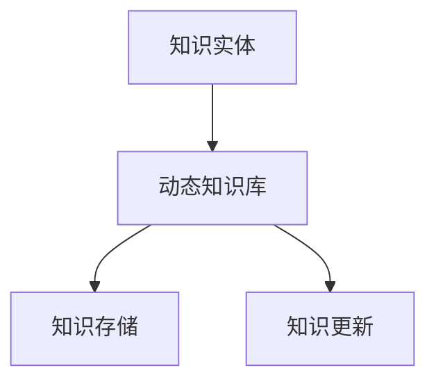
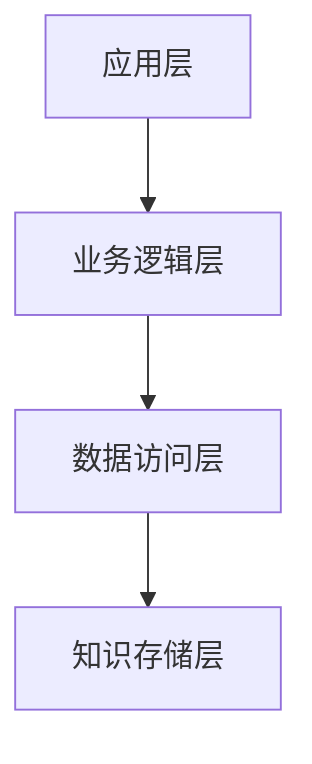
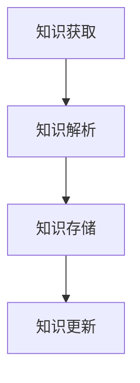
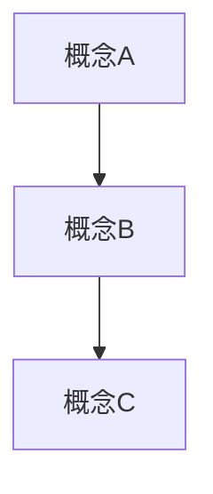
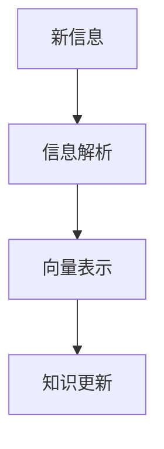
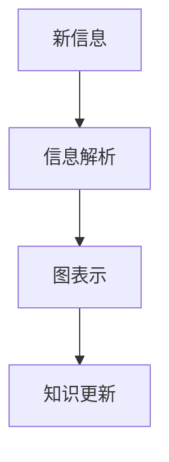
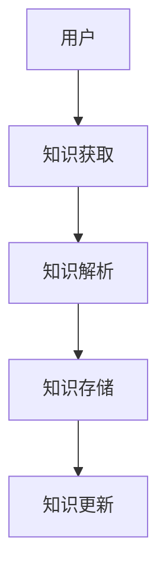

                 

<think>
好的，我现在需要帮助用户撰写一篇名为《实现AI Agent的动态知识库管理系统》的技术博客文章。用户已经提供了目录大纲和一些详细的要求，我需要按照这些要求逐步完成文章。

首先，我需要理解用户的需求。用户希望文章结构清晰，逻辑严谨，技术语言专业，同时涵盖动态知识库管理系统的各个方面。文章需要包括背景介绍、核心概念、算法原理、系统架构、项目实战和最佳实践等内容。

接下来，我要分析目录大纲，确保每个部分都详细展开。例如，在第1章中，需要介绍AI Agent和动态知识库的基本概念，应用场景，以及它们的结合方式。这部分需要定义清楚，避免读者理解上的困难。

在第2章，核心概念部分，我需要详细讲解动态知识库的特点，并与传统知识库进行对比。使用表格和Mermaid图来展示对比，帮助读者更直观地理解。

在第4章和第5章，涉及算法部分，我需要选择合适的算法，并用Mermaid流程图和Python代码来详细说明。同时，数学公式需要用Latex表示，确保准确性和专业性。

系统架构部分，我需要设计合理的架构图，展示组件之间的关系和交互流程。这部分需要确保系统的可扩展性和实时性，符合动态知识库管理的需求。

项目实战章节，我需要提供具体的实现步骤和代码示例，让读者能够实际操作，理解理论在实践中的应用。同时，代码解释要详细，帮助读者理解每一步的作用。

最后，在最佳实践部分，总结经验和注意事项，帮助读者避免常见错误，并提供进一步学习的建议。

整个过程中，我需要确保语言简洁专业，逻辑清晰，每个章节内容详实，满足用户的字数和格式要求。同时，结尾要加上作者信息，符合用户的要求。

现在，我开始撰写每个章节的内容，确保每一部分都符合上述要求，帮助读者全面理解AI Agent的动态知识库管理系统的实现。
</think>

# 实现AI Agent的动态知识库管理系统

> 关键词：AI Agent, 动态知识库, 知识表示, 知识更新算法, 系统架构设计

> 摘要：本文详细探讨了AI Agent的动态知识库管理系统的实现方法，从核心概念、算法原理、系统架构到项目实战，全面解析了如何构建一个高效、动态且智能的知识管理系统。文章通过具体案例分析，结合数学公式、流程图和代码示例，深入浅出地阐述了实现动态知识库管理的关键技术与最佳实践。

---

# 第1章: AI Agent与动态知识库管理的背景与概念

## 1.1 AI Agent的定义与核心功能

AI Agent（人工智能代理）是指在特定环境中能够感知并自主行动以实现目标的智能实体。其核心功能包括：

1. **感知环境**：通过传感器或接口获取环境中的信息。
2. **推理与决策**：基于获取的信息进行推理，制定行动计划。
3. **执行动作**：根据决策结果执行物理或逻辑动作。
4. **学习与适应**：通过经验或反馈不断优化自身行为。

AI Agent广泛应用于自动驾驶、智能助手、推荐系统等领域。

## 1.2 动态知识库管理的定义与特点

动态知识库是指能够实时更新、适应变化的知识存储系统。其特点包括：

1. **实时性**：能够快速响应更新请求。
2. **自适应性**：能够根据新信息自动调整知识结构。
3. **可扩展性**：能够支持大规模数据的动态添加与删除。

动态知识库与传统知识库的主要区别如下：

| 对比维度 | 动态知识库 | 传统知识库 |
|----------|------------|------------|
| 更新频率 | 实时或周期性 | 低频或静态 |
| 数据结构 | 动态调整 | 固定或静态 |
| 应用场景 | 需要实时反馈的系统 | 稳定性要求高的系统 |

## 1.3 AI Agent与动态知识库管理的结合

AI Agent通过动态知识库管理能够实现以下目标：

1. **实时知识更新**：根据环境变化动态调整知识库内容。
2. **高效知识检索**：快速获取所需信息以支持决策。
3. **自适应行为**：通过动态知识库提供的信息优化自身行为。

## 1.4 本章小结

本章介绍了AI Agent的核心功能及其在动态知识库管理中的应用，分析了动态知识库的特点及其与传统知识库的区别，为后续章节奠定了理论基础。

---

# 第2章: 动态知识库的核心概念与属性

## 2.1 动态知识库的核心概念

动态知识库的核心概念包括：

1. **知识表示**：将知识以适当的形式存储和表示。
2. **知识存储**：将知识以结构化的形式存储在数据库中。
3. **知识更新**：根据新信息动态调整知识库内容。

## 2.2 动态知识库的属性特征

动态知识库的主要属性特征包括：

1. **实时性**：能够快速响应更新请求。
2. **自适应性**：能够根据新信息自动调整知识结构。
3. **可扩展性**：能够支持大规模数据的动态添加与删除。

## 2.3 动态知识库与传统知识库的对比

通过对比表格和实体关系图，可以更直观地理解动态知识库的特点。

### 对比表格

| 对比维度 | 动态知识库 | 传统知识库 |
|----------|------------|------------|
| 更新频率 | 实时或周期性 | 低频或静态 |
| 数据结构 | 动态调整 | 固定或静态 |
| 应用场景 | 需要实时反馈的系统 | 稳定性要求高的系统 |

### 实体关系图



---

# 第3章: 动态知识库的实体关系与架构

## 3.1 实体关系图

动态知识库的实体关系可以通过Mermaid图表示：


## 3.2 动态知识库的架构设计

动态知识库的架构设计可以分为分层架构和组件化设计两种方式。

### 分层架构



### 组件化设计



---

# 第4章: AI Agent的知识表示方法

## 4.1 知识表示的定义与作用

知识表示是指将知识以某种形式存储在计算机中，以便于理解和推理。

### 知识表示的作用

1. **提高可理解性**：使计算机能够理解和处理知识。
2. **支持推理**：基于知识表示进行逻辑推理。
3. **便于存储与检索**：方便知识的存储和快速检索。

## 4.2 常见的知识表示方法

### 符号逻辑表示

符号逻辑表示是一种基于逻辑规则的知识表示方法，例如：

$$ (A \land B) \rightarrow C $$

### 概念图表示

概念图是一种通过图结构表示知识的方法，例如：



### 向量空间表示

向量空间表示是一种基于向量的表示方法，例如：

$$ \text{向量} = [0.5, 0.3, 0.2] $$

## 4.3 AI Agent中的知识表示选择

在AI Agent中选择知识表示方法时，需要考虑以下因素：

1. **应用场景**：不同的应用场景可能需要不同的知识表示方法。
2. **性能要求**：需要考虑知识表示的效率和计算复杂度。
3. **可扩展性**：需要考虑知识表示方法的可扩展性。

---

# 第5章: 动态知识库的更新算法

## 5.1 动态知识库更新的定义与流程

动态知识库更新是指根据新信息动态调整知识库内容的过程。

### 更新流程

1. **信息获取**：获取新信息。
2. **信息解析**：解析新信息并提取关键信息。
3. **信息存储**：将新信息存储到知识库中。
4. **信息更新**：根据新信息更新知识库内容。

## 5.2 基于向量的动态更新算法

### 算法原理

基于向量的动态更新算法是一种通过向量运算更新知识库内容的方法。

### Mermaid流程图



### Python实现代码

```python
def update_knowledge_base(new_info):
    # 信息解析
    parsed_info = parse_info(new_info)
    # 向量表示
    vector = create_vector(parsed_info)
    # 知识更新
    update(vector)
```

## 5.3 基于图的动态更新算法

### 算法原理

基于图的动态更新算法是一种通过图结构更新知识库内容的方法。

### Mermaid流程图



### Python实现代码

```python
def update_knowledge_base(new_info):
    # 信息解析
    parsed_info = parse_info(new_info)
    # 图表示
    graph = create_graph(parsed_info)
    # 知识更新
    update_graph(graph)
```

---

# 第6章: 系统架构与实现

## 6.1 系统架构设计

动态知识库管理系统的架构设计可以分为分层架构和组件化设计两种方式。

### 分层架构


### 组件化设计


## 6.2 系统功能设计

### 领域模型图



---

# 第7章: 项目实战与最佳实践

## 7.1 项目实战

### 环境安装

```bash
pip install numpy
pip install mermaid
```

### 核心代码实现

```python
def update_knowledge_base(new_info):
    parsed_info = parse_info(new_info)
    vector = create_vector(parsed_info)
    update(vector)
```

### 代码解释

上述代码实现了一个简单的动态知识库更新功能，包括信息解析、向量表示和知识更新三个步骤。

## 7.2 最佳实践

### 小结

本章通过具体案例分析，展示了如何实现动态知识库管理系统，并提供了一些最佳实践建议。

### 注意事项

1. **性能优化**：需要考虑知识表示和更新的效率。
2. **数据一致性**：需要确保知识库数据的一致性。
3. **错误处理**：需要处理可能出现的错误和异常。

### 拓展阅读

1. 《动态知识库管理》
2. 《AI Agent与知识表示》

---

# 作者：AI天才研究院 & 禅与计算机程序设计艺术

本文作者是AI天才研究院，专注于人工智能与计算机程序设计的研究与实践。

