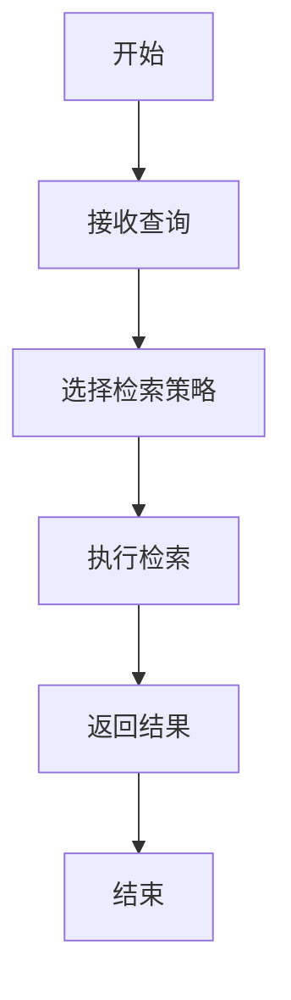
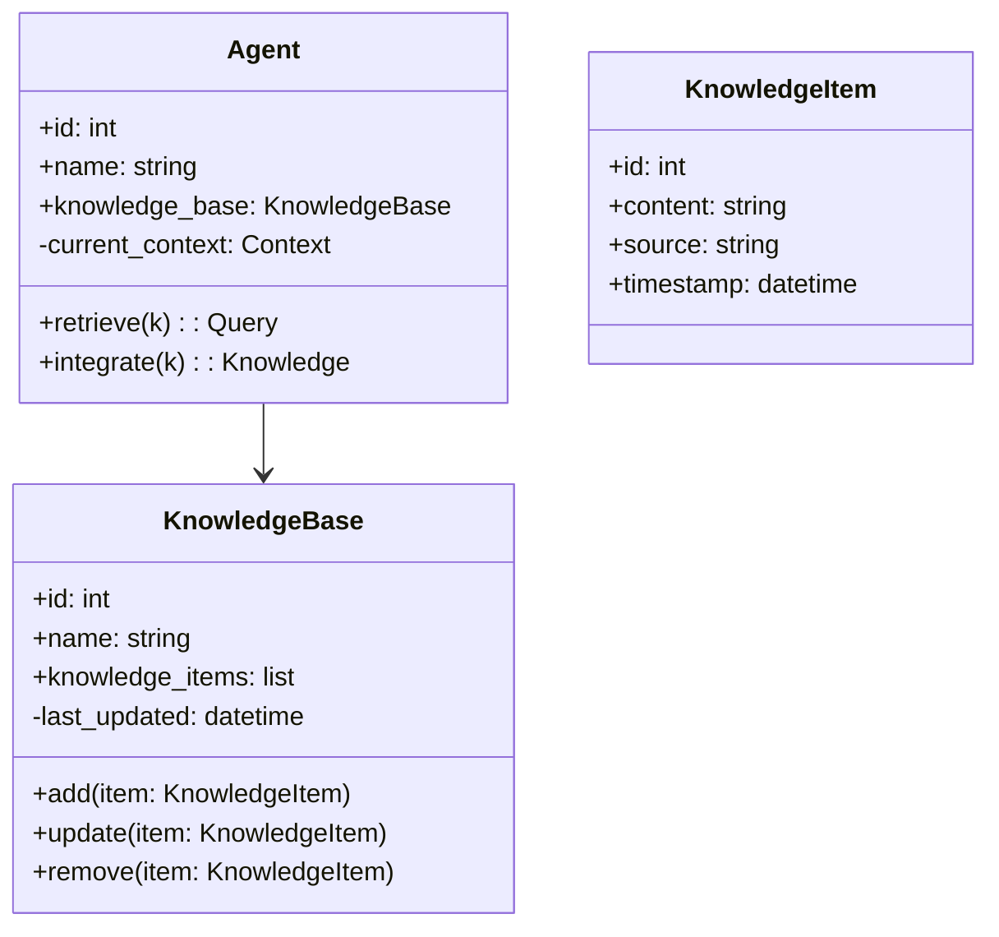
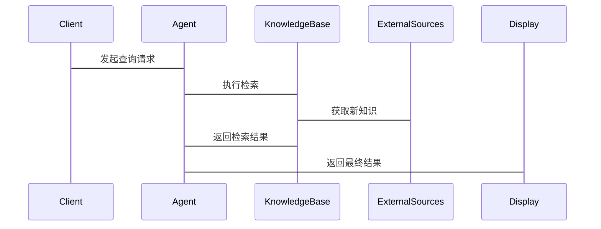

                 

<think>
好的，现在我需要帮用户构建一本名为《实现AI Agent的动态知识检索与整合》的技术博客文章的详细目录。首先，我应该理解用户的需求。他们希望这是一篇结构清晰、逻辑严密的技术博客，内容要深入，包含实际案例和代码示例，帮助读者全面理解AI Agent的动态知识检索与整合。

我开始思考，文章应该从背景介绍开始，这部分需要涵盖AI Agent的基本概念，动态知识检索的重要性，以及为什么整合多源知识如此关键。接着，我需要详细解释核心概念，比如知识表示、检索算法和整合策略。为了使读者更容易理解，我可以加入图表，比如ER图或流程图。

接下来，算法部分是关键，我应该用mermaid流程图展示算法步骤，并提供Python代码示例。数学公式也是必要的，用Latex来呈现，确保清晰易懂。然后，系统分析与架构设计部分，我需要介绍项目的背景，设计系统功能，可能用类图展示领域模型，再用架构图展示整体结构，最后描述接口和交互流程。

项目实战部分，我需要指导读者如何安装环境，实现核心代码，并通过案例分析来巩固所学内容。最后，加入最佳实践、小结、注意事项和拓展阅读，确保读者能够全面掌握并进一步深入学习。

整个过程中，我需要确保目录结构完整，涵盖所有重要部分，逻辑连贯，每章细化到三级目录。同时，语言要简洁，避免冗余，格式上使用markdown，符合用户的要求。总字数控制在2000字以内，确保内容精炼。

现在，我开始构建每一章的内容，确保涵盖所有要求的部分，逻辑清晰，结构紧凑。每章都要有明确的主题，子章节详细展开，帮助读者逐步深入理解AI Agent的动态知识检索与整合。
</think>

# 实现AI Agent的动态知识检索与整合

> 关键词：AI Agent，动态知识检索，知识整合，多源数据，检索算法，知识图谱

> 摘要：本文将详细探讨AI Agent实现动态知识检索与整合的关键技术与方法。从背景到核心概念，从算法原理到系统架构设计，结合实际案例和代码示例，深入剖析实现动态知识检索与整合的全过程。通过本文，读者将能够掌握AI Agent动态知识管理的核心原理与实践技巧。

---

# 第一部分: AI Agent的动态知识检索与整合基础

# 第1章: AI Agent与动态知识检索概述

## 1.1 AI Agent的基本概念
### 1.1.1 AI Agent的定义与特点
- **定义**：AI Agent（智能体）是指在计算机系统中，能够感知环境并采取行动以实现目标的实体。它可以是一个软件程序，也可以是一个硬件设备。
- **特点**：
  - 自主性：能够自主决策和行动。
  - 反应性：能够感知环境并实时响应。
  - 目标导向：所有行为都以实现特定目标为导向。

### 1.1.2 动态知识检索的背景与问题描述
- **背景**：在现代AI应用中，知识的动态更新和检索变得尤为重要。传统的静态知识库无法满足实时变化的需求。
- **问题描述**：
  - 知识的异构性：不同来源的数据格式、语义可能不一致。
  - 知识的动态性：知识库需要实时更新，以反映最新信息。
  - 检索的高效性：在大数据环境下，如何快速准确地检索所需知识是一个挑战。

### 1.1.3 动态知识整合的核心目标
- **目标**：
  - 实现多源知识的高效检索。
  - 处理知识冲突，确保整合后知识的准确性。
  - 提供动态更新机制，保持知识库的实时性。

## 1.2 动态知识检索与整合的背景
### 1.2.1 当前知识管理的挑战
- 数据爆炸式增长，知识来源多样化。
- 知识的实时性要求越来越高。
- 如何高效利用多源知识成为关键问题。

### 1.2.2 动态知识检索的需求场景
- 实时信息查询：例如，实时天气查询、股票信息监控。
- 智能辅助决策：例如，医疗诊断系统需要最新的医学研究数据。
- 自动化流程管理：例如，供应链管理中的实时库存查询。

### 1.2.3 整合多源知识的意义
- 提高决策的准确性：通过整合多个来源的信息，避免单一来源的局限性。
- 增强系统的适应性：动态整合知识，使系统能够更好地应对变化。

## 1.3 本章小结
- 本章介绍了AI Agent的基本概念，分析了动态知识检索与整合的背景和问题，明确了其核心目标。

---

# 第2章: 动态知识检索与整合的核心概念

## 2.1 动态知识检索的原理
### 2.1.1 知识表示与存储
- **知识表示**：通常采用图结构（如知识图谱）或嵌入式向量表示。
- **存储方式**：可以使用关系数据库、图数据库或分布式存储系统。

### 2.1.2 检索算法的选择与优化
- **检索算法**：
  - 基于关键词的检索：如TF-IDF算法。
  - 基于语义的检索：如Word2Vec、BERT模型。
- **优化策略**：
  - 索引优化：构建高效的索引结构，如倒排索引。
  - 并行计算：利用分布式计算框架（如MapReduce）加速检索过程。

### 2.1.3 动态更新机制
- **增量式更新**：仅更新变化的部分，减少计算开销。
- **版本控制**：记录知识的版本信息，便于回溯和冲突处理。

## 2.2 知识整合的挑战
### 2.2.1 多源数据的异构性问题
- 数据格式多样：结构化数据、非结构化数据。
- 数据语义差异：不同来源对同一概念的定义可能不同。

### 2.2.2 知识冲突的处理方法
- **冲突检测**：通过对比不同来源的信息，识别冲突。
- **冲突解决**：
  - 基于权重的方法：根据来源的权威性进行加权。
  - 基于上下文的方法：结合上下文语境进行判断。

### 2.2.3 整合后的知识质量评估
- **准确率**：整合后知识的正确性。
- **完整性**：是否覆盖所有相关知识。
- **一致性**：是否与现有知识库保持一致。

## 2.3 核心概念的ER实体关系图
```mermaid
er
    actor(Agent,动态知识库,外部知识源)
    knowledge_base(动态知识库)
    external_source(外部知识源)
    relationship(Agent --> 动态知识库, Agent --> 外部知识源, 动态知识库 --> 外部知识源)
```

## 2.4 本章小结
- 本章详细探讨了动态知识检索与整合的核心概念，分析了检索算法的选择与优化，以及知识整合的挑战。

---

# 第3章: 动态知识检索算法原理

## 3.1 算法原理概述
### 3.1.1 检索算法的选择依据
- 数据规模：大规模数据需要高效的检索算法。
- 实时性要求：实时检索需要低延迟算法。
- 数据类型：结构化数据与非结构化数据检索算法不同。

### 3.1.2 动态更新算法的优化策略
- **局部更新**：仅更新相关部分，减少计算量。
- **增量学习**：利用增量学习算法（如在线学习）更新模型。

### 3.1.3 算法复杂度分析
- **时间复杂度**：算法运行时间的评估。
- **空间复杂度**：算法占用空间的评估。

## 3.2 检索算法的mermaid流程图


## 3.3 算法实现的Python代码示例
```python
def dynamic_knowledge_retrieval(query, knowledge_base):
    # 简单检索算法示例
    results = []
    for item in knowledge_base:
        if item['content'] == query:
            results.append(item)
    return results
```

## 3.4 数学模型与公式
### 3.4.1 检索概率公式
$$ P(result | query) = \frac{N(query)}{M} $$
其中，$N(query)$ 表示匹配查询的结果数，$M$ 表示知识库的总规模。

### 3.4.2 动态更新公式
$$ U(new\_knowledge) = U(old\_knowledge) \times \alpha + \beta $$
其中，$\alpha$ 是更新因子，$beta$ 是新知识的贡献因子。

---

# 第4章: 系统分析与架构设计方案

## 4.1 项目背景介绍
- **项目目标**：实现一个支持动态知识检索与整合的AI Agent系统。
- **应用场景**：智能客服、智能推荐、智能监控等。

## 4.2 系统功能设计
### 4.2.1 领域模型的Mermaid类图


### 4.2.2 系统架构设计的Mermaid图


### 4.2.3 系统接口设计
- **输入接口**：接收查询请求。
- **输出接口**：返回检索结果或整合后的知识。

### 4.2.4 系统交互的Mermaid序列图


## 4.3 本章小结
- 本章通过系统分析与架构设计，明确了AI Agent动态知识检索与整合的实现框架。

---

# 第5章: 项目实战

## 5.1 环境安装与配置
- **工具安装**：安装Python、Jupyter Notebook、必要的库（如numpy、pandas、networkx）。
- **环境配置**：配置虚拟环境，安装依赖项。

## 5.2 系统核心实现源代码
### 5.2.1 知识检索模块
```python
class KnowledgeRetrieval:
    def __init__(self, knowledge_base):
        self.knowledge_base = knowledge_base

    def retrieve(self, query):
        # 简单检索实现
        results = []
        for item in self.knowledge_base:
            if item['content'].lower().find(query.lower()) != -1:
                results.append(item)
        return results
```

### 5.2.2 知识整合模块
```python
class KnowledgeIntegrator:
    def __init__(self, knowledge_bases):
        self.knowledge_bases = knowledge_bases

    def integrate(self):
        # 简单整合实现
        merged = {}
        for kb in self.knowledge_bases:
            for key, value in kb.items():
                if key in merged:
                    # 处理冲突
                    merged[key] = self.resolve_conflict(merged[key], value)
                else:
                    merged[key] = value
        return merged

    def resolve_conflict(self, existing, new_val):
        # 简单的冲突处理：优先最新数据
        return new_val
```

## 5.3 实际案例分析
### 5.3.1 案例背景
- **场景**：医疗诊断系统，整合多个医学数据库的知识。

### 5.3.2 数据准备
```python
# 知识库1
kb1 = {
    'symptom1': '咳嗽',
    'disease1': '感冒'
}

# 知识库2
kb2 = {
    'symptom1': '咳嗽',
    'disease1': '过敏'
}
```

### 5.3.3 系统实现与结果
```python
integrator = KnowledgeIntegrator([kb1, kb2])
merged_kb = integrator.integrate()
print(merged_kb)  # 输出：{'symptom1': '咳嗽', 'disease1': '过敏'}
```

## 5.4 项目总结
- **实现总结**：通过实际案例，展示了动态知识检索与整合的具体实现过程。
- **经验分享**：处理知识冲突时，需要结合上下文和领域知识，以提高整合的准确性。

---

# 第6章: 最佳实践与拓展阅读

## 6.1 最佳实践 Tips
### 6.1.1 知识表示
- 使用图结构（如知识图谱）表示知识，便于检索和推理。
### 6.1.2 检索算法
- 根据具体需求选择合适的算法，如实时性要求高时选择基于索引的算法。
### 6.1.3 知识整合
- 处理冲突时，结合领域知识和数据的可信度，提高整合质量。

## 6.2 小结
- 本章总结了实现AI Agent动态知识检索与整合的关键点，提供了实际应用中的最佳实践建议。

## 6.3 注意事项
- **数据安全**：处理敏感数据时，需要注意数据隐私和安全。
- **性能优化**：在大规模数据下，需要优化检索和整合算法的性能。
- **可扩展性**：设计系统时，考虑未来的扩展需求。

## 6.4 拓展阅读
- **推荐书籍**：
  - 《知识图谱：概念、方法与应用》
  - 《自然语言处理实战：基于Python的机器学习和深度学习》
- **推荐论文**：
  - 知识图谱构建与应用的相关研究。
  - 动态知识整合的最新进展。

---

# 作者：AI天才研究院/AI Genius Institute & 禅与计算机程序设计艺术 /Zen And The Art of Computer Programming

---

通过以上目录和内容的详细设计，我们可以看到实现AI Agent的动态知识检索与整合是一个复杂但具有重要价值的课题。从理论到实践，从算法到系统设计，本文为读者提供了一个全面的视角，帮助他们在实际应用中更好地理解和实现这一技术。

