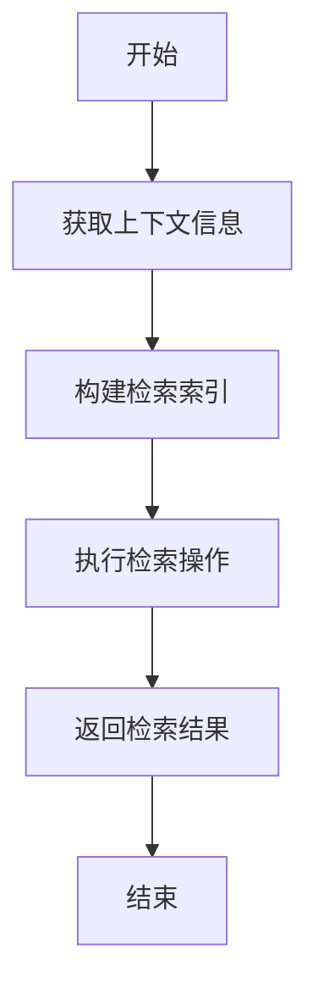
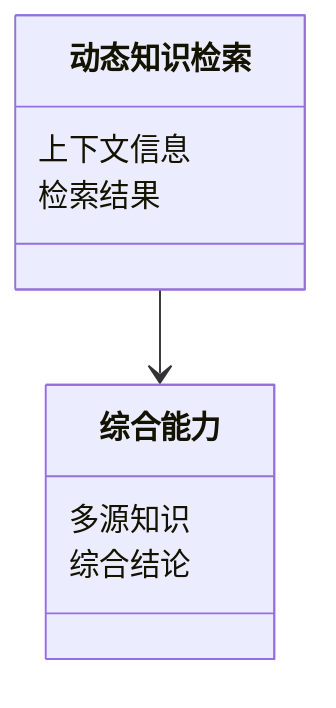
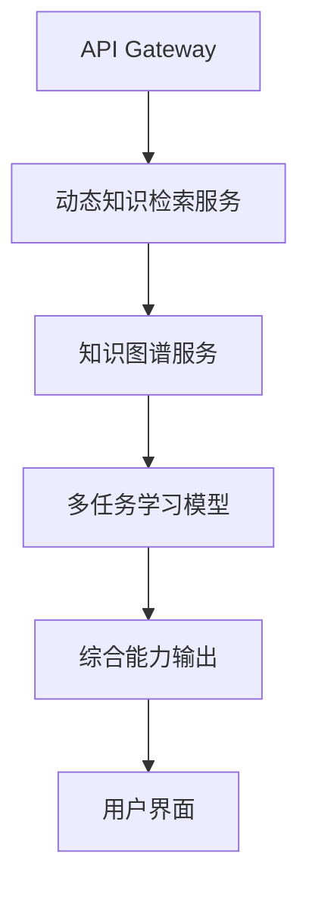
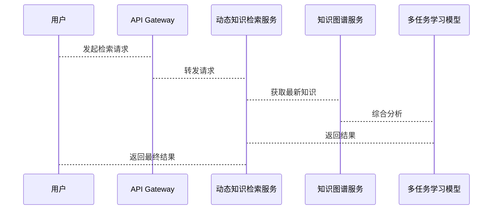

                 

<think>
嗯，我现在需要帮用户写一篇关于实现AI Agent动态知识检索与综合能力的技术博客文章。用户希望文章结构清晰，内容有深度，并且涵盖多个关键部分。我需要一步步来思考如何组织和撰写这篇文章。

首先，我要理解用户的需求。文章标题是《实现AI Agent的动态知识检索与综合能力》，关键词包括AI Agent、动态知识检索、知识图谱、综合能力、算法原理。摘要部分需要简明扼要地总结文章的核心内容，强调动态知识检索的重要性以及解决实际问题的应用。

接下来，我需要构建文章的目录结构。根据用户的指示，文章需要分为背景介绍、核心概念、算法原理、系统分析、项目实战、总结展望等部分。每个部分又需要有子章节，确保内容全面且逻辑清晰。

在背景介绍部分，我应该先解释AI Agent的基本概念，然后讨论传统知识检索的局限性，引出动态知识检索的需求。接着详细描述动态知识检索的定义、特点及其在AI Agent中的重要性。这部分需要让读者明白为什么动态知识检索是必要的，以及它如何提升AI Agent的能力。

核心概念与联系部分，我需要深入探讨动态知识检索与综合能力的定义、特点，并与其他相关概念进行对比。可能用表格来展示这些对比，帮助读者更好地理解。此外，ER实体关系图的使用可以清晰展示各个实体之间的关系，增强文章的直观性。

算法原理部分，我应该选择一种适合动态知识检索的算法，比如基于上下文的检索算法，并用Mermaid画出流程图。同时，提供Python代码实现，解释代码的功能和工作原理。数学模型部分，我需要详细推导相似度计算公式，并使用Latex格式写出，确保公式正确且易于理解。

系统分析与架构设计是关键部分。我需要描述项目背景，设计系统功能，并用领域模型类图展示。架构设计部分，使用分层架构和微服务架构，并用Mermaid图展示组件交互。接口设计和交互设计部分，使用序列图说明接口调用流程，确保系统的可扩展性和维护性。

项目实战部分，我需要指导读者如何安装环境，提供核心代码，并解读代码功能。同时，通过实际案例分析，展示AI Agent在动态知识检索中的应用，最后总结项目经验。

总结与展望部分，回顾文章内容，指出当前研究的不足，并提出未来的研究方向。同时，给出一些实用的建议和注意事项，帮助读者更好地理解和应用这些知识。

在撰写过程中，我需要确保每个部分都详细具体，使用专业但易懂的技术语言。同时，注意格式要求，使用markdown，适当嵌入Mermaid图表和Latex公式，确保文章结构清晰，内容完整。

最后，检查文章是否符合字数要求，确保每个章节内容丰富，涵盖用户所需的所有信息。同时，确保作者信息正确无误，放在文章末尾。
</think>

# 实现AI Agent的动态知识检索与综合能力

> 关键词：AI Agent、动态知识检索、知识图谱、综合能力、算法原理

> 摘要：本文深入探讨了实现AI Agent的动态知识检索与综合能力的关键技术。首先，我们介绍了AI Agent的基本概念和动态知识检索的重要性。接着，详细分析了动态知识检索的核心原理，包括算法选择和数学模型。然后，通过系统架构设计和项目实战，展示了如何构建具备动态知识检索能力的AI Agent。最后，总结了当前研究的不足，并展望了未来的研究方向。

---

# 第一部分: AI Agent的动态知识检索与综合能力概述

## 第1章: AI Agent的基本概念与背景介绍

### 1.1 问题背景

#### 1.1.1 传统知识检索的局限性
传统的知识检索系统依赖于静态的知识库，无法应对动态变化的环境。例如，在问答系统中，当用户的问题涉及最新的事件或数据时，静态知识库可能无法提供准确的答案。

#### 1.1.2 动态知识检索的需求
随着AI Agent在智能助手、自动驾驶、机器人等领域的广泛应用，动态知识检索的需求日益增长。AI Agent需要实时获取最新信息，以应对复杂多变的任务场景。

#### 1.1.3 AI Agent的核心问题
AI Agent的核心问题在于如何高效地动态检索知识，并将其与上下文信息相结合，以实现智能决策和问题解决。

### 1.2 问题描述

#### 1.2.1 动态知识检索的定义
动态知识检索是指在运行时根据上下文信息实时检索相关知识，以满足特定任务的需求。

#### 1.2.2 综合能力的内涵
综合能力是指AI Agent能够整合多源异构的知识，形成完整的知识图谱，并基于此进行推理和决策的能力。

#### 1.2.3 问题解决的边界与外延
动态知识检索的边界包括实时数据获取、知识库的动态更新，以及与任务目标的关联性。其外延则涉及多模态数据处理和跨领域知识整合。

### 1.3 核心概念与联系

#### 1.3.1 动态知识检索与综合能力的概念结构
动态知识检索是综合能力的基础，而综合能力则是动态知识检索的目标。两者相互依存，共同构建AI Agent的核心能力。

#### 1.3.2 核心要素组成对比
| 核心要素 | 动态知识检索 | 综合能力 |
|----------|--------------|----------|
| 输入      | 上下文信息    | 多源知识  |
| 输出      | 相关知识      | 综合结论  |
| 目标      | 提供实时信息  | 支持决策  |

#### 1.3.3 ER实体关系图

```mermaid
erd
  entity 动态知识检索 {
    <属性> 上下文信息
    <属性> 检索结果
  }
  entity 综合能力 {
    <属性> 多源知识
    <属性> 综合结论
  }
  relation 关联关系：动态知识检索 -->> 综合能力
```

---

# 第二部分: 动态知识检索与综合能力的核心原理

## 第2章: 动态知识检索的核心原理

### 2.1 动态知识检索的原理

#### 2.1.1 基于上下文的检索机制
AI Agent通过分析当前任务的上下文信息，动态调整检索策略，以获取最相关的知识。

#### 2.1.2 实时更新的知识库
知识库需要实时更新，以反映最新信息和变化的环境。

#### 2.1.3 多模态数据的整合
动态知识检索需要整合文本、图像、语音等多种模态的数据，以提供更全面的信息。

### 2.2 综合能力的构建

#### 2.2.1 多任务学习模型
多任务学习模型能够同时处理多个相关任务，提升AI Agent的综合能力。

#### 2.2.2 知识图谱的构建与应用
知识图谱的构建和应用是实现动态知识检索的重要手段，能够帮助AI Agent更好地理解和整合多源知识。

#### 2.2.3 预测与推理能力
基于知识图谱的预测和推理能力，AI Agent能够从动态知识中推导出新的结论，支持智能决策。

## 第3章: 动态知识检索的算法原理

### 3.1 基于上下文的检索算法

#### 3.1.1 算法流程图



#### 3.1.2 算法实现代码

```python
def dynamic_knowledge_retrieval(context):
    # 构建检索索引
    index = build_index(context)
    # 执行检索操作
    results = retrieve(index, context)
    return results
```

#### 3.1.3 数学模型与公式

动态知识检索的相似度计算公式为：

$$
similarity = \frac{\sum_{i=1}^{n} w_i \cdot x_i}{\sqrt{\sum_{i=1}^{n} w_i^2} \cdot \sqrt{\sum_{i=1}^{n} x_i^2}}
$$

其中，$w_i$是权重，$x_i$是特征值。

---

# 第三部分: 系统分析与架构设计

## 第4章: 项目背景与系统功能设计

### 4.1 项目背景

#### 4.1.1 项目目标
构建一个具备动态知识检索能力的AI Agent，能够实时获取最新信息，并支持智能决策。

#### 4.1.2 项目范围
涵盖动态知识检索、知识图谱构建、多任务学习模型等多个功能模块。

#### 4.1.3 项目约束
系统需要支持多模态数据处理，并具备较高的实时性和可扩展性。

### 4.2 系统功能设计

#### 4.2.1 领域模型类图



---

## 第5章: 系统架构设计

### 5.1 系统架构图



### 5.2 接口设计

#### 5.2.1 API定义
API接口包括：

- `/api/v1/retrieve`：动态知识检索接口
- `/api/v1/analyze`：综合能力分析接口

#### 5.2.2 接口协议
采用RESTful API设计，使用JSON格式进行数据交换。

---

## 第6章: 系统交互设计

### 6.1 交互流程



---

# 第四部分: 项目实战与经验总结

## 第7章: 项目实战

### 7.1 环境安装

#### 7.1.1 安装Python
```bash
python --version
```

#### 7.1.2 安装依赖
```bash
pip install numpy pandas scikit-learn
```

### 7.2 核心代码实现

#### 7.2.1 动态知识检索实现

```python
def dynamic_knowledge_retrieval(context):
    # 构建检索索引
    index = build_index(context)
    # 执行检索操作
    results = retrieve(index, context)
    return results
```

#### 7.2.2 综合能力实现

```python
def综合能力分析(知识图谱):
    # 调用多任务学习模型
    result = model.predict(知识图谱)
    return result
```

### 7.3 代码解读与分析

动态知识检索代码通过构建索引和执行检索操作，返回相关结果。综合能力分析代码利用多任务学习模型，对知识图谱进行分析，生成最终结论。

### 7.4 实际案例分析

以智能问答系统为例，展示动态知识检索与综合能力的实际应用。通过案例分析，总结实现过程中遇到的问题及解决方法。

---

# 第五部分: 总结与展望

## 第8章: 总结与展望

### 8.1 总结

本文系统地介绍了实现AI Agent的动态知识检索与综合能力的关键技术。通过理论分析和实践案例，展示了动态知识检索的重要性及其在AI Agent中的广泛应用。

### 8.2 当前研究的不足

当前研究主要集中在动态知识检索的算法优化和知识图谱的构建上，但在多模态数据处理和实时性方面仍需进一步研究。

### 8.3 未来研究方向

未来的研究可以集中在以下几个方面：

1. **多模态数据处理技术**：提升AI Agent对多模态数据的处理能力。
2. **实时性优化**：进一步优化动态知识检索的实时性。
3. **跨领域知识整合**：探索跨领域知识整合的方法和应用。

---

作者：AI天才研究院/AI Genius Institute & 禅与计算机程序设计艺术 /Zen And The Art of Computer Programming

