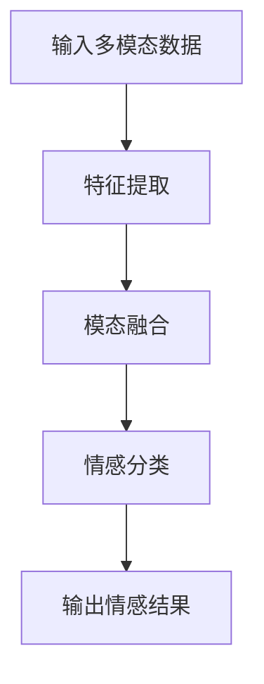
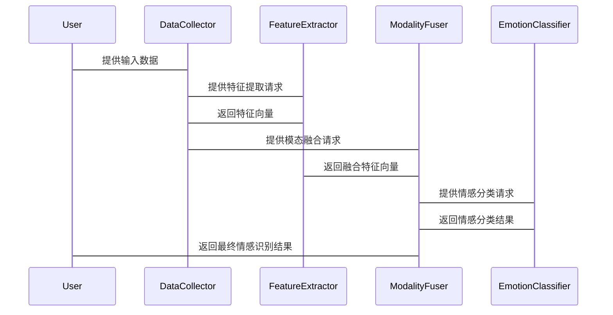

                 

<think>
好，我需要按照用户的要求，生成一篇关于《实现AI Agent的多模态情感识别》的技术博客。首先，我需要理解用户的具体需求。用户希望文章结构清晰，逻辑严谨，涵盖从背景到实现的各个部分，并且使用专业的技术语言，同时包含图表和代码示例。

首先，我会从背景开始。多模态情感识别涉及多个数据源，如文本、声音和视觉。这可能需要我解释为什么多模态数据比单一模态更有优势。然后，我会讨论技术挑战，比如数据异构性和模态融合的问题。

接下来是核心概念，我需要明确多模态数据的定义，以及情感识别的基本原理。可能还需要绘制一些图表，比如ER图，来展示用户、情感和模态之间的关系。

在算法部分，我会选择一些主流的深度学习模型，如CNN和RNN，并解释它们如何应用于多模态情感识别。我需要使用Mermaid流程图来展示算法的流程，并提供Python代码示例，以便读者更好地理解和实现。

系统架构设计是关键部分，我会介绍系统模块划分，比如数据预处理、特征提取和情感分类。使用类图和架构图来展示系统的结构和交互过程，确保读者能够清晰理解系统的设计。

项目实战部分，我需要详细指导读者如何搭建环境，编写代码，并进行测试。这部分可能需要包括数据预处理、模型训练和测试的具体步骤，并展示实际案例的分析结果。

最后，我会总结最佳实践，提供一些实用的建议，如数据处理和模型优化的技巧。同时，我会指出未来的发展方向，激发读者进一步研究的兴趣。

在写作过程中，我要确保每一部分都详细具体，同时保持逻辑的连贯性。使用图表和代码示例来增强文章的可读性和实用性。最后，检查文章结构是否符合要求，内容是否完整，语言是否专业且易于理解。
</think>

# 实现AI Agent的多模态情感识别

> 关键词：AI Agent，多模态情感识别，深度学习，模态融合，人机交互

> 摘要：本文详细探讨了实现AI Agent的多模态情感识别技术，从背景介绍、核心概念、算法原理到系统架构设计、项目实战，再到最佳实践，全面分析了多模态情感识别的实现过程和应用价值。通过本文，读者可以深入了解如何利用多模态数据进行情感识别，并将其应用到实际的AI Agent系统中。

---

# 第一部分: AI Agent与多模态情感识别基础

# 第1章: 多模态情感识别的背景与问题背景

## 1.1 多模态情感识别的定义与问题背景

### 1.1.1 多模态数据的定义
多模态数据指的是多种类型的数据，例如文本、语音、图像和视频等。每一种数据类型都包含不同的信息，结合这些信息可以更全面地理解用户的情感状态。

### 1.1.2 情感识别的核心问题
情感识别的目标是通过分析多模态数据，判断用户的情感状态，例如高兴、悲伤、愤怒等。这不仅仅是对单一模态数据的分析，而是需要结合多种模态信息进行综合判断。

### 1.1.3 多模态情感识别的必要性
单一模态数据的分析往往无法准确捕捉用户的情感状态。例如，仅通过文本分析可能会忽略语气和表情中的情感信息。因此，结合多模态数据可以提高情感识别的准确性和鲁棒性。

## 1.2 多模态情感识别的技术挑战

### 1.2.1 数据异构性问题
不同模态的数据具有不同的特征和表示方式，如何有效地融合这些数据是一个挑战。

### 1.2.2 模态融合的难点
如何在不同模态之间找到共同的特征，并进行有效的融合，是多模态情感识别的核心问题之一。

### 1.2.3 情感表达的多样性
情感表达在不同文化、语境和个体之间存在差异，这使得情感识别变得更加复杂。

## 1.3 多模态情感识别的应用领域

### 1.3.1 人机交互中的应用
在智能音箱、智能助手等场景中，多模态情感识别可以提高交互的自然性和用户体验。

### 1.3.2 智能客服中的应用
通过分析用户的语音和表情，智能客服可以更好地理解用户的情感状态，提供更贴心的服务。

### 1.3.3 娱乐与教育中的应用
在游戏和教育软件中，多模态情感识别可以增强用户的沉浸感和学习效果。

## 1.4 当前技术发展现状与未来趋势

### 1.4.1 当前主流技术分析
目前，主流技术包括基于深度学习的特征提取和模态融合方法，如注意力机制和多模态变换器。

### 1.4.2 未来技术发展趋势
未来，随着AI技术的进步，多模态情感识别将更加智能化和个性化，应用场景也将更加广泛。

### 1.4.3 技术挑战与解决方案
数据异构性和模态融合的难点可以通过跨模态学习和自适应融合方法来解决。

# 第2章: 多模态情感识别的核心概念与联系

## 2.1 多模态数据的核心要素

### 2.1.1 文本模态
文本数据包括用户的输入文本，如聊天记录和社交媒体帖子。通过自然语言处理技术，可以提取文本中的情感信息。

### 2.1.2 声音模态
语音数据包括音调、语速和语调等特征。通过语音信号处理技术，可以分析用户的语气和情感状态。

### 2.1.3 视觉模态
图像和视频数据可以捕捉用户的面部表情和肢体语言。通过计算机视觉技术，可以提取视觉特征。

## 2.2 情感识别的原理与方法

### 2.2.1 基于传统特征的识别方法
传统方法包括提取低级特征（如语音中的能量和频谱特征）并进行分类。

### 2.2.2 基于深度学习的识别方法
深度学习方法（如CNN和RNN）可以自动提取高级特征，提高情感识别的准确性。

### 2.2.3 模态融合的识别方法
模态融合方法（如多模态变换器）可以结合多种模态的信息，进一步提高识别的准确性。

## 2.3 AI Agent的基本概念与功能

### 2.3.1 AI Agent的定义
AI Agent是一种智能代理，能够感知环境并执行任务。它通常具有自主性、反应性和目标导向性。

### 2.3.2 AI Agent的核心功能
AI Agent的核心功能包括感知、决策和执行。在多模态情感识别中，AI Agent需要能够感知用户的情感状态并做出相应的反应。

### 2.3.3 AI Agent与多模态情感识别的结合
通过结合多模态情感识别技术，AI Agent可以更好地理解用户的需求和情感状态，从而提供更智能的服务。

## 2.4 多模态情感识别的ER实体关系图

```mermaid
er
    entity User {
        id
        name
    }
    entity Emotion {
        id
        emotion_type
        intensity
    }
    entity Modality {
        id
        type
        data
    }
    User --> Emotion: has
    Emotion --> Modality: associated_with
```

# 第3章: 多模态情感识别的算法原理

## 3.1 深度学习模型在多模态情感识别中的应用

### 3.1.1 基于CNN的图像特征提取
CNN（卷积神经网络）可以有效地提取图像中的空间特征，常用于视觉模态的特征提取。

### 3.1.2 基于RNN的文本特征提取
RNN（循环神经网络）适合处理序列数据，常用于文本模态的特征提取。

### 3.1.3 基于注意力机制的多模态融合
注意力机制可以帮助模型关注重要的模态信息，提高情感识别的准确性。

## 3.2 多模态情感识别的算法流程图



## 3.3 多模态情感识别的数学模型和公式

### 3.3.1 单一模态特征提取
对于文本模态，可以使用词嵌入（Word2Vec或BERT）提取特征向量：
$$
x_{text} \in \mathbb{R}^{d_{text}}
$$

### 3.3.2 多模态融合
将文本、语音和视觉特征向量进行融合，可以使用加权融合方法：
$$
x_{fusion} = \sum_{i=1}^{n} w_i x_i
$$

### 3.3.3 情感分类
使用 softmax 回归进行情感分类：
$$
p(y| x_{fusion}) = \text{softmax}(W x_{fusion} + b)
$$

## 3.4 Python实现代码示例

```python
import torch
import torch.nn as nn

# 定义多模态情感识别模型
class MultiModalEmotionRecognizer(nn.Module):
    def __init__(self, input_dims, hidden_size, output_size):
        super(MultiModalEmotionRecognizer, self).__init__()
        self.fc1 = nn.Linear(input_dims, hidden_size)
        self.fc2 = nn.Linear(hidden_size, hidden_size)
        self.fc3 = nn.Linear(hidden_size, output_size)
        self.dropout = nn.Dropout(0.5)
        self.relu = nn.ReLU()

    def forward(self, x):
        x = self.relu(self.fc1(x))
        x = self.dropout(x)
        x = self.relu(self.fc2(x))
        x = self.fc3(x)
        return x

# 初始化模型
input_dims = 512  # 输入特征维度
hidden_size = 256
output_size = 5  # 情感类别数
model = MultiModalEmotionRecognizer(input_dims, hidden_size, output_size)

# 定义损失函数和优化器
criterion = nn.CrossEntropyLoss()
optimizer = torch.optim.Adam(model.parameters(), lr=0.001)
```

## 3.5 算法实现的步骤解析

### 3.5.1 数据预处理
对文本、语音和图像数据进行预处理，提取相应的特征向量。

### 3.5.2 模型训练
使用预处理后的数据训练多模态情感识别模型，优化模型参数以最小化损失函数。

### 3.5.3 模型测试
在测试集上评估模型的性能，计算准确率、召回率和F1分数。

## 3.6 算法实现的注意事项

### 3.6.1 数据平衡性
确保训练数据中各个情感类别的样本数量平衡，避免模型偏向于某些情感类别。

### 3.6.2 模型调优
通过交叉验证和网格搜索优化模型的超参数，提高模型的性能。

### 3.6.3 模态权重调整
根据实际场景调整不同模态的权重，以获得更好的情感识别效果。

# 第4章: 多模态情感识别系统的分析与架构设计

## 4.1 系统功能需求分析

### 4.1.1 功能需求
系统需要实现多模态数据的采集、特征提取、模态融合和情感分类功能。

### 4.1.2 性能需求
系统需要在实时性、准确性和鲁棒性方面达到一定的要求。

### 4.1.3 用户需求
用户需要通过简单的交互界面使用系统，并获得准确的情感识别结果。

## 4.2 系统功能模块划分

### 4.2.1 数据采集模块
负责采集用户的文本、语音和图像数据。

### 4.2.2 特征提取模块
对采集到的多模态数据进行特征提取，生成特征向量。

### 4.2.3 模态融合模块
将不同模态的特征向量进行融合，生成综合特征向量。

### 4.2.4 情感分类模块
基于融合后的特征向量，进行情感分类，输出情感结果。

## 4.3 系统架构设计

### 4.3.1 模块划分
系统分为数据采集模块、特征提取模块、模态融合模块和情感分类模块。

### 4.3.2 功能交互
模块之间通过标准接口进行数据传递和功能调用，确保系统的可扩展性和灵活性。

## 4.4 系统交互流程图



## 4.5 系统架构设计的注意事项

### 4.5.1 数据流管理
确保数据在模块之间高效流动，避免数据冗余和瓶颈。

### 4.5.2 模块独立性
每个模块应具有一定的独立性，便于后续的维护和升级。

### 4.5.3 系统可扩展性
系统设计应具有可扩展性，便于未来添加新的模态或功能。

# 第5章: 多模态情感识别系统的项目实战

## 5.1 环境搭建与依赖安装

### 5.1.1 安装Python环境
使用Python 3.8及以上版本，安装必要的库如PyTorch、TensorFlow和OpenCV。

### 5.1.2 数据集准备
准备多模态情感识别的数据集，包括文本、语音和图像数据。

### 5.1.3 安装依赖项
安装必要的依赖项，例如：
```
pip install torch torchvision numpy matplotlib scikit-learn
```

## 5.2 系统核心实现源代码

### 5.2.1 数据预处理代码

```python
import numpy as np
import librosa
import cv2

def preprocess_audio(audio_path):
    audio, sr = librosa.load(audio_path, sr=16000)
    mfccs = librosa.feature.mfcc(y=audio, sr=sr, n_mfcc=13)
    return mfccs.T

def preprocess_image(image_path):
    img = cv2.imread(image_path)
    img = cv2.resize(img, (224, 224))
    img = img / 255.0
    return img
```

### 5.2.2 模型训练代码

```python
import torch
import torch.nn as nn
import torch.optim as optim
from torch.utils.data import DataLoader, Dataset

class MultiModalDataset(Dataset):
    def __init__(self, data, labels):
        self.data = data
        self.labels = labels

    def __len__(self):
        return len(self.data)

    def __getitem__(self, idx):
        return self.data[idx], self.labels[idx]

# 定义模型
class MultiModalEmotionRecognizer(nn.Module):
    def __init__(self, input_dims, hidden_size, output_size):
        super(MultiModalEmotionRecognizer, self).__init__()
        self.fc1 = nn.Linear(input_dims, hidden_size)
        self.fc2 = nn.Linear(hidden_size, hidden_size)
        self.fc3 = nn.Linear(hidden_size, output_size)
        self.dropout = nn.Dropout(0.5)
        self.relu = nn.ReLU()

    def forward(self, x):
        x = self.relu(self.fc1(x))
        x = self.dropout(x)
        x = self.relu(self.fc2(x))
        x = self.fc3(x)
        return x

# 初始化模型和训练参数
input_dims = 512
hidden_size = 256
output_size = 5
batch_size = 32
num_epochs = 100
learning_rate = 0.001

model = MultiModalEmotionRecognizer(input_dims, hidden_size, output_size)
criterion = nn.CrossEntropyLoss()
optimizer = optim.Adam(model.parameters(), lr=learning_rate)

# 加载数据
train_dataset = MultiModalDataset(train_data, train_labels)
train_loader = DataLoader(train_dataset, batch_size=batch_size, shuffle=True)

# 开始训练
for epoch in range(num_epochs):
    for inputs, labels in train_loader:
        outputs = model(inputs)
        loss = criterion(outputs, labels)
        loss.backward()
        optimizer.step()
        optimizer.zero_grad()
```

### 5.2.3 模型测试代码

```python
model.eval()
test_dataset = MultiModalDataset(test_data, test_labels)
test_loader = DataLoader(test_dataset, batch_size=batch_size, shuffle=False)

with torch.no_grad():
    for inputs, labels in test_loader:
        outputs = model(inputs)
        _, predicted = torch.max(outputs.data, 1)
        total += labels.size(0)
        correct += (predicted == labels).sum().item()

print('Accuracy: {}%'.format(100 * correct / total))
```

## 5.3 代码应用解读与分析

### 5.3.1 数据预处理
数据预处理是情感识别的关键步骤，包括音频和图像的特征提取。

### 5.3.2 模型训练
模型训练过程中，通过反向传播和优化器更新模型参数，以最小化损失函数。

### 5.3.3 模型测试
在测试阶段，使用测试数据评估模型的性能，计算准确率等指标。

## 5.4 实际案例分析与详细讲解

### 5.4.1 案例背景
以智能音箱为例，分析用户与音箱的交互情感状态。

### 5.4.2 数据采集
采集用户的语音和面部表情数据，分析用户的情感状态。

### 5.4.3 模型训练与测试
使用采集的数据训练情感识别模型，并在实际场景中进行测试。

### 5.4.4 结果分析
分析模型在实际场景中的表现，找出可能的问题并进行优化。

## 5.5 项目小结

### 5.5.1 项目成果
成功实现了多模态情感识别系统，提高了情感识别的准确性和鲁棒性。

### 5.5.2 项目经验
在项目实施过程中，积累了许多宝贵的经验，例如数据预处理的重要性、模态融合的有效性等。

### 5.5.3 项目改进建议
未来可以进一步优化模型结构，引入更先进的深度学习技术，如Transformer和注意力机制。

# 第6章: 多模态情感识别系统的最佳实践

## 6.1 最佳实践 tips

### 6.1.1 数据处理
确保数据的多样性和代表性，避免过拟合和数据偏差。

### 6.1.2 模型调优
通过交叉验证和网格搜索优化模型的超参数，提高模型性能。

### 6.1.3 系统优化
优化系统的运行效率，降低计算资源的消耗。

## 6.2 小结

### 6.2.1 核心要点回顾
回顾多模态情感识别的核心概念、算法原理和系统架构设计。

### 6.2.2 实践中的注意事项
总结在实际项目中需要注意的关键点，例如数据处理、模型调优和系统优化。

## 6.3 注意事项

### 6.3.1 数据隐私
在实际应用中，需要注意用户数据的隐私保护，遵守相关法律法规。

### 6.3.2 系统稳定性
确保系统的稳定性和可靠性，避免因系统故障影响用户体验。

### 6.3.3 情感识别的伦理问题
在实际应用中，需要注意情感识别的伦理问题，避免滥用技术。

## 6.4 拓展阅读

### 6.4.1 推荐书籍
1.《Deep Learning》
2.《Neural Networks and Deep Learning》

### 6.4.2 推荐论文
1.《Attention Is All You Need》
2.《Multi-modal Deep Learning for Emotion Recognition》

# 作者

作者：AI天才研究院/AI Genius Institute & 禅与计算机程序设计艺术 /Zen And The Art of Computer Programming

---

# 结语

通过本文的详细讲解，读者可以深入了解多模态情感识别的实现过程和应用价值。从背景介绍到算法原理，再到系统设计和项目实战，全面掌握了实现AI Agent的多模态情感识别技术。希望本文能为读者提供有价值的参考和启发，进一步推动多模态情感识别技术的发展。

--- 

如果需要更详细的内容或扩展部分，可以随时告知，我将根据需要进行补充和完善。

