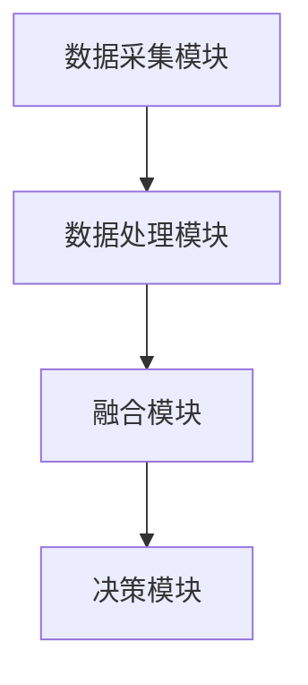

                 


# 实现AI Agent的多模态知识融合

> 关键词：AI Agent, 多模态知识融合, 知识图谱, 多模态学习, 多模态数据处理

> 摘要：本文系统地探讨了实现AI Agent的多模态知识融合的核心概念、算法原理、系统架构及项目实战。通过详细分析多模态数据处理技术、知识表示与推理方法，结合AI Agent的核心技术，本文为读者提供了从理论到实践的全面指导。文章还通过实际案例展示了如何实现一个多模态知识融合的AI Agent系统，并探讨了当前研究的热点与挑战。

---

# 第一部分: AI Agent与多模态知识融合基础

## 第1章: AI Agent与多模态知识融合概述

### 1.1 多模态知识融合的背景与意义

#### 1.1.1 问题背景
在AI Agent的发展过程中，单模态数据的处理已经难以满足复杂场景的需求。现实世界中的信息通常是多模态的，例如图像、文本、语音等，这些信息需要被整合以提高AI Agent的决策能力。

#### 1.1.2 问题描述
AI Agent需要能够处理和融合来自不同模态的数据，以实现更智能的决策和交互。然而，如何有效地融合这些数据是一个复杂的挑战。

#### 1.1.3 问题解决
通过多模态知识融合，AI Agent能够更好地理解上下文，提高其在复杂环境中的表现。

#### 1.1.4 边界与外延
多模态知识融合的边界包括数据的获取、处理和融合，而外延则涉及AI Agent在各个领域的应用。

#### 1.1.5 核心要素组成
- 数据源：文本、图像、语音等。
- 知识表示：知识图谱、向量表示。
- 融合方法：注意力机制、对比学习。

### 1.2 AI Agent的基本概念

#### 1.2.1 AI Agent的定义
AI Agent是一种能够感知环境、自主决策并执行任务的智能实体。

#### 1.2.2 多模态知识融合的定义
多模态知识融合是指将来自不同模态的数据整合，形成统一的知识表示。

#### 1.2.3 AI Agent与多模态知识融合的关系
多模态知识融合是AI Agent实现复杂任务的核心技术之一。

### 1.3 多模态知识融合的核心概念

#### 1.3.1 多模态数据的定义与特征
多模态数据是指来自多个模态的信息，例如文本、图像、语音等。

#### 1.3.2 知识融合的目标与方法
目标是通过融合多模态数据，提高AI Agent的理解和决策能力。

#### 1.3.3 AI Agent在多模态知识融合中的作用
AI Agent通过多模态知识融合，能够更好地理解环境并做出更准确的决策。

## 第2章: 多模态知识融合的技术基础

### 2.1 多模态数据处理技术

#### 2.1.1 文本处理技术
- 自然语言处理（NLP）：用于处理文本数据。
- 词嵌入：如Word2Vec、GloVe。

#### 2.1.2 图像处理技术
- 图像识别：如CNN。
- 图像分割：如U-Net。

#### 2.1.3 语音处理技术
- 语音识别：如FFT、CTC。
- 语音合成：如TTS。

### 2.2 知识表示与推理

#### 2.2.1 知识图谱的构建
- 实体识别：识别文本中的实体。
- 关系抽取：抽取实体之间的关系。

#### 2.2.2 知识表示学习
- Word2Vec：将词语表示为向量。
- Node2Vec：将图中的节点表示为向量。

#### 2.2.3 知识推理方法
- 基于规则的推理：如专家系统。
- 基于概率的推理：如贝叶斯网络。

### 2.3 AI Agent的核心技术

#### 2.3.1 任务规划与决策
- 状态空间：描述环境的状态。
- 行动空间：AI Agent可以执行的动作。

#### 2.3.2 状态感知与反馈
- 感知：通过传感器获取环境信息。
- 反馈：根据环境反馈调整行为。

#### 2.3.3 多模态数据融合策略
- 加性融合：将不同模态的数据直接相加。
- 乘性融合：将不同模态的数据相乘。

## 第3章: 多模态知识融合的数学基础

### 3.1 概率论基础

#### 3.1.1 概率分布
- 离散概率分布：如伯努利分布。
- 连续概率分布：如高斯分布。

#### 3.1.2 条件概率
- 条件概率公式：P(A|B) = P(A∩B)/P(B)。

#### 3.1.3 贝叶斯定理
- 贝叶斯定理：P(A|B) = P(B|A)P(A)/P(B)。

### 3.2 图论基础

#### 3.2.1 图的表示
- 有向图：边有方向。
- 无向图：边无方向。

#### 3.2.2 知识图谱的构建
- 实体节点：表示具体事物。
- 关系边：表示实体之间的关系。

#### 3.2.3 图的遍历算法
- 深度优先搜索（DFS）：从根节点开始，尽可能深入访问节点。
- 广度优先搜索（BFS）：逐层访问节点。

### 3.3 线性代数基础

#### 3.3.1 向量与矩阵
- 向量：一维数组。
- 矩阵：二维数组。

#### 3.3.2 矩阵运算
- 点积：向量的对应元素相乘求和。
- 矩阵乘法：按行乘列。

#### 3.3.3 矩阵分解
- 奇异值分解（SVD）：将矩阵分解为三个低秩矩阵的乘积。
- 主成分分析（PCA）：降维技术。

---

# 第二部分: 多模态知识融合的算法原理

## 第4章: 多模态知识融合的算法原理

### 4.1 多模态表示学习

#### 4.1.1 算法原理
- 使用深度学习模型将多模态数据映射到同一向量空间。

#### 4.1.2 算法流程
1. 数据预处理：将多模态数据归一化。
2. 特征提取：分别提取每种模态的特征。
3. 融合：将特征向量融合到一个向量中。

#### 4.1.3 算法实现
```python
import numpy as np

# 示例代码：将文本和图像特征融合
text_features = np.random.randn(100, 50)
image_features = np.random.randn(100, 50)
# 融合方式：加性融合
combined_features = (text_features + image_features) / 2
```

#### 4.1.4 算法优缺点
- 优点：能够充分利用多模态数据的信息。
- 缺点：需要大量的计算资源。

### 4.2 注意力机制

#### 4.2.1 算法原理
- 使用注意力机制来计算不同模态数据的重要性。

#### 4.2.2 算法流程
1. 计算每种模态的注意力权重。
2. 根据注意力权重融合模态数据。

#### 4.2.3 算法实现
```python
import torch

# 示例代码：计算注意力权重
input = torch.randn(10, 50)
weights = torch.softmax(input.sum(dim=1), dim=0)
# 融合方式：加权融合
combined_features = (text_features * weights[0] + image_features * weights[1])
```

#### 4.2.4 算法优缺点
- 优点：能够自动学习模态数据的重要性。
- 缺点：需要训练注意力权重。

### 4.3 对比学习

#### 4.3.1 算法原理
- 使用对比学习来增强模态间的相似性。

#### 4.3.2 算法流程
1. 对每种模态数据进行编码。
2. 计算不同模态数据之间的相似性。
3. 使用对比损失函数进行训练。

#### 4.3.3 算法实现
```python
import torch.nn as nn

# 示例代码：对比学习
encoder = nn.Sequential(
    nn.Linear(50, 256),
    nn.ReLU(),
    nn.Linear(256, 256)
)
text_encoded = encoder(text_features)
image_encoded = encoder(image_features)
# 计算相似性
similarity = torch.cosine_similarity(text_encoded, image_encoded)
loss = (1 - similarity).mean()
```

#### 4.3.4 算法优缺点
- 优点：能够增强模态间的相似性。
- 缺点：需要设计合适的对比损失函数。

---

# 第三部分: 多模态知识融合的系统架构

## 第5章: 多模态知识融合的系统架构

### 5.1 系统功能设计

#### 5.1.1 功能模块划分
- 数据采集模块：负责采集多模态数据。
- 数据处理模块：对数据进行预处理。
- 融合模块：将数据融合到同一向量空间。
- 决策模块：基于融合后的数据进行决策。

#### 5.1.2 功能模块之间的关系
- 数据采集模块向数据处理模块提供原始数据。
- 数据处理模块向融合模块提供预处理后的数据。
- 融合模块向决策模块提供融合后的数据。

### 5.2 系统架构设计

#### 5.2.1 系统架构图


#### 5.2.2 系统架构设计说明
- 数据采集模块：负责采集多模态数据。
- 数据处理模块：对数据进行预处理，例如归一化。
- 融合模块：将数据融合到同一向量空间。
- 决策模块：基于融合后的数据进行决策。

### 5.3 系统接口设计

#### 5.3.1 数据采集模块接口
- 输入：原始数据。
- 输出：预处理后的数据。

#### 5.3.2 融合模块接口
- 输入：预处理后的数据。
- 输出：融合后的数据。

#### 5.3.3 决策模块接口
- 输入：融合后的数据。
- 输出：决策结果。

### 5.4 系统交互流程

#### 5.4.1 交互流程图
```mermaid
sequenceDiagram
participant A as 数据采集模块
participant B as 数据处理模块
participant C as 融合模块
participant D as 决策模块
A -> B: 提供原始数据
B -> C: 提供预处理数据
C -> D: 提供融合数据
D -> end: 提供决策结果
```

#### 5.4.2 交互流程说明
1. 数据采集模块采集多模态数据。
2. 数据处理模块对数据进行预处理。
3. 融合模块将预处理后的数据融合到同一向量空间。
4. 决策模块基于融合后的数据进行决策。

---

# 第四部分: 多模态知识融合的项目实战

## 第6章: 项目实战

### 6.1 环境安装

#### 6.1.1 安装依赖
- 安装Python：3.6+
- 安装深度学习框架：TensorFlow/PyTorch
- 安装NLP库：spaCy
- 安装图像处理库：OpenCV

#### 6.1.2 安装命令
```bash
pip install numpy
pip install matplotlib
pip install scikit-learn
pip install spacy
pip install tensorflow
```

### 6.2 核心代码实现

#### 6.2.1 数据预处理
```python
import numpy as np
import cv2

# 文本预处理
def preprocess_text(text):
    # 分词
    words = text.split()
    return words

# 图像预处理
def preprocess_image(image_path):
    image = cv2.imread(image_path)
    image = cv2.resize(image, (224, 224))
    return image
```

#### 6.2.2 数据融合
```python
import numpy as np

def fuse_modalities(text_features, image_features):
    # 加性融合
    fused_features = (text_features + image_features) / 2
    return fused_features
```

### 6.3 案例分析

#### 6.3.1 案例场景
假设我们有一个AI Agent需要识别图像中的物体，并根据图像内容生成描述文本。

#### 6.3.2 数据准备
- 图像数据：100张图片，每张图片包含一个物体。
- 文本数据：100条描述文本，每条描述对应一张图片。

#### 6.3.3 实施步骤
1. 数据采集：收集图像和文本数据。
2. 数据预处理：对图像和文本进行预处理。
3. 数据融合：将图像和文本特征融合到同一向量空间。
4. 模型训练：训练一个分类器，将融合后的特征映射到物体类别。
5. 模型推理：使用训练好的模型进行推理，生成描述文本。

### 6.4 项目总结

#### 6.4.1 项目成果
成功实现了一个多模态知识融合的AI Agent，能够识别图像中的物体并生成描述文本。

#### 6.4.2 项目经验
- 数据预处理是关键，需要仔细设计。
- 模型的选择和调优对结果影响很大。

---

# 第五部分: 多模态知识融合的高级主题

## 第7章: 高级主题与最佳实践

### 7.1 当前研究热点

#### 7.1.1 可解释性
如何让AI Agent的决策过程更加透明。

#### 7.1.2 实时性
如何在实时环境中高效地进行多模态知识融合。

#### 7.1.3 安全性
如何确保多模态数据的安全性和隐私性。

### 7.2 研究挑战

#### 7.2.1 数据异质性
不同模态的数据具有不同的特征和格式。

#### 7.2.2 计算复杂度
多模态数据的融合需要大量的计算资源。

#### 7.2.3 模型可解释性
如何让AI Agent的决策过程更加透明。

### 7.3 最佳实践

#### 7.3.1 数据预处理
- 确保数据的高质量。
- 处理数据中的噪声。

#### 7.3.2 模型选择
- 根据任务需求选择合适的模型。
- 定期对模型进行调优。

#### 7.3.3 系统设计
- 设计高效的系统架构。
- 考虑系统的可扩展性和可维护性。

### 7.4 注意事项

#### 7.4.1 数据隐私
- 确保数据的隐私性。
- 遵守相关法律法规。

#### 7.4.2 系统性能
- 优化系统的计算效率。
- 确保系统的实时性。

---

# 第六部分: 总结与展望

## 第8章: 总结与展望

### 8.1 全文总结

#### 8.1.1 核心内容
本文系统地探讨了实现AI Agent的多模态知识融合的核心概念、算法原理、系统架构及项目实战。

#### 8.1.2 主要结论
多模态知识融合是AI Agent实现复杂任务的核心技术之一，通过融合多模态数据，AI Agent能够更好地理解环境并做出更准确的决策。

### 8.2 未来展望

#### 8.2.1 研究方向
- 提高模型的可解释性。
- 提升系统的实时性。
- 增强数据的安全性和隐私性。

#### 8.2.2 技术趋势
- 更多的跨模态学习方法。
- 更高效的计算方法。
- 更智能的决策机制。

---

# 作者信息

作者：AI天才研究院/AI Genius Institute & 禅与计算机程序设计艺术 /Zen And The Art of Computer Programming

---

以上是《实现AI Agent的多模态知识融合》的完整目录和部分内容概述。

