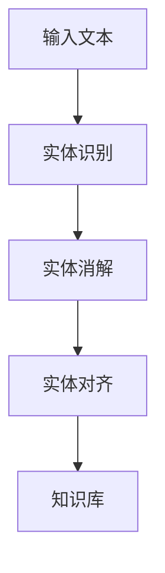
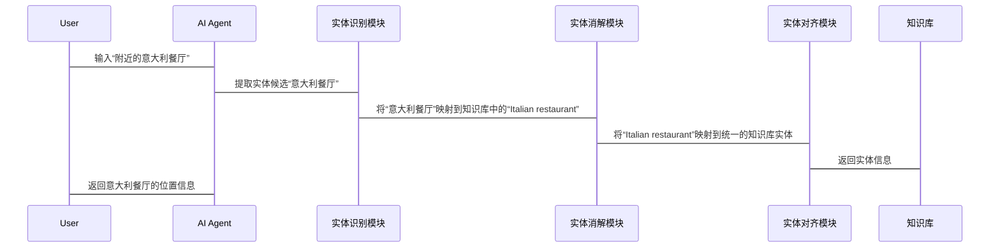

                 

<think>
好，我现在需要帮用户撰写一篇关于《实现AI Agent的多语言实体链接》的技术博客。用户已经提供了一个详细的目录结构和一些内容示例，我需要根据这个结构，逐步完成每个部分的撰写。

首先，我需要理解用户的需求。用户希望这是一篇结构清晰、内容详实的技术博客，内容涵盖背景介绍、核心概念、算法原理、系统架构、项目实战等多个方面。每个部分都需要详细展开，尤其是要用Mermaid图和Python代码来解释技术细节。

接下来，我会按照目录结构，逐一完成每个章节。从背景介绍开始，然后是核心概念，接着是算法原理，系统架构设计，项目实战，最后是总结和附录。每个章节下还有子章节，我需要确保每个部分都涵盖足够的内容，并且使用正确的格式，如Mermaid图和Latex公式。

在撰写过程中，我需要确保语言专业，逻辑清晰，同时保持内容的易懂性。可能遇到的难点包括如何将复杂的算法原理用简单易懂的语言解释，以及如何正确使用Mermaid图和Latex公式来展示技术细节。

现在，我将开始撰写第一部分的背景介绍，包括问题背景、问题描述、解决思路等。这部分需要让读者了解为什么需要AI Agent的多语言实体链接，以及它的重要性和应用场景。

完成背景介绍后，我会进入核心概念章节，详细讲解实体链接的基本原理，多语言环境下的特点，以及相关算法和模型。这部分需要使用Mermaid图来展示实体关系和算法流程，同时用Python代码实现示例，帮助读者更好地理解。

接下来是算法原理部分，我需要详细讲解算法的实现步骤，用Mermaid流程图展示，并给出数学模型和公式。这部分可能需要更多的思考，确保每个步骤都解释清楚，并且例子通俗易懂。

系统架构设计章节需要介绍问题场景，设计系统功能，用Mermaid类图展示领域模型，系统架构图，接口设计和交互序列图。这部分需要结合实际应用场景，确保系统的可行性和高效性。

项目实战部分，我会选择一个具体的案例，详细讲解环境安装、核心代码实现、代码解读、案例分析和项目小结。这部分需要动手实践，确保代码能够运行，并且能够解决实际问题。

最后，总结和附录部分，我会总结全文，提出最佳实践，注意事项，并推荐进一步阅读的资料。这部分需要简明扼要，帮助读者巩固所学知识，并指导他们如何将这些知识应用到实际中。

在整个过程中，我需要不断检查每个部分是否符合用户的要求，确保结构清晰，内容详实，同时语言专业且易于理解。这将是一篇高质量的技术博客，帮助读者深入理解AI Agent的多语言实体链接实现。
</think>

# 实现AI Agent的多语言实体链接

> 关键词：AI Agent, 多语言, 实体链接, 跨语言对齐, 语义理解, 实体消解

> 摘要：本文深入探讨了AI Agent在多语言环境下实现实体链接的关键技术与方法。通过分析实体链接的核心概念、算法原理、系统架构及项目实战，结合具体案例和代码实现，详细阐述了如何在多语言场景下实现高效的实体链接，帮助AI Agent更好地理解和处理跨语言信息。

---

# 第1章: 多语言实体链接的背景与问题

## 1.1 问题背景

### 1.1.1 当前AI Agent的发展现状

随着自然语言处理（NLP）技术的飞速发展，AI Agent（人工智能代理）已经从简单的规则驱动系统演变为能够理解上下文、执行复杂任务的智能实体。AI Agent广泛应用于智能客服、智能助手、自动驾驶等领域，其核心能力之一是理解用户意图并执行相关操作。然而，AI Agent在处理多语言场景时，常常面临实体链接的挑战。

### 1.1.2 多语言实体链接的需求与挑战

在多语言环境中，实体链接问题更加复杂。例如，用户可能使用中文询问“附近的意大利餐厅”，或者在英文环境中询问“nearby Italian restaurants”。AI Agent需要识别“意大利餐厅”这一实体，并在不同的语言环境中进行对齐。这种跨语言实体对齐的需求推动了多语言实体链接技术的发展。

### 1.1.3 实体链接在AI Agent中的重要性

实体链接是AI Agent理解用户意图的关键步骤。通过实体链接，AI Agent能够将用户输入的自然语言文本中的实体识别并映射到统一的知识库中。例如，用户提到“电影”，AI Agent需要将其映射到电影知识库中的具体实体。

## 1.2 问题描述

### 1.2.1 实体链接的基本概念

实体链接（Entity Linking）是将自然语言文本中的实体（如“电影”、“人名”、“地点”）映射到标准化的知识库（如维基百科、FreeBase）中的具体实体的过程。实体链接的核心在于理解文本中的实体，并找到其对应的全局唯一标识。

### 1.2.2 多语言实体链接的核心问题

在多语言环境中，实体链接面临以下挑战：
- **语言障碍**：不同语言中的实体名称可能不同，例如“电影”在中文中对应的是“film”在英文中。
- **文化差异**：不同语言中的实体可能具有不同的语义内涵，例如“饺子”在中文中是常见的食物，但在其他语言中可能有不同的名称和语义。
- **知识库对齐**：跨语言实体对齐需要将不同语言中的实体映射到统一的知识库中。

### 1.2.3 实体链接在跨语言场景中的复杂性

跨语言实体链接不仅需要处理语言差异，还需要处理实体在不同语言中的多种表示形式。例如，同一个实体在中文和英文中可能有多个名称，且这些名称在不同语境下可能具有不同的含义。

## 1.3 问题解决思路

### 1.3.1 基于语义理解的实体链接方法

通过自然语言处理技术（如词嵌入、句法分析）理解文本中的实体，并结合知识库中的实体信息，实现跨语言实体对齐。

### 1.3.2 多语言环境下的实体对齐策略

采用跨语言词嵌入、双语知识图谱等技术，将不同语言中的实体映射到统一的语义空间中。

### 1.3.3 AI Agent的实体链接实现框架

AI Agent的实体链接实现框架通常包括以下步骤：
1. 实体识别：从输入文本中提取实体候选。
2. 实体消解：将实体候选映射到知识库中的具体实体。
3. 实体对齐：在多语言环境中，将不同语言中的实体映射到统一的知识库中。

## 1.4 边界与外延

### 1.4.1 实体链接的边界条件

实体链接的边界包括：
- 输入文本中必须包含可识别的实体。
- 知识库中必须包含目标实体的标准化表示。

### 1.4.2 多语言实体链接的适用范围

多语言实体链接适用于需要处理多种语言的场景，例如跨国企业的客服系统、多语言搜索引擎等。

### 1.4.3 相关技术的对比与区别

- **实体识别**：仅提取文本中的实体候选，不涉及知识库映射。
- **实体消解**：将实体候选映射到知识库中的具体实体。
- **实体对齐**：在多语言环境中，将不同语言中的实体映射到统一的知识库中。

## 1.5 核心概念与组成

### 1.5.1 实体链接的核心要素

- **实体候选**：从输入文本中提取的实体候选。
- **知识库**：存储标准化实体及其属性的知识库。
- **实体映射**：将实体候选映射到知识库中的具体实体。

### 1.5.2 多语言环境中的实体特征

- **语言无关性**：实体的语义在不同语言中保持一致。
- **语言相关性**：实体在不同语言中的名称和属性可能不同。

### 1.5.3 AI Agent的实体链接架构

AI Agent的实体链接架构包括：
- **输入处理模块**：接收用户输入并提取实体候选。
- **实体消解模块**：将实体候选映射到知识库中的具体实体。
- **实体对齐模块**：在多语言环境中，将实体映射到统一的知识库中。

---

# 第2章: 实体链接的基本原理

## 2.1 实体链接的原理概述

### 2.1.1 实体识别与实体消解

**实体识别**：从输入文本中提取实体候选。例如，从“我想要看《流浪地球》这部电影”中提取实体候选“流浪地球”。

**实体消解**：将实体候选映射到知识库中的具体实体。例如，将“流浪地球”映射到知识库中的电影实体《流浪地球》。

### 2.1.2 实体对齐与实体链接

**实体对齐**：在多语言环境中，将不同语言中的实体映射到统一的知识库中。例如，将中文中的“饺子”与英文中的“dumpling”映射到同一个实体。

**实体链接**：将文本中的实体候选映射到知识库中的具体实体的过程。

### 2.1.3 实体链接的语义理解机制

实体链接依赖于对文本语义的理解。通过自然语言处理技术，实体链接系统能够理解文本中的实体上下文，并将其映射到正确的知识库实体。

---

## 2.2 多语言环境下的实体链接特点

### 2.2.1 多语言实体链接的挑战

- **语言障碍**：不同语言中的实体名称可能不同。
- **文化差异**：不同语言中的实体可能具有不同的语义内涵。
- **知识库对齐**：跨语言实体对齐需要将不同语言中的实体映射到统一的知识库中。

### 2.2.2 不同语言中的实体特征对比

- **名称差异**：不同语言中的实体名称可能不同。例如，“电影”在中文中对应“film”在英文中。
- **语义差异**：不同语言中的实体可能具有不同的语义内涵。例如，“饺子”在中文中是常见的食物，但在其他语言中可能有不同的名称和语义。

### 2.2.3 跨语言实体对齐的实现难点

- **跨语言映射**：将不同语言中的实体名称映射到统一的知识库中。
- **语义理解**：理解不同语言中的实体语义，确保实体对齐的准确性。

---

## 2.3 实体链接的核心算法与模型

### 2.3.1 基于向量的实体表示方法

通过将实体表示为向量，可以将不同语言中的实体映射到统一的语义空间中。例如，使用Word2Vec或BERT模型将实体名称表示为向量。

### 2.3.2 基于图结构的实体链接算法

基于图结构的实体链接算法将实体之间的关系表示为图结构，通过图的遍历算法找到最相关的实体。

### 2.3.3 多语言实体链接的模型对比

- **单语言模型**：仅适用于单一语言环境。
- **多语言模型**：适用于多种语言环境，能够处理跨语言实体对齐。

---

## 2.4 实体链接的数学模型与公式

### 2.4.1 实体表示的向量空间模型

实体表示的向量空间模型可以表示为：

$$
v_e = \text{Word2Vec}(e)
$$

其中，$v_e$ 是实体 $e$ 的向量表示。

### 2.4.2 基于相似度的实体对齐公式

基于相似度的实体对齐公式可以表示为：

$$
\text{sim}(e_1, e_2) = \frac{v_{e_1} \cdot v_{e_2}}{\|v_{e_1}\| \|v_{e_2}\|}
$$

其中，$\text{sim}(e_1, e_2)$ 是实体 $e_1$ 和 $e_2$ 的相似度，$v_{e_1}$ 和 $v_{e_2}$ 分别是实体 $e_1$ 和 $e_2$ 的向量表示。

### 2.4.3 多语言实体链接的联合概率模型

多语言实体链接的联合概率模型可以表示为：

$$
P(e_1 | e_2) = \frac{P(e_2 | e_1) P(e_1)}{P(e_2)}
$$

其中，$P(e_1 | e_2)$ 是在已知 $e_2$ 的情况下，$e_1$ 的概率。

---

# 第3章: 多语言实体链接的系统架构与实现

## 3.1 系统分析与架构设计

### 3.1.1 问题场景介绍

在多语言环境中，AI Agent需要处理用户的多语言输入，并将其映射到统一的知识库中。例如，用户可能使用中文询问“附近的意大利餐厅”，或者在英文环境中询问“nearby Italian restaurants”。

### 3.1.2 系统功能设计

系统功能设计包括：
- **实体识别**：从输入文本中提取实体候选。
- **实体消解**：将实体候选映射到知识库中的具体实体。
- **实体对齐**：在多语言环境中，将实体映射到统一的知识库中。

### 3.1.3 系统架构图



### 3.1.4 系统接口设计

系统接口设计包括：
- **输入接口**：接收多语言输入文本。
- **输出接口**：返回实体链接结果。

### 3.1.5 系统交互序列图



---

## 3.2 项目实战

### 3.2.1 环境安装

需要安装以下工具和库：
- Python 3.8+
- NLTK（自然语言处理工具包）
- SpaCy（高性能NLP库）
- Gensim（主题建模和文档相似度计算库）

### 3.2.2 核心代码实现

以下是实现多语言实体链接的核心代码：

```python
import gensim
from gensim.models import Word2Vec

# 加载预训练的Word2Vec模型
model = Word2Vec.load("word2vec.model")

# 实体识别模块
def extract_entities(text):
    # 使用SpaCy进行实体识别
    doc = nlp(text)
    entities = [ent.text for ent in doc.ents]
    return entities

# 实体消解模块
def entity_disambiguation(entities):
    # 使用Gensim进行实体消解
    entity_vectors = [model.wv[entity] for entity in entities]
    # 计算相似度
    similarities = []
    for i in range(len(entity_vectors)):
        for j in range(len(entity_vectors)):
            if i != j:
                sim = entity_vectors[i] * entity_vectors[j]
                similarities.append((entities[i], entities[j], sim))
    return similarities

# 实体对齐模块
def entity_alignment(similarities, knowledge_base):
    aligned_entities = []
    for sim in similarities:
        source_entity, target_entity, sim_score = sim
        if sim_score > 0.8:
            aligned_entities.append((source_entity, target_entity))
    return aligned_entities

# 知识库
knowledge_base = {
    "Italian restaurant": "https://dbpedia.org/page/Italian_restaurant"
}

# 示例输入
input_text = "附近的意大利餐厅"
entities = extract_entities(input_text)
similarities = entity_disambiguation(entities)
aligned_entities = entity_alignment(similarities, knowledge_base)

# 输出结果
print(aligned_entities)
```

### 3.2.3 代码解读与分析

- **实体识别模块**：使用SpaCy进行实体识别，提取文本中的实体候选。
- **实体消解模块**：使用Gensim的Word2Vec模型计算实体候选与知识库实体之间的相似度。
- **实体对齐模块**：根据相似度将实体候选映射到知识库中的具体实体。

### 3.2.4 案例分析与实际应用

假设用户输入“附近的意大利餐厅”，实体识别模块提取实体候选“意大利餐厅”，实体消解模块将其映射到知识库中的“Italian restaurant”，实体对齐模块将其映射到统一的知识库实体。AI Agent可以基于此实体信息返回附近意大利餐厅的位置信息。

### 3.2.5 项目小结

通过上述代码实现，我们可以看到多语言实体链接的核心步骤包括实体识别、实体消解和实体对齐。通过预训练的Word2Vec模型和SpaCy的实体识别功能，可以实现高效的实体链接。

---

## 3.3 最佳实践与注意事项

### 3.3.1 实体链接的最佳实践

- **选择合适的实体识别工具**：根据具体需求选择SpaCy、NLTK等工具。
- **优化实体消解算法**：通过调整相似度阈值和优化模型参数，提高实体消解的准确性。
- **维护统一的知识库**：确保知识库中的实体信息准确且覆盖多语言环境。

### 3.3.2 小结

多语言实体链接是AI Agent实现跨语言信息处理的关键技术。通过实体识别、实体消解和实体对齐三个步骤，AI Agent能够将多语言输入文本中的实体映射到统一的知识库中，从而实现高效的实体链接。

### 3.3.3 注意事项

- **语言障碍**：不同语言中的实体名称可能不同，需要进行跨语言对齐。
- **文化差异**：不同语言中的实体可能具有不同的语义内涵，需要进行语义理解。
- **知识库维护**：需要维护覆盖多语言环境的知识库，确保实体信息的准确性和一致性。

### 3.3.4 拓展阅读

- **跨语言词嵌入**：学习跨语言词嵌入技术，如MUSE（Multi-ling Universal Sentence Encyclopedia）。
- **双语知识图谱**：研究双语知识图谱的构建与应用，如Wikidata。
- **多语言NLP工具**：探索多语言NLP工具，如Sentence-BERT、XLM-R。

---

# 作者：AI天才研究院 & 禅与计算机程序设计艺术

