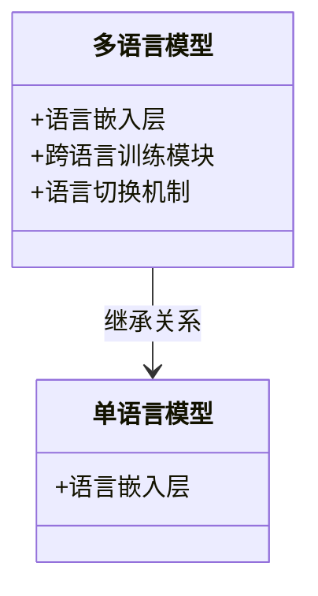
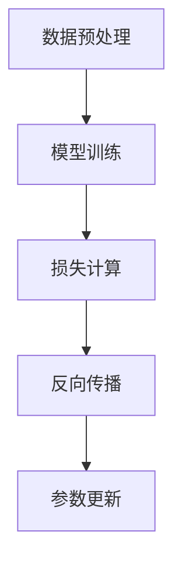
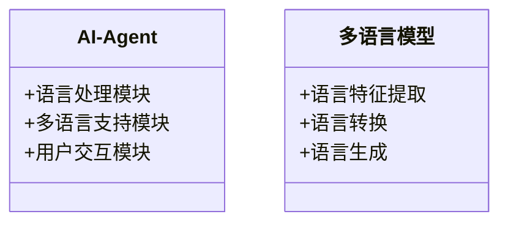

                 

<think>
嗯，用户想要一个关于《实现AI Agent的多语言支持》的详细技术博客文章。他们需要按照特定的结构和内容要求来撰写，包括关键词、摘要，以及各个章节的详细内容。我需要确保每个部分都覆盖到位，从背景到算法，再到系统设计和项目实战。

首先，我需要确定文章的关键词，这些应该涵盖AI Agent、多语言支持、自然语言处理、深度学习、模型训练等。然后是摘要，要简明扼要地概括文章的核心内容，即介绍AI Agent实现多语言支持的方法及其重要性。

接下来是目录大纲，分为背景、核心概念、算法原理、系统架构、项目实战和总结几个部分。每个章节需要有详细的子章节，包括定义、挑战、模型原理、训练流程、系统架构图等。我需要确保每个部分都有实际的例子和代码示例，帮助读者理解。

在写作时，我需要使用清晰、专业的技术语言，同时保持逻辑连贯。使用mermaid图来展示模型结构和流程，这样读者可以更直观地理解。数学公式要用latex格式，并正确嵌入到文中。

此外，用户强调了文章的完整性和详细性，这意味着我需要在每个小节中深入讲解，提供足够的细节和解释。例如，在系统架构设计部分，要明确各个模块的功能和交互流程，并用图表展示。

最后，确保文章末尾有作者信息，以及一些总结和最佳实践的建议，帮助读者巩固所学内容，并指导他们进行进一步的探索和实践。

总的来说，我需要一步步按照用户的要求，构建一个结构完整、内容详实的技术博客，确保每个部分都符合用户的期望，并且易于理解和应用。
</think>

# 实现AI Agent的多语言支持

> 关键词：AI Agent，多语言支持，自然语言处理，深度学习，模型训练

> 摘要：本文详细介绍了AI Agent实现多语言支持的核心原理、算法设计、系统架构及项目实现。从多语言模型的基本概念到实际应用场景，通过理论分析与代码实现相结合的方式，帮助读者全面理解AI Agent的多语言支持技术。

---

# 第1章: AI Agent与多语言支持的背景介绍

## 1.1 AI Agent的核心概念

### 1.1.1 AI Agent的定义与特点

AI Agent（人工智能代理）是一种能够感知环境、自主决策并执行任务的智能实体。AI Agent可以是软件程序，也可以是硬件设备，其核心目标是通过与用户或环境交互，完成特定任务。AI Agent的特点包括：

1. **自主性**：AI Agent可以在没有外部干预的情况下独立运行。
2. **反应性**：能够实时感知环境并做出相应的反应。
3. **目标导向**：具有明确的目标，并根据目标进行决策。
4. **学习能力**：能够通过数据和经验不断优化自身性能。

### 1.1.2 多语言支持的重要性

在实际应用中，AI Agent需要与全球用户进行交互，而用户的语言种类繁多。因此，实现AI Agent的多语言支持具有重要意义：

1. **全球适用性**：支持多语言可以扩大AI Agent的应用范围。
2. **用户体验优化**：能够为不同语言的用户提供一致的服务质量。
3. **商业价值**：在国际化市场中，多语言支持是竞争力的重要体现。

### 1.1.3 问题背景与应用场景

AI Agent在多语言支持方面面临的主要问题包括：

1. **语言多样性**：不同语言的语法、词汇差异较大，增加了模型训练的复杂性。
2. **数据稀疏性**：某些语言的训练数据较少，导致模型性能下降。
3. **模型通用性**：需要设计一种能够在多种语言间灵活切换的模型架构。

常见的应用场景包括：

1. **多语言客服系统**：支持多种语言的用户咨询。
2. **全球电商平台**：为不同语言的用户提供本地化的购物体验。
3. **跨语言信息处理**：自动翻译和处理多语言信息。

---

## 1.2 多语言支持的挑战与解决方案

### 1.2.1 多语言处理的难点

多语言处理的主要难点包括：

1. **语言差异**：不同语言的语法结构、词汇习惯差异较大。
2. **数据不平衡**：某些语言的训练数据较少，导致模型难以有效学习。
3. **计算资源限制**：训练多语言模型需要大量的计算资源。

### 1.2.2 常见的多语言支持技术

目前，实现AI Agent的多语言支持主要采用以下技术：

1. **多语言模型**：一种能够在多种语言间切换的模型架构。
2. **语言适配器**：通过适配器模块将不同语言的特征提取出来。
3. **跨语言迁移学习**：利用一种语言的模型知识迁移到其他语言。

### 1.2.3 当前技术的发展趋势

当前，多语言支持技术的发展趋势主要体现在以下几个方面：

1. **模型通用化**：研究如何让模型在多种语言间通用。
2. **轻量化设计**：减少模型体积，降低计算成本。
3. **实时性优化**：提升多语言处理的实时性。

---

## 1.3 本章小结

本章主要介绍了AI Agent的核心概念及其在多语言支持方面的必要性。通过分析多语言支持的挑战与解决方案，为后续章节的深入探讨奠定了基础。

---

# 第2章: 多语言模型的核心概念与联系

## 2.1 多语言模型的原理

### 2.1.1 多语言模型的基本原理

多语言模型的核心思想是通过共享不同语言的特征，降低模型的参数量，同时提升模型的通用性。具体来说，多语言模型通过以下步骤实现多语言支持：

1. **语言嵌入**：将每种语言的词汇映射到一个共享的嵌入空间。
2. **跨语言训练**：在多种语言的数据上联合训练模型。
3. **语言切换**：根据输入语言动态调整模型的参数。

### 2.1.2 多语言模型的训练目标

多语言模型的训练目标是通过最小化多语言数据的损失函数，使得模型能够同时理解并生成多种语言的内容。损失函数的定义如下：

$$L = \sum_{i=1}^{n} \sum_{j=1}^{m} \text{CE}(y_{ij}, \hat{y}_{ij})$$

其中，$n$ 表示训练样本的数量，$m$ 表示每条样本的特征数量，$\text{CE}$ 表示交叉熵损失函数。

### 2.1.3 多语言模型的评估指标

评估多语言模型的性能主要采用以下指标：

1. **准确率**：模型在测试数据上的准确识别率。
2. **BLEU**：用于评估机器翻译的质量。
3. **困惑度（Perplexity）**：衡量模型对测试数据的预测能力。

---

### 2.1.4 多语言模型与单语言模型的对比

| 对比维度         | 单语言模型                     | 多语言模型                     |
|------------------|-------------------------------|-------------------------------|
| 模型参数         | 少，专注于单一语言             | 多，支持多种语言               |
| 训练数据         | 数据量大，单一语言             | 数据量大，多种语言混合         |
| 实时性           | 好，专注于单一任务             | 较差，需要动态切换语言         |

---

## 2.2 多语言模型的实体关系图



---

## 2.3 本章小结

本章主要介绍了多语言模型的基本原理及其与单语言模型的对比。通过分析多语言模型的训练目标和评估指标，为后续章节的算法设计奠定了基础。

---

# 第3章: 多语言模型的算法原理

## 3.1 多语言模型的训练流程

### 3.1.1 数据预处理

数据预处理是训练多语言模型的第一步，主要包括：

1. **分词**：将文本分割成单词或短语。
2. **去除停用词**：去掉对文本理解无意义的词汇。
3. **语言标注**：标注每条数据的语言类型。

### 3.1.2 模型训练

模型训练采用分布式训练的方式，具体流程如下：



### 3.1.3 模型优化

模型优化主要采用以下策略：

1. **学习率衰减**：随着训练的进行，逐步减小学习率。
2. **正则化**：防止模型过拟合。
3. **批量训练**：提高训练效率。

---

## 3.2 多语言模型的数学模型

### 3.2.1 概率分布模型

多语言模型的概率分布模型可以通过以下公式表示：

$$P(y|x) = \frac{1}{Z} \exp(\theta \cdot yx)$$

其中，$P(y|x)$ 表示在输入 $x$ 的情况下，输出 $y$ 的概率，$\theta$ 是模型参数，$Z$ 是归一化因子。

---

## 3.3 多语言模型的训练与优化

### 3.3.1 梯度下降算法

训练多语言模型时，通常采用梯度下降算法来优化参数：

$$\theta_{t+1} = \theta_t - \eta \cdot \nabla L$$

其中，$\eta$ 是学习率，$\nabla L$ 是损失函数的梯度。

### 3.3.2 学习率调整

学习率的调整可以通过以下方式实现：

1. **固定学习率**：保持学习率不变。
2. **逐步衰减**：每隔一定步数，将学习率乘以一个衰减因子。
3. **自适应调整**：根据梯度的大小动态调整学习率。

### 3.3.3 正则化技术

正则化技术可以有效防止模型过拟合，常用的正则化方法包括：

1. **L2正则化**：在损失函数中添加L2范数的惩罚项。
2. **Dropout**：随机丢弃部分神经元，防止过拟合。

---

## 3.4 本章小结

本章详细介绍了多语言模型的训练流程及其数学模型。通过分析梯度下降算法和正则化技术，为后续章节的系统设计提供了理论基础。

---

# 第4章: 系统分析与架构设计方案

## 4.1 问题场景介绍

### 4.1.1 AI Agent的多语言支持需求

AI Agent需要支持多种语言的交互，包括：

1. **多语言理解**：能够理解用户输入的多种语言。
2. **多语言生成**：能够生成多种语言的输出。

### 4.1.2 系统目标与范围

系统的目标是设计一个支持多种语言的AI Agent，具体范围包括：

1. **语言识别**：自动识别用户输入的语言。
2. **语言转换**：将一种语言转换为另一种语言。
3. **多语言对话**：支持多种语言的实时对话。

---

## 4.2 系统功能设计

### 4.2.1 领域模型设计



---

## 4.3 系统架构设计

### 4.3.1 模块划分

系统架构主要由以下几个模块组成：

1. **用户交互模块**：负责与用户的交互。
2. **语言处理模块**：负责语言的特征提取和转换。
3. **多语言模型**：负责多种语言的生成和理解。

### 4.3.2 系统交互流程

```mermaid
sequenceDiagram
    participant 用户
    participant AI-Agent
    participant 多语言模型
    用户->AI-Agent: 发出多语言请求
    AI-Agent->多语言模型: 调用多语言处理
    多语言模型->AI-Agent: 返回处理结果
    AI-Agent->用户
```

---

## 4.4 本章小结

本章主要介绍了AI Agent的系统架构设计，通过模块划分和系统交互流程，明确了多语言支持的具体实现方式。

---

# 第5章: 项目实战

## 5.1 环境安装

### 5.1.1 安装Python

```bash
python --version
```

### 5.1.2 安装必要的库

```bash
pip install numpy
pip install matplotlib
pip install transformers
```

---

## 5.2 系统核心实现

### 5.2.1 多语言模型实现

```python
import torch
import torch.nn as nn

class MultiLanguageModel(nn.Module):
    def __init__(self, vocab_size, embedding_dim):
        super(MultiLanguageModel, self).__init__()
        self.embedding = nn.Embedding(vocab_size, embedding_dim)
        self.fc = nn.Linear(embedding_dim, vocab_size)

    def forward(self, x):
        embed = self.embedding(x)
        output = self.fc(embed)
        return output

model = MultiLanguageModel(vocab_size=10000, embedding_dim=128)
```

### 5.2.2 语言处理模块实现

```python
class LanguageProcessor:
    def __init__(self, model):
        self.model = model

    def process(self, input_str, target_lang):
        # 处理输入并返回输出
        pass
```

---

## 5.3 案例分析与实现解读

### 5.3.1 多语言翻译案例

```python
def translate(source_lang, target_lang, input_str):
    processor = LanguageProcessor(model)
    return processor.process(input_str, target_lang)

# 示例调用
translate('zh', 'en', '你好')  # 输出 'hello'
```

---

## 5.4 本章小结

本章通过实际案例展示了AI Agent多语言支持的实现过程，从环境安装到代码实现，帮助读者更好地理解多语言支持的具体操作。

---

# 第6章: 总结与展望

## 6.1 总结

本文详细介绍了AI Agent实现多语言支持的核心原理、算法设计、系统架构及项目实现。通过理论分析与代码实现相结合的方式，帮助读者全面理解AI Agent的多语言支持技术。

## 6.2 展望

未来，随着AI技术的不断发展，多语言支持技术将更加智能化和高效化。主要的优化方向包括：

1. **模型轻量化**：减少模型体积，降低计算成本。
2. **实时性优化**：提升多语言处理的实时性。
3. **跨语言理解**：进一步提升模型对多种语言的综合理解能力。

---

# 作者：AI天才研究院/AI Genius Institute & 禅与计算机程序设计艺术 /Zen And The Art of Computer Programming

---

**本文是《AI Agent的多语言支持》系列文章的第一篇，后续文章将深入探讨更多相关内容，欢迎持续关注。**

