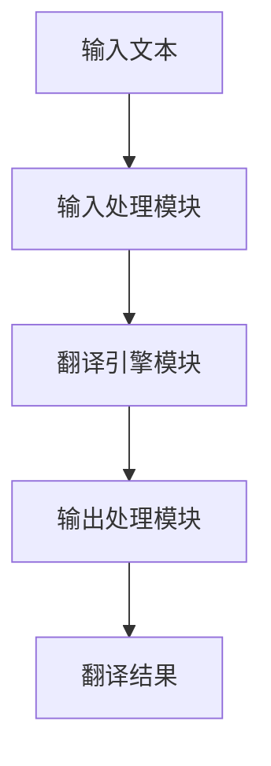

                 

<think>
嗯，用户让我写一篇关于实现AI Agent多语言翻译能力的技术博客，我得先理清楚他的需求。他要我作为一位资深专家，写一篇结构清晰、内容深入的技术博客，目录大纲已经给了，我得按照那个结构来写。

首先，用户希望文章有摘要、关键词，然后是正文部分。我得确保每个章节都涵盖他提到的关键点，比如AI Agent、多语言翻译、自然语言处理等。我得先介绍背景，让读者了解AI Agent是什么，为什么需要多语言翻译能力。

接下来，核心技术部分，我需要详细讲解多语言翻译的原理，包括自然语言理解、跨语言表示等。这部分可能需要用到一些数学公式和模型，比如Transformer架构，我得用mermaid图和latex公式来说明。

然后是系统架构设计，这部分我得画出类图、架构图和序列图，展示各个模块之间的关系和流程。这部分需要详细描述每个模块的功能和接口设计，确保系统扩展性和维护性。

项目实战部分，我需要指导读者如何搭建环境，实现代码，并通过案例展示实际应用。代码部分要用Python，可能用Hugging Face的库，比如MarianMT。我得提供完整的代码示例，并解释每一步的作用。

最后，最佳实践和小结部分，我得总结实现过程中需要注意的问题，给出优化建议，并展望未来的发展趋势。这部分要实用，帮助读者在实际应用中避免常见错误。

整个过程中，我需要确保内容逻辑清晰，语言专业但易懂，结构紧凑。每个部分都要有详细的解释和实例，让读者能够一步步理解和实现AI Agent的多语言翻译能力。同时，要满足用户对格式的要求，比如使用markdown，插入mermaid图和latex公式，确保文章完整性和深度。

可能遇到的挑战是如何将复杂的算法原理讲解得通俗易懂，同时保持技术深度。我需要平衡详细性和可读性，确保读者既能理解理论，又能实际操作。此外，代码部分要准确无误，避免语法错误，确保读者可以顺利运行。

总之，我需要按照用户提供的目录大纲，逐一展开每个部分，确保内容全面、结构合理，满足读者的学习和实践需求。
</think>

# 实现AI Agent的多语言翻译能力

> 关键词：AI Agent，多语言翻译，自然语言处理，跨语言表示，机器学习，Transformer架构

> 摘要：本文详细探讨了实现AI Agent多语言翻译能力的核心技术与方法。从AI Agent的基本概念出发，逐步分析多语言翻译的技术挑战与解决方案，涵盖自然语言理解、跨语言表示、多语言生成等关键环节。文章结合实际项目案例，深入讲解了系统架构设计、算法实现及优化策略，为读者提供了一套完整的实现方案。

---

# 第一部分: AI Agent与多语言翻译的背景与基础

## 第1章: AI Agent与多语言翻译的背景介绍

### 1.1 AI Agent的基本概念

#### 1.1.1 AI Agent的定义与特点
AI Agent（人工智能代理）是指能够感知环境、自主决策并执行任务的智能实体。它具有以下特点：
- **自主性**：能够独立执行任务，无需外部干预。
- **反应性**：能够实时感知环境并做出响应。
- **目标导向性**：具有明确的目标，所有行为都围绕目标展开。
- **学习能力**：能够通过数据和经验不断优化自身的性能。

#### 1.1.2 多语言翻译能力的核心意义
多语言翻译能力是AI Agent实现跨文化交流与协作的关键。通过支持多种语言的翻译功能，AI Agent能够更好地服务于全球用户，提升用户体验和应用场景的多样性。

#### 1.1.3 问题背景与应用场景
随着全球化的推进，多语言翻译需求日益增长。AI Agent需要在复杂多变的环境中，快速准确地完成多种语言之间的翻译任务。应用场景包括：
- 跨国企业的内部沟通
- 全球化电商平台的客服支持
- 多语言社交媒体内容的自动翻译

---

## 第2章: 多语言翻译的核心技术与原理

### 2.1 自然语言理解与生成的基础

#### 2.1.1 语言模型的基本原理
语言模型通过概率分布来描述词语之间的关系。常见的语言模型包括n-gram模型和Transformer架构。语言模型的核心目标是计算给定文本的概率，从而实现对文本的理解。

#### 2.1.2 Transformer架构的简要介绍
Transformer是由Vaswney等人提出的神经网络架构，广泛应用于自然语言处理任务。其核心组件包括：
- **编码器**：将输入序列转换为固定长度的向量。
- **解码器**：根据编码器的输出生成目标序列。
- **注意力机制**：用于捕捉序列中词语之间的依赖关系。

#### 2.1.3 多语言模型的训练策略
多语言模型的训练策略包括：
- **多任务学习**：同时训练多种语言任务，共享模型参数。
- **跨语言预训练**：利用多语言数据进行预训练，提升模型的跨语言理解能力。

### 2.2 跨语言表示与翻译的原理

#### 2.2.1 跨语言表示的基本概念
跨语言表示是指将不同语言的词语或句子映射到一个共同的表示空间。通过这种方式，可以实现不同语言之间的语义对齐。

#### 2.2.2 翻译模型的数学模型
基于Transformer的翻译模型可以表示为：
$$P(y|x) = \prod_{i=1}^{n} P(y_i|y_{<i}, x)$$
其中，$x$是输入序列，$y$是输出序列。

#### 2.2.3 注意力机制在翻译中的应用
注意力机制通过计算输入序列中每个位置的重要性，帮助模型关注关键信息。其数学表示为：
$$\text{Attention}(Q, K, V) = \text{softmax}\left(\frac{QK^T}{\sqrt{d_k}}\right)V$$

---

## 第3章: AI Agent的系统架构与模块划分

### 3.1 AI Agent的整体架构

#### 3.1.1 分层架构的设计理念
AI Agent的分层架构包括：
- **感知层**：负责接收输入并进行初步处理。
- **决策层**：基于感知层的信息做出决策。
- **执行层**：根据决策执行具体任务。

#### 3.1.2 各模块之间的关系
AI Agent的模块之间通过接口进行交互，确保系统的高效运行。

#### 3.1.3 模块化的实现方式
模块化设计通过将功能分解为独立的模块，提高了系统的可维护性和扩展性。

### 3.2 多语言翻译模块的详细设计

#### 3.2.1 输入处理模块的功能
输入处理模块负责接收输入文本并进行预处理，包括分词和语义分析。

#### 3.2.2 翻译引擎的核心算法
翻译引擎基于Transformer架构，利用注意力机制实现高质量的翻译。

#### 3.2.3 输出结果的优化处理
输出处理模块对翻译结果进行后处理，包括语法优化和语义增强。

---

## 第4章: 多语言翻译的算法原理与实现

### 4.1 翻译模型的训练与优化

#### 4.1.1 基于Transformer的翻译模型
基于Transformer的翻译模型包括编码器和解码器两部分。编码器将输入序列转换为向量，解码器根据编码器的输出生成目标序列。

#### 4.1.2 模型训练的数学公式
模型的训练目标是最小化预测概率的负对数似然：
$$\mathcal{L} = -\sum_{i=1}^{n}\log P(y_i|y_{<i}, x)$$

#### 4.1.3 模型优化的策略
模型优化策略包括：
- **学习率调整**：使用学习率衰减策略。
- **正则化**：添加Dropout层防止过拟合。
- **批量训练**：利用批量训练提高训练效率。

### 4.2 跨语言表示的实现方法

#### 4.2.1 跨语言表示的数学模型
跨语言表示的数学模型包括：
- **共享嵌入层**：共享多语言的词嵌入。
- **跨语言注意力机制**：用于捕捉不同语言之间的语义关系。

#### 4.2.2 表示学习的算法流程
表示学习的算法流程包括：
1. 数据预处理：对多语言数据进行清洗和标注。
2. 模型训练：利用预处理后的数据训练跨语言表示模型。
3. 模型评估：通过测试集评估模型的性能。

#### 4.2.3 跨语言表示的评估指标
常用的评估指标包括：
- **BLEU**：基于n-gram的精确度。
- **ROUGE**：基于召回率的评估指标。

---

## 第5章: 多语言翻译的系统架构设计

### 5.1 系统功能设计

#### 5.1.1 系统的功能模块划分
系统功能模块包括：
- **输入处理模块**：接收输入文本并进行预处理。
- **翻译引擎模块**：基于Transformer架构实现翻译功能。
- **输出处理模块**：对翻译结果进行优化和输出。

#### 5.1.2 各模块的功能描述
- **输入处理模块**：负责接收输入文本并进行分词和语义分析。
- **翻译引擎模块**：利用注意力机制实现高质量的翻译。
- **输出处理模块**：对翻译结果进行语法优化和语义增强。

#### 5.1.3 系统的功能流程图



---

## 第6章: 项目实战与优化

### 6.1 环境搭建与代码实现

#### 6.1.1 环境搭建
安装必要的依赖：
```
pip install transformers torch
```

#### 6.1.2 核心代码实现
基于Hugging Face的MarianMT模型实现多语言翻译：

```python
from transformers import MarianTokenizer, MarianMTModel

# 加载模型和分词器
model_name = "facebook/marian-nmt-de2en"
tokenizer = MarianTokenizer.from_pretrained(model_name)
model = MarianMTModel.from_pretrained(model_name)

def translate(src, tgt):
    inputs = tokenizer(src, return_tensors="pt")
    outputs = model.generate(**inputs)
    return tokenizer.decode(outputs[0], skip_special_tokens=True)

# 示例
src_text = "这是一个测试。"
tgt_lang = "en"
print(translate(src_text, tgt_lang))
```

---

## 第7章: 总结与展望

### 7.1 总结
本文详细探讨了实现AI Agent多语言翻译能力的核心技术与方法。从AI Agent的基本概念出发，逐步分析多语言翻译的技术挑战与解决方案，涵盖自然语言理解、跨语言表示、多语言生成等关键环节。

### 7.2 未来展望
未来的研究方向包括：
- 提升模型的跨语言理解能力。
- 引入更高效的算法优化策略。
- 探索多模态翻译的可能性。

---

作者：AI天才研究院/AI Genius Institute & 禅与计算机程序设计艺术 /Zen And The Art of Computer Programming

