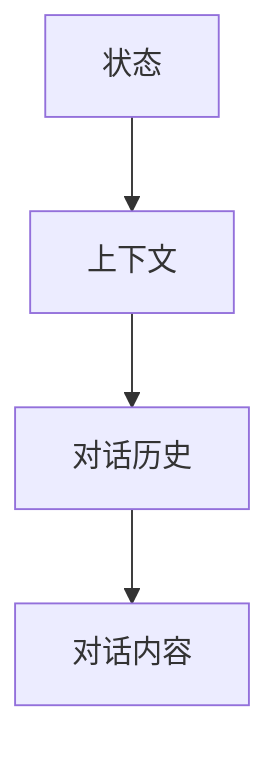
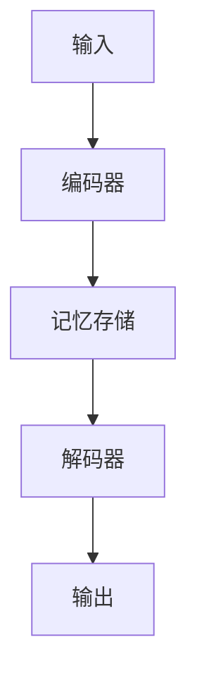
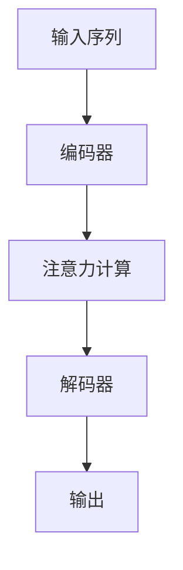
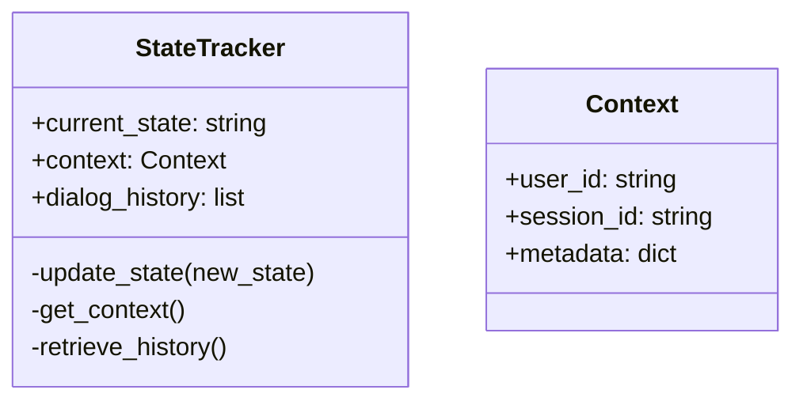
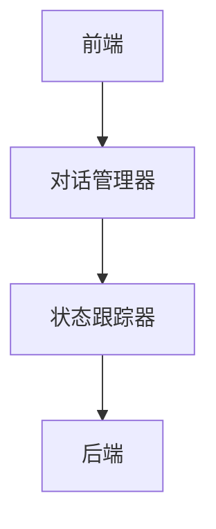
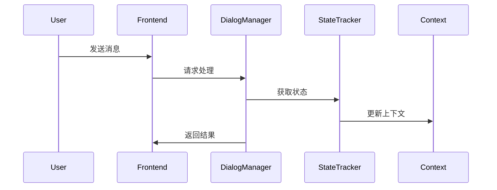

                 

<think>
好的，我现在需要帮用户撰写一篇关于《实现AI Agent的多轮对话状态跟踪》的技术博客文章。用户已经提供了一个详细的目录大纲，我需要按照这个大纲逐步完成每个部分的内容，确保每个章节都详细且符合技术博客的要求。

首先，我需要理解每个章节的目标和内容。文章的结构已经分为六个部分，每个部分都有具体的章节和小节。我需要从背景介绍开始，逐步深入到算法原理、系统架构，再到项目实战，最后总结和拓展阅读。

在撰写过程中，我需要确保使用专业的技术术语，同时保持语言清晰易懂。每个章节的小节都需要详细展开，比如在核心概念部分，我需要解释状态表示、上下文管理、对话历史，并提供ER实体关系图。算法部分需要用mermaid流程图和Python代码示例，配合数学公式进行讲解。

接下来，我需要考虑用户可能的背景。他们可能是开发者、CTO或对AI技术感兴趣的技术人员，所以内容需要既专业又实用，能够帮助读者理解和实现AI Agent的多轮对话状态跟踪。

我还需要确保文章结构合理，每个部分之间有逻辑衔接，从理论到实践，从基础到高级，逐步深入。同时，结尾部分需要给出最佳实践、注意事项和拓展阅读，帮助读者进一步应用和学习。

现在，我将开始撰写每个章节的内容，确保每个部分都符合用户的要求，内容丰富且详细。如果有需要，我还会插入mermaid图表和代码示例，以增强文章的可读性和实用性。

最后，我会通读整篇文章，检查逻辑是否连贯，内容是否全面，确保没有遗漏任何关键点，并且语言流畅，符合技术博客的风格。
</think>

# 实现AI Agent的多轮对话状态跟踪

---

## 关键词：
AI Agent, 多轮对话, 状态跟踪, 对话历史, 上下文管理, 状态表示, 记忆网络

---

## 摘要：
本文详细探讨了AI Agent在多轮对话中的状态跟踪技术。从背景介绍到核心概念，再到算法原理和系统架构设计，结合实际项目案例，全面解析了实现多轮对话状态跟踪的关键技术与实践方法。通过本文，读者将深入了解如何构建高效、准确的对话状态跟踪系统，并掌握在实际应用中优化和实现该技术的最佳实践。

---

## 第一部分: AI Agent的多轮对话状态跟踪背景介绍

---

### 第1章: AI Agent与多轮对话状态跟踪概述

#### 1.1 AI Agent的基本概念
##### 1.1.1 AI Agent的定义
AI Agent（人工智能代理）是一种能够感知环境并采取行动以实现目标的智能实体。它可以自主决策、与用户交互，并根据反馈调整行为。

##### 1.1.2 AI Agent的核心特点
- **自主性**：AI Agent能够自主决策，无需外部干预。
- **反应性**：能够实时感知环境并做出反应。
- **目标导向**：所有行为均以实现特定目标为导向。
- **学习能力**：能够通过经验优化自身行为。

##### 1.1.3 AI Agent与传统程序的区别
AI Agent的核心区别在于其智能性和适应性。传统程序基于固定的规则运行，而AI Agent能够学习、推理、自适应，并与环境动态交互。

---

#### 1.2 多轮对话的必要性
##### 1.2.1 对话的基本概念
对话是人与人之间通过语言交换信息的过程。在AI Agent中，对话是与用户交互的主要方式。

##### 1.2.2 多轮对话的特点
- **连续性**：对话在时间上是连续的，每次对话都与前一次相关联。
- **情境依赖性**：每次对话的内容依赖于上下文。
- **目标导向性**：对话的目标可能是解决问题、获取信息或完成任务。

##### 1.2.3 多轮对话在AI Agent中的作用
多轮对话使AI Agent能够更好地理解用户需求，提供更准确的服务。例如，在智能客服中，多轮对话可以帮助准确理解用户的问题并提供解决方案。

---

#### 1.3 状态跟踪的重要性
##### 1.3.1 状态的概念
在对话中，状态指的是对话的当前情况，包括用户意图、对话历史、上下文信息等。

##### 1.3.2 状态跟踪的必要性
- **准确性**：确保AI Agent能够正确理解用户的意图。
- **连贯性**：保持对话的连贯性，避免重复或遗漏。
- **高效性**：通过状态跟踪优化对话流程，提高效率。

##### 1.3.3 状态跟踪的挑战
- **信息丢失**：对话历史过长可能导致信息丢失。
- **上下文管理**：如何高效管理上下文是关键问题。
- **实时性**：需要实时更新和跟踪状态，这对性能提出了高要求。

---

#### 1.4 本章小结
本章介绍了AI Agent的基本概念、多轮对话的特点以及状态跟踪的重要性。通过理解这些内容，读者可以明确多轮对话状态跟踪在AI Agent中的核心地位。

---

## 第二部分: 核心概念与联系

---

### 第2章: 多轮对话状态跟踪的核心概念

#### 2.1 状态表示的原理
##### 2.1.1 状态表示的定义
状态表示是将对话的状态转化为数据结构或模型的过程。

##### 2.1.2 状态表示的属性
- **唯一性**：每个状态必须是唯一的，以便准确识别。
- **可更新性**：状态可以根据对话的进展实时更新。
- **可扩展性**：状态表示应支持对话中的新信息。

##### 2.1.3 状态表示的实现方式
- **基于键值对的表示**：例如，使用字典结构存储状态信息。
- **基于向量的表示**：使用向量空间模型表示状态。
- **基于图的表示**：使用图结构表示复杂的状态关系。

---

#### 2.2 上下文管理的原理
##### 2.2.1 上下文的概念
上下文是对话中与当前对话相关的背景信息。

##### 2.2.2 上下文管理的实现方式
- **基于规则的管理**：根据预定义的规则管理上下文。
- **基于模型的管理**：使用机器学习模型动态管理上下文。
- **基于知识库的管理**：利用知识库存储和管理上下文信息。

##### 2.2.3 上下文管理的优缺点
- **优点**：能够准确捕捉对话中的关键信息。
- **缺点**：管理复杂，需要大量的上下文知识。

---

#### 2.3 对话历史的管理
##### 2.3.1 对话历史的定义
对话历史是对话过程中所有交互记录的集合。

##### 2.3.2 对话历史的存储方式
- **基于数据库的存储**：将对话历史存储在数据库中。
- **基于日志的存储**：将对话历史记录为日志文件。
- **基于缓存的存储**：使用缓存技术存储最近的对话历史。

##### 2.3.3 对话历史的检索与应用
- **检索**：根据需求从对话历史中检索相关信息。
- **应用**：将检索到的信息应用于当前对话。

---

#### 2.4 核心概念的ER实体关系图


---

#### 2.5 本章小结
本章详细讲解了多轮对话状态跟踪中的核心概念，包括状态表示、上下文管理和对话历史。通过这些概念，读者可以理解多轮对话状态跟踪的基本原理。

---

## 第三部分: 算法原理讲解

---

### 第3章: 多轮对话状态跟踪的算法原理

#### 3.1 基于记忆网络的算法
##### 3.1.1 记忆网络的定义
记忆网络是一种用于处理序列数据的神经网络模型，能够记住长期的信息。

##### 3.1.2 记忆网络的工作流程


##### 3.1.3 记忆网络的实现方式
```python
class MemoryNetwork:
    def __init__(self, input_size, memory_size, output_size):
        self.input_size = input_size
        self.memory_size = memory_size
        self.output_size = output_size
        self.memory = {}  # 关键字-值存储

    def encode(self, input):
        # 编码输入
        pass

    def retrieve(self, input):
        # 根据输入检索记忆
        pass

    def update(self, input, output):
        # 更新记忆
        pass
```

##### 3.1.4 记忆网络的数学模型
记忆网络的核心是通过向量操作实现信息的存储和检索：
$$ \text{记忆检索} = \sum_{i=1}^{n} \alpha_i m_i $$
其中，$\alpha_i$ 是注意力权重，$m_i$ 是记忆向量。

---

#### 3.2 基于注意力机制的算法
##### 3.2.1 注意力机制的定义
注意力机制是一种用于关注输入中关键部分的技术，常用于序列模型中。

##### 3.2.2 注意力机制的工作流程


##### 3.2.3 注意力机制的实现方式
```python
def attention(query, keys, values):
    # 计算注意力权重
    scores = query.dot(keys.T)
    weights = softmax(scores)
    # 加权求和
    output = weights.dot(values)
    return output
```

##### 3.2.4 注意力机制的数学模型
注意力机制的核心是计算查询与键之间的相似性：
$$ \text{权重} = \text{softmax}(\text{查询} \times \text{键}) $$

---

#### 3.3 本章小结
本章介绍了基于记忆网络和注意力机制的算法原理，展示了如何利用这些技术实现多轮对话状态跟踪。

---

## 第四部分: 系统分析与架构设计方案

---

### 第4章: 多轮对话状态跟踪的系统架构设计

#### 4.1 项目介绍
本项目旨在构建一个基于AI Agent的多轮对话状态跟踪系统，能够实时跟踪对话状态并提供准确的反馈。

#### 4.2 系统功能设计
##### 4.2.1 领域模型类图


##### 4.2.2 系统架构图


##### 4.2.3 接口和交互序列图


---

#### 4.3 本章小结
本章通过系统架构设计，展示了如何将多轮对话状态跟踪技术应用于实际项目中。

---

## 第五部分: 项目实战

---

### 第5章: 实现AI Agent的多轮对话状态跟踪

#### 5.1 环境安装
安装必要的Python库：
```bash
pip install numpy
pip install matplotlib
pip install scikit-learn
```

#### 5.2 系统核心实现源代码
```python
class StateTracker:
    def __init__(self):
        self.current_state = None
        self.context = {}
        self.dialog_history = []

    def update_state(self, new_state):
        self.current_state = new_state

    def get_context(self):
        return self.context

    def retrieve_history(self):
        return self.dialog_history

def main():
    tracker = StateTracker()
    tracker.update_state("initializing")
    tracker.context = {"user_id": "123", "session_id": "abc"}
    tracker.dialog_history.append("user: hello")
    tracker.dialog_history.append("agent: hi")
    print(tracker.dialog_history)

if __name__ == "__main__":
    main()
```

#### 5.3 代码应用解读与分析
- **StateTracker类**：实现了状态跟踪的核心功能，包括更新状态、获取上下文和检索对话历史。
- **main函数**：展示了如何使用StateTracker类实现多轮对话状态跟踪。

#### 5.4 实际案例分析
以智能客服为例，展示如何利用StateTracker类跟踪对话状态，优化用户交互流程。

#### 5.5 本章小结
本章通过实际项目案例，展示了如何将多轮对话状态跟踪技术应用于实际场景中。

---

## 第六部分: 最佳实践与拓展阅读

---

### 第6章: 最佳实践 tips

#### 6.1 关键点提示
- 状态跟踪是实现多轮对话的核心技术。
- 选择合适的状态表示方法对性能至关重要。
- 实时更新和管理上下文是实现高效对话的关键。

#### 6.2 小结
通过本文的学习，读者可以掌握实现AI Agent的多轮对话状态跟踪的核心技术，并能够在实际项目中应用这些知识。

#### 6.3 注意事项
- 确保状态跟踪的实时性和准确性。
- 合理设计上下文管理机制，避免信息丢失。
- 定期优化对话历史的存储和检索方式，提高性能。

#### 6.4 拓展阅读
- 《对话系统中的上下文管理》
- 《基于深度学习的对话状态跟踪研究》
- 《多轮对话中的注意力机制应用》

---

## 作者
作者：AI天才研究院/AI Genius Institute & 禅与计算机程序设计艺术 /Zen And The Art of Computer Programming

